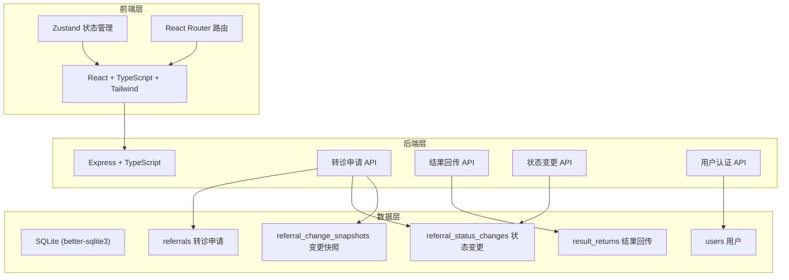

## 1. 架构设计



## 2. 技术说明

- 前端：React@18 + Tailwind CSS@3 + Vite + Zustand
- 初始化工具：vite-init
- 后端：Express@4 + TypeScript (ESM)
- 数据库：SQLite (better-sqlite3)，含种子数据
- 状态管理：Zustand（前端），所有状态变更通过后端API持久化

## 3. 路由定义

| 路由 | 用途 |
|------|------|
| / | 工作台首页，角色待办和概览 |
| /referral/new | 新建转诊申请 |
| /referral/:id | 转诊详情时间线 |
| /referral/:id/edit | 编辑转诊申请 |
| /returns | 结果回传列表 |
| /returns/:id | 结果回传详情与确认 |
| /login | 登录页（演示账号选择） |

## 4. API 定义

### 4.1 认证

```
POST /api/auth/login
  body: { username: string, password: string }
  response: { user: User, token: string }

GET /api/auth/me
  response: { user: User }
```

### 4.2 转诊申请

```
GET /api/referrals?status=&role=&page=&limit=
  response: { data: Referral[], total: number }

POST /api/referrals
  body: { patientName, patientAge, patientGender, reason, targetDept, urgency, expectedReturnDays, notes }
  response: Referral

PUT /api/referrals/:id
  body: { reason?, targetDept?, urgency?, expectedReturnDays?, notes?, changeNote: string }
  response: Referral (含新变更快照)

PATCH /api/referrals/:id/status
  body: { status: ReferralStatus, note?: string }
  response: Referral
```

### 4.3 状态变更记录

```
GET /api/referrals/:id/changes
  response: ReferralStatusChange[]

GET /api/referrals/:id/snapshots
  response: ReferralChangeSnapshot[]
```

### 4.4 结果回传

```
GET /api/returns?status=&page=&limit=
  response: { data: ResultReturn[], total: number }

POST /api/returns
  body: { referralId, resultContent, resultDept, resultDoctor, attachments? }
  response: ResultReturn

PATCH /api/returns/:id/confirm
  body: { changeAcknowledged?: boolean, note?: string }
  response: ResultReturn
```

### 4.5 TypeScript 类型定义

```typescript
type ReferralStatus =
  | "draft"
  | "pending_review"
  | "approved"
  | "rejected"
  | "sent"
  | "result_returned"
  | "change_alerted"
  | "confirmed"
  | "closed";

type Urgency = "routine" | "urgent" | "emergency";

interface User {
  id: number;
  username: string;
  displayName: string;
  role: "gp" | "nurse" | "pho";
  roleLabel: string;
}

interface Referral {
  id: number;
  patientName: string;
  patientAge: number;
  patientGender: "male" | "female";
  reason: string;
  targetDept: string;
  urgency: Urgency;
  expectedReturnDays: number;
  status: ReferralStatus;
  createdBy: number;
  createdAt: string;
  updatedAt: string;
  version: number;
}

interface ReferralStatusChange {
  id: number;
  referralId: number;
  fromStatus: ReferralStatus | null;
  toStatus: ReferralStatus;
  operatorId: number;
  operatorRole: string;
  operatorName: string;
  note: string | null;
  createdAt: string;
}

interface ReferralChangeSnapshot {
  id: number;
  referralId: number;
  field: string;
  oldValue: string;
  newValue: string;
  operatorId: number;
  operatorName: string;
  note: string;
  createdAt: string;
}

interface ResultReturn {
  id: number;
  referralId: number;
  resultContent: string;
  resultDept: string;
  resultDoctor: string;
  referralModifiedAfterSent: boolean;
  changeAcknowledged: boolean;
  confirmedBy: number | null;
  confirmedByName: string | null;
  confirmedAt: string | null;
  createdAt: string;
}
```

## 5. 服务端架构图

```mermaid
flowchart LR
    "Controller" --> "Service"
    "Service" --> "Repository"
    "Repository" --> "SQLite"
```

## 6. 数据模型

### 6.1 数据模型定义

```mermaid
erdiag
    "users" {
        int id PK
        string username
        string password_hash
        string display_name
        string role
        string role_label
    }
    "referrals" {
        int id PK
        string patient_name
        int patient_age
        string patient_gender
        string reason
        string target_dept
        string urgency
        int expected_return_days
        string status
        int created_by FK
        int version
        datetime created_at
        datetime updated_at
    }
    "referral_status_changes" {
        int id PK
        int referral_id FK
        string from_status
        string to_status
        int operator_id FK
        string operator_role
        string operator_name
        string note
        datetime created_at
    }
    "referral_change_snapshots" {
        int id PK
        int referral_id FK
        string field
        string old_value
        string new_value
        int operator_id FK
        string operator_name
        string note
        datetime created_at
    }
    "result_returns" {
        int id PK
        int referral_id FK
        string result_content
        string result_dept
        string result_doctor
        boolean referral_modified_after_sent
        boolean change_acknowledged
        int confirmed_by FK
        string confirmed_by_name
        datetime confirmed_at
        datetime created_at
    }
    "users" ||--o{ "referrals": "创建"
    "referrals" ||--o{ "referral_status_changes": "状态变更"
    "referrals" ||--o{ "referral_change_snapshots": "变更快照"
    "referrals" ||--o{ "result_returns": "结果回传"
    "users" ||--o{ "result_returns": "确认签收"
```

### 6.2 数据定义语言

```sql
CREATE TABLE users (
  id INTEGER PRIMARY KEY AUTOINCREMENT,
  username TEXT NOT NULL UNIQUE,
  password_hash TEXT NOT NULL,
  display_name TEXT NOT NULL,
  role TEXT NOT NULL CHECK(role IN ('gp', 'nurse', 'pho')),
  role_label TEXT NOT NULL,
  created_at TEXT NOT NULL DEFAULT (datetime('now'))
);

CREATE TABLE referrals (
  id INTEGER PRIMARY KEY AUTOINCREMENT,
  patient_name TEXT NOT NULL,
  patient_age INTEGER NOT NULL,
  patient_gender TEXT NOT NULL CHECK(patient_gender IN ('male', 'female')),
  reason TEXT NOT NULL,
  target_dept TEXT NOT NULL,
  urgency TEXT NOT NULL CHECK(urgency IN ('routine', 'urgent', 'emergency')) DEFAULT 'routine',
  expected_return_days INTEGER NOT NULL DEFAULT 7,
  status TEXT NOT NULL DEFAULT 'draft',
  created_by INTEGER NOT NULL REFERENCES users(id),
  version INTEGER NOT NULL DEFAULT 1,
  created_at TEXT NOT NULL DEFAULT (datetime('now')),
  updated_at TEXT NOT NULL DEFAULT (datetime('now'))
);

CREATE TABLE referral_status_changes (
  id INTEGER PRIMARY KEY AUTOINCREMENT,
  referral_id INTEGER NOT NULL REFERENCES referrals(id),
  from_status TEXT,
  to_status TEXT NOT NULL,
  operator_id INTEGER NOT NULL REFERENCES users(id),
  operator_role TEXT NOT NULL,
  operator_name TEXT NOT NULL,
  note TEXT,
  created_at TEXT NOT NULL DEFAULT (datetime('now'))
);

CREATE TABLE referral_change_snapshots (
  id INTEGER PRIMARY KEY AUTOINCREMENT,
  referral_id INTEGER NOT NULL REFERENCES referrals(id),
  field TEXT NOT NULL,
  old_value TEXT NOT NULL,
  new_value TEXT NOT NULL,
  operator_id INTEGER NOT NULL REFERENCES users(id),
  operator_name TEXT NOT NULL,
  note TEXT NOT NULL,
  created_at TEXT NOT NULL DEFAULT (datetime('now'))
);

CREATE TABLE result_returns (
  id INTEGER PRIMARY KEY AUTOINCREMENT,
  referral_id INTEGER NOT NULL REFERENCES referrals(id),
  result_content TEXT NOT NULL,
  result_dept TEXT NOT NULL,
  result_doctor TEXT NOT NULL,
  referral_modified_after_sent INTEGER NOT NULL DEFAULT 0,
  change_acknowledged INTEGER NOT NULL DEFAULT 0,
  confirmed_by INTEGER REFERENCES users(id),
  confirmed_by_name TEXT,
  confirmed_at TEXT,
  created_at TEXT NOT NULL DEFAULT (datetime('now'))
);

CREATE INDEX idx_referrals_status ON referrals(status);
CREATE INDEX idx_referrals_created_by ON referrals(created_by);
CREATE INDEX idx_referral_status_changes_referral_id ON referral_status_changes(referral_id);
CREATE INDEX idx_referral_change_snapshots_referral_id ON referral_change_snapshots(referral_id);
CREATE INDEX idx_result_returns_referral_id ON result_returns(referral_id);
```

### 6.3 种子数据

```sql
INSERT INTO users (username, password_hash, display_name, role, role_label) VALUES
  ('dr_wang', 'demo', '王建国', 'gp', '全科医生'),
  ('nurse_li', 'demo', '李芳', 'nurse', '护士'),
  ('pho_zhang', 'demo', '张卫民', 'pho', '公共卫生专员');
```
