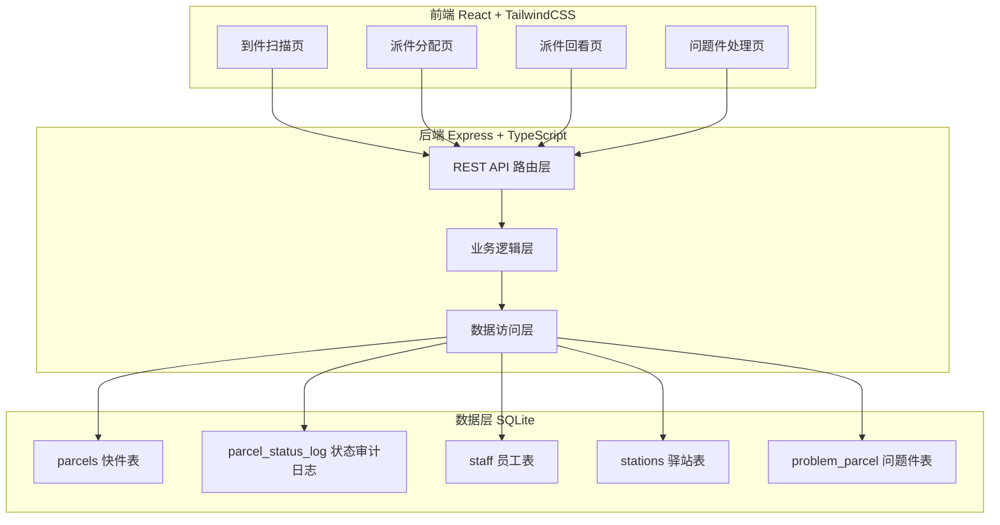
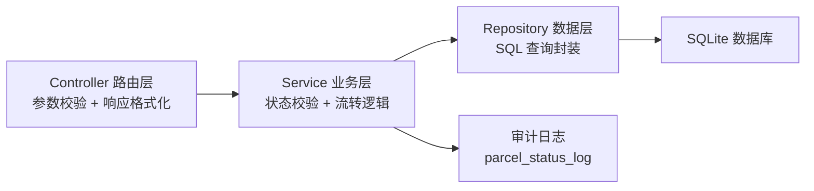
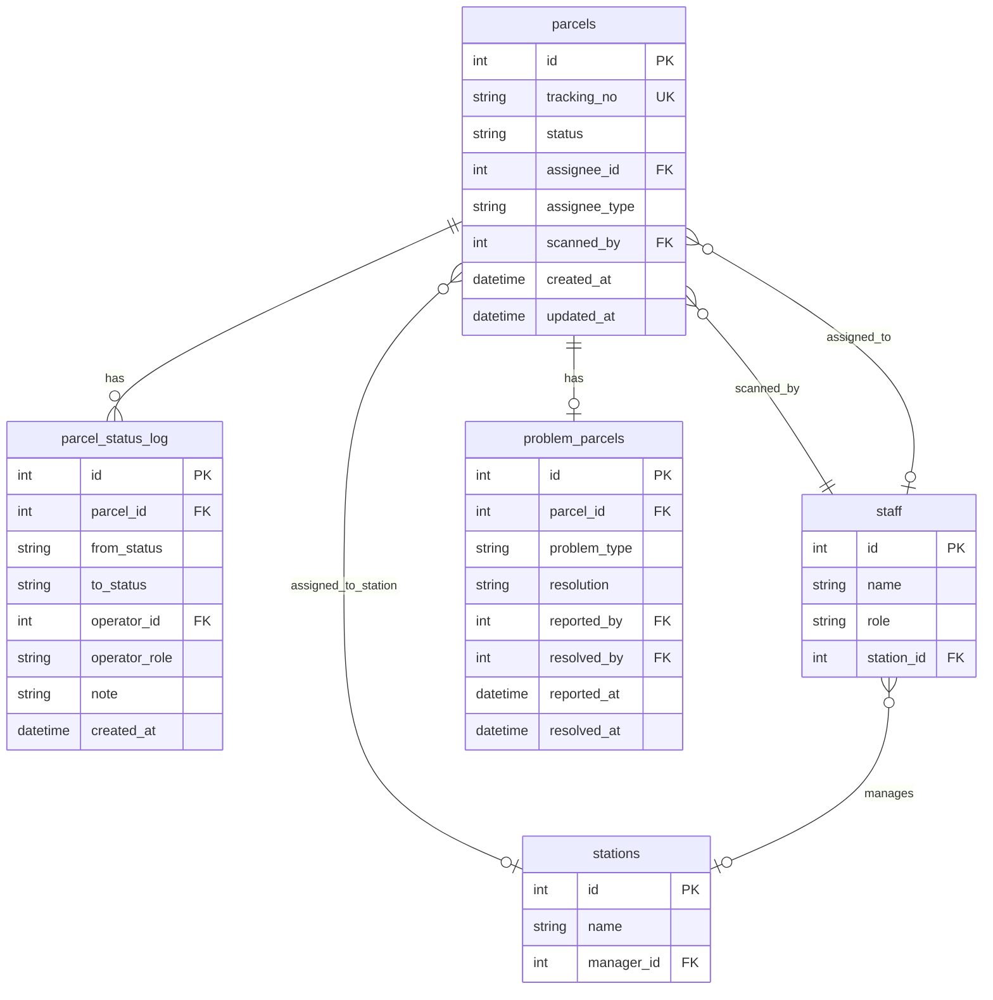

## 1. 架构设计



## 2. 技术说明

- 前端：React@18 + TailwindCSS@3 + Vite + Zustand
- 初始化工具：vite-init
- 后端：Express@4 + TypeScript（ESM）
- 数据库：SQLite（better-sqlite3），无需外部数据库服务
- 状态管理：Zustand

## 3. 路由定义

| 路由 | 用途 |
|------|------|
| /scan | 到件扫描页 |
| /dispatch | 派件分配页 |
| /review | 派件回看页 |
| /problem | 问题件处理页 |

## 4. API 定义

### 4.1 到件扫描

```
POST /api/parcels/scan
请求体: { trackingNo: string, operatorId: number, note?: string }
响应体: { id: number, trackingNo: string, status: string, operatorName: string, scannedAt: string }
```

批量到件扫描（忙时）：
```
POST /api/parcels/scan/batch
请求体: { items: Array<{ trackingNo: string }>, operatorId: number, note?: string }
响应体: { count: number, parcels: Array<Parcel> }
```

### 4.2 派件分配

```
POST /api/parcels/dispatch
请求体: { parcelIds: number[], assigneeId: number, assigneeType: "courier" | "station", note?: string }
响应体: { count: number, parcels: Array<Parcel> }
```

### 4.3 派件/签收确认

```
POST /api/parcels/deliver
请求体: { parcelId: number, operatorId: number, note?: string }
响应体: { parcel: Parcel }

POST /api/parcels/sign
请求体: { parcelIds: number[], operatorId: number, note?: string }
响应体: { count: number, parcels: Array<Parcel> }
```

### 4.4 问题件

```
POST /api/parcels/problem
请求体: { parcelId: number, problemType: string, operatorId: number, note?: string }
响应体: { parcel: Parcel }

PUT /api/parcels/problem/:id/resolve
请求体: { resolution: "reassign" | "close", operatorId: number, note?: string }
响应体: { parcel: Parcel }
```

### 4.5 查询

```
GET /api/parcels?status=&assigneeId=&trackingNo=&startDate=&endDate=&page=&pageSize=
响应体: { total: number, items: Array<Parcel> }

GET /api/parcels/:id/audit-log
响应体: { logs: Array<AuditLog> }

GET /api/staff?role=
响应体: { staff: Array<Staff> }

GET /api/stations
响应体: { stations: Array<Station> }
```

### 4.6 TypeScript 类型定义

```typescript
type ParcelStatus =
  | "arrived_pending"
  | "dispatched_pending"
  | "delivering"
  | "signed"
  | "problem_pending"
  | "closed";

interface Parcel {
  id: number;
  trackingNo: string;
  status: ParcelStatus;
  assigneeId: number | null;
  assigneeType: "courier" | "station" | null;
  assigneeName: string | null;
  createdAt: string;
  updatedAt: string;
}

interface ParcelAuditLog {
  id: number;
  parcelId: number;
  fromStatus: ParcelStatus | null;
  toStatus: ParcelStatus;
  operatorId: number;
  operatorName: string;
  operatorRole: string;
  note: string | null;
  createdAt: string;
}

interface Staff {
  id: number;
  name: string;
  role: "customer_service" | "courier" | "station_manager";
  stationId: number | null;
}

interface Station {
  id: number;
  name: string;
  managerId: number;
}
```

## 5. 服务端架构图



## 6. 数据模型

### 6.1 数据模型关系



### 6.2 DDL 和种子数据

#### parcels 表

```sql
CREATE TABLE parcels (
  id INTEGER PRIMARY KEY AUTOINCREMENT,
  tracking_no TEXT NOT NULL UNIQUE,
  status TEXT NOT NULL DEFAULT 'arrived_pending',
  assignee_id INTEGER,
  assignee_type TEXT CHECK(assignee_type IN ('courier', 'station', NULL)),
  scanned_by INTEGER NOT NULL,
  created_at TEXT NOT NULL DEFAULT (datetime('now', 'localtime')),
  updated_at TEXT NOT NULL DEFAULT (datetime('now', 'localtime')),
  FOREIGN KEY (scanned_by) REFERENCES staff(id),
  FOREIGN KEY (assignee_id) REFERENCES staff(id)
);

CREATE INDEX idx_parcels_status ON parcels(status);
CREATE INDEX idx_parcels_assignee ON parcels(assignee_id);
CREATE INDEX idx_parcels_tracking ON parcels(tracking_no);
```

#### parcel_status_log 表

```sql
CREATE TABLE parcel_status_log (
  id INTEGER PRIMARY KEY AUTOINCREMENT,
  parcel_id INTEGER NOT NULL,
  from_status TEXT,
  to_status TEXT NOT NULL,
  operator_id INTEGER NOT NULL,
  operator_role TEXT NOT NULL,
  note TEXT,
  created_at TEXT NOT NULL DEFAULT (datetime('now', 'localtime')),
  FOREIGN KEY (parcel_id) REFERENCES parcels(id),
  FOREIGN KEY (operator_id) REFERENCES staff(id)
);

CREATE INDEX idx_audit_parcel ON parcel_status_log(parcel_id);
CREATE INDEX idx_audit_time ON parcel_status_log(created_at);
```

#### staff 表

```sql
CREATE TABLE staff (
  id INTEGER PRIMARY KEY AUTOINCREMENT,
  name TEXT NOT NULL,
  role TEXT NOT NULL CHECK(role IN ('customer_service', 'courier', 'station_manager')),
  station_id INTEGER,
  FOREIGN KEY (station_id) REFERENCES stations(id)
);
```

#### stations 表

```sql
CREATE TABLE stations (
  id INTEGER PRIMARY KEY AUTOINCREMENT,
  name TEXT NOT NULL,
  manager_id INTEGER,
  FOREIGN KEY (manager_id) REFERENCES staff(id)
);
```

#### problem_parcels 表

```sql
CREATE TABLE problem_parcels (
  id INTEGER PRIMARY KEY AUTOINCREMENT,
  parcel_id INTEGER NOT NULL,
  problem_type TEXT NOT NULL,
  resolution TEXT,
  reported_by INTEGER NOT NULL,
  resolved_by INTEGER,
  reported_at TEXT NOT NULL DEFAULT (datetime('now', 'localtime')),
  resolved_at TEXT,
  FOREIGN KEY (parcel_id) REFERENCES parcels(id),
  FOREIGN KEY (reported_by) REFERENCES staff(id),
  FOREIGN KEY (resolved_by) REFERENCES staff(id)
);
```

#### 种子数据

```sql
INSERT INTO stations (id, name) VALUES (1, '城东驿站'), (2, '城西驿站'), (3, '城南驿站');

INSERT INTO staff (id, name, role, station_id) VALUES
  (1, '张客服', 'customer_service', NULL),
  (2, '李客服', 'customer_service', NULL),
  (3, '王派件员', 'courier', NULL),
  (4, '赵派件员', 'courier', NULL),
  (5, '刘派件员', 'courier', NULL),
  (6, '陈站长', 'station_manager', 1),
  (7, '周站长', 'station_manager', 2),
  (8, '吴站长', 'station_manager', 3);

UPDATE stations SET manager_id = 6 WHERE id = 1;
UPDATE stations SET manager_id = 7 WHERE id = 2;
UPDATE stations SET manager_id = 8 WHERE id = 3;

INSERT INTO parcels (id, tracking_no, status, scanned_by, assignee_id, assignee_type) VALUES
  (1, 'SF1234567890', 'arrived_pending', 1, NULL, NULL),
  (2, 'SF1234567891', 'arrived_pending', 1, NULL, NULL),
  (3, 'SF1234567892', 'dispatched_pending', 1, 3, 'courier'),
  (4, 'SF1234567893', 'dispatched_pending', 2, 6, 'station'),
  (5, 'SF1234567894', 'delivering', 1, 4, 'courier'),
  (6, 'SF1234567895', 'signed', 1, 4, 'courier'),
  (7, 'SF1234567896', 'problem_pending', 2, NULL, NULL),
  (8, 'SF1234567897', 'closed', 1, NULL, NULL);

INSERT INTO parcel_status_log (parcel_id, from_status, to_status, operator_id, operator_role, note) VALUES
  (1, NULL, 'arrived_pending', 1, 'customer_service', '到件扫描'),
  (2, NULL, 'arrived_pending', 1, 'customer_service', '到件扫描'),
  (3, NULL, 'arrived_pending', 1, 'customer_service', '到件扫描'),
  (3, 'arrived_pending', 'dispatched_pending', 1, 'customer_service', '分配给王派件员'),
  (4, NULL, 'arrived_pending', 2, 'customer_service', '到件扫描'),
  (4, 'arrived_pending', 'dispatched_pending', 2, 'customer_service', '分配给城东驿站'),
  (5, NULL, 'arrived_pending', 1, 'customer_service', '到件扫描'),
  (5, 'arrived_pending', 'dispatched_pending', 1, 'customer_service', '分配给赵派件员'),
  (5, 'dispatched_pending', 'delivering', 4, 'courier', '开始派件'),
  (6, NULL, 'arrived_pending', 1, 'customer_service', '到件扫描'),
  (6, 'arrived_pending', 'dispatched_pending', 1, 'customer_service', '分配给赵派件员'),
  (6, 'dispatched_pending', 'delivering', 4, 'courier', '开始派件'),
  (6, 'delivering', 'signed', 4, 'courier', '本人签收'),
  (7, NULL, 'arrived_pending', 2, 'customer_service', '到件扫描'),
  (7, 'arrived_pending', 'problem_pending', 3, 'courier', '外包装破损'),
  (8, NULL, 'arrived_pending', 1, 'customer_service', '到件扫描'),
  (8, 'arrived_pending', 'problem_pending', 1, 'customer_service', '地址错误'),
  (8, 'problem_pending', 'closed', 1, 'customer_service', '客服裁决关闭');
```
