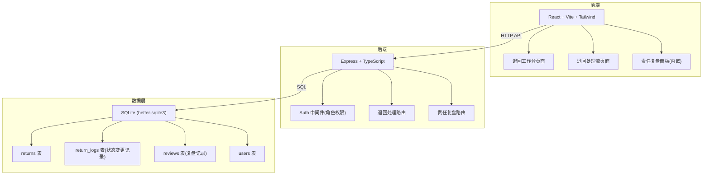
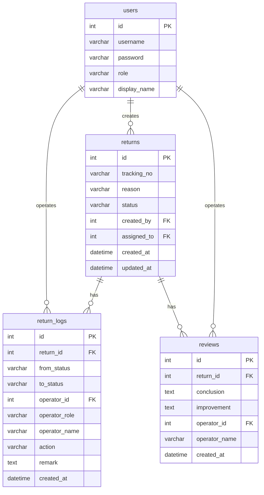

## 1. 架构设计



## 2. 技术说明

- 前端：React@18 + TailwindCSS@3 + Vite + Zustand
- 初始化工具：vite-init
- 后端：Express@4 + TypeScript (ESM)
- 数据库：SQLite (better-sqlite3)，零配置嵌入式数据库
- 状态管理：Zustand

## 3. 路由定义

| 路由 | 用途 |
|------|------|
| /login | 角色登录页 |
| / | 退回工作台（退回件列表+筛选+分页+快速登记） |
| /return/:id | 退回处理流详情（三角色接力+责任复盘面板） |

## 4. API 定义

### 4.1 认证相关

```
POST /api/auth/login
  Body: { username: string, password: string }
  Response: { token: string, user: { id, username, role, displayName } }

GET /api/auth/me
  Headers: Authorization: Bearer <token>
  Response: { user: { id, username, role, displayName } }
```

### 4.2 退回件相关

```
GET /api/returns?page=1&pageSize=20&status=待派件员确认&role=客服&keyword=SF123
  Headers: Authorization: Bearer <token>
  Response: {
    list: ReturnItem[],
    total: number,
    page: number,
    pageSize: number
  }

POST /api/returns
  Headers: Authorization: Bearer <token>
  Body: { trackingNo: string, reason: string, remark?: string }
  Response: ReturnItem

GET /api/returns/:id
  Headers: Authorization: Bearer <token>
  Response: ReturnItemDetail (含 logs 数组)

PUT /api/returns/:id/process
  Headers: Authorization: Bearer <token>
  Body: { action: "confirm"|"reject"|"supplement", remark?: string, evidence?: string }
  Response: ReturnItemDetail

POST /api/returns/:id/review
  Headers: Authorization: Bearer <token>
  Body: { conclusion: string, improvement?: string }
  Response: ReviewRecord
```

### 4.3 类型定义

```typescript
type UserRole = "客服" | "派件员" | "驿站负责人"

interface User {
  id: number
  username: string
  password: string
  role: UserRole
  displayName: string
}

interface ReturnItem {
  id: number
  trackingNo: string
  reason: string
  status: ReturnStatus
  createdBy: number
  assignedTo: number | null
  createdAt: string
  updatedAt: string
}

type ReturnStatus =
  | "待派件员确认"
  | "待驿站认定"
  | "退回处理完成"
  | "已驳回-待补录"
  | "复盘进行中"
  | "复盘完成"

interface ReturnLog {
  id: number
  returnId: number
  fromStatus: ReturnStatus | null
  toStatus: ReturnStatus
  operatorId: number
  operatorRole: UserRole
  operatorName: string
  action: string
  remark: string | null
  createdAt: string
}

interface ReviewRecord {
  id: number
  returnId: number
  conclusion: string
  improvement: string | null
  operatorId: number
  operatorName: string
  createdAt: string
}

interface ReturnItemDetail extends ReturnItem {
  logs: ReturnLog[]
  reviews: ReviewRecord[]
}
```

## 5. 服务端架构


### 各层职责

- **Router**：定义路由，挂载中间件
- **Auth Middleware**：校验 JWT token，注入 user 信息，校验角色权限
- **Controller**：参数校验，调用 Service，格式化响应
- **Service**：业务逻辑（状态流转校验、驳回回退、复盘触发）
- **Repository**：SQL 查询，数据读写

### 权限校验规则

| 操作 | 允许角色 |
|------|----------|
| 登记退回件 | 客服 |
| 派件员确认退回 | 派件员 |
| 派件员补充说明 | 派件员 |
| 驿站负责人认定(通过/驳回) | 驿站负责人 |
| 客服补录 | 客服 |
| 发起/追加复盘 | 驿站负责人 |
| 查看退回件 | 全部角色 |

### 状态流转规则

| 当前状态 | 操作 | 目标状态 | 操作角色 |
|----------|------|----------|----------|
| 待派件员确认 | 确认退回 | 待驿站认定 | 派件员 |
| 待派件员确认 | 补充说明 | 待派件员确认 | 派件员 |
| 待驿站认定 | 认定通过 | 退回处理完成 | 驿站负责人 |
| 待驿站认定 | 驳回(至派件员) | 已驳回-待补录 | 驿站负责人 |
| 已驳回-待补录 | 补充说明 | 待驿站认定 | 派件员 |
| 已驳回-待补录 | 驳回(至客服) | 已驳回-待补录 | 派件员 |
| 已驳回-待补录 | 客服补录 | 待派件员确认 | 客服 |
| 退回处理完成 | 发起复盘 | 复盘进行中 | 驿站负责人 |
| 复盘进行中 | 追加复盘结论 | 复盘完成 | 驿站负责人 |

## 6. 数据模型

### 6.1 数据模型定义



### 6.2 DDL

```sql
CREATE TABLE users (
  id INTEGER PRIMARY KEY AUTOINCREMENT,
  username TEXT NOT NULL UNIQUE,
  password TEXT NOT NULL,
  role TEXT NOT NULL CHECK(role IN ('客服', '派件员', '驿站负责人')),
  display_name TEXT NOT NULL
);

CREATE TABLE returns (
  id INTEGER PRIMARY KEY AUTOINCREMENT,
  tracking_no TEXT NOT NULL,
  reason TEXT NOT NULL,
  status TEXT NOT NULL DEFAULT '待派件员确认',
  created_by INTEGER NOT NULL REFERENCES users(id),
  assigned_to INTEGER REFERENCES users(id),
  created_at TEXT NOT NULL DEFAULT (datetime('now', 'localtime')),
  updated_at TEXT NOT NULL DEFAULT (datetime('now', 'localtime'))
);

CREATE TABLE return_logs (
  id INTEGER PRIMARY KEY AUTOINCREMENT,
  return_id INTEGER NOT NULL REFERENCES returns(id),
  from_status TEXT,
  to_status TEXT NOT NULL,
  operator_id INTEGER NOT NULL REFERENCES users(id),
  operator_role TEXT NOT NULL,
  operator_name TEXT NOT NULL,
  action TEXT NOT NULL,
  remark TEXT,
  created_at TEXT NOT NULL DEFAULT (datetime('now', 'localtime'))
);

CREATE TABLE reviews (
  id INTEGER PRIMARY KEY AUTOINCREMENT,
  return_id INTEGER NOT NULL REFERENCES returns(id),
  conclusion TEXT NOT NULL,
  improvement TEXT,
  operator_id INTEGER NOT NULL REFERENCES users(id),
  operator_name TEXT NOT NULL,
  created_at TEXT NOT NULL DEFAULT (datetime('now', 'localtime'))
);

CREATE INDEX idx_returns_status ON returns(status);
CREATE INDEX idx_returns_created_by ON returns(created_by);
CREATE INDEX idx_returns_tracking_no ON returns(tracking_no);
CREATE INDEX idx_return_logs_return_id ON return_logs(return_id);
CREATE INDEX idx_reviews_return_id ON reviews(return_id);

-- 初始用户数据
INSERT INTO users (username, password, role, display_name) VALUES
  ('kefu01', '123456', '客服', '张客服'),
  ('paijian01', '123456', '派件员', '李派件'),
  ('yizhan01', '123456', '驿站负责人', '王站长');
```
