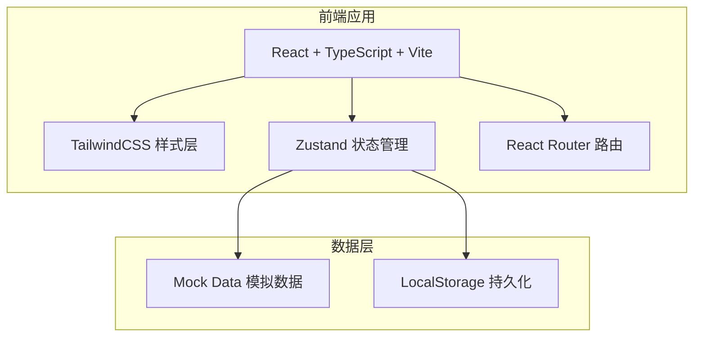
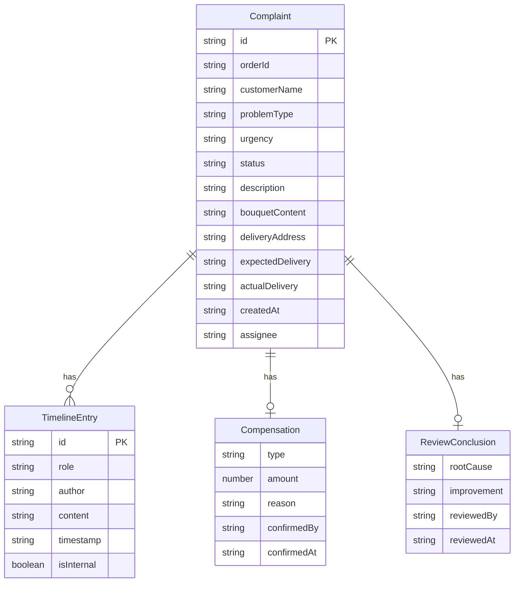

## 1. 架构设计



## 2. 技术说明

- 前端：React@18 + TypeScript + TailwindCSS@3 + Vite
- 初始化工具：vite-init (react-ts 模板)
- 后端：无（纯前端 + Mock 数据）
- 数据库：无（使用 Zustand + LocalStorage 持久化 Mock 数据）
- 状态管理：Zustand
- 路由：React Router DOM v6
- 图标：lucide-react
- 图表：recharts

## 3. 路由定义

| 路由 | 用途 |
|------|------|
| / | 客诉工单列表页，展示所有客诉工单及筛选 |
| /complaint/:id | 客诉详情页，展示协作时间线、补偿面板、复盘表单 |
| /review | 复盘分析页，展示问题归因统计与趋势 |

## 4. API定义

无后端API，使用前端Mock数据。数据结构定义如下：

```typescript
type ComplaintStatus = "pending" | "processing" | "closed" | "reviewed"
type ProblemType = "delivery_late" | "flower_replace" | "card_error" | "customer_reject"
type Urgency = "urgent" | "normal" | "low"
type CompensationType = "reflower" | "refund" | "coupon"
type RootCause = "production" | "delivery" | "note_understanding" | "other"
type Role = "cs" | "florist" | "dispatcher"

interface TimelineEntry {
  id: string
  role: Role
  author: string
  content: string
  timestamp: string
  isInternal: boolean
}

interface Compensation {
  type: CompensationType
  amount: number
  reason: string
  confirmedBy: string
  confirmedAt: string | null
}

interface ReviewConclusion {
  rootCause: RootCause
  improvement: string
  reviewedBy: string
  reviewedAt: string
}

interface Complaint {
  id: string
  orderId: string
  customerName: string
  customerPhone: string
  problemType: ProblemType
  urgency: Urgency
  status: ComplaintStatus
  description: string
  bouquetContent: string
  deliveryAddress: string
  expectedDelivery: string
  actualDelivery: string | null
  createdAt: string
  assignee: string
  timeline: TimelineEntry[]
  compensation: Compensation | null
  reviewConclusion: ReviewConclusion | null
}
```

## 5. 服务器架构图

无后端服务

## 6. 数据模型

### 6.1 数据模型定义



### 6.2 数据定义语言

使用前端 TypeScript 类型定义代替 DDL，数据存储在 Zustand store 中，可选持久化至 LocalStorage。
