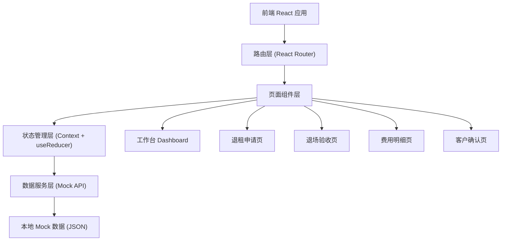

## 1. 架构设计



## 2. 技术选型说明

- **前端框架**：React 18 + TypeScript + Vite
- **路由**：React Router v6
- **样式**：TailwindCSS 3 + CSS Variables 主题
- **图标**：Lucide React
- **状态管理**：React Context + useReducer（轻量级全局状态）
- **数据层**：前端 Mock 数据 + localStorage 持久化（演示用，无需后端服务）
- **构建工具**：Vite 5

## 3. 路由定义

| 路由路径 | 页面用途 |
|----------|----------|
| `/` | 工作台 - 退租申请列表、数据概览 |
| `/application/new` | 新建退租申请 |
| `/application/:id` | 退租申请详情（流程导航） |
| `/application/:id/inspection` | 退场验收 |
| `/application/:id/cost` | 费用明细与押金拆分 |
| `/application/:id/confirm` | 客户确认与异议处理 |

## 4. 数据结构定义

### 4.1 核心类型定义

```typescript
// 退租申请
interface SurrenderApplication {
  id: string;
  status: 'pending' | 'inspecting' | 'costing' | 'confirming' | 'disputing' | 'completed';
  createdAt: string;
  updatedAt: string;
  
  // 租户信息
  tenant: {
    companyName: string;
    contactPerson: string;
    contactPhone: string;
  };
  
  // 合同信息
  contract: {
    contractNo: string;
    floorRoom: string;
    area: number;
    depositAmount: number;
    startDate: string;
    endDate: string;
    dailyRent: number;
  };
  
  // 退租信息
  surrenderInfo: {
    reason: string;
    expectedMoveOutDate: string;
    remark: string;
    applicant: string;
  };
  
  // 退场验收
  inspection?: Inspection;
  
  // 费用明细
  costBreakdown?: CostBreakdown;
  
  // 客户确认
  confirmation?: Confirmation;
}

// 退场验收
interface Inspection {
  id: string;
  inspector: string;
  inspectionDate: string;
  items: InspectionItem[];
  keys: KeyHandover[];
  remark: string;
}

interface InspectionItem {
  id: string;
  category: string; // 墙面/地面/天花/门窗/空调/消防/家具
  name: string;
  status: 'normal' | 'damaged' | 'missing';
  description: string;
  photos: string[]; // 照片URL占位
  estimatedCost?: number;
}

interface KeyHandover {
  type: string; // 大门/办公室/抽屉/门禁卡
  quantity: number;
  handedOver: boolean;
}

// 费用明细
interface CostBreakdown {
  id: string;
  preparedBy: string;
  preparedAt: string;
  totalDeposit: number;
  totalDeduction: number;
  refundAmount: number;
  
  rentSettlement: RentSettlement;
  utilityFees: UtilityFee[];
  repairFees: RepairFee[];
  penaltyFee?: PenaltyFee;
  deductions: DeductionItem[];
}

interface RentSettlement {
  occupationDays: number;
  dailyRent: number;
  amount: number;
  period: string;
  basis: string; // 扣减依据，引用合同条款
}

interface UtilityFee {
  type: 'water' | 'electricity';
  previousReading: number;
  currentReading: number;
  unitPrice: number;
  amount: number;
  period: string;
}

interface RepairFee {
  id: string;
  itemName: string;
  damageDescription: string;
  quotedAmount: number;
  quoteAttachment?: string;
  basis: string;
}

interface PenaltyFee {
  amount: number;
  clause: string; // 违约条款
  defaultDays: number;
  formula: string;
}

interface DeductionItem {
  id: string;
  category: 'rent' | 'utility' | 'repair' | 'penalty' | 'other';
  itemName: string;
  amount: number;
  basis: string;
  relatedEvidence?: string;
}

// 客户确认
interface Confirmation {
  id: string;
  customerViewedAt?: string;
  disputes: Dispute[];
  finalConfirmed?: boolean;
  confirmedAt?: string;
  confirmerName?: string;
  signature?: string;
}

interface Dispute {
  id: string;
  deductionItemId: string;
  customerReason: string;
  customerAttachments?: string[];
  createdAt: string;
  response?: DisputeResponse;
}

interface DisputeResponse {
  content: string;
  adjustedAmount?: number;
  responder: string;
  respondedAt: string;
}
```

## 5. 目录结构

```
src/
├── components/          # 公共组件
│   ├── layout/          # 布局组件（Sidebar, Topbar）
│   ├── common/          # 通用组件（Card, Button, StatusBadge, PhotoUploader 等）
│   └── steps/           # 流程步骤组件
├── pages/               # 页面组件
│   ├── Dashboard.tsx
│   ├── NewApplication.tsx
│   ├── ApplicationDetail.tsx
│   ├── Inspection.tsx
│   ├── CostBreakdown.tsx
│   └── Confirmation.tsx
├── context/             # 全局状态
│   └── ApplicationContext.tsx
├── data/                # Mock 数据
│   └── mockData.ts
├── types/               # TypeScript 类型定义
│   └── index.ts
├── utils/               # 工具函数
│   ├── formatters.ts    # 金额、日期格式化
│   └── helpers.ts
├── App.tsx
├── main.tsx
└── index.css
```

## 6. 关键功能实现方案

### 6.1 流程状态管理
使用 Context + useReducer 管理退租申请的完整状态流转，支持角色切换模拟演示。

### 6.2 照片占位方案
使用渐变色占位图 + 相机图标，每个验收项最多支持3张照片占位，点击可触发模拟上传效果。

### 6.3 费用计算
前端实现计算逻辑：租金按天计算、水电费按读数差计算、维修费按验收项估算、违约金按违约条款公式计算，每一项展示计算过程和依据。

### 6.4 异议处理
采用评论区模式，客户可对任意扣减项发起异议，运营方可以回复并调整金额，实时更新应退还金额。
