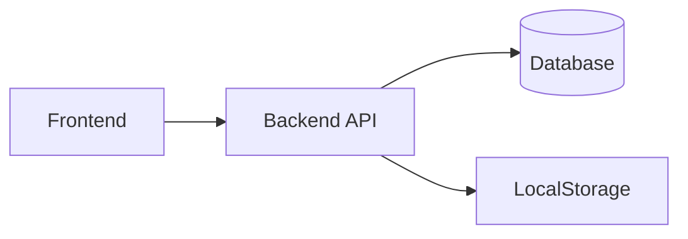
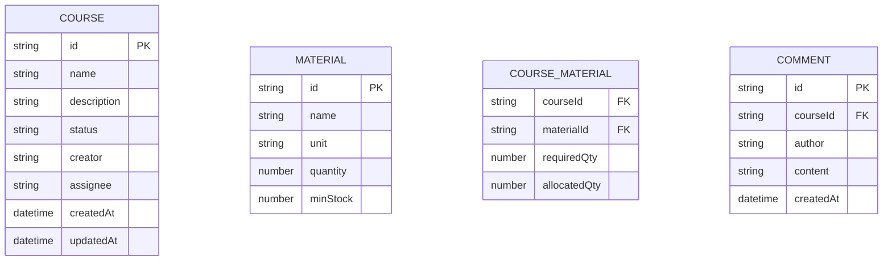

## 1. Architecture Design


## 2. Technology Description
- Frontend: React@18 + tailwindcss@3 + vite
- Initialization Tool: vite-init
- Backend: Local JSON + LocalStorage
- Database: In-memory with localStorage persistence

## 3. Route Definitions
| Route | Purpose |
|-------|---------|
| / | 首页 - 实验课程列表 |
| /course/:id | 课程详情页 |
| /materials | 材料领用管理 |
| /backup | 备份恢复 |

## 4. Data Model

### 4.1 Data Model Definition


### 4.2 Data Definition Language
```typescript
interface Course {
  id: string;
  name: string;
  description: string;
  status: 'pending' | 'approved' | 'rejected' | 'urgent' | 'supplement' | 'completed';
  creator: string;
  assignee: string;
  createdAt: string;
  updatedAt: string;
  materials: CourseMaterial[];
  comments: Comment[];
}

interface CourseMaterial {
  materialId: string;
  materialName: string;
  requiredQty: number;
  allocatedQty: number;
  unit: string;
}

interface Material {
  id: string;
  name: string;
  unit: string;
  quantity: number;
  minStock: number;
}

interface Comment {
  id: string;
  courseId: string;
  author: string;
  content: string;
  createdAt: string;
}
```

### 4.3 Initial Sample Data
包含5条带历史备注的样例课程数据，覆盖各种状态。