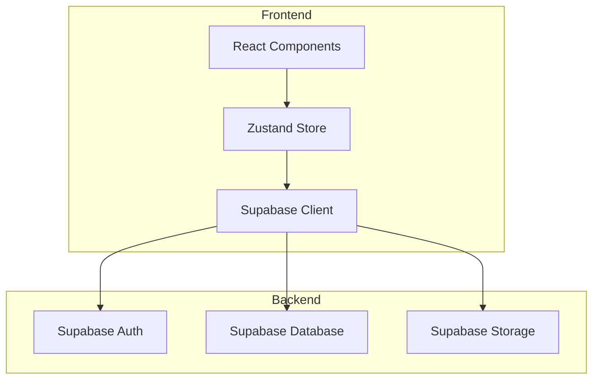
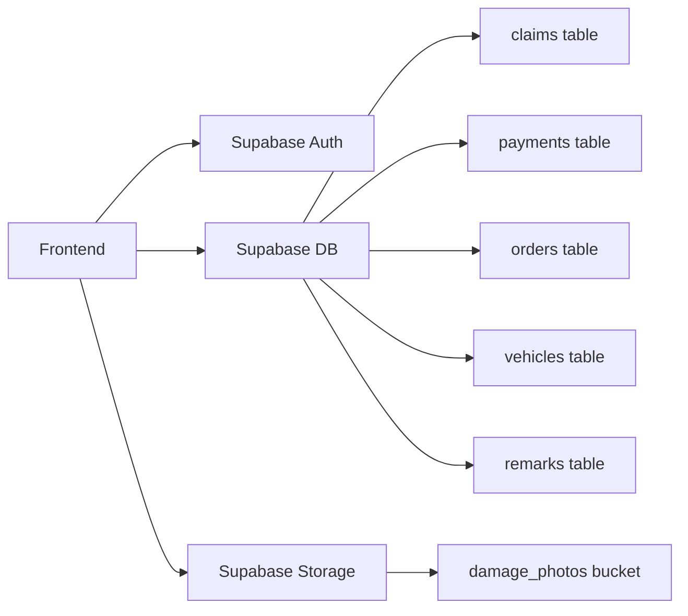
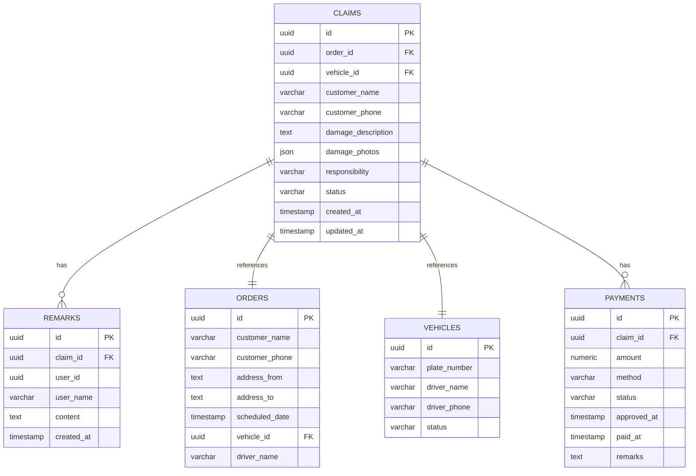

## 1. Architecture Design


## 2. Technology Description
- Frontend: React@18 + tailwindcss@3 + vite
- Initialization Tool: vite-init
- Backend: Supabase
- Database: Supabase (PostgreSQL)
- State Management: Zustand
- Icons: Lucide React

## 3. Route Definitions
| Route | Purpose |
|-------|---------|
| / | 工作台首页 |
| /claims | 物损申诉列表 |
| /claims/:id | 物损申诉详情 |
| /payments | 赔付处理列表 |
| /payments/:id | 赔付处理详情 |
| /exceptions | 异常提醒中心 |

## 4. API Definitions
```typescript
interface Claim {
  id: string;
  orderId: string;
  vehicleId: string;
  customerName: string;
  customerPhone: string;
  damageDescription: string;
  damagePhotos: string[];
  responsibility: 'company' | 'customer' | 'third_party' | 'undetermined';
  status: 'pending' | 'processing' | 'review' | 'approved' | 'paid' | 'archived';
  remarks: Remark[];
  createdAt: Date;
  updatedAt: Date;
}

interface Remark {
  id: string;
  claimId: string;
  userId: string;
  userName: string;
  content: string;
  createdAt: Date;
}

interface Payment {
  id: string;
  claimId: string;
  amount: number;
  method: 'bank' | 'wechat' | 'alipay';
  status: 'pending' | 'approved' | 'paid' | 'rejected';
  approvedAt?: Date;
  paidAt?: Date;
  remarks: string;
}

interface Order {
  id: string;
  customerName: string;
  customerPhone: string;
  addressFrom: string;
  addressTo: string;
  scheduledDate: Date;
  vehicleId: string;
  driverName: string;
}

interface Vehicle {
  id: string;
  plateNumber: string;
  driverName: string;
  driverPhone: string;
  status: 'available' | 'assigned' | 'maintenance';
}
```

## 5. Server Architecture Diagram


## 6. Data Model

### 6.1 Data Model Definition


### 6.2 Data Definition Language
```sql
CREATE TABLE claims (
    id UUID PRIMARY KEY DEFAULT uuid_generate_v4(),
    order_id UUID REFERENCES orders(id),
    vehicle_id UUID REFERENCES vehicles(id),
    customer_name VARCHAR(100) NOT NULL,
    customer_phone VARCHAR(20) NOT NULL,
    damage_description TEXT NOT NULL,
    damage_photos JSONB DEFAULT '[]',
    responsibility VARCHAR(20) DEFAULT 'undetermined',
    status VARCHAR(20) DEFAULT 'pending',
    created_at TIMESTAMP DEFAULT CURRENT_TIMESTAMP,
    updated_at TIMESTAMP DEFAULT CURRENT_TIMESTAMP
);

CREATE TABLE remarks (
    id UUID PRIMARY KEY DEFAULT uuid_generate_v4(),
    claim_id UUID REFERENCES claims(id) ON DELETE CASCADE,
    user_id UUID,
    user_name VARCHAR(100) NOT NULL,
    content TEXT NOT NULL,
    created_at TIMESTAMP DEFAULT CURRENT_TIMESTAMP
);

CREATE TABLE payments (
    id UUID PRIMARY KEY DEFAULT uuid_generate_v4(),
    claim_id UUID REFERENCES claims(id) ON DELETE CASCADE,
    amount NUMERIC(10,2) NOT NULL,
    method VARCHAR(20) NOT NULL,
    status VARCHAR(20) DEFAULT 'pending',
    approved_at TIMESTAMP,
    paid_at TIMESTAMP,
    remarks TEXT
);

CREATE TABLE orders (
    id UUID PRIMARY KEY DEFAULT uuid_generate_v4(),
    customer_name VARCHAR(100) NOT NULL,
    customer_phone VARCHAR(20) NOT NULL,
    address_from TEXT NOT NULL,
    address_to TEXT NOT NULL,
    scheduled_date TIMESTAMP NOT NULL,
    vehicle_id UUID REFERENCES vehicles(id),
    driver_name VARCHAR(100)
);

CREATE TABLE vehicles (
    id UUID PRIMARY KEY DEFAULT uuid_generate_v4(),
    plate_number VARCHAR(20) NOT NULL UNIQUE,
    driver_name VARCHAR(100) NOT NULL,
    driver_phone VARCHAR(20) NOT NULL,
    status VARCHAR(20) DEFAULT 'available'
);

GRANT SELECT ON claims TO anon;
GRANT SELECT ON remarks TO anon;
GRANT SELECT ON payments TO anon;
GRANT SELECT ON orders TO anon;
GRANT SELECT ON vehicles TO anon;

GRANT ALL PRIVILEGES ON claims TO authenticated;
GRANT ALL PRIVILEGES ON remarks TO authenticated;
GRANT ALL PRIVILEGES ON payments TO authenticated;
GRANT ALL PRIVILEGES ON orders TO authenticated;
GRANT ALL PRIVILEGES ON vehicles TO authenticated;
```
