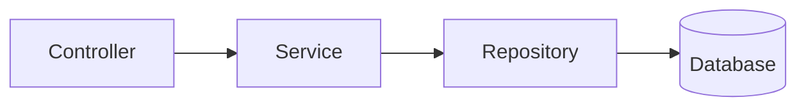
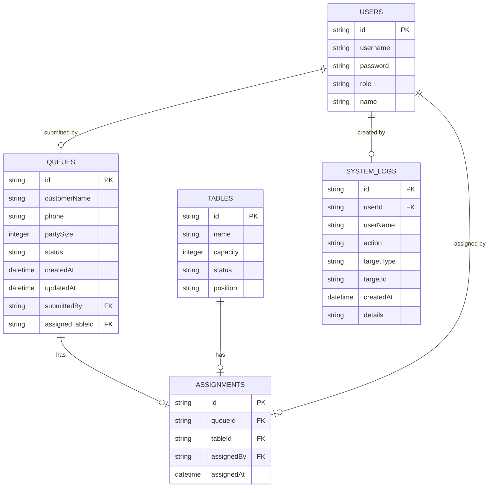

## 1. Architecture Design

```mermaid
layeredGraph LR
    subgraph Frontend
        A[React Components]
        B[Zustand State]
        C[Axios API]
    end
    
    subgraph Backend
        D[Express Server]
        E[API Routes]
        F[Services]
    end
    
    subgraph Database
        G[SQLite]
    end
    
    A --> C
    C --> E
    E --> F
    F --> G
```

## 2. Technology Description
- Frontend: React@18 + TypeScript + TailwindCSS@3 + Vite
- State Management: Zustand
- HTTP Client: Axios
- Backend: Express@4 + TypeScript
- Database: SQLite (便于本地运行)
- Initialization Tool: vite-init

## 3. Route Definitions
| Route | Purpose |
|-------|---------|
| / | 首页 - 排号列表和桌台状态 |
| /queue/:id | 排号详情页 - 时间线展示 |
| /tables | 桌台管理页 |
| /logs | 系统日志页 |
| /login | 登录页 |

## 4. API Definitions

### 4.1 等位排号 APIs
| Method | Endpoint | Description |
|--------|----------|-------------|
| GET | /api/queues | 获取排号列表 |
| POST | /api/queues | 创建新排号 |
| GET | /api/queues/:id | 获取排号详情 |
| PUT | /api/queues/:id | 更新排号状态 |
| DELETE | /api/queues/:id | 删除排号 |

### 4.2 桌台 APIs
| Method | Endpoint | Description |
|--------|----------|-------------|
| GET | /api/tables | 获取桌台列表 |
| POST | /api/tables | 创建桌台 |
| PUT | /api/tables/:id | 更新桌台状态 |
| DELETE | /api/tables/:id | 删除桌台 |

### 4.3 分配记录 APIs
| Method | Endpoint | Description |
|--------|----------|-------------|
| POST | /api/assignments | 创建分配记录 |
| GET | /api/assignments | 获取分配记录列表 |

### 4.4 系统日志 APIs
| Method | Endpoint | Description |
|--------|----------|-------------|
| GET | /api/logs | 获取系统日志 |

### 4.5 类型定义
```typescript
interface Queue {
  id: string;
  customerName: string;
  phone: string;
  partySize: number;
  status: 'waiting' | 'seated' | 'completed' | 'cancelled';
  createdAt: string;
  updatedAt: string;
  submittedBy: string;
  assignedTableId?: string;
}

interface Table {
  id: string;
  name: string;
  capacity: number;
  status: 'available' | 'occupied' | 'reserved' | 'cleaning';
  position: string;
}

interface Assignment {
  id: string;
  queueId: string;
  tableId: string;
  assignedBy: string;
  assignedAt: string;
}

interface SystemLog {
  id: string;
  userId: string;
  userName: string;
  action: string;
  targetType: string;
  targetId: string;
  createdAt: string;
  details: string;
}
```

## 5. Server Architecture Diagram



## 6. Data Model

### 6.1 Data Model Definition



### 6.2 Data Definition Language

```sql
CREATE TABLE users (
  id TEXT PRIMARY KEY,
  username TEXT UNIQUE NOT NULL,
  password TEXT NOT NULL,
  role TEXT NOT NULL CHECK(role IN ('manager', 'chef', 'cashier', 'admin')),
  name TEXT NOT NULL
);

CREATE TABLE tables (
  id TEXT PRIMARY KEY,
  name TEXT NOT NULL,
  capacity INTEGER NOT NULL,
  status TEXT NOT NULL CHECK(status IN ('available', 'occupied', 'reserved', 'cleaning')),
  position TEXT
);

CREATE TABLE queues (
  id TEXT PRIMARY KEY,
  customerName TEXT NOT NULL,
  phone TEXT,
  partySize INTEGER NOT NULL,
  status TEXT NOT NULL CHECK(status IN ('waiting', 'seated', 'completed', 'cancelled')),
  createdAt TEXT NOT NULL,
  updatedAt TEXT NOT NULL,
  submittedBy TEXT NOT NULL,
  assignedTableId TEXT,
  FOREIGN KEY(submittedBy) REFERENCES users(id),
  FOREIGN KEY(assignedTableId) REFERENCES tables(id)
);

CREATE TABLE assignments (
  id TEXT PRIMARY KEY,
  queueId TEXT NOT NULL,
  tableId TEXT NOT NULL,
  assignedBy TEXT NOT NULL,
  assignedAt TEXT NOT NULL,
  FOREIGN KEY(queueId) REFERENCES queues(id),
  FOREIGN KEY(tableId) REFERENCES tables(id),
  FOREIGN KEY(assignedBy) REFERENCES users(id)
);

CREATE TABLE system_logs (
  id TEXT PRIMARY KEY,
  userId TEXT NOT NULL,
  userName TEXT NOT NULL,
  action TEXT NOT NULL,
  targetType TEXT NOT NULL,
  targetId TEXT,
  createdAt TEXT NOT NULL,
  details TEXT,
  FOREIGN KEY(userId) REFERENCES users(id)
);

-- 初始数据
INSERT INTO users (id, username, password, role, name) VALUES
('u1', 'manager', '123456', 'manager', '前厅经理'),
('u2', 'chef', '123456', 'chef', '后厨主管'),
('u3', 'cashier', '123456', 'cashier', '收银员'),
('u4', 'admin', '123456', 'admin', '管理员');

INSERT INTO tables (id, name, capacity, status, position) VALUES
('t1', 'A1', 4, 'available', '一楼大厅左侧'),
('t2', 'A2', 4, 'available', '一楼大厅右侧'),
('t3', 'B1', 6, 'available', '二楼包间1'),
('t4', 'B2', 6, 'available', '二楼包间2'),
('t5', 'C1', 8, 'available', '三楼VIP包间'),
('t6', 'D1', 2, 'available', '一楼吧台'),
('t7', 'D2', 2, 'available', '一楼吧台'),
('t8', 'E1', 10, 'available', '宴会厅');
```
