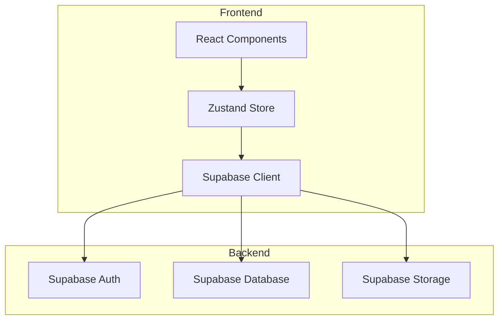
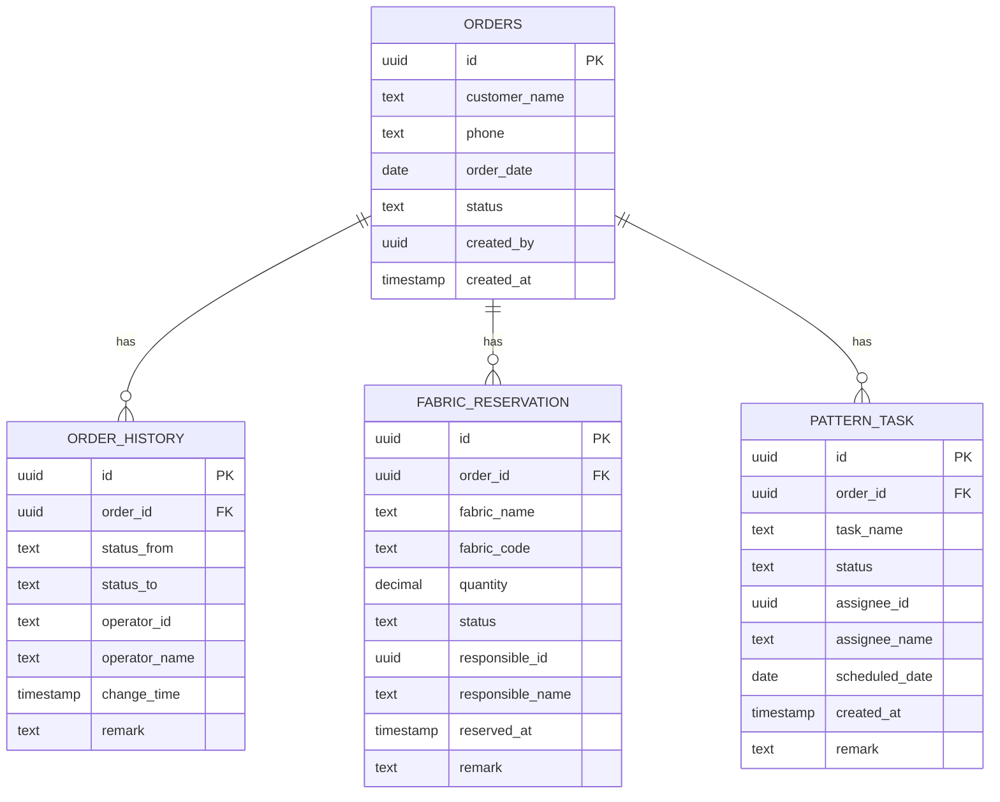

## 服装定制店-面料预留与打版排期系统 技术架构文档

### 1. Architecture Design


### 2. Technology Description
- Frontend: React@18 + TypeScript + TailwindCSS@3 + Vite
- State Management: Zustand
- UI Icons: Lucide React
- Backend: Supabase (PostgreSQL)

### 3. Route Definitions
| Route | Purpose |
|-------|---------|
| /dashboard | 工作台首页 |
| /fabric-reservation | 面料预留管理 |
| /pattern-scheduling | 打版排期管理 |
| /order/:id | 订单详情页 |

### 4. Data Model

#### 4.1 ER Diagram


#### 4.2 DDL Statements
```sql
CREATE TABLE orders (
    id UUID PRIMARY KEY DEFAULT uuid_generate_v4(),
    customer_name TEXT NOT NULL,
    phone TEXT,
    order_date DATE NOT NULL,
    status TEXT NOT NULL DEFAULT 'pending',
    created_by UUID,
    created_at TIMESTAMP DEFAULT NOW()
);

CREATE TABLE order_history (
    id UUID PRIMARY KEY DEFAULT uuid_generate_v4(),
    order_id UUID REFERENCES orders(id),
    status_from TEXT,
    status_to TEXT NOT NULL,
    operator_id UUID,
    operator_name TEXT NOT NULL,
    change_time TIMESTAMP DEFAULT NOW(),
    remark TEXT
);

CREATE TABLE fabric_reservation (
    id UUID PRIMARY KEY DEFAULT uuid_generate_v4(),
    order_id UUID REFERENCES orders(id),
    fabric_name TEXT NOT NULL,
    fabric_code TEXT,
    quantity DECIMAL NOT NULL,
    status TEXT NOT NULL DEFAULT 'pending',
    responsible_id UUID,
    responsible_name TEXT,
    reserved_at TIMESTAMP DEFAULT NOW(),
    remark TEXT
);

CREATE TABLE pattern_task (
    id UUID PRIMARY KEY DEFAULT uuid_generate_v4(),
    order_id UUID REFERENCES orders(id),
    task_name TEXT NOT NULL,
    status TEXT NOT NULL DEFAULT 'pending',
    assignee_id UUID,
    assignee_name TEXT,
    scheduled_date DATE,
    created_at TIMESTAMP DEFAULT NOW(),
    remark TEXT
);
```

### 5. Core Types
```typescript
interface Order {
  id: string;
  customer_name: string;
  phone: string;
  order_date: string;
  status: 'pending' | 'measured' | 'fabric_reserved' | 'pattern_in_progress' | 'fitting' | 'completed';
  created_by: string;
  created_at: string;
}

interface OrderHistory {
  id: string;
  order_id: string;
  status_from: string | null;
  status_to: string;
  operator_id: string;
  operator_name: string;
  change_time: string;
  remark: string;
}

interface FabricReservation {
  id: string;
  order_id: string;
  fabric_name: string;
  fabric_code: string;
  quantity: number;
  status: 'pending' | 'reserved' | 'rejected' | 'supplement';
  responsible_id: string;
  responsible_name: string;
  reserved_at: string;
  remark: string;
}

interface PatternTask {
  id: string;
  order_id: string;
  task_name: string;
  status: 'pending' | 'in_progress' | 'completed' | 'rejected';
  assignee_id: string;
  assignee_name: string;
  scheduled_date: string;
  created_at: string;
  remark: string;
}
```