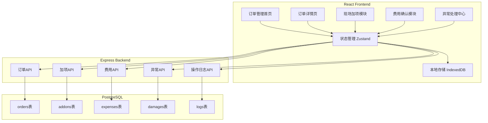
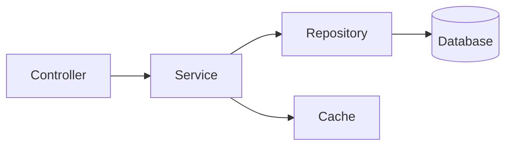
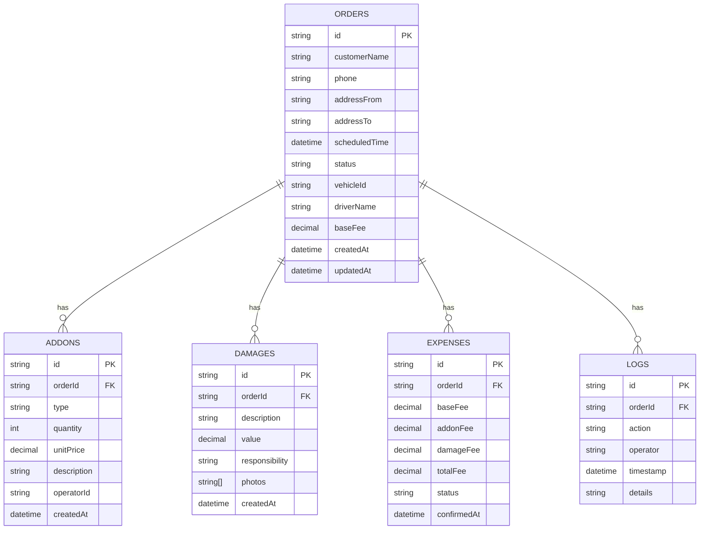

## 1. Architecture Design



## 2. Technology Description
- Frontend: React@18 + TypeScript + tailwindcss@3 + vite
- Initialization Tool: vite-init
- State Management: Zustand
- Local Storage: IndexedDB (localForage)
- Backend: Express@4 + TypeScript
- Database: SQLite (开发环境) / PostgreSQL (生产环境)
- Icons: lucide-react

## 3. Route Definitions
| Route | Purpose |
|-------|---------|
| / | 订单管理首页 |
| /orders/:id | 订单详情页 |
| /orders/:id/addon | 现场加项处理 |
| /orders/:id/confirm | 费用确认页 |
| /exceptions | 异常处理中心 |
| /history | 操作历史回看 |

## 4. API Definitions

### 4.1 订单API

#### GET /api/orders
获取订单列表

**Response:**
```typescript
interface Order {
  id: string;
  customerName: string;
  phone: string;
  addressFrom: string;
  addressTo: string;
  scheduledTime: string;
  status: 'reserved' | 'transporting' | 'serving' | 'pending' | 'settling' | 'completed' | 'dispute';
  vehicleId: string;
  driverName: string;
  baseFee: number;
  createdAt: string;
  updatedAt: string;
}
```

#### GET /api/orders/:id
获取订单详情

#### POST /api/orders
创建订单

**Request:**
```typescript
interface CreateOrderRequest {
  customerName: string;
  phone: string;
  addressFrom: string;
  addressTo: string;
  scheduledTime: string;
  baseFee: number;
}
```

#### PUT /api/orders/:id/status
更新订单状态

### 4.2 加项API

#### POST /api/orders/:id/addons
添加现场加项

**Request:**
```typescript
interface AddAddonRequest {
  type: string;
  quantity: number;
  unitPrice: number;
  description: string;
  operatorId: string;
}
```

#### GET /api/orders/:id/addons
获取订单加项列表

### 4.3 费用API

#### GET /api/orders/:id/expenses
获取费用明细

**Response:**
```typescript
interface ExpenseDetail {
  baseFee: number;
  addonFee: number;
  damageFee: number;
  totalFee: number;
  status: 'pending' | 'approved' | 'rejected';
}
```

#### PUT /api/orders/:id/expenses/confirm
确认费用

### 4.4 异常API

#### POST /api/orders/:id/exceptions
上报异常

**Request:**
```typescript
interface ReportExceptionRequest {
  type: 'late' | 'damage' | 'dispute';
  message: string;
  photos?: string[];
}
```

#### GET /api/exceptions
获取异常列表

### 4.5 操作日志API

#### GET /api/orders/:id/logs
获取操作历史

**Response:**
```typescript
interface OperationLog {
  id: string;
  orderId: string;
  action: string;
  operator: string;
  timestamp: string;
  details?: string;
}
```

## 5. Server Architecture Diagram



## 6. Data Model

### 6.1 Data Model Definition



### 6.2 Data Definition Language

```sql
CREATE TABLE orders (
  id TEXT PRIMARY KEY,
  customer_name TEXT NOT NULL,
  phone TEXT NOT NULL,
  address_from TEXT NOT NULL,
  address_to TEXT NOT NULL,
  scheduled_time DATETIME NOT NULL,
  status TEXT NOT NULL DEFAULT 'reserved',
  vehicle_id TEXT,
  driver_name TEXT,
  base_fee DECIMAL(10, 2) NOT NULL,
  created_at DATETIME NOT NULL DEFAULT CURRENT_TIMESTAMP,
  updated_at DATETIME NOT NULL DEFAULT CURRENT_TIMESTAMP
);

CREATE TABLE addons (
  id TEXT PRIMARY KEY,
  order_id TEXT NOT NULL,
  type TEXT NOT NULL,
  quantity INTEGER NOT NULL DEFAULT 1,
  unit_price DECIMAL(10, 2) NOT NULL,
  description TEXT,
  operator_id TEXT NOT NULL,
  created_at DATETIME NOT NULL DEFAULT CURRENT_TIMESTAMP,
  FOREIGN KEY (order_id) REFERENCES orders(id)
);

CREATE TABLE damages (
  id TEXT PRIMARY KEY,
  order_id TEXT NOT NULL,
  description TEXT NOT NULL,
  value DECIMAL(10, 2) NOT NULL,
  responsibility TEXT NOT NULL,
  photos TEXT,
  created_at DATETIME NOT NULL DEFAULT CURRENT_TIMESTAMP,
  FOREIGN KEY (order_id) REFERENCES orders(id)
);

CREATE TABLE expenses (
  id TEXT PRIMARY KEY,
  order_id TEXT NOT NULL,
  base_fee DECIMAL(10, 2) NOT NULL,
  addon_fee DECIMAL(10, 2) NOT NULL DEFAULT 0,
  damage_fee DECIMAL(10, 2) NOT NULL DEFAULT 0,
  total_fee DECIMAL(10, 2) NOT NULL,
  status TEXT NOT NULL DEFAULT 'pending',
  confirmed_at DATETIME,
  FOREIGN KEY (order_id) REFERENCES orders(id)
);

CREATE TABLE logs (
  id TEXT PRIMARY KEY,
  order_id TEXT NOT NULL,
  action TEXT NOT NULL,
  operator TEXT NOT NULL,
  timestamp DATETIME NOT NULL DEFAULT CURRENT_TIMESTAMP,
  details TEXT,
  FOREIGN KEY (order_id) REFERENCES orders(id)
);

CREATE INDEX idx_orders_status ON orders(status);
CREATE INDEX idx_orders_scheduled_time ON orders(scheduled_time);
CREATE INDEX idx_addons_order_id ON addons(order_id);
CREATE INDEX idx_damages_order_id ON damages(order_id);
CREATE INDEX idx_expenses_order_id ON expenses(order_id);
CREATE INDEX idx_logs_order_id ON logs(order_id);
```

## 7. 本地存储设计

### 7.1 IndexedDB Schema

```typescript
interface LocalOrder extends Order {
  syncStatus: 'synced' | 'pending' | 'failed';
}

interface LocalAddon extends Addon {
  syncStatus: 'synced' | 'pending' | 'failed';
}

interface LocalLog {
  id: string;
  orderId: string;
  action: string;
  operator: string;
  timestamp: string;
  details?: string;
  syncStatus: 'synced' | 'pending' | 'failed';
}
```

### 7.2 同步策略

1. **在线模式**: 操作立即同步到服务器
2. **离线模式**: 操作存储到IndexedDB，标记为pending
3. **恢复连接**: 自动重试pending操作
4. **冲突处理**: 以服务器数据为准，本地pending操作标记为failed，通知用户处理

## 8. 异常处理机制

### 8.1 异常检测规则

```typescript
interface ExceptionRule {
  type: 'late' | 'damage' | 'unconfirmed';
  condition: (order: Order) => boolean;
  severity: 'warning' | 'error' | 'critical';
  notificationInterval: number; // 分钟
}
```

### 8.2 提醒机制

- **实时提醒**: 状态变化时立即通知相关人员
- **定时检查**: 每5分钟检查一次异常订单
- **升级机制**: 超过阈值自动升级提醒级别
