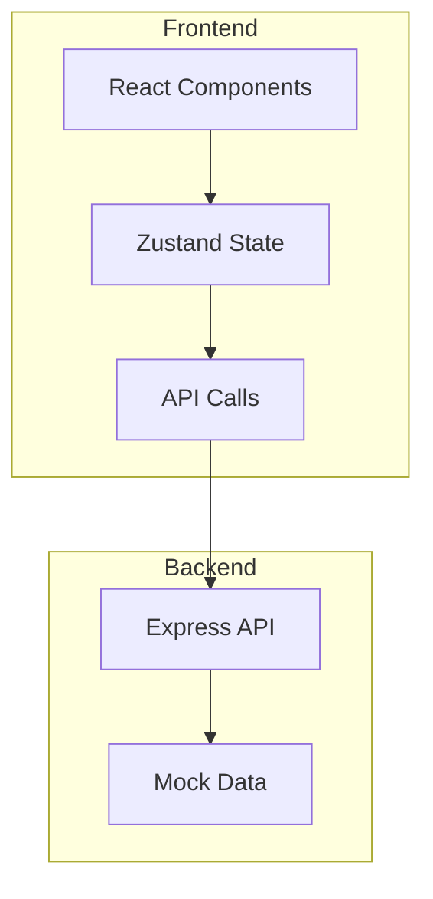
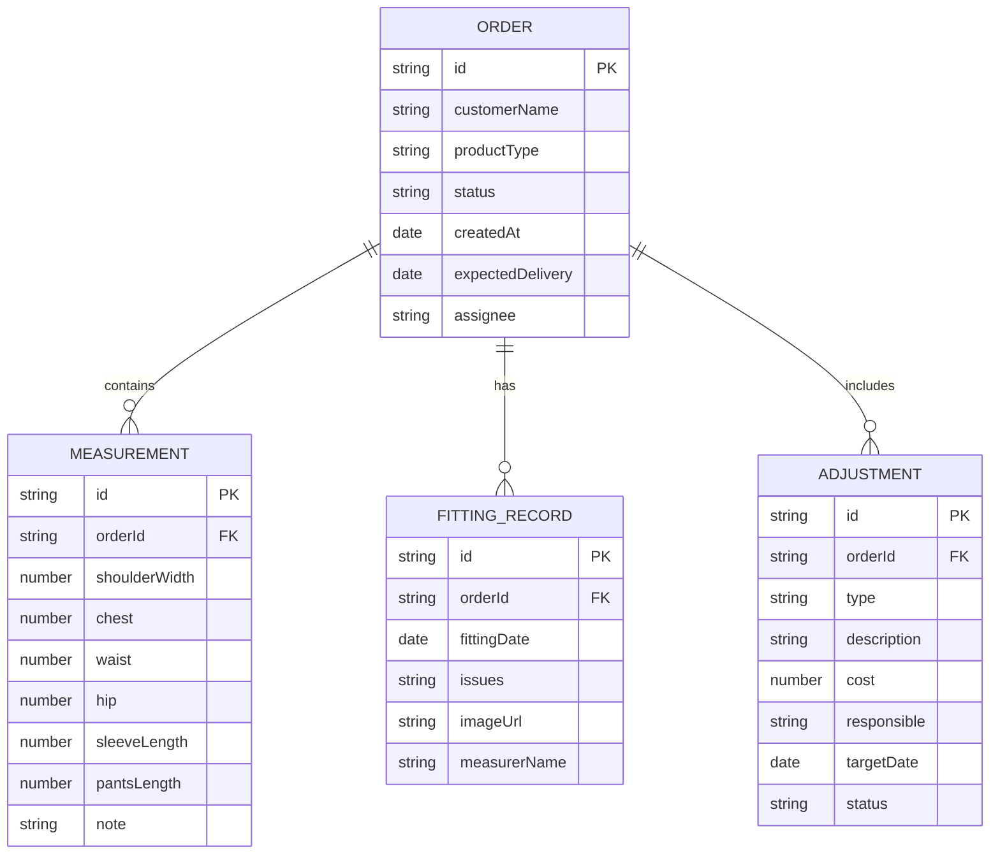

## 1. Architecture Design



## 2. Technology Description
- Frontend: React@18 + TypeScript + TailwindCSS@3 + Vite
- State Management: Zustand
- Router: React Router DOM
- Icons: Lucide React
- Backend: Express@4 + TypeScript (仅用于Mock数据)

## 3. Route Definitions
| Route | Purpose |
|-------|---------|
| / | 工作台首页 - 订单列表 |
| /order/:id | 订单详情页 |

## 4. Data Model

### 4.1 Data Model Definition


### 4.2 Mock Data Structure
```typescript
interface Order {
  id: string;
  customerName: string;
  productType: 'suit' | 'wedding-dress' | 'custom';
  status: 'pending' | 'fitting' | 'adjusting' | 'completed';
  createdAt: string;
  expectedDelivery: string;
  assignee: string;
}

interface Measurement {
  id: string;
  orderId: string;
  shoulderWidth: number;
  chest: number;
  waist: number;
  hip: number;
  sleeveLength: number;
  pantsLength: number;
  note: string;
}

interface FittingRecord {
  id: string;
  orderId: string;
  fittingDate: string;
  issues: string;
  imageUrl?: string;
  measurerName: string;
}

interface Adjustment {
  id: string;
  orderId: string;
  type: 'free' | 'paid' | 'size-change';
  description: string;
  cost: number;
  responsible: string;
  targetDate: string;
  status: 'pending' | 'in-progress' | 'completed';
}
```

## 5. Component Structure
```
src/
├── components/
│   ├── Layout/
│   │   └── Header.tsx
│   ├── Dashboard/
│   │   ├── OrderCard.tsx
│   │   ├── OrderList.tsx
│   │   └── FilterBar.tsx
│   └── OrderDetail/
│       ├── MeasurementSheet.tsx
│       ├── FittingTimeline.tsx
│       └── AdjustmentPanel.tsx
├── pages/
│   ├── Dashboard.tsx
│   └── OrderDetail.tsx
├── store/
│   └── orderStore.ts
├── data/
│   └── mockData.ts
└── types/
    └── index.ts
```

## 6. API Endpoints (Mock)
| Method | Endpoint | Description |
|--------|----------|-------------|
| GET | /api/orders | 获取订单列表 |
| GET | /api/orders/:id | 获取订单详情 |
| GET | /api/orders/:id/measurements | 获取量体单 |
| GET | /api/orders/:id/fittings | 获取试衣记录 |
| GET | /api/orders/:id/adjustments | 获取调整记录 |
| PUT | /api/orders/:id/adjustments | 更新调整状态 |
