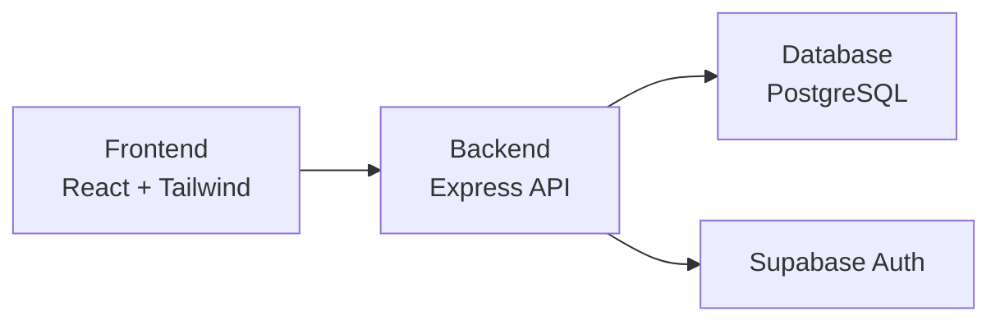
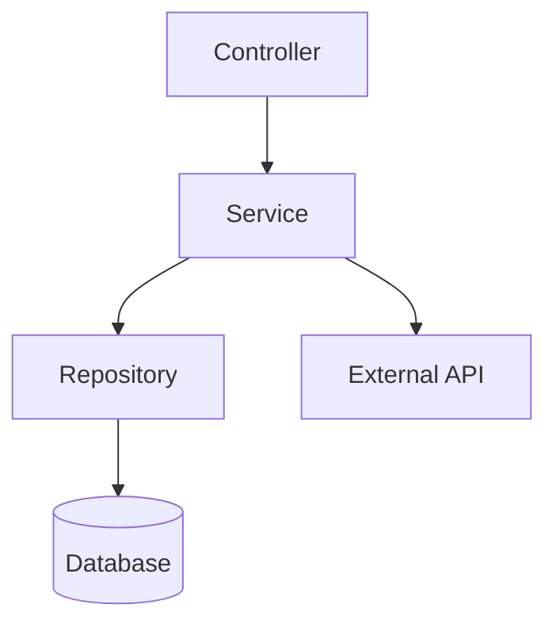
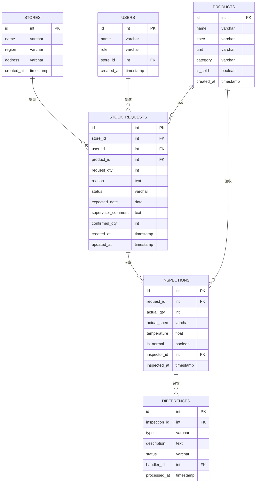

## 1. Architecture Design



## 2. Technology Description
- Frontend: React@18 + tailwindcss@3 + vite@6
- Initialization Tool: vite-init
- Backend: Express@4 + TypeScript
- Database: PostgreSQL (via Supabase)
- State Management: Zustand
- Icons: lucide-react

## 3. Route Definitions
| Route | Purpose |
|-------|---------|
| / | 首页仪表盘 |
| /stock-request | 缺货申领页 |
| /delivery-status | 配货状态页 |
| /arrival-inspection | 到货验收页 |
| /difference-handling | 差异处理页 |
| /store-feedback | 门店反馈页 |

## 4. API Definitions

### 4.1 缺货申领相关
- POST /api/stock-requests - 创建缺货申领
- GET /api/stock-requests - 获取申领列表
- GET /api/stock-requests/:id - 获取申领详情
- PUT /api/stock-requests/:id/status - 更新申领状态

### 4.2 商品相关
- GET /api/products - 获取商品列表
- GET /api/products/:id - 获取商品详情

### 4.3 到货验收相关
- POST /api/inspections - 创建验收记录
- GET /api/inspections - 获取验收列表
- PUT /api/inspections/:id - 更新验收记录

### 4.4 差异处理相关
- POST /api/differences - 创建差异记录
- GET /api/differences - 获取差异列表
- PUT /api/differences/:id/status - 处理差异

## 5. Server Architecture Diagram



## 6. Data Model

### 6.1 Data Model Definition



### 6.2 Data Definition Language

```sql
-- Stores table
CREATE TABLE stores (
    id SERIAL PRIMARY KEY,
    name VARCHAR(100) NOT NULL,
    region VARCHAR(50),
    address TEXT,
    created_at TIMESTAMP DEFAULT CURRENT_TIMESTAMP
);

-- Users table
CREATE TABLE users (
    id SERIAL PRIMARY KEY,
    name VARCHAR(100) NOT NULL,
    role VARCHAR(20) NOT NULL,
    store_id INT REFERENCES stores(id),
    created_at TIMESTAMP DEFAULT CURRENT_TIMESTAMP
);

-- Products table
CREATE TABLE products (
    id SERIAL PRIMARY KEY,
    name VARCHAR(100) NOT NULL,
    spec VARCHAR(50),
    unit VARCHAR(20) NOT NULL,
    category VARCHAR(50),
    is_cold BOOLEAN DEFAULT FALSE,
    created_at TIMESTAMP DEFAULT CURRENT_TIMESTAMP
);

-- Stock requests table
CREATE TABLE stock_requests (
    id SERIAL PRIMARY KEY,
    store_id INT REFERENCES stores(id),
    user_id INT REFERENCES users(id),
    product_id INT REFERENCES products(id),
    request_qty INT NOT NULL,
    reason TEXT,
    status VARCHAR(20) DEFAULT 'pending',
    expected_date DATE,
    supervisor_comment TEXT,
    confirmed_qty INT,
    created_at TIMESTAMP DEFAULT CURRENT_TIMESTAMP,
    updated_at TIMESTAMP DEFAULT CURRENT_TIMESTAMP
);

-- Inspections table
CREATE TABLE inspections (
    id SERIAL PRIMARY KEY,
    request_id INT REFERENCES stock_requests(id),
    actual_qty INT,
    actual_spec VARCHAR(50),
    temperature FLOAT,
    is_normal BOOLEAN DEFAULT TRUE,
    inspector_id INT REFERENCES users(id),
    inspected_at TIMESTAMP DEFAULT CURRENT_TIMESTAMP
);

-- Differences table
CREATE TABLE differences (
    id SERIAL PRIMARY KEY,
    inspection_id INT REFERENCES inspections(id),
    type VARCHAR(20) NOT NULL,
    description TEXT,
    status VARCHAR(20) DEFAULT 'pending',
    handler_id INT REFERENCES users(id),
    processed_at TIMESTAMP
);

-- Insert initial data
INSERT INTO stores (name, region, address) VALUES
('望京SOHO店', '北京', '北京市朝阳区望京街10号'),
('国贸店', '北京', '北京市朝阳区建国门外大街1号'),
('三里屯店', '北京', '北京市朝阳区三里屯太古里');

INSERT INTO users (name, role, store_id) VALUES
('张三', 'manager', 1),
('李四', 'supervisor', NULL),
('王五', 'purchaser', NULL),
('赵六', 'manager', 2);

INSERT INTO products (name, spec, unit, category, is_cold) VALUES
('生菜', '250g/袋', '袋', '蔬菜', FALSE),
('鸡胸肉', '500g/盒', '盒', '肉类', TRUE),
('牛奶', '1L/瓶', '瓶', '乳制品', TRUE),
('大米', '5kg/袋', '袋', '粮油', FALSE),
('食用油', '5L/桶', '桶', '粮油', FALSE);

INSERT INTO stock_requests (store_id, user_id, product_id, request_qty, reason, status, expected_date) VALUES
(1, 1, 2, 10, '库存不足，影响营业', 'pending', '2026-06-20'),
(1, 1, 3, 20, '临时断货', 'approved', '2026-06-18'),
(2, 4, 4, 5, '库存告急', 'delivering', '2026-06-19');
```
