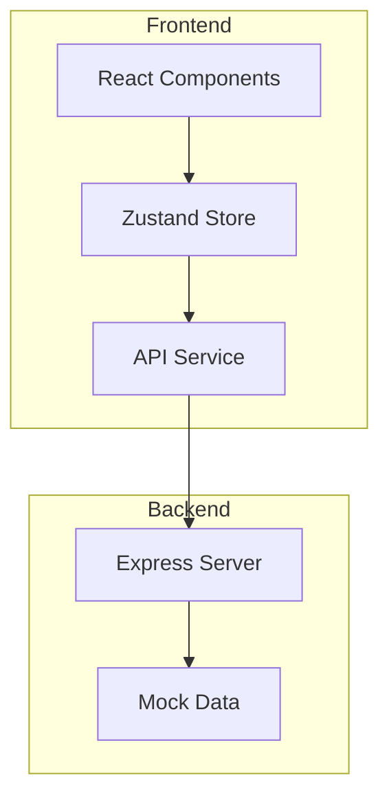
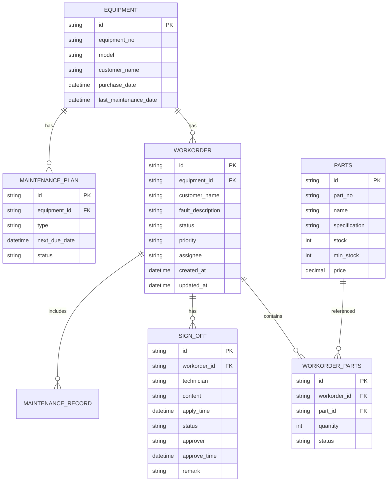

## 1. Architecture Design


## 2. Technology Description
- Frontend: React@18 + TypeScript + TailwindCSS@3 + Vite
- State Management: Zustand
- Routing: React Router DOM
- Icons: Lucide React
- Backend: Express@4 + TypeScript (Mock API)
- Initialization Tool: vite-init

## 3. Route Definitions
| Route | Purpose | Component |
|-------|---------|-----------|
| / | 工作台 - 工单看板 | Dashboard |
| /workorder/:id | 工单详情 | WorkOrderDetail |
| /workorder/create | 创建工单 | WorkOrderCreate |
| /parts | 配件管理 | PartsManagement |
| /signoff | 签认中心 | SignoffCenter |
| /equipment | 设备档案 | EquipmentArchive |

## 4. API Definitions

### 4.1 工单相关
| Method | Endpoint | Description |
|--------|----------|-------------|
| GET | /api/workorders | 获取工单列表 |
| GET | /api/workorders/:id | 获取工单详情 |
| POST | /api/workorders | 创建工单 |
| PUT | /api/workorders/:id | 更新工单 |
| POST | /api/workorders/:id/assign | 分配技师 |
| POST | /api/workorders/:id/apply-parts | 申请配件 |
| POST | /api/workorders/:id/signoff | 提交复工申请 |

### 4.2 配件相关
| Method | Endpoint | Description |
|--------|----------|-------------|
| GET | /api/parts | 获取配件库存列表 |
| GET | /api/parts/:id | 获取配件详情 |
| PUT | /api/parts/:id/outbound | 配件出库 |
| POST | /api/parts | 新增配件 |

### 4.3 设备相关
| Method | Endpoint | Description |
|--------|----------|-------------|
| GET | /api/equipment | 获取设备列表 |
| GET | /api/equipment/:id | 获取设备详情 |
| GET | /api/equipment/:id/maintenance | 获取保养记录 |

### 4.4 签认相关
| Method | Endpoint | Description |
|--------|----------|-------------|
| GET | /api/signoffs | 获取签认记录列表 |
| GET | /api/signoffs/:id | 获取签认详情 |
| POST | /api/signoffs/:id/approve | 审批签认 |

## 5. Data Model

### 5.1 Entity Relationship Diagram


### 5.2 状态定义
| 状态类型 | 值 | 说明 |
|----------|-----|------|
| 工单状态 | pending | 待处理 |
| 工单状态 | assigned | 已分配 |
| 工单状态 | diagnosing | 诊断中 |
| 工单状态 | waiting_parts | 等待配件 |
| 工单状态 | repairing | 维修中 |
| 工单状态 | signoff_pending | 待签认 |
| 工单状态 | completed | 已完成 |
| 工单状态 | cancelled | 已取消 |
| 优先级 | high | 高 |
| 优先级 | medium | 中 |
| 优先级 | low | 低 |

### 5.3 Mock Data 结构
```typescript
interface WorkOrder {
  id: string;
  equipmentId: string;
  equipmentNo: string;
  customerName: string;
  model: string;
  faultDescription: string;
  status: WorkOrderStatus;
  priority: Priority;
  assignee: string;
  assigneeName: string;
  createdAt: string;
  updatedAt: string;
  estimatedCompletionTime: string;
  parts: WorkOrderPart[];
  signOff?: SignOff;
  maintenanceRecords: MaintenanceRecord[];
}

interface Equipment {
  id: string;
  equipmentNo: string;
  model: string;
  customerName: string;
  purchaseDate: string;
  lastMaintenanceDate: string;
  status: 'active' | 'inactive';
  maintenancePlans: MaintenancePlan[];
}

interface Part {
  id: string;
  partNo: string;
  name: string;
  specification: string;
  stock: number;
  minStock: number;
  price: number;
}

interface SignOff {
  id: string;
  workorderId: string;
  technician: string;
  technicianName: string;
  content: string;
  partsUsed: string[];
  workingHours: number;
  applyTime: string;
  status: 'pending' | 'approved' | 'rejected';
  approver?: string;
  approverName?: string;
  approveTime?: string;
  remark?: string;
  attachments: string[];
}
```

## 6. Project Structure
```
src/
├── components/           # 公共组件
│   ├── Layout/          # 布局组件
│   ├── WorkOrder/       # 工单相关组件
│   ├── Parts/           # 配件相关组件
│   ├── SignOff/         # 签认相关组件
│   └── Common/          # 通用组件
├── pages/               # 页面组件
│   ├── Dashboard.tsx    # 工作台
│   ├── WorkOrderDetail.tsx
│   ├── WorkOrderCreate.tsx
│   ├── PartsManagement.tsx
│   ├── SignoffCenter.tsx
│   └── EquipmentArchive.tsx
├── stores/              # Zustand状态管理
│   ├── workorder.ts
│   ├── parts.ts
│   ├── equipment.ts
│   └── auth.ts
├── api/                 # API服务
│   └── index.ts
├── data/                # Mock数据
│   └── mockData.ts
├── types/               # 类型定义
│   └── index.ts
├── utils/               # 工具函数
│   └── helpers.ts
├── App.tsx
├── main.tsx
└── index.css
```

## 7. State Management

### 7.1 Store 结构
```typescript
// stores/workorder.ts
interface WorkOrderStore {
  workorders: WorkOrder[];
  currentWorkOrder: WorkOrder | null;
  statusFilter: string;
  fetchWorkOrders: () => void;
  getWorkOrderById: (id: string) => void;
  createWorkOrder: (data: WorkOrderCreateData) => void;
  updateWorkOrder: (id: string, data: Partial<WorkOrder>) => void;
  assignTechnician: (id: string, technicianId: string) => void;
  applyParts: (id: string, parts: PartRequest[]) => void;
  submitSignOff: (id: string, data: SignOffData) => void;
  approveSignOff: (id: string, remark?: string) => void;
  rejectSignOff: (id: string, remark: string) => void;
  setStatusFilter: (status: string) => void;
}
```

## 8. Security Considerations
- 前端权限控制通过角色判断实现
- Mock数据不涉及真实敏感信息
- 所有操作都需要验证当前用户权限
- 使用TypeScript进行类型安全检查