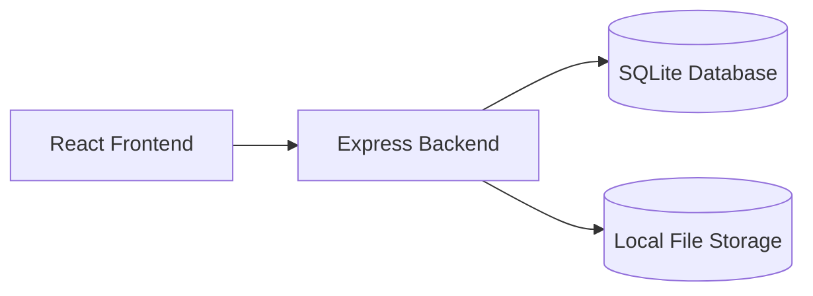
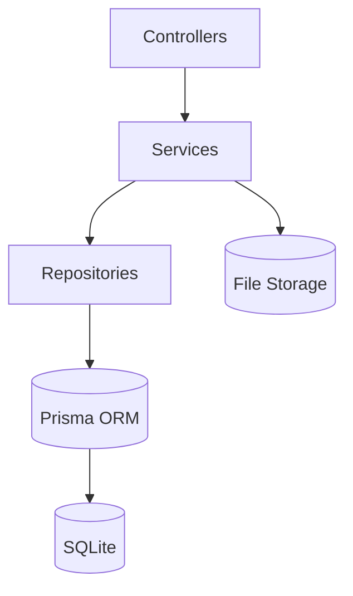
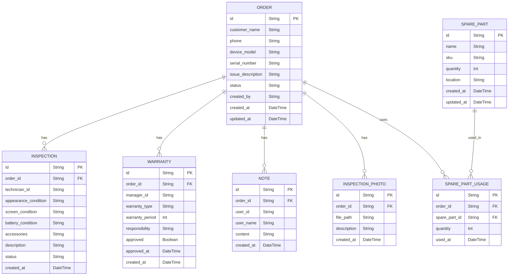

## 1. Architecture Design



## 2. Technology Description
- Frontend: React@18 + TypeScript + TailwindCSS@3 + Vite
- Backend: Express@4 + TypeScript
- Database: SQLite with Prisma ORM
- State Management: Zustand
- Icons: Lucide React

## 3. Route Definitions
| Route | Purpose |
|-------|---------|
| / | 首页仪表盘 |
| /orders | 接机单管理列表 |
| /orders/:id | 工单详情页 |
| /orders/:id/inspection | 取机质检页 |
| /orders/:id/warranty | 售后保修页 |
| /spare-parts | 备件管理 |
| /reset-data | 数据重置 |

## 4. API Definitions

### 4.1 Order Routes
| Method | Endpoint | Description |
|--------|----------|-------------|
| GET | /api/orders | 获取工单列表 |
| GET | /api/orders/:id | 获取工单详情 |
| POST | /api/orders | 创建接机单 |
| PUT | /api/orders/:id | 更新工单 |
| DELETE | /api/orders/:id | 删除工单 |

### 4.2 Inspection Routes
| Method | Endpoint | Description |
|--------|----------|-------------|
| POST | /api/orders/:id/inspection | 提交质检报告 |
| GET | /api/orders/:id/inspection | 获取质检信息 |

### 4.3 Warranty Routes
| Method | Endpoint | Description |
|--------|----------|-------------|
| POST | /api/orders/:id/warranty | 确认售后保修 |
| GET | /api/orders/:id/warranty | 获取保修信息 |

### 4.4 Spare Parts Routes
| Method | Endpoint | Description |
|--------|----------|-------------|
| GET | /api/spare-parts | 获取备件列表 |
| POST | /api/spare-parts | 创建备件 |
| PUT | /api/spare-parts/:id | 更新备件 |
| DELETE | /api/spare-parts/:id | 删除备件 |

### 4.5 Reset Routes
| Method | Endpoint | Description |
|--------|----------|-------------|
| POST | /api/reset | 重置测试数据 |

## 5. Server Architecture Diagram



## 6. Data Model

### 6.1 Data Model Definition



### 6.2 Data Definition Language

**orders table:**
```sql
CREATE TABLE orders (
    id TEXT PRIMARY KEY,
    customer_name TEXT NOT NULL,
    phone TEXT NOT NULL,
    device_model TEXT NOT NULL,
    serial_number TEXT,
    issue_description TEXT,
    status TEXT NOT NULL DEFAULT 'pending',
    created_by TEXT NOT NULL,
    created_at DATETIME NOT NULL DEFAULT CURRENT_TIMESTAMP,
    updated_at DATETIME NOT NULL DEFAULT CURRENT_TIMESTAMP
);
```

**inspections table:**
```sql
CREATE TABLE inspections (
    id TEXT PRIMARY KEY,
    order_id TEXT NOT NULL,
    technician_id TEXT NOT NULL,
    technician_name TEXT NOT NULL,
    appearance_condition TEXT NOT NULL,
    screen_condition TEXT NOT NULL,
    battery_condition TEXT NOT NULL,
    accessories TEXT,
    description TEXT,
    status TEXT NOT NULL DEFAULT 'pending',
    created_at DATETIME NOT NULL DEFAULT CURRENT_TIMESTAMP,
    FOREIGN KEY (order_id) REFERENCES orders(id)
);
```

**warranties table:**
```sql
CREATE TABLE warranties (
    id TEXT PRIMARY KEY,
    order_id TEXT NOT NULL,
    manager_id TEXT NOT NULL,
    manager_name TEXT NOT NULL,
    warranty_type TEXT NOT NULL,
    warranty_period INTEGER NOT NULL,
    responsibility TEXT NOT NULL,
    approved BOOLEAN NOT NULL DEFAULT FALSE,
    approved_at DATETIME,
    created_at DATETIME NOT NULL DEFAULT CURRENT_TIMESTAMP,
    FOREIGN KEY (order_id) REFERENCES orders(id)
);
```

**notes table:**
```sql
CREATE TABLE notes (
    id TEXT PRIMARY KEY,
    order_id TEXT NOT NULL,
    user_id TEXT NOT NULL,
    user_name TEXT NOT NULL,
    content TEXT NOT NULL,
    created_at DATETIME NOT NULL DEFAULT CURRENT_TIMESTAMP,
    FOREIGN KEY (order_id) REFERENCES orders(id)
);
```

**inspection_photos table:**
```sql
CREATE TABLE inspection_photos (
    id TEXT PRIMARY KEY,
    order_id TEXT NOT NULL,
    file_path TEXT NOT NULL,
    description TEXT,
    created_at DATETIME NOT NULL DEFAULT CURRENT_TIMESTAMP,
    FOREIGN KEY (order_id) REFERENCES orders(id)
);
```

**spare_parts table:**
```sql
CREATE TABLE spare_parts (
    id TEXT PRIMARY KEY,
    name TEXT NOT NULL,
    sku TEXT NOT NULL,
    quantity INTEGER NOT NULL DEFAULT 0,
    location TEXT,
    created_at DATETIME NOT NULL DEFAULT CURRENT_TIMESTAMP,
    updated_at DATETIME NOT NULL DEFAULT CURRENT_TIMESTAMP
);
```

**spare_part_usages table:**
```sql
CREATE TABLE spare_part_usages (
    id TEXT PRIMARY KEY,
    order_id TEXT NOT NULL,
    spare_part_id TEXT NOT NULL,
    quantity INTEGER NOT NULL,
    used_at DATETIME NOT NULL DEFAULT CURRENT_TIMESTAMP,
    FOREIGN KEY (order_id) REFERENCES orders(id),
    FOREIGN KEY (spare_part_id) REFERENCES spare_parts(id)
);
```