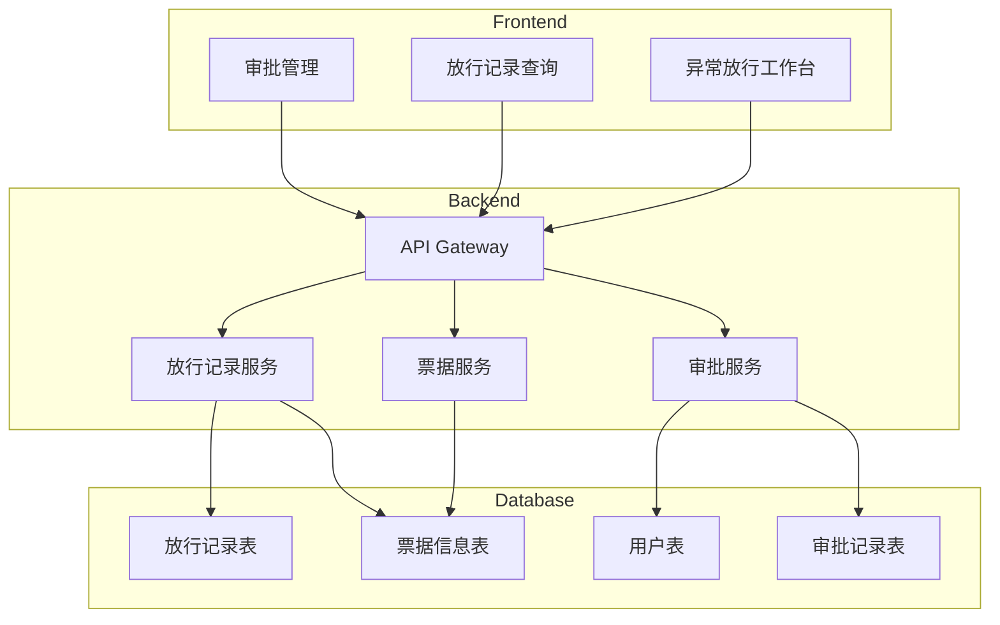
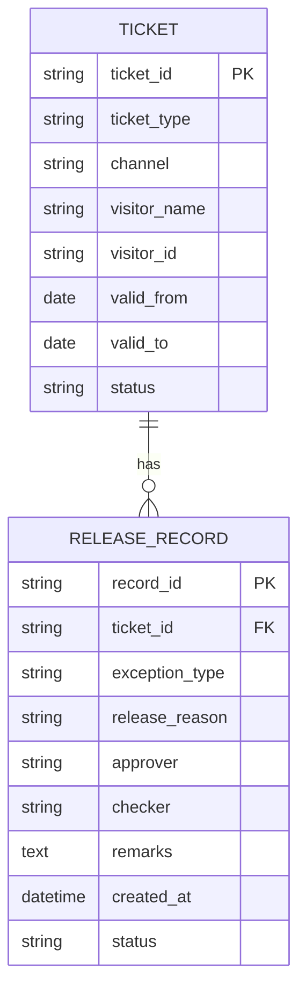

## 1. Architecture Design


## 2. Technology Description
- Frontend: React@18 + tailwindcss@3 + vite
- Initialization Tool: vite-init
- Backend: None (纯前端模拟)
- State Management: zustand
- Icons: lucide-react

## 3. Route Definitions
| Route | Purpose |
|-------|---------|
| / | 异常放行工作台首页 |
| /records | 放行记录查询页面 |
| /approval | 审批管理页面 |

## 4. Data Model

### 4.1 Data Model Definition


### 4.2 Data Definition Language
```sql
-- 票据信息表
CREATE TABLE tickets (
    ticket_id VARCHAR(50) PRIMARY KEY,
    ticket_type VARCHAR(50) NOT NULL,
    channel VARCHAR(50) NOT NULL,
    visitor_name VARCHAR(100) NOT NULL,
    visitor_id VARCHAR(50) NOT NULL,
    valid_from DATE NOT NULL,
    valid_to DATE NOT NULL,
    status VARCHAR(20) DEFAULT 'valid'
);

-- 放行记录表
CREATE TABLE release_records (
    record_id VARCHAR(50) PRIMARY KEY,
    ticket_id VARCHAR(50) NOT NULL,
    exception_type VARCHAR(50) NOT NULL,
    release_reason VARCHAR(200) NOT NULL,
    approver VARCHAR(100),
    checker VARCHAR(100) NOT NULL,
    remarks TEXT,
    created_at TIMESTAMP DEFAULT CURRENT_TIMESTAMP,
    status VARCHAR(20) DEFAULT 'pending'
);
```

## 5. Component Structure
```
src/
├── components/
│   ├── Header.tsx           # 顶部导航栏
│   ├── TicketInfoCard.tsx   # 票据信息卡片
│   ├── ExceptionSelector.tsx # 异常类型选择器
│   ├── ReleaseForm.tsx      # 放行申请表单
│   ├── RecordTable.tsx      # 记录列表表格
│   └── ApprovalModal.tsx    # 审批弹窗
├── pages/
│   ├── Workbench.tsx        # 异常放行工作台
│   ├── Records.tsx          # 放行记录查询
│   └── Approval.tsx         # 审批管理
├── store/
│   └── ticketStore.ts       # 状态管理
├── data/
│   └── mockData.ts          # 模拟数据
├── types/
│   └── index.ts             # 类型定义
└── App.tsx
```

## 6. Type Definitions
```typescript
interface Ticket {
    ticket_id: string;
    ticket_type: string;
    channel: string;
    visitor_name: string;
    visitor_id: string;
    valid_from: string;
    valid_to: string;
    status: string;
}

interface ReleaseRecord {
    record_id: string;
    ticket_id: string;
    exception_type: string;
    release_reason: string;
    approver: string;
    checker: string;
    remarks: string;
    created_at: string;
    status: 'pending' | 'approved' | 'rejected';
}

type ExceptionType = 'expired' | 'team_mismatch' | 'gate_offline' | 'id_verify_fail';
```

## 7. Mock Data Structure
```typescript
// 异常类型配置
const exceptionTypes = [
    { value: 'expired', label: '套票过期', color: 'red' },
    { value: 'team_mismatch', label: '团队票名单不符', color: 'orange' },
    { value: 'gate_offline', label: '闸机离线', color: 'yellow' },
    { value: 'id_verify_fail', label: '证件核验失败', color: 'blue' }
];

// 票种配置
const ticketTypes = ['成人票', '儿童票', '老人票', '家庭套票', '团队票'];

// 渠道配置
const channels = ['官网', 'OTA', '现场', '旅行社'];
```