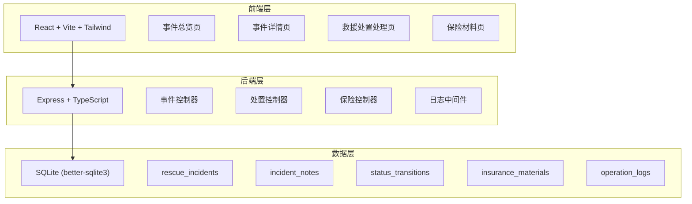
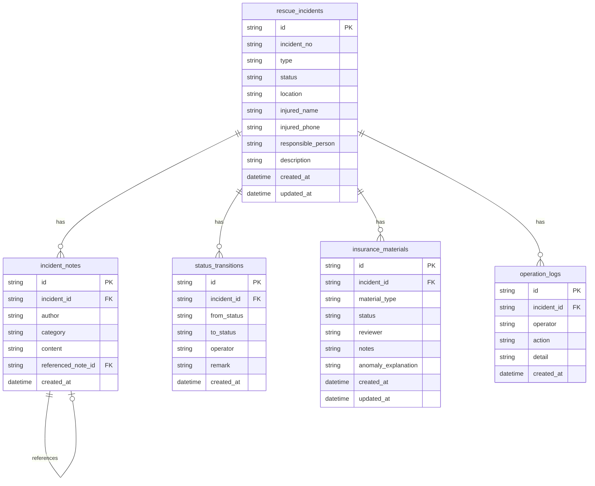

## 1. 架构设计



## 2. 技术说明

- 前端：React@18 + tailwindcss@3 + vite + zustand
- 初始化工具：vite-init
- 后端：Express@4 + TypeScript (ESM)
- 数据库：SQLite (better-sqlite3)，本地文件存储，无需外部服务

## 3. 路由定义

| 路由 | 用途 |
|------|------|
| / | 事件总览页，展示救援事件看板 |
| /incident/:id | 事件详情页，时间线+备注流+状态流转 |
| /incident/:id/process | 救援处置处理页，处置操作+备注录入 |
| /incident/:id/insurance | 保险材料页，备注回看+材料管理 |

## 4. API定义

### 4.1 事件相关

```
GET    /api/incidents              获取事件列表（支持状态/责任人筛选）
GET    /api/incidents/:id          获取事件详情（含时间线）
POST   /api/incidents              创建救援事件
```

### 4.2 处置相关

```
POST   /api/incidents/:id/notes         添加处置备注
POST   /api/incidents/:id/status        推进状态流转
GET    /api/incidents/:id/timeline       获取完整时间线
GET    /api/incidents/:id/logs           获取操作日志
```

### 4.3 保险相关

```
GET    /api/incidents/:id/insurance     获取保险材料列表
POST   /api/incidents/:id/insurance     添加保险材料
PUT    /api/insurance/:materialId        更新保险材料状态
POST   /api/insurance/:materialId/anomaly  添加异常说明
```

### 4.4 类型定义

```typescript
interface RescueIncident {
  id: string
  incident_no: string
  type: 'collision' | 'fall' | 'equipment' | 'weather' | 'other'
  status: 'pending' | 'processing' | 'review' | 'completed' | 'archived'
  location: string
  injured_name: string
  injured_phone: string
  responsible_person: string
  description: string
  created_at: string
  updated_at: string
}

interface IncidentNote {
  id: string
  incident_id: string
  author: string
  category: 'rescue' | 'medical' | 'insurance' | 'anomaly'
  content: string
  referenced_note_id: string | null
  created_at: string
}

interface StatusTransition {
  id: string
  incident_id: string
  from_status: string
  to_status: string
  operator: string
  remark: string
  created_at: string
}

interface InsuranceMaterial {
  id: string
  incident_id: string
  material_type: 'claim_form' | 'medical_cert' | 'rescue_report' | 'photo_evidence' | 'other'
  status: 'draft' | 'submitted' | 'approved' | 'rejected'
  reviewer: string | null
  notes: string
  anomaly_explanation: string | null
  created_at: string
  updated_at: string
}

interface OperationLog {
  id: string
  incident_id: string
  operator: string
  action: string
  detail: string
  created_at: string
}
```

## 5. 服务端架构图

```mermaid
flowchart LR
    "路由层 Router" --> "控制器 Controller"
    "控制器 Controller" --> "服务层 Service"
    "服务层 Service" --> "数据层 Repository"
    "数据层 Repository" --> "SQLite"
```

## 6. 数据模型

### 6.1 数据模型定义



### 6.2 数据定义语言

```sql
CREATE TABLE rescue_incidents (
  id TEXT PRIMARY KEY,
  incident_no TEXT NOT NULL UNIQUE,
  type TEXT NOT NULL CHECK(type IN ('collision', 'fall', 'equipment', 'weather', 'other')),
  status TEXT NOT NULL DEFAULT 'pending' CHECK(status IN ('pending', 'processing', 'review', 'completed', 'archived')),
  location TEXT NOT NULL,
  injured_name TEXT NOT NULL,
  injured_phone TEXT NOT NULL,
  responsible_person TEXT NOT NULL,
  description TEXT NOT NULL DEFAULT '',
  created_at TEXT NOT NULL DEFAULT (datetime('now')),
  updated_at TEXT NOT NULL DEFAULT (datetime('now'))
);

CREATE TABLE incident_notes (
  id TEXT PRIMARY KEY,
  incident_id TEXT NOT NULL REFERENCES rescue_incidents(id),
  author TEXT NOT NULL,
  category TEXT NOT NULL CHECK(category IN ('rescue', 'medical', 'insurance', 'anomaly')),
  content TEXT NOT NULL,
  referenced_note_id TEXT REFERENCES incident_notes(id),
  created_at TEXT NOT NULL DEFAULT (datetime('now'))
);

CREATE TABLE status_transitions (
  id TEXT PRIMARY KEY,
  incident_id TEXT NOT NULL REFERENCES rescue_incidents(id),
  from_status TEXT NOT NULL,
  to_status TEXT NOT NULL,
  operator TEXT NOT NULL,
  remark TEXT NOT NULL DEFAULT '',
  created_at TEXT NOT NULL DEFAULT (datetime('now'))
);

CREATE TABLE insurance_materials (
  id TEXT PRIMARY KEY,
  incident_id TEXT NOT NULL REFERENCES rescue_incidents(id),
  material_type TEXT NOT NULL CHECK(material_type IN ('claim_form', 'medical_cert', 'rescue_report', 'photo_evidence', 'other')),
  status TEXT NOT NULL DEFAULT 'draft' CHECK(status IN ('draft', 'submitted', 'approved', 'rejected')),
  reviewer TEXT,
  notes TEXT NOT NULL DEFAULT '',
  anomaly_explanation TEXT,
  created_at TEXT NOT NULL DEFAULT (datetime('now')),
  updated_at TEXT NOT NULL DEFAULT (datetime('now'))
);

CREATE TABLE operation_logs (
  id TEXT PRIMARY KEY,
  incident_id TEXT NOT NULL REFERENCES rescue_incidents(id),
  operator TEXT NOT NULL,
  action TEXT NOT NULL,
  detail TEXT NOT NULL DEFAULT '',
  created_at TEXT NOT NULL DEFAULT (datetime('now'))
);

CREATE INDEX idx_incident_notes_incident ON incident_notes(incident_id);
CREATE INDEX idx_status_transitions_incident ON status_transitions(incident_id);
CREATE INDEX idx_insurance_materials_incident ON insurance_materials(incident_id);
CREATE INDEX idx_operation_logs_incident ON operation_logs(incident_id);
CREATE INDEX idx_rescue_incidents_status ON rescue_incidents(status);
CREATE INDEX idx_rescue_incidents_responsible ON rescue_incidents(responsible_person);
```
