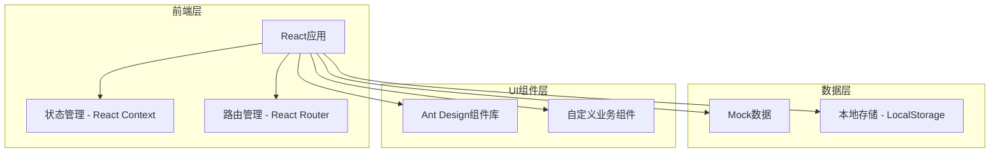

# 蓝领招聘平台 - 返费结算与异常申诉工作台 技术架构文档

## 1. 架构设计



## 2. 技术栈说明

- **前端框架**: React@18 + TypeScript
- **样式方案**: Tailwind CSS@3
- **UI组件库**: Ant Design@5（用于表格、表单、弹窗等复杂业务组件）
- **路由管理**: React Router@6
- **状态管理**: React Context + useReducer
- **构建工具**: Vite
- **数据存储**: Mock数据 + LocalStorage（用于演示状态持久化）
- **图标**: Lucide React（线性图标库）

## 3. 路由定义

| 路由路径 | 页面名称 | 说明 |
|---------|---------|------|
| `/login` | 登录页 | 三类角色选择和登录入口 |
| `/operator` | 运营工作台首页 | 运营数据概览 |
| `/operator/settlements` | 运营工作台-返费结算列表 | 查看待审核结算单 |
| `/operator/settlements/:id` | 运营工作台-返费结算详情 | 审核结算单详情 |
| `/operator/appeals` | 运营工作台-异常申诉列表 | 查看待仲裁申诉 |
| `/operator/appeals/:id` | 运营工作台-异常申诉详情 | 仲裁申诉详情 |
| `/recruiter` | 招聘顾问工作台首页 | 招聘顾问任务概览 |
| `/recruiter/positions` | 招聘顾问工作台-岗位管理 | 管理发布的岗位 |
| `/recruiter/interviews` | 招聘顾问工作台-面试名单 | 管理面试候选人 |
| `/recruiter/onboarding` | 招聘顾问工作台-入职回执 | 管理入职回执 |
| `/recruiter/settlements` | 招聘顾问工作台-返费结算 | 管理返费结算申请 |
| `/recruiter/settlements/:id` | 招聘顾问工作台-返费结算详情 | 发起和管理结算申请 |
| `/recruiter/appeals` | 招聘顾问工作台-异常申诉 | 查看收到的申诉 |
| `/recruiter/appeals/:id` | 招聘顾问工作台-异常申诉详情 | 补充申诉说明 |
| `/hr` | 企业HR工作台首页 | 企业HR任务概览 |
| `/hr/positions` | 企业HR工作台-岗位需求 | 管理岗位需求 |
| `/hr/interviews` | 企业HR工作台-面试确认 | 确认面试名单 |
| `/hr/onboarding` | 企业HR工作台-入职确认 | 确认入职信息 |
| `/hr/settlements` | 企业HR工作台-返费结算 | 确认返费结算 |
| `/hr/settlements/:id` | 企业HR工作台-返费结算详情 | 确认结算金额 |
| `/hr/appeals` | 企业HR工作台-异常申诉 | 发起和管理申诉 |
| `/hr/appeals/:id` | 企业HR工作台-异常申诉详情 | 上传证据材料 |

## 4. 数据模型定义

### 4.1 用户角色

```typescript
type UserRole = 'operator' | 'recruiter' | 'hr';

interface User {
  id: string;
  name: string;
  role: UserRole;
  avatar?: string;
}
```

### 4.2 岗位信息

```typescript
interface Position {
  id: string;
  title: string;
  company: string;
  salary: string;
  location: string;
  requirements: string[];
  status: 'open' | 'closed';
  recruiterId: string;
  recruiterName: string;
  createdAt: string;
  updatedAt: string;
}
```

### 4.3 候选人信息

```typescript
interface Candidate {
  id: string;
  name: string;
  phone: string;
  positionId: string;
  interviewDate: string;
  interviewStatus: 'pending' | 'passed' | 'failed';
  onboardDate?: string;
  onboardStatus?: 'pending' | 'onboarded' | 'left';
  recruiterId: string;
  recruiterName: string;
  createdAt: string;
  updatedAt: string;
}
```

### 4.4 返费结算

```typescript
interface Settlement {
  id: string;
  positionId: string;
  position: string;
  company: string;
  recruiterId: string;
  recruiterName: string;
  hrId?: string;
  hrName?: string;
  candidates: SettlementCandidate[];
  settlementAmount: number;
  status: 'pending_hr_confirm' | 'pending_operator_review' | 'completed' | 'rejected' | 'appealing';
  history: HistoryRecord[];
  createdAt: string;
  updatedAt: string;
}

interface SettlementCandidate {
  name: string;
  phone: string;
  interviewDate: string;
  onboardDate: string;
  status: string;
}

interface HistoryRecord {
  time: string;
  role: '运营' | '招聘顾问' | '企业HR';
  operator: string;
  action: string;
  remark: string;
}
```

### 4.5 异常申诉

```typescript
interface Appeal {
  id: string;
  settlementId: string;
  position: string;
  company: string;
  recruiterId: string;
  recruiterName: string;
  hrId: string;
  hrName: string;
  appealReason: string;
  status: 'pending_recruiter_response' | 'pending_operator_arbitration' | 'resolved' | 'rejected';
  evidence: Evidence[];
  history: HistoryRecord[];
  createdAt: string;
  updatedAt: string;
}

interface Evidence {
  role: '企业HR' | '招聘顾问';
  files: string[];
  description: string;
}
```

## 5. 组件架构

### 5.1 公共组件

```
src/components/common/
├── Layout.tsx              # 工作台布局组件（左侧导航+顶部工具栏）
├── Sidebar.tsx             # 侧边栏导航组件
├── Header.tsx              # 顶部工具栏组件
├── HistoryTimeline.tsx     # 历史备注时间线组件
├── StatusBadge.tsx         # 状态标签组件
├── FlowProgress.tsx        # 流程进度条组件
├── ContinuousHandler.tsx   # 连续处理组件（处理下一个按钮）
└── EmptyState.tsx          # 空状态组件
```

### 5.2 业务组件

```
src/components/business/
├── SettlementCard.tsx      # 结算单卡片组件
├── AppealCard.tsx          # 申诉卡片组件
├── CandidateTable.tsx      # 候选人表格组件
├── EvidenceViewer.tsx      # 证据材料查看器
├── SettlementForm.tsx      # 结算申请表单
├── AppealForm.tsx          # 申诉表单
└── StatisticsCard.tsx      # 统计卡片组件
```

### 5.3 页面组件

```
src/pages/
├── Login/
│   └── index.tsx           # 登录页
├── operator/               # 运营工作台
│   ├── Dashboard/
│   ├── SettlementList/
│   ├── SettlementDetail/
│   ├── AppealList/
│   └── AppealDetail/
├── recruiter/              # 招聘顾问工作台
│   ├── Dashboard/
│   ├── PositionList/
│   ├── InterviewList/
│   ├── OnboardingList/
│   ├── SettlementList/
│   ├── SettlementDetail/
│   ├── AppealList/
│   └── AppealDetail/
└── hr/                     # 企业HR工作台
    ├── Dashboard/
    ├── PositionList/
    ├── InterviewList/
    ├── OnboardingList/
    ├── SettlementList/
    ├── SettlementDetail/
    ├── AppealList/
    └── AppealDetail/
```

## 6. 状态管理

### 6.1 全局状态

```typescript
interface AppState {
  user: User | null;
  currentRole: UserRole | null;
  settlements: Settlement[];
  appeals: Appeal[];
  positions: Position[];
  candidates: Candidate[];
}
```

### 6.2 Context结构

```typescript
const AppContext = createContext<{
  state: AppState;
  dispatch: React.Dispatch<Action>;
}>(null!);

type Action =
  | { type: 'SET_USER'; payload: User }
  | { type: 'LOGOUT' }
  | { type: 'UPDATE_SETTLEMENT'; payload: Settlement }
  | { type: 'UPDATE_APPEAL'; payload: Appeal }
  | { type: 'ADD_HISTORY_RECORD'; payload: { type: 'settlement' | 'appeal'; id: string; record: HistoryRecord } };
```

## 7. Mock数据

### 7.1 初始Mock数据

项目将包含完整的Mock数据，包括：
- 3个角色的示例用户数据
- 10+条返费结算记录（不同状态）
- 5+条异常申诉记录（不同状态）
- 20+条岗位数据
- 30+条候选人数据

### 7.2 数据持久化

使用LocalStorage存储：
- 当前登录用户信息
- 用户操作后的数据变更
- 页面筛选条件

## 8. 关键功能实现

### 8.1 连续处理机制

```typescript
const handleNextTask = () => {
  const currentIndex = taskList.findIndex(t => t.id === currentTaskId);
  if (currentIndex < taskList.length - 1) {
    const nextTask = taskList[currentIndex + 1];
    navigate(`/operator/settlements/${nextTask.id}`);
  } else {
    message.success('所有任务已处理完成！');
    navigate('/operator/settlements');
  }
};
```

### 8.2 历史备注时间线

```typescript
const HistoryTimeline: React.FC<{ history: HistoryRecord[] }> = ({ history }) => {
  const getRoleColor = (role: string) => {
    switch (role) {
      case '运营': return 'blue';
      case '招聘顾问': return 'green';
      case '企业HR': return 'orange';
      default: return 'gray';
    }
  };

  return (
    <div className="space-y-4">
      {history.map((record, index) => (
        <div key={index} className="flex gap-4">
          <div className="w-32 text-sm text-gray-500">{record.time}</div>
          <div className="flex-1">
            <Tag color={getRoleColor(record.role)}>{record.role}</Tag>
            <span className="font-medium">{record.operator}</span>
            <span className="text-gray-600 ml-2">{record.action}</span>
            <p className="text-gray-500 mt-1">{record.remark}</p>
          </div>
        </div>
      ))}
    </div>
  );
};
```

### 8.3 流程进度展示

```typescript
const FlowProgress: React.FC<{ currentStep: number; steps: string[] }> = ({ currentStep, steps }) => {
  return (
    <div className="flex items-center justify-between">
      {steps.map((step, index) => (
        <div key={index} className="flex items-center">
          <div className={`
            w-8 h-8 rounded-full flex items-center justify-center
            ${index < currentStep ? 'bg-blue-500 text-white' : 
              index === currentStep ? 'bg-blue-100 text-blue-500 border-2 border-blue-500' : 
              'bg-gray-200 text-gray-500'}
          `}>
            {index < currentStep ? '✓' : index + 1}
          </div>
          <span className="ml-2 text-sm">{step}</span>
          {index < steps.length - 1 && (
            <div className={`w-20 h-1 mx-2 ${index < currentStep ? 'bg-blue-500' : 'bg-gray-200'}`} />
          )}
        </div>
      ))}
    </div>
  );
};
```

## 9. 样式规范

### 9.1 色彩系统

```css
/* 主色调 */
--primary-50: #EFF6FF;
--primary-100: #DBEAFE;
--primary-500: #3B82F6;
--primary-600: #2563EB;
--primary-700: #1D4ED8;
--primary-800: #1E40AF;

/* 辅助色 */
--warning-500: #F59E0B;
--success-500: #10B981;
--danger-500: #EF4444;

/* 中性色 */
--gray-50: #F9FAFB;
--gray-100: #F3F4F6;
--gray-200: #E5E7EB;
--gray-300: #D1D5DB;
--gray-400: #9CA3AF;
--gray-500: #6B7280;
--gray-600: #4B5563;
--gray-700: #374151;
--gray-800: #1F2937;
--gray-900: #111827;
```

### 9.2 字体系统

```css
/* 标题 */
.font-title {
  font-family: 'Source Han Sans CN', 'Noto Sans SC', sans-serif;
  font-weight: 700;
}

/* 正文 */
.font-body {
  font-family: 'Source Han Sans CN', 'Noto Sans SC', sans-serif;
  font-weight: 400;
}

/* 数据 */
.font-data {
  font-family: 'Roboto Mono', monospace;
}
```

### 9.3 间距系统

```css
/* 间距 */
--spacing-xs: 4px;
--spacing-sm: 8px;
--spacing-md: 16px;
--spacing-lg: 24px;
--spacing-xl: 32px;
--spacing-2xl: 48px;
```

## 10. 项目目录结构

```
src/
├── components/
│   ├── common/           # 公共组件
│   └── business/         # 业务组件
├── pages/
│   ├── Login/            # 登录页
│   ├── operator/         # 运营工作台
│   ├── recruiter/        # 招聘顾问工作台
│   └── hr/               # 企业HR工作台
├── contexts/
│   └── AppContext.tsx    # 全局状态管理
├── hooks/
│   ├── useSettlements.ts # 结算相关hooks
│   ├── useAppeals.ts     # 申诉相关hooks
│   └── useContinuous.ts  # 连续处理hooks
├── data/
│   ├── mockUsers.ts      # Mock用户数据
│   ├── mockSettlements.ts # Mock结算数据
│   ├── mockAppeals.ts    # Mock申诉数据
│   ├── mockPositions.ts  # Mock岗位数据
│   └── mockCandidates.ts # Mock候选人数据
├── types/
│   └── index.ts          # TypeScript类型定义
├── utils/
│   ├── storage.ts        # LocalStorage工具
│   └── helpers.ts        # 辅助函数
├── App.tsx               # 应用主组件
├── main.tsx              # 应用入口
└── index.css             # 全局样式
```

## 11. 开发计划

### 11.1 第一阶段：基础架构
- 项目初始化和依赖安装
- 路由配置
- 布局组件开发
- 公共组件开发

### 11.2 第二阶段：核心页面
- 登录页开发
- 运营工作台首页
- 返费结算列表和详情页
- 异常申诉列表和详情页

### 11.3 第三阶段：招聘顾问工作台
- 招聘顾问工作台首页
- 岗位管理页面
- 面试名单和入职回执页面
- 返费结算和异常申诉页面

### 11.4 第四阶段：企业HR工作台
- 企业HR工作台首页
- 岗位需求和面试确认页面
- 入职确认页面
- 返费结算和异常申诉页面

### 11.5 第五阶段：优化和测试
- 连续处理功能优化
- 历史备注时间线优化
- 响应式适配
- 交互细节优化