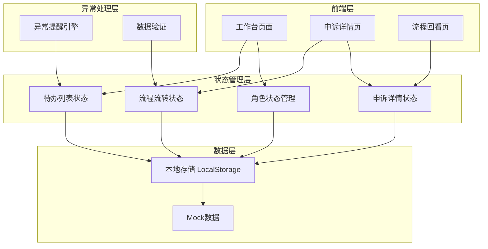
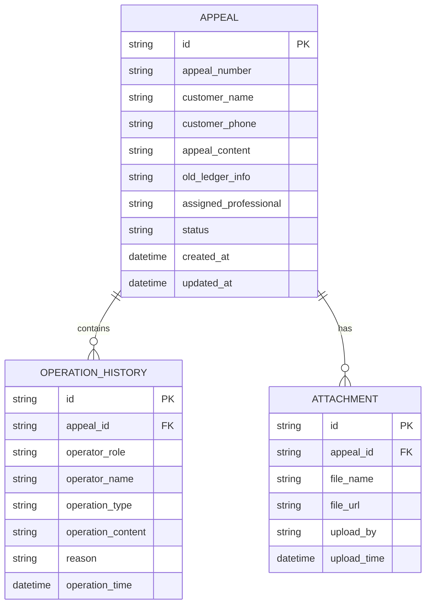
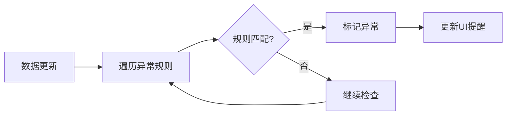
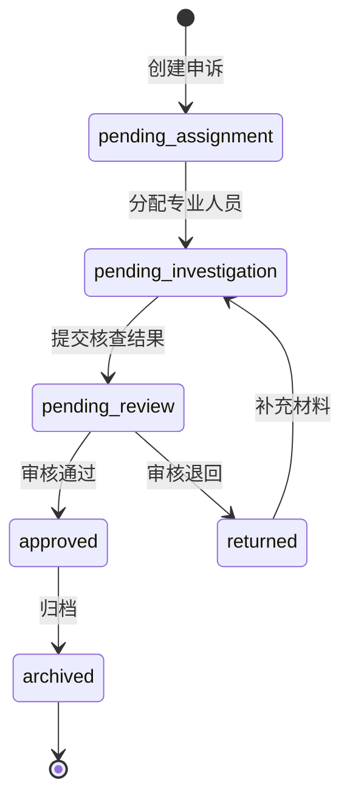

# 保险理赔中心-客户申诉与复核系统 技术架构文档

## 1. 架构设计



## 2. 技术选型

- **前端框架**: React 18 + TypeScript
- **样式方案**: Tailwind CSS 3
- **状态管理**: Zustand (轻量级状态管理)
- **路由管理**: React Router 6
- **构建工具**: Vite
- **图标库**: Lucide React
- **动画库**: Framer Motion
- **数据持久化**: LocalStorage + Mock数据
- **日期处理**: date-fns

**初始化工具**: `npm create vite@latest insurance-appeal-system -- --template react-ts`

## 3. 路由定义

| 路由 | 页面 | 功能描述 |
|------|------|---------|
| `/` | 工作台页面 | 根据当前角色显示待办列表和快捷操作 |
| `/appeal/:id` | 申诉详情页 | 查看和操作单个申诉记录,包含信息聚合和流程操作 |
| `/history` | 流程回看页 | 查询历史归档记录,查看完整流程链路 |
| `/role/:role` | 角色切换页 | 切换当前角色(接待人员/专业人员/审核主管) |

## 4. 数据模型定义

### 4.1 核心数据实体



### 4.2 TypeScript 类型定义

```typescript
type Role = 'receptionist' | 'professional' | 'supervisor';

type AppealStatus = 
  | 'pending_assignment'     // 待分配
  | 'pending_investigation'  // 待核查
  | 'pending_review'         // 待复核
  | 'returned'               // 已退回
  | 'approved'               // 已通过
  | 'archived';              // 已归档

type OperationType = 
  | 'create'                 // 创建申诉
  | 'assign'                 // 分配专业人员
  | 'submit_investigation'   // 提交核查结果
  | 'approve'                // 通过
  | 'return'                 // 退回
  | 'supplement';            // 补充材料

interface Appeal {
  id: string;
  appealNumber: string;
  customerName: string;
  customerPhone: string;
  appealContent: string;
  oldLedgerInfo: string;
  assignedProfessional?: string;
  status: AppealStatus;
  createdAt: Date;
  updatedAt: Date;
  
  // 专业人员填写
  siteRecord?: string;
  professionalOpinion?: string;
  
  // 审核主管填写
  reviewConclusion?: string;
  returnReason?: string;
  supplementNote?: string;
  
  // 异常标记
  isException: boolean;
  exceptionReason?: string;
}

interface OperationHistory {
  id: string;
  appealId: string;
  operatorRole: Role;
  operatorName: string;
  operationType: OperationType;
  operationContent: string;
  reason?: string;
  operationTime: Date;
}

interface Attachment {
  id: string;
  appealId: string;
  fileName: string;
  fileUrl: string;
  uploadedBy: string;
  uploadTime: Date;
}
```

## 5. 状态管理设计

### 5.1 角色状态 (RoleStore)

```typescript
interface RoleStore {
  currentRole: Role;
  currentUserName: string;
  switchRole: (role: Role) => void;
}
```

### 5.2 待办列表状态 (TodoListStore)

```typescript
interface TodoListStore {
  appeals: Appeal[];
  filter: {
    status?: AppealStatus;
    priority?: 'high' | 'medium' | 'low';
    dateRange?: [Date, Date];
  };
  
  getTodoList: (role: Role) => Appeal[];
  updateFilter: (filter: Partial<TodoListStore['filter']>) => void;
  refreshList: () => void;
}
```

### 5.3 申诉详情状态 (AppealDetailStore)

```typescript
interface AppealDetailStore {
  currentAppeal: Appeal | null;
  operationHistory: OperationHistory[];
  attachments: Attachment[];
  
  loadAppeal: (id: string) => void;
  updateAppeal: (updates: Partial<Appeal>) => void;
  addOperation: (operation: Omit<OperationHistory, 'id' | 'operationTime'>) => void;
  uploadAttachment: (file: File) => void;
}
```

### 5.4 流程流转状态 (WorkflowStore)

```typescript
interface WorkflowStore {
  assignProfessional: (appealId: string, professionalName: string) => void;
  submitInvestigation: (appealId: string, siteRecord: string, opinion: string) => void;
  approveAppeal: (appealId: string, conclusion: string) => void;
  returnAppeal: (appealId: string, reason: string) => void;
  supplementMaterial: (appealId: string, note: string) => void;
}
```

## 6. Mock数据设计

### 6.1 初始Mock数据

系统启动时自动生成以下Mock数据:

1. **顺利流样例数据**: TS20240115001 (张先生车险理赔申诉)
2. **问题流样例数据**: TS20240160002 (李女士拒赔申诉)
3. **待处理数据**: 
   - 3条待分配申诉(接待人员待办)
   - 2条待核查申诉(专业人员待办)
   - 1条待复核申诉(审核主管待办)
   - 1条已退回待补充申诉(异常提醒)

### 6.2 数据持久化

- 使用LocalStorage存储所有数据
- 首次访问时初始化Mock数据
- 后续操作实时更新LocalStorage
- 提供重置数据功能(开发调试用)

## 7. 异常提醒引擎

### 7.1 异常规则

```typescript
interface ExceptionRule {
  type: 'timeout' | 'return_count' | 'complaint_escalation';
  condition: (appeal: Appeal) => boolean;
  message: string;
  priority: 'high' | 'medium' | 'low';
}

const exceptionRules: ExceptionRule[] = [
  {
    type: 'timeout',
    condition: (appeal) => {
      const hours = differenceInHours(new Date(), appeal.updatedAt);
      return hours > 24 && appeal.status !== 'archived';
    },
    message: '申诉处理超时,请及时处理',
    priority: 'high'
  },
  {
    type: 'return_count',
    condition: (appeal) => {
      const returnCount = operationHistory.filter(
        op => op.appealId === appeal.id && op.operationType === 'return'
      ).length;
      return returnCount >= 2;
    },
    message: '申诉已退回2次以上,请重点关注',
    priority: 'high'
  }
];
```

### 7.2 异常检测流程



## 8. 本地流转机制

### 8.1 流转状态机



### 8.2 操作权限控制

| 当前状态 | 接待人员 | 专业人员 | 审核主管 |
|---------|---------|---------|---------|
| pending_assignment | 分配专业人员 | - | - |
| pending_investigation | - | 提交核查结果 | - |
| pending_review | - | - | 通过/退回 |
| returned | - | 补充材料 | - |
| approved | - | - | 归档 |

## 9. 组件设计

### 9.1 工作台页面组件

```
WorkbenchPage/
├── RoleSwitcher          # 角色切换器
├── ExceptionBanner       # 异常提醒横幅
├── TodoList              # 待办列表
│   ├── TodoCard          # 待办卡片
│   └── FilterBar         # 筛选栏
└── QuickActions          # 快捷操作按钮组
```

### 9.2 申诉详情页组件

```
AppealDetailPage/
├── InfoAggregator        # 信息聚合区
│   ├── OldLedgerCard     # 旧台账卡片
│   ├── SiteRecordCard    # 现场记录卡片
│   ├── CommunicationCard # 沟通截图卡片
│   └── AppealContentCard  # 客户申诉卡片
├── WorkflowTimeline      # 流程时间轴
├── OperationPanel        # 流程操作面板
│   ├── AssignForm        # 分配表单
│   ├── InvestigationForm # 核查表单
│   ├── ReviewForm        # 复核表单
│   └── SupplementForm    # 补充表单
└── AttachmentList        # 附件列表
```

### 9.3 流程回看页组件

```
HistoryPage/
├── SearchBar             # 查询筛选栏
├── HistoryList           # 历史记录列表
│   └── HistoryCard       # 历史记录卡片
└── DetailModal           # 详情弹窗
    ├── TimelineView       # 时间轴视图
    └── ResponsibilityChain # 责任链路
```

## 10. 性能优化策略

### 10.1 数据加载优化

- 使用React.lazy懒加载详情页和回看页
- 待办列表虚拟滚动(当数据量>100条时)
- 图片附件懒加载

### 10.2 状态更新优化

- 使用Zustand的selector避免不必要的重渲染
- 操作历史记录分页加载
- LocalStorage写入防抖(500ms)

### 10.3 动画性能优化

- 使用Framer Motion的layout动画优化列表更新
- CSS transform代替top/left属性
- will-change提示浏览器优化

## 11. 开发调试工具

### 11.1 数据重置功能

在开发模式下,提供数据重置按钮:
- 清空LocalStorage
- 重新初始化Mock数据
- 刷新页面

### 11.2 角色快速切换

在开发模式下,提供角色快速切换面板:
- 一键切换接待人员/专业人员/审核主管
- 自动加载对应角色的待办数据

### 11.3 异常模拟

在开发模式下,提供异常场景模拟:
- 模拟超时申诉
- 模拟多次退回申诉
- 模拟客户投诉升级