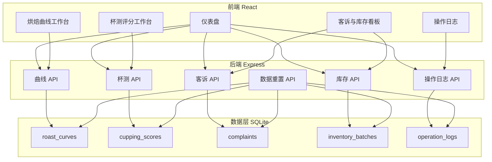

## 1. 架构设计



## 2. 技术说明

- **前端**：React@18 + TypeScript + Tailwind CSS@3 + Vite + Zustand + React Router
- **后端**：Express@4 + TypeScript (ESM)
- **数据库**：SQLite (better-sqlite3)
- **初始化工具**：vite-init (react-express-ts 模板)

## 3. 路由定义

| 路由 | 用途 |
|------|------|
| `/` | 仪表盘 - 待处理项、风险提醒、最近变更 |
| `/roast-curves` | 烘焙曲线工作台 - 曲线列表与筛选 |
| `/roast-curves/:id` | 烘焙曲线详情 - 参数、版本历史、关联杯测 |
| `/cupping-scores` | 杯测评分工作台 - 评分列表与筛选 |
| `/cupping-scores/:id` | 杯测评分详情 - 评分明细、关联曲线与批次 |
| `/complaints-inventory` | 客诉与库存看板 - 客诉列表、库存状态 |
| `/operation-logs` | 操作日志 - 全局操作记录与筛选 |

## 4. API 定义

### 4.1 烘焙曲线 API

```
GET    /api/roast-curves          - 获取曲线列表(支持 ?beanType=&status=&keyword= 筛选)
GET    /api/roast-curves/:id      - 获取曲线详情(含版本历史、关联杯测)
POST   /api/roast-curves          - 创建新曲线
PUT    /api/roast-curves/:id      - 更新曲线(自动生成新版本)
PUT    /api/roast-curves/:id/version/:ver/activate - 将指定版本标记为正式
```

### 4.2 杯测评分 API

```
GET    /api/cupping-scores        - 获取评分列表(支持 ?beanType=&status=&dateFrom=&dateTo= 筛选)
GET    /api/cupping-scores/:id     - 获取评分详情(含关联曲线参数和批次信息)
POST   /api/cupping-scores        - 录入杯测评分
PUT    /api/cupping-scores/:id     - 更新杯测评分
```

### 4.3 客诉 API

```
GET    /api/complaints             - 获取客诉列表(支持 ?status= 筛选)
GET    /api/complaints/:id         - 获取客诉详情(含关联曲线和杯测)
POST   /api/complaints             - 录入客诉
PUT    /api/complaints/:id         - 更新客诉状态
```

### 4.4 库存 API

```
GET    /api/inventory              - 获取库存列表(含FIFO状态)
PUT    /api/inventory/:id          - 更新库存状态
```

### 4.5 操作日志 API

```
GET    /api/operation-logs         - 获取操作日志(支持 ?module=&operator=&dateFrom=&dateTo= 筛选)
```

### 4.6 数据重置 API

```
POST   /api/reset-data             - 重置所有数据到初始样例状态
```

### 4.7 仪表盘聚合 API

```
GET    /api/dashboard              - 获取仪表盘数据(待处理数、风险项、最近变更)
```

## 5. 服务器架构图

```mermaid
flowchart LR
    "Router" --> "Controller"
    "Controller" --> "Service"
    "Service" --> "Repository"
    "Repository" --> "SQLite"
```

## 6. 数据模型

### 6.1 数据模型定义

```mermaid
erDiagram
    "roast_curves" {
        "int id PK"
        "string bean_type"
        "string roast_level"
        "string status"
        "int current_version"
        "string created_by"
        "datetime created_at"
        "datetime updated_at"
    }
    "curve_versions" {
        "int id PK"
        "int curve_id FK"
        "int version_number"
        "string status"
        "float charge_temp"
        "float turn_point_temp"
        "float turn_point_time"
        "float first_crack_temp"
        "float first_crack_time"
        "float development_time"
        "float drop_temp"
        "string notes"
        "string created_by"
        "datetime created_at"
    }
    "cupping_scores" {
        "int id PK"
        "int curve_id FK"
        "int curve_version_id FK"
        "string batch_code"
        "float dry_aroma"
        "float wet_aroma"
        "float acidity"
        "float body"
        "float aftertaste"
        "float balance"
        "float overall"
        "float total_score"
        "boolean flavor_anomaly"
        "string anomaly_description"
        "string cupper_name"
        "datetime cupped_at"
        "datetime created_at"
    }
    "complaints" {
        "int id PK"
        "string customer_name"
        "string channel"
        "string content"
        "int curve_id FK"
        "int cupping_score_id FK"
        "string batch_code"
        "string status"
        "string handler"
        "datetime created_at"
        "datetime updated_at"
    }
    "inventory_batches" {
        "int id PK"
        "string bean_type"
        "string batch_code"
        "float quantity_kg"
        "float remaining_kg"
        "datetime roast_date"
        "datetime expiry_date"
        "string status"
        "int curve_id FK"
        "datetime created_at"
    }
    "operation_logs" {
        "int id PK"
        "string module"
        "string action"
        "string operator"
        "string target_type"
        "int target_id"
        "string detail"
        "datetime created_at"
    }
    "roast_curves" ||--o{ "curve_versions" : "has"
    "roast_curves" ||--o{ "cupping_scores" : "has"
    "roast_curves" ||--o{ "complaints" : "has"
    "roast_curves" ||--o{ "inventory_batches" : "has"
    "cupping_scores" ||--o| "complaints" : "has"
    "curve_versions" ||--o{ "cupping_scores" : "has"
```

### 6.2 数据定义语言

```sql
CREATE TABLE roast_curves (
  id INTEGER PRIMARY KEY AUTOINCREMENT,
  bean_type TEXT NOT NULL,
  roast_level TEXT NOT NULL,
  status TEXT NOT NULL DEFAULT 'draft',
  current_version INTEGER NOT NULL DEFAULT 1,
  created_by TEXT NOT NULL,
  created_at TEXT NOT NULL DEFAULT (datetime('now')),
  updated_at TEXT NOT NULL DEFAULT (datetime('now'))
);

CREATE TABLE curve_versions (
  id INTEGER PRIMARY KEY AUTOINCREMENT,
  curve_id INTEGER NOT NULL REFERENCES roast_curves(id),
  version_number INTEGER NOT NULL,
  status TEXT NOT NULL DEFAULT 'draft',
  charge_temp REAL,
  turn_point_temp REAL,
  turn_point_time REAL,
  first_crack_temp REAL,
  first_crack_time REAL,
  development_time REAL,
  drop_temp REAL,
  notes TEXT,
  created_by TEXT NOT NULL,
  created_at TEXT NOT NULL DEFAULT (datetime('now'))
);

CREATE TABLE cupping_scores (
  id INTEGER PRIMARY KEY AUTOINCREMENT,
  curve_id INTEGER NOT NULL REFERENCES roast_curves(id),
  curve_version_id INTEGER REFERENCES curve_versions(id),
  batch_code TEXT NOT NULL,
  dry_aroma REAL,
  wet_aroma REAL,
  acidity REAL,
  body REAL,
  aftertaste REAL,
  balance REAL,
  overall REAL,
  total_score REAL,
  flavor_anomaly INTEGER NOT NULL DEFAULT 0,
  anomaly_description TEXT,
  cupper_name TEXT NOT NULL,
  cupped_at TEXT NOT NULL,
  created_at TEXT NOT NULL DEFAULT (datetime('now'))
);

CREATE TABLE complaints (
  id INTEGER PRIMARY KEY AUTOINCREMENT,
  customer_name TEXT NOT NULL,
  channel TEXT NOT NULL,
  content TEXT NOT NULL,
  curve_id INTEGER REFERENCES roast_curves(id),
  cupping_score_id INTEGER REFERENCES cupping_scores(id),
  batch_code TEXT,
  status TEXT NOT NULL DEFAULT 'pending',
  handler TEXT,
  created_at TEXT NOT NULL DEFAULT (datetime('now')),
  updated_at TEXT NOT NULL DEFAULT (datetime('now'))
);

CREATE TABLE inventory_batches (
  id INTEGER PRIMARY KEY AUTOINCREMENT,
  bean_type TEXT NOT NULL,
  batch_code TEXT NOT NULL,
  quantity_kg REAL NOT NULL,
  remaining_kg REAL NOT NULL,
  roast_date TEXT NOT NULL,
  expiry_date TEXT NOT NULL,
  status TEXT NOT NULL DEFAULT 'normal',
  curve_id INTEGER REFERENCES roast_curves(id),
  created_at TEXT NOT NULL DEFAULT (datetime('now'))
);

CREATE TABLE operation_logs (
  id INTEGER PRIMARY KEY AUTOINCREMENT,
  module TEXT NOT NULL,
  action TEXT NOT NULL,
  operator TEXT NOT NULL,
  target_type TEXT NOT NULL,
  target_id INTEGER NOT NULL,
  detail TEXT,
  created_at TEXT NOT NULL DEFAULT (datetime('now'))
);
```
