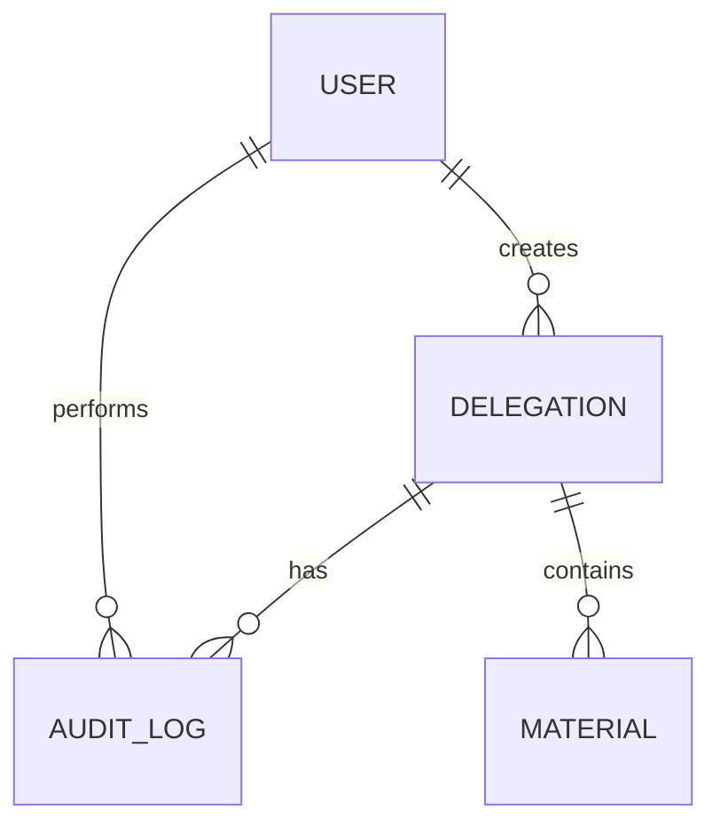

# 司法鉴定所系统技术架构文档

## 1. 系统架构概览

### 1.1 架构风格

采用**前后端分离架构**（BFF + Backend + Frontend）

```
┌─────────────────────────────────────────────────────┐
│                    用户界面层                        │
│                   (React Frontend)                  │
└────────────────────────┬────────────────────────────┘
                         │ HTTP/REST API
                         ▼
┌─────────────────────────────────────────────────────┐
│                   API 网关层                         │
│                 (Express Backend)                  │
├─────────────────────────────────────────────────────┤
│  ┌─────────────┐  ┌─────────────┐  ┌─────────────┐ │
│  │   委托受理   │  │   材料核验   │  │   质控审核   │ │
│  │   Service   │  │   Service   │  │   Service   │ │
│  └──────┬──────┘  └──────┬──────┘  └──────┬──────┘ │
│         │                │                │         │
│         └────────────────┼────────────────┘         │
│                          │                          │
│  ┌───────────────────────────────────────────────┐ │
│  │              业务逻辑层                         │ │
│  │            (Business Layer)                   │ │
│  └───────────────────────────────────────────────┘ │
│                          │                          │
│  ┌───────────────────────────────────────────────┐ │
│  │              数据访问层                         │ │
│  │         (SQLite / PostgreSQL)                 │ │
│  └───────────────────────────────────────────────┘ │
└─────────────────────────────────────────────────────┘
```

### 1.2 技术栈详情

| 层级 | 技术选型 | 说明 |
|------|---------|------|
| 前端框架 | React 18 | 使用Create React App或Vite |
| 路由管理 | React Router v6 | SPA路由 |
| 状态管理 | React Context + useReducer | 轻量级状态管理 |
| HTTP客户端 | Axios | API调用 |
| 后端框架 | Express.js | Node.js Web框架 |
| 数据库 | SQLite | 演示环境，轻量易用 |
| ORM | Sequelize | 数据库ORM |
| 认证 | JWT | 无状态认证 |
| 日志 | Winston | 日志记录 |
| 构建工具 | Vite | 快速构建 |

---

## 2. 数据库设计

### 2.1 ER图



### 2.2 数据表设计

#### 2.2.1 用户表 (users)

```sql
CREATE TABLE users (
  id INTEGER PRIMARY KEY AUTOINCREMENT,
  username VARCHAR(50) UNIQUE NOT NULL,
  password VARCHAR(255) NOT NULL,
  role ENUM('acceptor', 'appraiser', 'qc_reviewer', 'admin') NOT NULL,
  name VARCHAR(100) NOT NULL,
  organization VARCHAR(200),
  email VARCHAR(100),
  status ENUM('active', 'inactive') DEFAULT 'active',
  last_login_time DATETIME,
  created_at DATETIME DEFAULT CURRENT_TIMESTAMP,
  updated_at DATETIME DEFAULT CURRENT_TIMESTAMP
);
```

**索引**：
- `idx_username`: username
- `idx_role`: role
- `idx_status`: status

#### 2.2.2 委托单表 (delegations)

```sql
CREATE TABLE delegations (
  id INTEGER PRIMARY KEY AUTOINCREMENT,
  delegation_number VARCHAR(50) UNIQUE NOT NULL,
  status ENUM(
    'PENDING_ACCEPTANCE',
    'ACCEPTANCE_IN_PROGRESS',
    'MATERIAL_VERIFICATION',
    'VERIFICATION_PASSED',
    'VERIFICATION_FAILED',
    'MATERIAL_INCOMPLETE',
    'QC_REVIEW_PENDING',
    'QC_APPROVED',
    'QC_REJECTED',
    'COMPLETED',
    'ON_HOLD'
  ) NOT NULL,
  
  -- 委托方信息
  applicant_name VARCHAR(100),
  applicant_organization VARCHAR(200),
  applicant_contact VARCHAR(50),
  applicant_id_card VARCHAR(50),
  
  -- 案件信息
  case_type VARCHAR(100),
  case_description TEXT,
  incident_date DATE,
  incident_location VARCHAR(200),
  
  -- 鉴定信息
  appraisal_items TEXT,  -- JSON数组
  expected_completion_date DATE,
  
  -- 责任人
  current_assignee VARCHAR(50),
  created_by VARCHAR(50) NOT NULL,
  
  -- 时间戳
  created_at DATETIME DEFAULT CURRENT_TIMESTAMP,
  updated_at DATETIME DEFAULT CURRENT_TIMESTAMP,
  completion_date DATETIME,
  
  -- 异常标记
  is_abnormal BOOLEAN DEFAULT FALSE,
  abnormal_type VARCHAR(50),
  abnormal_reason TEXT,
  
  FOREIGN KEY (created_by) REFERENCES users(username)
);
```

**索引**：
- `idx_delegation_number`: delegation_number
- `idx_status`: status
- `idx_current_assignee`: current_assignee
- `idx_is_abnormal`: is_abnormal
- `idx_created_at`: created_at

#### 2.2.3 材料清单表 (materials)

```sql
CREATE TABLE materials (
  id INTEGER PRIMARY KEY AUTOINCREMENT,
  delegation_id INTEGER NOT NULL,
  material_name VARCHAR(200) NOT NULL,
  material_type VARCHAR(50),
  is_required BOOLEAN DEFAULT TRUE,
  is_provided BOOLEAN DEFAULT FALSE,
  verification_status ENUM('pending', 'passed', 'failed') DEFAULT 'pending',
  verification_notes TEXT,
  verified_by VARCHAR(50),
  verified_at DATETIME,
  
  created_at DATETIME DEFAULT CURRENT_TIMESTAMP,
  updated_at DATETIME DEFAULT CURRENT_TIMESTAMP,
  
  FOREIGN KEY (delegation_id) REFERENCES delegations(id) ON DELETE CASCADE
);
```

**索引**：
- `idx_delegation_id`: delegation_id
- `idx_verification_status`: verification_status

#### 2.2.4 审计日志表 (audit_logs)

```sql
CREATE TABLE audit_logs (
  id INTEGER PRIMARY KEY AUTOINCREMENT,
  delegation_id INTEGER NOT NULL,
  action_type ENUM(
    'CREATE',
    'UPDATE',
    'SUBMIT',
    'VERIFY',
    'APPROVE',
    'REJECT',
    'STATUS_CHANGE',
    'MATERIAL_UPDATE',
    'ABNORMAL_FLAG',
    'ABNORMAL_RESOLVE'
  ) NOT NULL,
  
  previous_status VARCHAR(50),
  new_status VARCHAR(50),
  
  operator_username VARCHAR(50) NOT NULL,
  operator_role VARCHAR(50) NOT NULL,
  operator_name VARCHAR(100),
  
  operate_time DATETIME DEFAULT CURRENT_TIMESTAMP,
  remarks TEXT,
  details TEXT,  -- JSON格式的详细信息
  
  FOREIGN KEY (delegation_id) REFERENCES delegations(id) ON DELETE CASCADE,
  FOREIGN KEY (operator_username) REFERENCES users(username)
);
```

**索引**：
- `idx_delegation_id`: delegation_id
- `idx_action_type`: action_type
- `idx_operator_username`: operator_username
- `idx_operate_time`: operate_time

---

## 3. API 设计

### 3.1 API 规范

**Base URL**: `/api/v1`

**认证方式**: JWT Bearer Token

**响应格式**:
```json
{
  "success": true,
  "data": {},
  "message": "操作成功",
  "timestamp": "2024-01-01T12:00:00Z"
}
```

**错误格式**:
```json
{
  "success": false,
  "error": {
    "code": "ERROR_CODE",
    "message": "错误描述"
  },
  "timestamp": "2024-01-01T12:00:00Z"
}
```

### 3.2 认证接口

#### POST /auth/login

**请求**:
```json
{
  "username": "acceptor01",
  "password": "demo123"
}
```

**响应**:
```json
{
  "success": true,
  "data": {
    "token": "eyJhbGciOiJIUzI1NiIs...",
    "user": {
      "id": 1,
      "username": "acceptor01",
      "role": "acceptor",
      "name": "张三"
    }
  }
}
```

### 3.3 委托单接口

#### GET /delegations

**查询参数**:
- `status`: 状态筛选（可选）
- `isAbnormal`: 是否异常（可选）
- `page`: 页码（默认1）
- `limit`: 每页数量（默认10）

**响应**:
```json
{
  "success": true,
  "data": {
    "delegations": [...],
    "pagination": {
      "total": 100,
      "page": 1,
      "limit": 10,
      "totalPages": 10
    }
  }
}
```

#### POST /delegations

**请求**:
```json
{
  "applicantInfo": {
    "name": "李四",
    "organization": "XX市公安局",
    "contact": "13800138000",
    "idCard": "110101199001011234"
  },
  "caseInfo": {
    "type": "交通事故",
    "description": "车辆碰撞鉴定",
    "incidentDate": "2024-01-15",
    "location": "北京市朝阳区"
  },
  "appraisalItems": ["车辆技术鉴定", "痕迹鉴定"],
  "expectedCompletionDate": "2024-02-15",
  "materials": [
    {"name": "委托书", "required": true},
    {"name": "身份证明", "required": true},
    {"name": "事故现场照片", "required": false}
  ]
}
```

#### GET /delegations/:id

**响应**: 返回单个委托单的完整信息，包括材料清单和审计日志

#### PUT /delegations/:id

**请求**: 可更新的字段

#### PUT /delegations/:id/status

**请求**:
```json
{
  "newStatus": "MATERIAL_VERIFICATION",
  "remarks": "委托受理完成，提交材料核验"
}
```

**业务规则**：
- 检查状态流转是否符合规范
- 创建审计日志
- 更新 current_assignee

### 3.4 材料核验接口

#### PUT /delegations/:id/materials/:materialId

**请求**:
```json
{
  "verificationStatus": "passed",
  "verificationNotes": "材料完整，清晰可辨",
  "verifiedBy": "appraiser01"
}
```

### 3.5 审计日志接口

#### GET /delegations/:id/audit-logs

**响应**: 返回该委托单的所有审计日志，按时间倒序

#### GET /audit-logs

**查询参数**:
- `delegationId`: 委托单ID
- `actionType`: 操作类型
- `operator`: 操作人
- `startTime`: 开始时间
- `endTime`: 结束时间
- `page`: 页码
- `limit`: 每页数量

---

## 4. 前端架构

### 4.1 目录结构

```
frontend/
├── public/
├── src/
│   ├── components/           # 通用组件
│   │   ├── common/          # 通用UI组件
│   │   │   ├── Button/
│   │   │   ├── Card/
│   │   │   ├── Table/
│   │   │   ├── Modal/
│   │   │   ├── StatusBadge/
│   │   │   ├── Timeline/
│   │   │   └── Loading/
│   │   └── layout/          # 布局组件
│   │       ├── Header/
│   │       ├── Sidebar/
│   │       └── Footer/
│   ├── pages/               # 页面组件
│   │   ├── Login/
│   │   ├── Dashboard/
│   │   ├── Delegation/
│   │   │   ├── DelegationList/
│   │   │   ├── DelegationDetail/
│   │   │   ├── DelegationCreate/
│   │   │   └── DelegationVerify/
│   │   ├── Material/
│   │   │   └── MaterialVerification/
│   │   ├── Audit/
│   │   │   └── AuditLogs/
│   │   └── Statistics/
│   ├── services/            # API服务
│   │   ├── api.js          # Axios实例
│   │   ├── authService.js
│   │   ├── delegationService.js
│   │   └── auditService.js
│   ├── context/             # React Context
│   │   ├── AuthContext.jsx
│   │   └── DelegationContext.jsx
│   ├── hooks/               # 自定义Hooks
│   │   ├── useAuth.js
│   │   ├── useDelegation.js
│   │   └── useAuditLog.js
│   ├── utils/              # 工具函数
│   │   ├── constants.js    # 常量定义
│   │   ├── statusMap.js    # 状态映射
│   │   ├── dateUtils.js    # 日期工具
│   │   └── validation.js   # 表单验证
│   ├── styles/             # 全局样式
│   │   ├── variables.css
│   │   ├── global.css
│   │   └── animations.css
│   ├── App.jsx
│   └── index.jsx
├── package.json
└── vite.config.js
```

### 4.2 路由设计

```jsx
<Routes>
  <Route path="/login" element={<LoginPage />} />
  
  <Route path="/" element={<PrivateRoute><Layout /></PrivateRoute>}>
    <Route index element={<Dashboard />} />
    
    {/* 委托单管理 */}
    <Route path="delegations">
      <Route index element={<DelegationList />} />
      <Route path="create" element={<DelegationCreate />} />
      <Route path=":id" element={<DelegationDetail />} />
      <Route path=":id/edit" element={<DelegationEdit />} />
    </Route>
    
    {/* 材料核验 */}
    <Route path="verification">
      <Route index element={<VerificationList />} />
      <Route path=":delegationId/materials/:materialId" element={<MaterialVerify />} />
    </Route>
    
    {/* 审计日志 */}
    <Route path="audit-logs">
      <Route index element={<AuditLogList />} />
      <Route path=":delegationId" element={<DelegationAuditLogs />} />
    </Route>
    
    {/* 统计分析 */}
    <Route path="statistics" element={<Statistics />} />
  </Route>
  
  <Route path="*" element={<NotFound />} />
</Routes>
```

### 4.3 状态管理

使用 React Context 实现全局状态管理：

**AuthContext**:
```jsx
{
  user: { id, username, role, name },
  token: string,
  isAuthenticated: boolean,
  login: (credentials) => Promise,
  logout: () => void
}
```

**DelegationContext**:
```jsx
{
  delegations: [],
  currentDelegation: null,
  filters: { status, isAbnormal, page, limit },
  loading: boolean,
  fetchDelegations: (filters) => Promise,
  fetchDelegation: (id) => Promise,
  createDelegation: (data) => Promise,
  updateDelegation: (id, data) => Promise,
  updateStatus: (id, newStatus, remarks) => Promise
}
```

### 4.4 组件设计原则

1. **单一职责**：每个组件只负责一个功能
2. **可复用性**：通用组件抽离到 components/common
3. **受控组件**：表单组件使用受控模式
4. **错误边界**：关键组件添加错误边界
5. **加载状态**：每个异步操作都有加载状态

---

## 5. 状态流转控制

### 5.1 状态机定义

```javascript
const STATUS_TRANSITIONS = {
  PENDING_ACCEPTANCE: ['ACCEPTANCE_IN_PROGRESS'],
  ACCEPTANCE_IN_PROGRESS: ['MATERIAL_VERIFICATION', 'PENDING_ACCEPTANCE'],
  MATERIAL_VERIFICATION: [
    'VERIFICATION_PASSED',
    'VERIFICATION_FAILED',
    'MATERIAL_INCOMPLETE'
  ],
  VERIFICATION_PASSED: ['QC_REVIEW_PENDING'],
  VERIFICATION_FAILED: ['MATERIAL_VERIFICATION'],
  MATERIAL_INCOMPLETE: ['MATERIAL_VERIFICATION'],
  QC_REVIEW_PENDING: ['QC_APPROVED', 'QC_REJECTED'],
  QC_APPROVED: ['COMPLETED'],
  QC_REJECTED: ['MATERIAL_VERIFICATION', 'QC_REVIEW_PENDING'],
  COMPLETED: [],
  ON_HOLD: ['PENDING_ACCEPTANCE', 'ACCEPTANCE_IN_PROGRESS', 'MATERIAL_VERIFICATION']
};
```

### 5.2 流转验证规则

```javascript
function validateStatusTransition(currentStatus, newStatus, userRole) {
  // 检查状态是否允许流转
  const allowedTransitions = STATUS_TRANSITIONS[currentStatus];
  if (!allowedTransitions.includes(newStatus)) {
    return {
      valid: false,
      message: `不允许从 ${currentStatus} 转换到 ${newStatus}`
    };
  }
  
  // 检查角色权限
  const rolePermissions = {
    'acceptor': ['PENDING_ACCEPTANCE', 'ACCEPTANCE_IN_PROGRESS'],
    'appraiser': ['MATERIAL_VERIFICATION', 'VERIFICATION_PASSED', 'VERIFICATION_FAILED', 'MATERIAL_INCOMPLETE'],
    'qc_reviewer': ['QC_REVIEW_PENDING', 'QC_APPROVED', 'QC_REJECTED'],
    'admin': ['*']  // 管理员可以操作所有状态
  };
  
  // 实现权限检查逻辑...
}
```

---

## 6. 安全设计

### 6.1 认证机制

- **JWT Token**: 无状态认证
- **Token过期**: 24小时
- **Token刷新**: 支持刷新机制
- **密码加密**: bcrypt加密

### 6.2 授权控制

**角色权限矩阵**：

| 功能 | 受理员 | 鉴定人 | 质控审核 | 管理员 |
|------|--------|--------|----------|--------|
| 创建委托单 | ✓ | ✗ | ✗ | ✓ |
| 编辑委托单 | ✓ | ✓ | ✗ | ✓ |
| 提交材料核验 | ✓ | ✗ | ✗ | ✓ |
| 材料核验 | ✗ | ✓ | ✗ | ✓ |
| 质控审核 | ✗ | ✗ | ✓ | ✓ |
| 查看审计日志 | ✓ | ✓ | ✓ | ✓ |
| 系统配置 | ✗ | ✗ | ✗ | ✓ |

### 6.3 输入验证

- 所有用户输入进行XSS过滤
- SQL注入防护（使用ORM）
- 文件上传类型和大小限制
- 请求频率限制

---

## 7. 日志系统

### 7.1 日志级别

- **ERROR**: 错误日志
- **WARN**: 警告日志
- **INFO**: 信息日志
- **DEBUG**: 调试日志

### 7.2 日志格式

```json
{
  "timestamp": "2024-01-01T12:00:00.000Z",
  "level": "INFO",
  "message": "委托单状态变更",
  "meta": {
    "delegationId": 1,
    "previousStatus": "PENDING_ACCEPTANCE",
    "newStatus": "ACCEPTANCE_IN_PROGRESS",
    "operator": "acceptor01",
    "ip": "192.168.1.1",
    "userAgent": "Mozilla/5.0..."
  }
}
```

### 7.3 审计日志要求

1. **详细记录**：每个业务操作都记录审计日志
2. **不可篡改**：审计日志不允许修改和删除
3. **长期保存**：审计日志至少保存3年
4. **可查询**：支持多维度查询和导出

---

## 8. 部署架构

### 8.1 开发环境

```
Frontend: http://localhost:3000
Backend: http://localhost:5000
Database: SQLite (文件数据库)
```

### 8.2 项目启动

**前端启动**:
```bash
cd frontend
npm install
npm start
```

**后端启动**:
```bash
cd backend
npm install
npm run dev  # 开发环境
npm start    # 生产环境
```

**数据库初始化**:
```bash
cd database
node seed.js  # 初始化演示数据
```

---

## 9. 性能优化

### 9.1 前端优化

1. **代码分割**：使用 React.lazy 实现路由级代码分割
2. **组件懒加载**：非首屏组件懒加载
3. **状态缓存**：使用 Context 缓存数据
4. **虚拟列表**：大列表使用虚拟滚动
5. **图片优化**：使用 WebP 格式，懒加载

### 9.2 后端优化

1. **数据库索引**：为常用查询字段创建索引
2. **查询优化**：使用分页，避免全表扫描
3. **缓存**：热点数据使用内存缓存
4. **连接池**：数据库连接池管理

---

## 10. 错误处理

### 10.1 前端错误处理

```javascript
// 统一的错误处理
const errorHandler = (error, customMessage) => {
  if (error.response) {
    // 服务器返回错误
    const message = error.response.data?.message || customMessage;
    notification.error({
      message: '操作失败',
      description: message
    });
  } else if (error.request) {
    // 网络错误
    notification.error({
      message: '网络错误',
      description: '请检查网络连接'
    });
  } else {
    // 其他错误
    notification.error({
      message: '错误',
      description: error.message
    });
  }
};
```

### 10.2 后端错误处理

```javascript
// 统一错误响应格式
app.use((err, req, res, next) => {
  console.error(err.stack);
  
  res.status(err.status || 500).json({
    success: false,
    error: {
      code: err.code || 'INTERNAL_SERVER_ERROR',
      message: err.message || '服务器内部错误'
    },
    timestamp: new Date().toISOString()
  });
});
```

---

## 11. 测试策略

### 11.1 单元测试

- 工具：Jest + React Testing Library
- 覆盖率：核心业务逻辑 > 80%

### 11.2 集成测试

- API 端点测试
- 数据库操作测试

### 11.3 E2E 测试

- 工具：Cypress
- 覆盖关键业务流程

---

**文档版本**：v1.0  
**创建日期**：2024年  
**文档状态**：待审批
