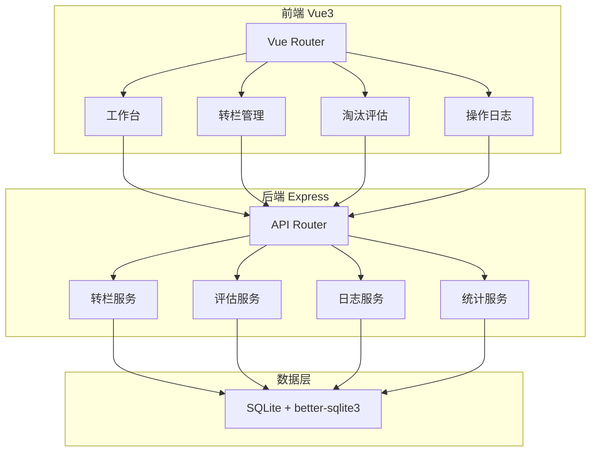
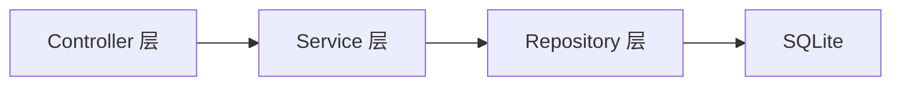
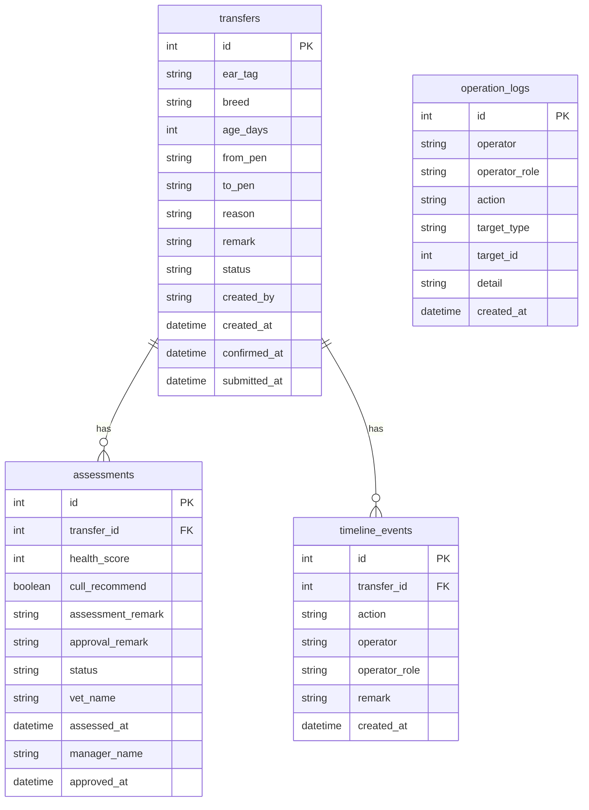

## 1. 架构设计



## 2. 技术说明

- **前端**：Vue3 + TypeScript + Tailwind CSS + Vue Router + Vite
- **初始化工具**：vite-init (vue-express-ts 模板)
- **后端**：Express4 + TypeScript (ESM)
- **数据库**：SQLite (better-sqlite3)，零配置本地运行
- **状态管理**：Pinia
- **图标**：Lucide Vue Next

## 3. 路由定义

| 路由 | 用途 |
|------|------|
| / | 工作台首页，角色选择+待办+最近操作 |
| /transfer | 转栏列表 |
| /transfer/new | 新建转栏 |
| /transfer/:id | 转栏详情(含时间线) |
| /assessment | 评估列表 |
| /assessment/:id | 评估详情(含历史备注) |
| /log | 操作日志 |

## 4. API 定义

### 4.1 角色与认证

```
POST /api/auth/login
  请求: { role: 'breeder' | 'vet' | 'manager', name: string }
  响应: { token: string, role: string, name: string }
```

### 4.2 转栏管理

```
GET    /api/transfers?page=1&pageSize=20&status=&keyword=
  响应: { list: Transfer[], total: number }

POST   /api/transfers
  请求: { earTag: string, breed: string, ageDays: number, fromPen: string, toPen: string, reason: string, remark?: string }
  响应: Transfer

PATCH  /api/transfers/:id/status
  请求: { action: 'confirm' | 'submit_assessment', remark?: string }
  响应: Transfer

GET    /api/transfers/:id
  响应: Transfer (含 timeline)
```

### 4.3 淘汰评估

```
GET    /api/assessments?page=1&pageSize=20&status=&keyword=
  响应: { list: Assessment[], total: number }

POST   /api/assessments/:transferId
  请求: { healthScore: number, cullRecommend: boolean, assessmentRemark: string }
  响应: Assessment

PATCH  /api/assessments/:id/approve
  请求: { approved: boolean, remark?: string }
  响应: Assessment

GET    /api/assessments/:id
  响应: Assessment (含历史备注)
```

### 4.4 操作日志

```
GET    /api/logs?page=1&pageSize=50&role=&action=&startDate=&endDate=
  响应: { list: OperationLog[], total: number }
```

### 4.5 统计

```
GET    /api/stats?role=
  响应: { pendingTransfer: number, pendingAssessment: number, pendingApproval: number, recentActions: RecentAction[] }
```

### 4.6 TypeScript 类型定义

```typescript
type PigletStatus = 'pending_transfer' | 'transferred' | 'pending_assessment' | 'pending_approval' | 'culled' | 'retained'

interface Transfer {
  id: number
  earTag: string
  breed: string
  ageDays: number
  fromPen: string
  toPen: string
  reason: string
  remark: string
  status: PigletStatus
  createdBy: string
  createdAt: string
  confirmedAt: string | null
  submittedAt: string | null
  timeline: TimelineEvent[]
}

interface Assessment {
  id: number
  transferId: number
  earTag: string
  breed: string
  ageDays: number
  fromPen: string
  toPen: string
  healthScore: number
  cullRecommend: boolean
  assessmentRemark: string
  approvalRemark: string
  status: PigletStatus
  vetName: string
  assessedAt: string
  managerName: string | null
  approvedAt: string | null
  historyRemarks: HistoryRemark[]
}

interface TimelineEvent {
  id: number
  action: string
  operator: string
  operatorRole: string
  remark: string
  createdAt: string
}

interface HistoryRemark {
  id: number
  source: 'transfer' | 'assessment' | 'approval'
  author: string
  authorRole: string
  content: string
  createdAt: string
}

interface OperationLog {
  id: number
  operator: string
  operatorRole: string
  action: string
  targetType: string
  targetId: number
  detail: string
  createdAt: string
}
```

## 5. 服务端架构图



- Controller：参数校验、角色鉴权、响应格式化
- Service：业务逻辑、状态流转校验、时效检查
- Repository：SQL查询、数据映射

## 6. 数据模型

### 6.1 数据模型定义



### 6.2 数据定义语言

```sql
CREATE TABLE transfers (
  id INTEGER PRIMARY KEY AUTOINCREMENT,
  ear_tag TEXT NOT NULL,
  breed TEXT NOT NULL,
  age_days INTEGER NOT NULL,
  from_pen TEXT NOT NULL,
  to_pen TEXT NOT NULL,
  reason TEXT NOT NULL,
  remark TEXT DEFAULT '',
  status TEXT NOT NULL DEFAULT 'pending_transfer',
  created_by TEXT NOT NULL,
  created_at TEXT NOT NULL DEFAULT (datetime('now', 'localtime')),
  confirmed_at TEXT,
  submitted_at TEXT
);

CREATE TABLE assessments (
  id INTEGER PRIMARY KEY AUTOINCREMENT,
  transfer_id INTEGER NOT NULL REFERENCES transfers(id),
  health_score INTEGER NOT NULL,
  cull_recommend INTEGER NOT NULL,
  assessment_remark TEXT DEFAULT '',
  approval_remark TEXT DEFAULT '',
  status TEXT NOT NULL DEFAULT 'pending_assessment',
  vet_name TEXT NOT NULL,
  assessed_at TEXT NOT NULL DEFAULT (datetime('now', 'localtime')),
  manager_name TEXT,
  approved_at TEXT
);

CREATE TABLE timeline_events (
  id INTEGER PRIMARY KEY AUTOINCREMENT,
  transfer_id INTEGER NOT NULL REFERENCES transfers(id),
  action TEXT NOT NULL,
  operator TEXT NOT NULL,
  operator_role TEXT NOT NULL,
  remark TEXT DEFAULT '',
  created_at TEXT NOT NULL DEFAULT (datetime('now', 'localtime'))
);

CREATE TABLE operation_logs (
  id INTEGER PRIMARY KEY AUTOINCREMENT,
  operator TEXT NOT NULL,
  operator_role TEXT NOT NULL,
  action TEXT NOT NULL,
  target_type TEXT NOT NULL,
  target_id INTEGER NOT NULL,
  detail TEXT DEFAULT '',
  created_at TEXT NOT NULL DEFAULT (datetime('now', 'localtime'))
);
```
