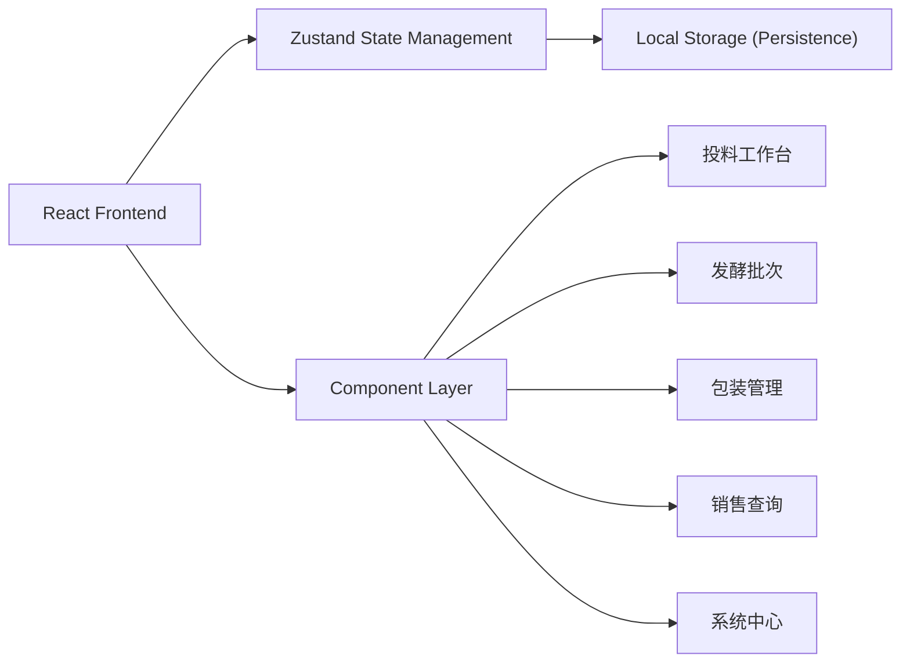
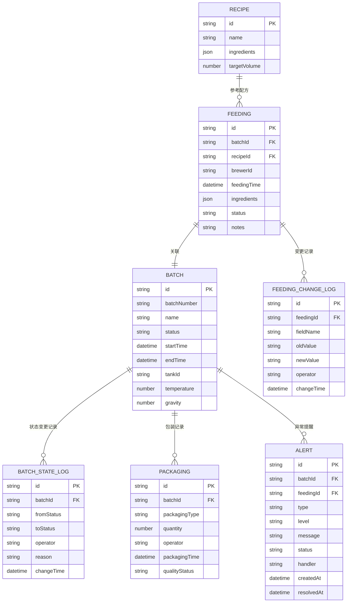

## 1. 架构设计



## 2. 技术描述

- **前端**：React@18 + TypeScript + Vite
- **状态管理**：Zustand
- **样式**：TailwindCSS@3
- **数据持久化**：LocalStorage + JSON 导入/导出
- **UI组件**：原生React组件，密集表格优先

## 3. 路由定义

| Route | 页面用途 |
|-------|----------|
| /feeding | 原料投料工作台 |
| /batches | 发酵批次列表 |
| /batches/:id | 发酵批次详情回看 |
| /packaging | 包装管理 |
| /sales | 销售查询与追溯 |
| /system | 系统中心(备份/异常) |

## 4. 数据模型

### 4.1 数据模型定义



### 4.2 状态流转

发酵批次状态定义：
- `PENDING` - 待投料
- `FEEDING` - 投料中
- `FERMENTING` - 发酵中
- `CONDITIONING` - 后熟
- `READY` - 待包装
- `PACKAGED` - 已包装
- `ABNORMAL` - 异常

### 4.3 核心Store结构

```typescript
// useBreweryStore.ts
interface BreweryState {
  // 数据
  recipes: Recipe[]
  feedings: Feeding[]
  batches: Batch[]
  batchStateLogs: BatchStateLog[]
  packagingRecords: Packaging[]
  alerts: Alert[]
  feedingChangeLogs: FeedingChangeLog[]
  
  // 当前用户角色
  currentRole: UserRole
  
  // Actions - 投料相关
  addFeeding: (feeding: Omit<Feeding, 'id'>) => void
  updateFeeding: (id: string, updates: Partial<Feeding>) => void
  
  // Actions - 批次相关
  addBatch: (batch: Omit<Batch, 'id'>) => void
  updateBatchStatus: (batchId: string, status: BatchStatus, reason: string) => void
  
  // Actions - 异常提醒
  createAlert: (alert: Omit<Alert, 'id' | 'createdAt' | 'status'>) => void
  resolveAlert: (alertId: string, handler: string) => void
  
  // Actions - 备份恢复
  exportData: () => string
  importData: (jsonString: string) => void
  createBackup: () => BackupInfo
  restoreBackup: (backupId: string) => void
}
```

## 5. 关键技术点

### 5.1 状态联动机制

原料投料更新时，自动触发：
1. 记录投料变更日志 (FeedingChangeLog)
2. 更新关联发酵批次状态
3. 记录批次状态变更日志
4. 根据变更内容判断是否创建异常提醒

### 5.2 本地存储策略

- 全量数据存储在 localStorage
- 变更时自动持久化
- 支持导出为 JSON 文件备份
- 支持导入 JSON 恢复数据

### 5.3 异常检测规则

自动触发异常提醒的条件：
- 投料量与配方偏差 > 10%
- 发酵温度超出范围 ±2°C
- 批次状态停留超过预设时间
- 同一批次多次投料变更

## 6. 目录结构

```
src/
├── components/
│   ├── layout/          # 布局组件
│   ├── feeding/         # 投料相关组件
│   ├── batches/         # 批次相关组件
│   ├── packaging/       # 包装相关组件
│   ├── sales/           # 销售查询组件
│   └── system/          # 系统功能组件
├── store/
│   └── useBreweryStore.ts  # 状态管理
├── types/
│   └── index.ts         # TypeScript 类型定义
├── utils/
│   ├── validation.ts    # 校验工具
│   └── backup.ts        # 备份恢复工具
├── data/
│   └── mockData.ts      # 初始模拟数据
├── App.tsx
└── main.tsx
```
