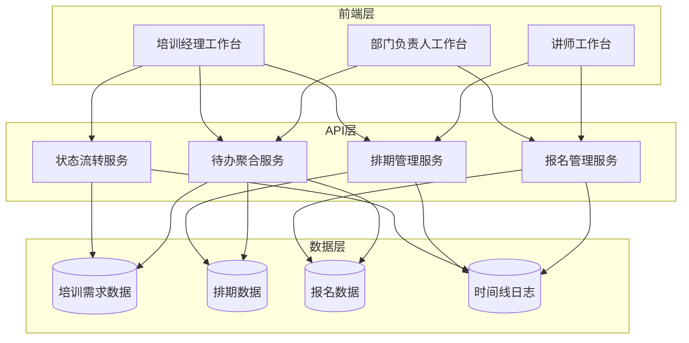
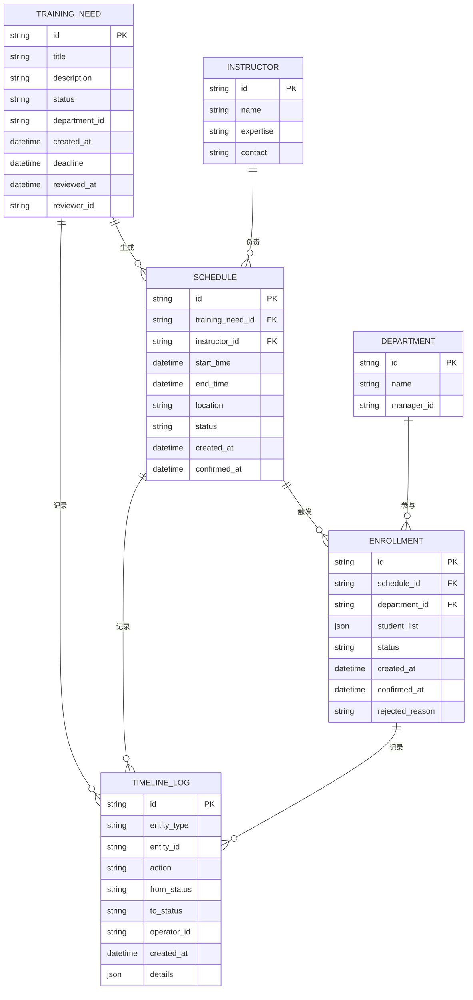

# 企业内训部-讲师排期与学员报名系统 技术架构

## 1. 架构设计



## 2. 技术选型

- **前端框架**：React 18 + TypeScript
- **样式方案**：Tailwind CSS 3
- **构建工具**：Vite
- **状态管理**：Zustand（轻量级状态管理）
- **路由方案**：React Router v6
- **UI组件库**：Headless UI（无样式组件）+ 自定义设计系统
- **图标库**：Lucide React
- **日期处理**：date-fns
- **后端方案**：Mock数据 + LocalStorage（演示版本）

## 3. 路由定义

| 路由路径 | 页面名称 | 角色权限 |
|----------|----------|----------|
| `/manager` | 培训经理工作台 | 培训经理 |
| `/manager/needs` | 培训需求管理 | 培训经理 |
| `/manager/schedule` | 讲师排期中心 | 培训经理 |
| `/manager/enrollment` | 学员报名监控 | 培训经理 |
| `/department` | 部门负责人工作台 | 部门负责人 |
| `/department/submit` | 培训需求提交 | 部门负责人 |
| `/department/enrollment` | 学员报名确认 | 部门负责人 |
| `/department/calendar` | 部门培训日历 | 部门负责人 |
| `/instructor` | 讲师工作台 | 讲师 |
| `/instructor/schedule` | 排期确认 | 讲师 |
| `/instructor/students` | 学员名单查看 | 讲师 |
| `/instructor/feedback` | 培训记录回填 | 讲师 |
| `/training/:id` | 培训详情（时间线） | 所有角色 |
| `/training/:id/enrollment` | 报名回看 | 所有角色 |

## 4. 数据模型

### 4.1 实体关系图



### 4.2 状态枚举定义

```typescript
// 培训需求状态
enum TrainingNeedStatus {
  DRAFT = '草稿',
  PENDING_REVIEW = '待审核',
  APPROVED = '已通过',
  REJECTED = '已退回',
  SCHEDULED = '已排期'
}

// 排期状态
enum ScheduleStatus {
  PENDING = '待排期',
  SCHEDULED = '已排期',
  CONFIRMED = '已确认',
  REJECTED = '讲师拒绝',
  ENROLLING = '报名中',
  ENROLLMENT_CLOSED = '报名截止',
  IN_PROGRESS = '培训中',
  COMPLETED = '已完成'
}

// 报名状态
enum EnrollmentStatus {
  PENDING = '待确认',
  CONFIRMED = '已确认',
  REJECTED = '已退回',
  RESET = '已重置'
}

// 待办类型
enum TodoType {
  TODAY = '今天要办',
  OVERDUE = '已经拖延',
  RETURNED = '刚刚退回'
}
```

### 4.3 核心数据结构

```typescript
// 待办项聚合结构
interface TodoItem {
  id: string;
  type: TodoType;
  category: 'need' | 'schedule' | 'enrollment';
  title: string;
  description: string;
  deadline: Date;
  priority: 'high' | 'medium' | 'low';
  status: string;
  actions: string[];
  createdAt: Date;
  returnedAt?: Date;
}

// 时间线日志结构
interface TimelineLog {
  id: string;
  entityType: 'training_need' | 'schedule' | 'enrollment';
  entityId: string;
  action: string;
  fromStatus: string;
  toStatus: string;
  operatorId: string;
  operatorName: string;
  operatorRole: string;
  createdAt: Date;
  details: Record<string, any>;
}

// 学员信息结构
interface Student {
  id: string;
  name: string;
  employeeId: string;
  department: string;
  position: string;
  email: string;
  phone: string;
}
```

## 5. API接口定义

### 5.1 待办聚合接口

```typescript
// GET /api/todos
// 获取当前用户的待办列表（自动聚合今天要办、已拖延、刚退回）
interface GetTodosResponse {
  today: TodoItem[];
  overdue: TodoItem[];
  returned: TodoItem[];
}

// 后端逻辑：
// 1. 查询截止日期 = 今天 AND 状态 != 已完成
// 2. 查询截止日期 < 今天 AND 状态 != 已完成
// 3. 查询退回时间 > 24小时前 AND 状态 = 已退回
```

### 5.2 状态流转接口

```typescript
// POST /api/training-needs/:id/submit
// 提交培训需求审核
interface SubmitTrainingNeedRequest {
  id: string;
}

interface SubmitTrainingNeedResponse {
  success: boolean;
  newStatus: TrainingNeedStatus;
  timelineLog: TimelineLog;
}

// POST /api/schedules/:id/confirm
// 讲师确认排期（自动触发报名流程）
interface ConfirmScheduleRequest {
  id: string;
  confirmed: boolean;
  rejectedReason?: string;
}

interface ConfirmScheduleResponse {
  success: boolean;
  newStatus: ScheduleStatus;
  enrollmentTasks?: Enrollment[]; // 自动创建的报名任务
  timelineLog: TimelineLog;
}
```

### 5.3 报名管理接口

```typescript
// POST /api/enrollments/:id/confirm
// 部门负责人确认学员名单
interface ConfirmEnrollmentRequest {
  id: string;
  studentList: Student[];
}

// POST /api/enrollments/:id/reject
// 部门负责人退回报名
interface RejectEnrollmentRequest {
  id: string;
  reason: string;
}

// GET /api/enrollments/:id/history
// 获取报名历史记录（回看功能）
interface GetEnrollmentHistoryResponse {
  current: Enrollment;
  history: {
    version: number;
    studentList: Student[];
    updatedAt: Date;
    updatedBy: string;
    status: string;
  }[];
}
```

### 5.4 数据重置接口

```typescript
// POST /api/enrollments/:id/reset
// 重置报名数据（保留历史记录）
interface ResetEnrollmentRequest {
  id: string;
  reason: string;
}

interface ResetEnrollmentResponse {
  success: boolean;
  newStatus: EnrollmentStatus.RESET;
  timelineLog: TimelineLog;
  historyVersion: number;
}
```

## 6. 前端状态管理

### 6.1 全局状态（Zustand Store）

```typescript
interface AppState {
  // 当前用户
  currentUser: {
    id: string;
    name: string;
    role: 'manager' | 'department' | 'instructor';
    departmentId?: string;
  };
  
  // 待办数据
  todos: {
    today: TodoItem[];
    overdue: TodoItem[];
    returned: TodoItem[];
  };
  
  // 操作方法
  actions: {
    fetchTodos: () => Promise<void>;
    submitTrainingNeed: (id: string) => Promise<void>;
    confirmSchedule: (id: string, confirmed: boolean, reason?: string) => Promise<void>;
    confirmEnrollment: (id: string, students: Student[]) => Promise<void>;
    rejectEnrollment: (id: string, reason: string) => Promise<void>;
    resetEnrollment: (id: string, reason: string) => Promise<void>;
  };
}
```

### 6.2 本地缓存策略

- 待办列表：每次进入工作台自动刷新
- 培训详情：缓存5分钟，手动刷新
- 学员名单：实时获取，不缓存
- 时间线：实时获取，不缓存

## 7. 关键业务逻辑

### 7.1 排期完成自动触发报名

```typescript
// 后端服务层伪代码
async function confirmSchedule(scheduleId: string) {
  // 1. 更新排期状态
  const schedule = await updateScheduleStatus(scheduleId, 'CONFIRMED');
  
  // 2. 记录时间线
  await createTimelineLog({
    entityType: 'schedule',
    entityId: scheduleId,
    action: '讲师确认排期',
    toStatus: '已确认'
  });
  
  // 3. 自动创建报名任务（核心：自然衔接）
  const trainingNeed = await getTrainingNeed(schedule.trainingNeedId);
  const departments = trainingNeed.participantDepartments;
  
  for (const deptId of departments) {
    await createEnrollmentTask({
      scheduleId,
      departmentId: deptId,
      status: 'PENDING',
      deadline: calculateDeadline(schedule.startTime)
    });
  }
  
  // 4. 发送系统通知（非消息提醒，而是工作台待办更新）
  await notifyDepartmentManagers(departments, 'NEW_ENROLLMENT_TASK');
  
  return { success: true };
}
```

### 7.2 默认列表数据聚合

```typescript
// 后端服务层伪代码
async function getTodos(userId: string, role: string) {
  const today = new Date();
  today.setHours(0, 0, 0, 0);
  
  const yesterday = new Date(today);
  yesterday.setDate(yesterday.getDate() - 1);
  
  const yesterdayEvening = new Date(yesterday);
  yesterdayEvening.setHours(23, 59, 59, 999);
  
  // 今天要办
  const todayTasks = await queryTasks({
    assignee: userId,
    role: role,
    deadline: { $gte: today, $lt: tomorrow },
    status: { $ne: 'COMPLETED' }
  });
  
  // 已经拖延
  const overdueTasks = await queryTasks({
    assignee: userId,
    role: role,
    deadline: { $lt: today },
    status: { $ne: 'COMPLETED' }
  });
  
  // 刚刚退回（24小时内）
  const returnedTasks = await queryTasks({
    assignee: userId,
    role: role,
    returnedAt: { $gte: yesterdayEvening },
    status: 'REJECTED'
  });
  
  return {
    today: todayTasks,
    overdue: overdueTasks,
    returned: returnedTasks
  };
}
```

## 8. 安全与权限

### 8.1 角色权限矩阵

| 操作 | 培训经理 | 部门负责人 | 讲师 |
|------|----------|------------|------|
| 创建培训需求 | ✓ | ✗ | ✗ |
| 审核培训需求 | ✓ | ✗ | ✗ |
| 指派讲师 | ✓ | ✗ | ✗ |
| 确认排期 | ✗ | ✗ | ✓ |
| 提交学员名单 | ✗ | ✓ | ✗ |
| 查看全局进度 | ✓ | ✗ | ✗ |
| 查看部门培训 | ✗ | ✓ | ✗ |
| 查看自己的培训 | ✗ | ✗ | ✓ |

### 8.2 数据访问控制

- 培训经理：可访问所有数据
- 部门负责人：只能访问本部门相关数据
- 讲师：只能访问自己负责的培训数据

## 9. 性能优化

### 9.1 前端优化

- 待办列表虚拟滚动（大量数据时）
- 时间线数据懒加载
- 学员名单分页加载
- 图片和静态资源CDN加速

### 9.2 后端优化

- 待办聚合查询使用索引（deadline、status、assignee）
- 时间线日志分表存储（按月分表）
- 报名历史版本压缩存储
- 缓存热点数据（Redis）