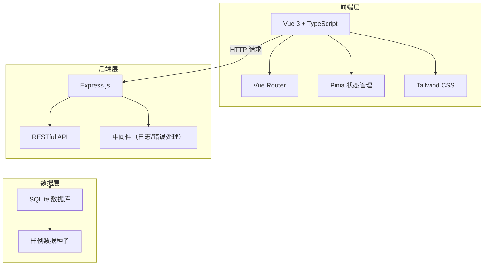
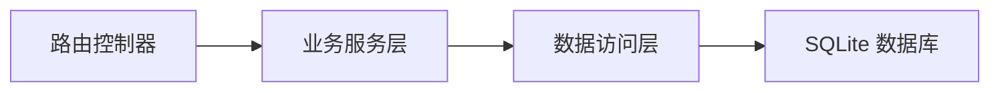
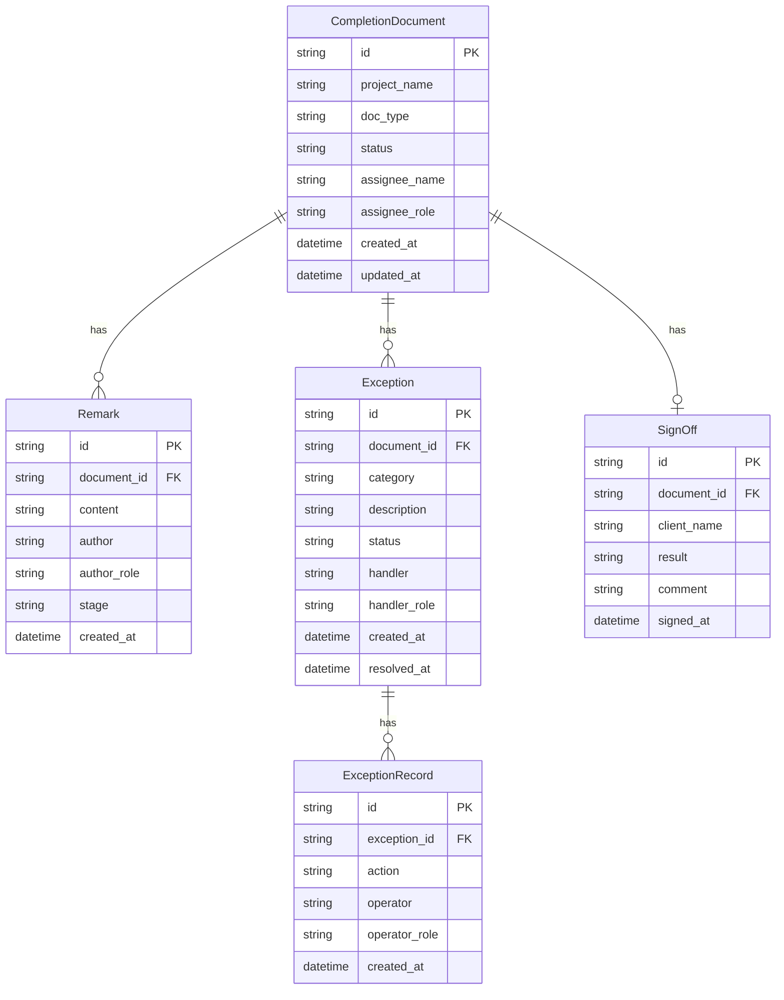

## 1. 架构设计



## 2. 技术说明

- 前端：Vue 3 + TypeScript + Vite + Tailwind CSS
- 状态管理：Pinia
- 路由：Vue Router 4
- 初始化工具：vite-init (vue-express-ts 模板)
- 后端：Express.js + TypeScript (ESM)
- 数据库：SQLite（better-sqlite3）
- 图标：lucide-vue-next

## 3. 路由定义

| 路由 | 用途 |
|------|------|
| / | 总览仪表盘（默认页） |
| /documents | 竣工资料处理列表 |
| /sign-off | 客户签认页面 |
| /documents/:id | 单条竣工资料详情（含签认回看） |

## 4. API 定义

### 4.1 竣工资料相关

```typescript
interface CompletionDocument {
  id: string
  projectName: string
  docType: "布线图" | "材料领用单" | "现场照片" | "测试报告" | "验收记录"
  status: "待整理" | "待审核" | "待签认" | "已签认" | "已驳回"
  assignee: {
    role: "项目负责人" | "施工班组长" | "资料员"
    name: string
  }
  remarks: Remark[]
  exceptions: Exception[]
  createdAt: string
  updatedAt: string
}

interface Remark {
  id: string
  documentId: string
  content: string
  author: string
  authorRole: string
  stage: "整理" | "审核" | "签认" | "异常处理"
  createdAt: string
}

interface Exception {
  id: string
  documentId: string
  category: "资料缺失" | "照片不符" | "材料领用差异" | "布线图错误" | "其他"
  description: string
  status: "待处理" | "处理中" | "已解决" | "已升级"
  handler: string
  handlerRole: string
  records: ExceptionRecord[]
  createdAt: string
  resolvedAt?: string
}

interface ExceptionRecord {
  id: string
  exceptionId: string
  action: string
  operator: string
  operatorRole: string
  createdAt: string
}

interface SignOff {
  id: string
  documentId: string
  clientName: string
  result: "已签认" | "已驳回"
  comment?: string
  signedAt: string
}
```

### 4.2 API 端点

| 方法 | 路径 | 说明 |
|------|------|------|
| GET | /api/documents | 获取竣工资料列表（支持 status/assignee 筛选） |
| GET | /api/documents/:id | 获取单条竣工资料详情（含备注与异常） |
| POST | /api/documents | 创建竣工资料 |
| PUT | /api/documents/:id | 更新竣工资料（状态流转、指派等） |
| POST | /api/documents/:id/remarks | 添加备注 |
| PUT | /api/documents/batch | 批量操作（提交审核、标记异常、指派） |
| GET | /api/documents/:id/exceptions | 获取资料异常列表 |
| POST | /api/documents/:id/exceptions | 创建异常 |
| PUT | /api/documents/:id/exceptions/:eid | 更新异常（处理、升级） |
| POST | /api/documents/:id/sign-off | 客户签认（签认或驳回） |
| GET | /api/dashboard/overview | 获取仪表盘概览数据 |
| GET | /api/dashboard/risks | 获取风险项列表 |
| GET | /api/dashboard/recent-changes | 获取最近变更 |

## 5. 服务端架构图



## 6. 数据模型

### 6.1 数据模型定义



### 6.2 数据定义语言

```sql
CREATE TABLE completion_documents (
  id TEXT PRIMARY KEY,
  project_name TEXT NOT NULL,
  doc_type TEXT NOT NULL CHECK(doc_type IN ('布线图', '材料领用单', '现场照片', '测试报告', '验收记录')),
  status TEXT NOT NULL CHECK(status IN ('待整理', '待审核', '待签认', '已签认', '已驳回')) DEFAULT '待整理',
  assignee_name TEXT NOT NULL,
  assignee_role TEXT NOT NULL CHECK(assignee_role IN ('项目负责人', '施工班组长', '资料员')),
  created_at TEXT NOT NULL DEFAULT (datetime('now')),
  updated_at TEXT NOT NULL DEFAULT (datetime('now'))
);

CREATE TABLE remarks (
  id TEXT PRIMARY KEY,
  document_id TEXT NOT NULL REFERENCES completion_documents(id),
  content TEXT NOT NULL,
  author TEXT NOT NULL,
  author_role TEXT NOT NULL,
  stage TEXT NOT NULL CHECK(stage IN ('整理', '审核', '签认', '异常处理')),
  created_at TEXT NOT NULL DEFAULT (datetime('now'))
);

CREATE TABLE exceptions (
  id TEXT PRIMARY KEY,
  document_id TEXT NOT NULL REFERENCES completion_documents(id),
  category TEXT NOT NULL CHECK(category IN ('资料缺失', '照片不符', '材料领用差异', '布线图错误', '其他')),
  description TEXT NOT NULL,
  status TEXT NOT NULL CHECK(status IN ('待处理', '处理中', '已解决', '已升级')) DEFAULT '待处理',
  handler TEXT,
  handler_role TEXT,
  created_at TEXT NOT NULL DEFAULT (datetime('now')),
  resolved_at TEXT
);

CREATE TABLE exception_records (
  id TEXT PRIMARY KEY,
  exception_id TEXT NOT NULL REFERENCES exceptions(id),
  action TEXT NOT NULL,
  operator TEXT NOT NULL,
  operator_role TEXT NOT NULL,
  created_at TEXT NOT NULL DEFAULT (datetime('now'))
);

CREATE TABLE sign_offs (
  id TEXT PRIMARY KEY,
  document_id TEXT NOT NULL REFERENCES completion_documents(id),
  client_name TEXT NOT NULL,
  result TEXT NOT NULL CHECK(result IN ('已签认', '已驳回')),
  comment TEXT,
  signed_at TEXT NOT NULL DEFAULT (datetime('now'))
);

CREATE INDEX idx_documents_status ON completion_documents(status);
CREATE INDEX idx_documents_assignee ON completion_documents(assignee_role);
CREATE INDEX idx_remarks_document ON remarks(document_id);
CREATE INDEX idx_exceptions_document ON exceptions(document_id);
CREATE INDEX idx_signoffs_document ON sign_offs(document_id);
```
