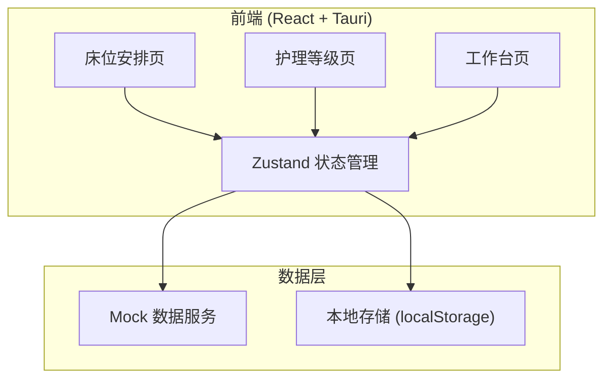
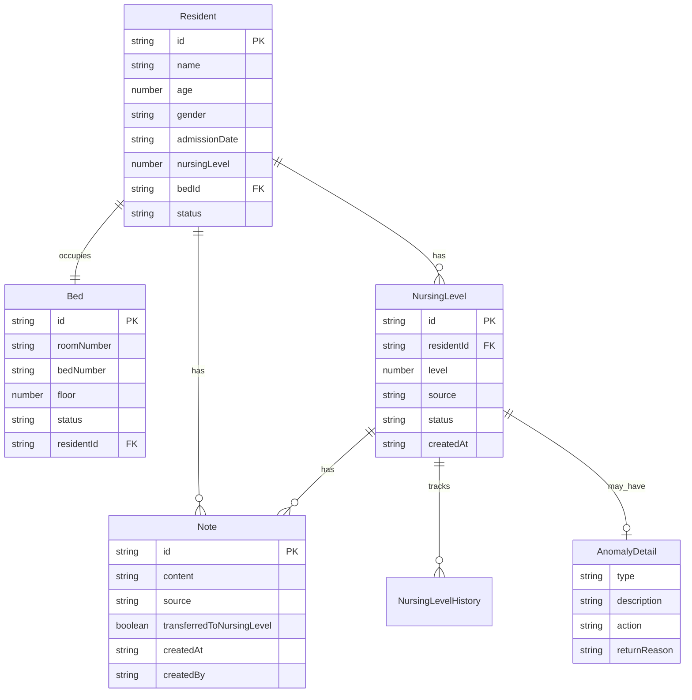

## 1. 架构设计



## 2. 技术说明

- 前端：React@18 + TypeScript + Tailwind CSS@3 + Zustand + Vite
- 初始化工具：vite-init (react-ts 模板)
- 桌面端：Tauri（后续集成，当前先实现Web端）
- 后端：无（纯前端，使用 Mock 数据 + localStorage 持久化）
- 数据库：无（使用内存数据 + localStorage）

## 3. 路由定义

| 路由 | 用途 |
|------|------|
| / | 工作台首页，角色差异化入口面板 |
| /beds | 床位安排管理页，密集表格与备注流转 |
| /nursing-levels | 护理等级管理页，回看时间线与异常处理 |
| /beds/:bedId | 单个床位详情与处理面板 |

## 4. API 定义（Mock 数据服务）

无需后端API，使用前端 Mock 数据服务。核心数据接口：

```typescript
interface Resident {
  id: string;
  name: string;
  age: number;
  gender: 'male' | 'female';
  admissionDate: string;
  nursingLevel: NursingLevelType;
  bedId: string;
  notes: Note[];
  status: 'active' | 'pending_transfer' | 'discharged';
}

interface Bed {
  id: string;
  roomNumber: string;
  bedNumber: string;
  floor: number;
  status: 'available' | 'occupied' | 'pending_adjustment' | 'maintenance';
  residentId: string | null;
  notes: Note[];
}

interface NursingLevel {
  id: string;
  residentId: string;
  level: 1 | 2 | 3 | 4 | 5;
  source: 'bed_arrangement' | 'periodic_assessment' | 'anomaly_report';
  status: 'pending' | 'confirmed' | 'anomaly' | 'returned';
  createdAt: string;
  confirmedAt: string | null;
  anomalyDetail: AnomalyDetail | null;
  notes: Note[];
  history: NursingLevelHistory[];
}

interface Note {
  id: string;
  content: string;
  source: 'bed_arrangement' | 'nursing_level' | 'anomaly_return';
  transferredToNursingLevel: boolean;
  createdAt: string;
  createdBy: UserRole;
}

interface AnomalyDetail {
  type: 'health_change' | 'behavior_change' | 'family_complaint' | 'other';
  description: string;
  action: 'alert' | 'return';
  returnedFrom?: string;
  returnReason?: string;
}

type UserRole = 'nursing_supervisor' | 'care_worker' | 'social_worker';
type NursingLevelType = 1 | 2 | 3 | 4 | 5;
```

## 5. 无后端服务架构

本系统为纯前端应用，数据通过 Mock 服务提供，状态持久化至 localStorage。

## 6. 数据模型

### 6.1 数据模型定义



### 6.2 Mock 初始数据

系统启动时注入以下 Mock 数据：
- 20张床位（分布在3个楼层，6个房间）
- 15位在住老人（含不同护理等级1-5级）
- 5条待处理护理等级评估
- 3条异常标记（含1条已退回、1条待处理、1条已触发提醒）
- 备注流转示例（含已流转和待流转）
