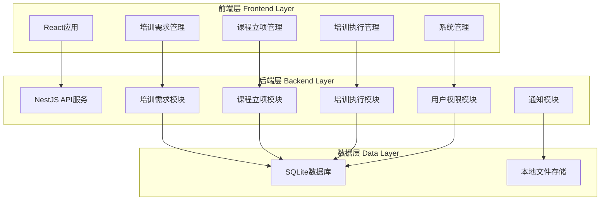
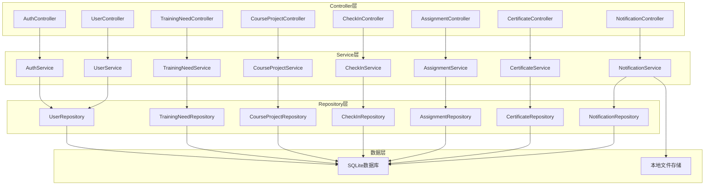
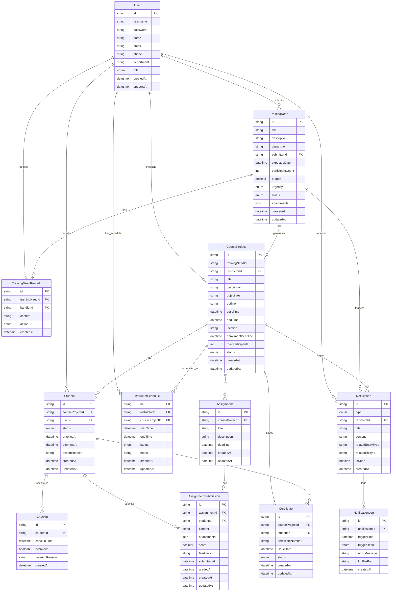
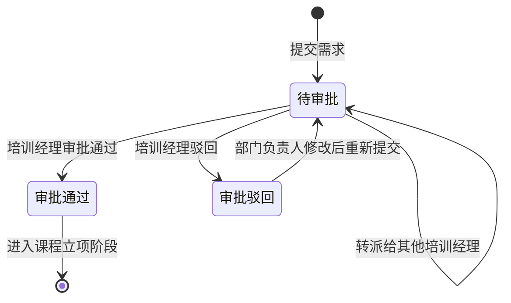
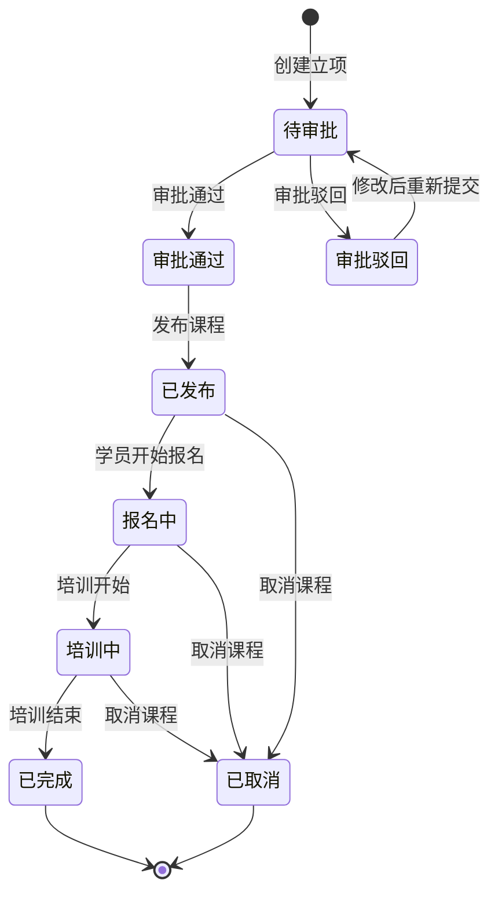
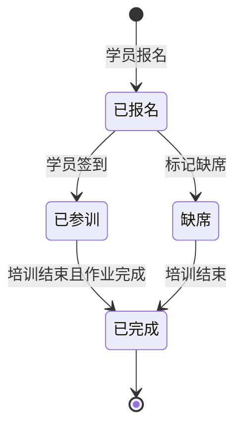

# 企业内训部 - 培训需求与课程立项管理系统技术架构

## 1. 架构设计

系统采用前后端分离架构，后端使用NestJS框架提供RESTful API，前端使用React构建用户界面。数据库使用SQLite存储业务数据，使用本地文件记录模拟通知触发结果。



## 2. 技术栈说明

### 2.1 后端技术栈
- **框架**: NestJS 10.x
- **语言**: TypeScript 5.x
- **数据库**: SQLite 3.x (better-sqlite3)
- **ORM**: TypeORM 0.3.x
- **认证**: JWT (jsonwebtoken)
- **密码加密**: bcrypt
- **API文档**: Swagger/OpenAPI
- **验证**: class-validator, class-transformer
- **日志**: winston

### 2.2 前端技术栈
- **框架**: React 18.x
- **构建工具**: Vite 5.x
- **UI库**: Ant Design 5.x
- **样式**: Tailwind CSS 3.x
- **路由**: React Router 6.x
- **状态管理**: Zustand 4.x
- **HTTP客户端**: Axios 1.x
- **表单**: React Hook Form 7.x
- **日期处理**: dayjs 1.x

### 2.3 开发工具
- **代码规范**: ESLint, Prettier
- **Git提交规范**: Commitlint, Husky
- **包管理器**: pnpm

## 3. 路由定义

### 3.1 前端路由

| 路由路径 | 用途 | 权限 |
|---------|------|------|
| `/login` | 用户登录页面 | 公开 |
| `/dashboard` | 首页仪表盘 | 所有角色 |
| `/training-needs` | 培训需求列表 | 培训经理、部门负责人 |
| `/training-needs/create` | 创建培训需求 | 部门负责人 |
| `/training-needs/:id` | 培训需求详情 | 培训经理、部门负责人 |
| `/training-needs/:id/edit` | 编辑培训需求 | 部门负责人 |
| `/course-projects` | 课程立项列表 | 培训经理 |
| `/course-projects/create` | 创建课程立项 | 培训经理 |
| `/course-projects/:id` | 课程立项详情 | 培训经理、讲师、学员 |
| `/course-projects/:id/edit` | 编辑课程立项 | 培训经理 |
| `/instructor-schedule` | 讲师排期页面 | 培训经理、讲师 |
| `/check-in/:projectId` | 签到管理页面 | 培训经理、讲师 |
| `/assignments/:projectId` | 作业管理页面 | 讲师、学员 |
| `/certificates` | 证书管理页面 | 培训经理、学员 |
| `/notifications` | 通知记录页面 | 培训经理 |
| `/users` | 用户管理页面 | 培训经理 |
| `/roles` | 角色权限页面 | 培训经理 |

### 3.2 后端API路由

#### 3.2.1 认证模块 `/api/auth`
| 方法 | 路由 | 用途 |
|------|------|------|
| POST | `/api/auth/login` | 用户登录 |
| POST | `/api/auth/logout` | 用户登出 |
| GET | `/api/auth/profile` | 获取当前用户信息 |
| POST | `/api/auth/refresh` | 刷新Token |

#### 3.2.2 培训需求模块 `/api/training-needs`
| 方法 | 路由 | 用途 |
|------|------|------|
| GET | `/api/training-needs` | 获取培训需求列表（支持筛选、分页） |
| GET | `/api/training-needs/:id` | 获取培训需求详情 |
| POST | `/api/training-needs` | 创建培训需求 |
| PUT | `/api/training-needs/:id` | 更新培训需求 |
| DELETE | `/api/training-needs/:id` | 删除培训需求 |
| POST | `/api/training-needs/:id/approve` | 审批通过培训需求 |
| POST | `/api/training-needs/:id/reject` | 驳回培训需求 |
| POST | `/api/training-needs/:id/transfer` | 转派培训需求 |
| POST | `/api/training-needs/:id/remarks` | 添加处理备注 |
| GET | `/api/training-needs/:id/history` | 获取培训需求处理历史 |

#### 3.2.3 课程立项模块 `/api/course-projects`
| 方法 | 路由 | 用途 |
|------|------|------|
| GET | `/api/course-projects` | 获取课程立项列表（支持筛选、分页） |
| GET | `/api/course-projects/:id` | 获取课程立项详情 |
| POST | `/api/course-projects` | 创建课程立项 |
| PUT | `/api/course-projects/:id` | 更新课程立项 |
| DELETE | `/api/course-projects/:id` | 删除课程立项 |
| POST | `/api/course-projects/:id/approve` | 审批通过课程立项 |
| POST | `/api/course-projects/:id/reject` | 驳回课程立项 |
| POST | `/api/course-projects/:id/publish` | 发布课程立项 |
| POST | `/api/course-projects/:id/cancel` | 取消课程立项 |
| GET | `/api/course-projects/:id/students` | 获取课程学员列表 |
| POST | `/api/course-projects/:id/students` | 添加学员（报名） |
| DELETE | `/api/course-projects/:id/students/:studentId` | 移除学员 |
| POST | `/api/course-projects/:id/students/:studentId/absent` | 标记学员缺席 |
| GET | `/api/course-projects/:id/remarks` | 获取关联的培训需求备注 |

#### 3.2.4 讲师排期模块 `/api/instructor-schedules`
| 方法 | 路由 | 用途 |
|------|------|------|
| GET | `/api/instructor-schedules` | 获取讲师排期列表 |
| GET | `/api/instructor-schedules/:instructorId` | 获取指定讲师排期 |
| POST | `/api/instructor-schedules` | 创建讲师排期 |
| PUT | `/api/instructor-schedules/:id` | 更新讲师排期 |
| DELETE | `/api/instructor-schedules/:id` | 删除讲师排期 |
| GET | `/api/instructor-schedules/conflicts` | 检测排期冲突 |

#### 3.2.5 签到管理模块 `/api/check-ins`
| 方法 | 路由 | 用途 |
|------|------|------|
| GET | `/api/check-ins/project/:projectId` | 获取课程签到记录 |
| POST | `/api/check-ins` | 学员签到 |
| POST | `/api/check-ins/batch` | 批量签到 |
| POST | `/api/check-ins/:id/makeup` | 补签 |
| GET | `/api/check-ins/project/:projectId/statistics` | 获取签到统计 |

#### 3.2.6 作业管理模块 `/api/assignments`
| 方法 | 路由 | 用途 |
|------|------|------|
| GET | `/api/assignments/project/:projectId` | 获取课程作业列表 |
| POST | `/api/assignments` | 发布作业 |
| PUT | `/api/assignments/:id` | 更新作业 |
| DELETE | `/api/assignments/:id` | 删除作业 |
| GET | `/api/assignments/:id/submissions` | 获取作业提交列表 |
| POST | `/api/assignments/:id/submissions` | 提交作业 |
| PUT | `/api/assignments/:id/submissions/:submissionId` | 批改作业 |

#### 3.2.7 证书管理模块 `/api/certificates`
| 方法 | 路由 | 用途 |
|------|------|------|
| GET | `/api/certificates` | 获取证书列表 |
| GET | `/api/certificates/:id` | 获取证书详情 |
| POST | `/api/certificates/generate` | 批量生成证书 |
| POST | `/api/certificates/:id/issue` | 发放证书 |
| GET | `/api/certificates/project/:projectId` | 获取课程证书列表 |

#### 3.2.8 用户权限模块 `/api/users`
| 方法 | 路由 | 用途 |
|------|------|------|
| GET | `/api/users` | 获取用户列表 |
| GET | `/api/users/:id` | 获取用户详情 |
| POST | `/api/users` | 创建用户 |
| PUT | `/api/users/:id` | 更新用户 |
| DELETE | `/api/users/:id` | 删除用户 |
| GET | `/api/roles` | 获取角色列表 |
| POST | `/api/roles` | 创建角色 |
| PUT | `/api/roles/:id` | 更新角色 |
| DELETE | `/api/roles/:id` | 删除角色 |

#### 3.2.9 通知模块 `/api/notifications`
| 方法 | 路由 | 用途 |
|------|------|------|
| GET | `/api/notifications` | 获取通知记录列表 |
| GET | `/api/notifications/:id` | 获取通知详情 |
| GET | `/api/notifications/logs` | 获取本地通知日志 |

#### 3.2.10 讲师管理模块 `/api/instructors`
| 方法 | 路由 | 用途 |
|------|------|------|
| GET | `/api/instructors` | 获取讲师列表 |
| GET | `/api/instructors/:id` | 获取讲师详情 |
| POST | `/api/instructors` | 创建讲师 |
| PUT | `/api/instructors/:id` | 更新讲师 |
| DELETE | `/api/instructors/:id` | 删除讲师 |

## 4. API定义

### 4.1 数据类型定义

```typescript
// 用户角色枚举
enum UserRole {
  TRAINING_MANAGER = 'training_manager',
  DEPARTMENT_HEAD = 'department_head',
  INSTRUCTOR = 'instructor',
  STUDENT = 'student'
}

// 培训需求状态枚举
enum TrainingNeedStatus {
  PENDING = 'pending',           // 待审批
  APPROVED = 'approved',          // 审批通过
  REJECTED = 'rejected',          // 审批驳回
  TRANSFERRED = 'transferred'     // 已转派
}

// 课程立项状态枚举
enum CourseProjectStatus {
  PENDING = 'pending',           // 待审批
  APPROVED = 'approved',          // 审批通过
  REJECTED = 'rejected',          // 审批驳回
  PUBLISHED = 'published',        // 已发布
  ENROLLING = 'enrolling',        // 报名中
  IN_PROGRESS = 'in_progress',    // 培训中
  COMPLETED = 'completed',        // 已完成
  CANCELLED = 'cancelled'         // 已取消
}

// 学员状态枚举
enum StudentStatus {
  ENROLLED = 'enrolled',          // 已报名
  ATTENDED = 'attended',          // 已参训
  ABSENT = 'absent',              // 缺席
  COMPLETED = 'completed'         // 已完成
}

// 通知类型枚举
enum NotificationType {
  TRAINING_NEED_APPROVED = 'training_need_approved',
  TRAINING_NEED_REJECTED = 'training_need_rejected',
  COURSE_PROJECT_APPROVED = 'course_project_approved',
  COURSE_PROJECT_REJECTED = 'course_project_rejected',
  COURSE_REMINDER = 'course_reminder',
  ASSIGNMENT_REMINDER = 'assignment_reminder',
  CERTIFICATE_ISSUED = 'certificate_issued'
}

// 用户实体
interface User {
  id: string;
  username: string;
  password: string;
  name: string;
  email: string;
  phone: string;
  department: string;
  role: UserRole;
  createdAt: Date;
  updatedAt: Date;
}

// 培训需求实体
interface TrainingNeed {
  id: string;
  title: string;
  description: string;
  department: string;
  submitterId: string;
  submitter: User;
  expectedDate: Date;
  participantCount: number;
  budget: number;
  urgency: 'low' | 'medium' | 'high';
  status: TrainingNeedStatus;
  attachments: string[];
  createdAt: Date;
  updatedAt: Date;
}

// 培训需求处理记录实体
interface TrainingNeedRemark {
  id: string;
  trainingNeedId: string;
  trainingNeed: TrainingNeed;
  handlerId: string;
  handler: User;
  content: string;
  action: 'approve' | 'reject' | 'transfer' | 'comment';
  createdAt: Date;
}

// 课程立项实体
interface CourseProject {
  id: string;
  trainingNeedId: string;
  trainingNeed: TrainingNeed;
  title: string;
  description: string;
  objectives: string;
  outline: string;
  instructorId: string;
  instructor: User;
  startTime: Date;
  endTime: Date;
  location: string;
  enrollmentDeadline: Date;
  maxParticipants: number;
  status: CourseProjectStatus;
  createdAt: Date;
  updatedAt: Date;
}

// 学员实体
interface Student {
  id: string;
  courseProjectId: string;
  courseProject: CourseProject;
  userId: string;
  user: User;
  status: StudentStatus;
  enrolledAt: Date;
  attendedAt: Date;
  absentReason: string;
  createdAt: Date;
  updatedAt: Date;
}

// 签到记录实体
interface CheckIn {
  id: string;
  studentId: string;
  student: Student;
  checkInTime: Date;
  isMakeup: boolean;
  makeupReason: string;
  createdAt: Date;
}

// 作业实体
interface Assignment {
  id: string;
  courseProjectId: string;
  courseProject: CourseProject;
  title: string;
  description: string;
  deadline: Date;
  createdAt: Date;
  updatedAt: Date;
}

// 作业提交实体
interface AssignmentSubmission {
  id: string;
  assignmentId: string;
  assignment: Assignment;
  studentId: string;
  student: Student;
  content: string;
  attachments: string[];
  score: number;
  feedback: string;
  submittedAt: Date;
  gradedAt: Date;
  createdAt: Date;
  updatedAt: Date;
}

// 证书实体
interface Certificate {
  id: string;
  courseProjectId: string;
  courseProject: CourseProject;
  studentId: string;
  student: Student;
  certificateNumber: string;
  issueDate: Date;
  status: 'pending' | 'issued';
  createdAt: Date;
  updatedAt: Date;
}

// 通知记录实体
interface Notification {
  id: string;
  type: NotificationType;
  recipientId: string;
  recipient: User;
  title: string;
  content: string;
  relatedEntityType: 'training_need' | 'course_project' | 'assignment' | 'certificate';
  relatedEntityId: string;
  isRead: boolean;
  createdAt: Date;
}

// 本地通知日志实体
interface NotificationLog {
  id: string;
  notificationId: string;
  notification: Notification;
  triggerTime: Date;
  triggerResult: 'success' | 'failed';
  errorMessage: string;
  logFilePath: string;
  createdAt: Date;
}

// 讲师排期实体
interface InstructorSchedule {
  id: string;
  instructorId: string;
  instructor: User;
  courseProjectId: string;
  courseProject: CourseProject;
  startTime: Date;
  endTime: Date;
  status: 'scheduled' | 'completed' | 'cancelled';
  notes: string;
  createdAt: Date;
  updatedAt: Date;
}
```

### 4.2 请求/响应Schema

#### 4.2.1 培训需求相关

```typescript
// 创建培训需求请求
interface CreateTrainingNeedDto {
  title: string;
  description: string;
  department: string;
  expectedDate: Date;
  participantCount: number;
  budget: number;
  urgency: 'low' | 'medium' | 'high';
  attachments?: string[];
}

// 更新培训需求请求
interface UpdateTrainingNeedDto {
  title?: string;
  description?: string;
  department?: string;
  expectedDate?: Date;
  participantCount?: number;
  budget?: number;
  urgency?: 'low' | 'medium' | 'high';
  attachments?: string[];
}

// 审批培训需求请求
interface ApproveTrainingNeedDto {
  remarks: string;
}

// 驳回培训需求请求
interface RejectTrainingNeedDto {
  reason: string;
  remarks: string;
}

// 转派培训需求请求
interface TransferTrainingNeedDto {
  targetManagerId: string;
  remarks: string;
}

// 添加处理备注请求
interface AddRemarkDto {
  content: string;
}

// 培训需求列表查询参数
interface TrainingNeedQueryDto {
  page?: number;
  pageSize?: number;
  status?: TrainingNeedStatus;
  department?: string;
  urgency?: 'low' | 'medium' | 'high';
  startDate?: Date;
  endDate?: Date;
  keyword?: string;
}

// 培训需求响应
interface TrainingNeedResponseDto {
  id: string;
  title: string;
  description: string;
  department: string;
  submitter: {
    id: string;
    name: string;
  };
  expectedDate: Date;
  participantCount: number;
  budget: number;
  urgency: 'low' | 'medium' | 'high';
  status: TrainingNeedStatus;
  attachments: string[];
  remarks: TrainingNeedRemarkDto[];
  createdAt: Date;
  updatedAt: Date;
}

// 培训需求备注响应
interface TrainingNeedRemarkDto {
  id: string;
  handler: {
    id: string;
    name: string;
  };
  content: string;
  action: 'approve' | 'reject' | 'transfer' | 'comment';
  createdAt: Date;
}
```

#### 4.2.2 课程立项相关

```typescript
// 创建课程立项请求
interface CreateCourseProjectDto {
  trainingNeedId: string;
  title: string;
  description: string;
  objectives: string;
  outline: string;
  instructorId: string;
  startTime: Date;
  endTime: Date;
  location: string;
  enrollmentDeadline: Date;
  maxParticipants: number;
}

// 更新课程立项请求
interface UpdateCourseProjectDto {
  title?: string;
  description?: string;
  objectives?: string;
  outline?: string;
  instructorId?: string;
  startTime?: Date;
  endTime?: Date;
  location?: string;
  enrollmentDeadline?: Date;
  maxParticipants?: number;
}

// 课程立项列表查询参数
interface CourseProjectQueryDto {
  page?: number;
  pageSize?: number;
  status?: CourseProjectStatus;
  instructorId?: string;
  startDate?: Date;
  endDate?: Date;
  keyword?: string;
}

// 课程立项响应
interface CourseProjectResponseDto {
  id: string;
  trainingNeed: {
    id: string;
    title: string;
    department: string;
    remarks: TrainingNeedRemarkDto[];
  };
  title: string;
  description: string;
  objectives: string;
  outline: string;
  instructor: {
    id: string;
    name: string;
  };
  startTime: Date;
  endTime: Date;
  location: string;
  enrollmentDeadline: Date;
  maxParticipants: number;
  currentParticipants: number;
  status: CourseProjectStatus;
  createdAt: Date;
  updatedAt: Date;
}

// 添加学员请求
interface AddStudentDto {
  userId: string;
}

// 标记缺席请求
interface MarkAbsentDto {
  reason: string;
}
```

#### 4.2.3 通知相关

```typescript
// 通知列表查询参数
interface NotificationQueryDto {
  page?: number;
  pageSize?: number;
  type?: NotificationType;
  isRead?: boolean;
  startDate?: Date;
  endDate?: Date;
}

// 通知响应
interface NotificationResponseDto {
  id: string;
  type: NotificationType;
  recipient: {
    id: string;
    name: string;
  };
  title: string;
  content: string;
  relatedEntity: {
    type: string;
    id: string;
  };
  isRead: boolean;
  createdAt: Date;
}

// 本地通知日志响应
interface NotificationLogResponseDto {
  id: string;
  notification: NotificationResponseDto;
  triggerTime: Date;
  triggerResult: 'success' | 'failed';
  errorMessage: string;
  logFilePath: string;
  createdAt: Date;
}
```

## 5. 服务架构图



## 6. 数据模型

### 6.1 数据模型定义



### 6.2 数据定义语言

```sql
-- 用户表
CREATE TABLE user (
    id VARCHAR(36) PRIMARY KEY,
    username VARCHAR(50) UNIQUE NOT NULL,
    password VARCHAR(255) NOT NULL,
    name VARCHAR(100) NOT NULL,
    email VARCHAR(100) UNIQUE NOT NULL,
    phone VARCHAR(20),
    department VARCHAR(100),
    role VARCHAR(20) NOT NULL,
    created_at DATETIME DEFAULT CURRENT_TIMESTAMP,
    updated_at DATETIME DEFAULT CURRENT_TIMESTAMP
);

-- 培训需求表
CREATE TABLE training_need (
    id VARCHAR(36) PRIMARY KEY,
    title VARCHAR(200) NOT NULL,
    description TEXT,
    department VARCHAR(100) NOT NULL,
    submitter_id VARCHAR(36) NOT NULL,
    expected_date DATE NOT NULL,
    participant_count INTEGER DEFAULT 0,
    budget DECIMAL(10, 2),
    urgency VARCHAR(20) DEFAULT 'medium',
    status VARCHAR(20) DEFAULT 'pending',
    attachments TEXT,
    created_at DATETIME DEFAULT CURRENT_TIMESTAMP,
    updated_at DATETIME DEFAULT CURRENT_TIMESTAMP,
    FOREIGN KEY (submitter_id) REFERENCES user(id)
);

-- 培训需求备注表
CREATE TABLE training_need_remark (
    id VARCHAR(36) PRIMARY KEY,
    training_need_id VARCHAR(36) NOT NULL,
    handler_id VARCHAR(36) NOT NULL,
    content TEXT NOT NULL,
    action VARCHAR(20) NOT NULL,
    created_at DATETIME DEFAULT CURRENT_TIMESTAMP,
    FOREIGN KEY (training_need_id) REFERENCES training_need(id),
    FOREIGN KEY (handler_id) REFERENCES user(id)
);

-- 课程立项表
CREATE TABLE course_project (
    id VARCHAR(36) PRIMARY KEY,
    training_need_id VARCHAR(36) NOT NULL,
    instructor_id VARCHAR(36) NOT NULL,
    title VARCHAR(200) NOT NULL,
    description TEXT,
    objectives TEXT,
    outline TEXT,
    start_time DATETIME NOT NULL,
    end_time DATETIME NOT NULL,
    location VARCHAR(200),
    enrollment_deadline DATETIME,
    max_participants INTEGER DEFAULT 0,
    status VARCHAR(20) DEFAULT 'pending',
    created_at DATETIME DEFAULT CURRENT_TIMESTAMP,
    updated_at DATETIME DEFAULT CURRENT_TIMESTAMP,
    FOREIGN KEY (training_need_id) REFERENCES training_need(id),
    FOREIGN KEY (instructor_id) REFERENCES user(id)
);

-- 学员表
CREATE TABLE student (
    id VARCHAR(36) PRIMARY KEY,
    course_project_id VARCHAR(36) NOT NULL,
    user_id VARCHAR(36) NOT NULL,
    status VARCHAR(20) DEFAULT 'enrolled',
    enrolled_at DATETIME DEFAULT CURRENT_TIMESTAMP,
    attended_at DATETIME,
    absent_reason TEXT,
    created_at DATETIME DEFAULT CURRENT_TIMESTAMP,
    updated_at DATETIME DEFAULT CURRENT_TIMESTAMP,
    FOREIGN KEY (course_project_id) REFERENCES course_project(id),
    FOREIGN KEY (user_id) REFERENCES user(id),
    UNIQUE(course_project_id, user_id)
);

-- 签到记录表
CREATE TABLE check_in (
    id VARCHAR(36) PRIMARY KEY,
    student_id VARCHAR(36) NOT NULL,
    check_in_time DATETIME DEFAULT CURRENT_TIMESTAMP,
    is_makeup BOOLEAN DEFAULT FALSE,
    makeup_reason TEXT,
    created_at DATETIME DEFAULT CURRENT_TIMESTAMP,
    FOREIGN KEY (student_id) REFERENCES student(id)
);

-- 作业表
CREATE TABLE assignment (
    id VARCHAR(36) PRIMARY KEY,
    course_project_id VARCHAR(36) NOT NULL,
    title VARCHAR(200) NOT NULL,
    description TEXT,
    deadline DATETIME NOT NULL,
    created_at DATETIME DEFAULT CURRENT_TIMESTAMP,
    updated_at DATETIME DEFAULT CURRENT_TIMESTAMP,
    FOREIGN KEY (course_project_id) REFERENCES course_project(id)
);

-- 作业提交表
CREATE TABLE assignment_submission (
    id VARCHAR(36) PRIMARY KEY,
    assignment_id VARCHAR(36) NOT NULL,
    student_id VARCHAR(36) NOT NULL,
    content TEXT,
    attachments TEXT,
    score DECIMAL(5, 2),
    feedback TEXT,
    submitted_at DATETIME DEFAULT CURRENT_TIMESTAMP,
    graded_at DATETIME,
    created_at DATETIME DEFAULT CURRENT_TIMESTAMP,
    updated_at DATETIME DEFAULT CURRENT_TIMESTAMP,
    FOREIGN KEY (assignment_id) REFERENCES assignment(id),
    FOREIGN KEY (student_id) REFERENCES student(id)
);

-- 证书表
CREATE TABLE certificate (
    id VARCHAR(36) PRIMARY KEY,
    course_project_id VARCHAR(36) NOT NULL,
    student_id VARCHAR(36) NOT NULL,
    certificate_number VARCHAR(50) UNIQUE NOT NULL,
    issue_date DATE,
    status VARCHAR(20) DEFAULT 'pending',
    created_at DATETIME DEFAULT CURRENT_TIMESTAMP,
    updated_at DATETIME DEFAULT CURRENT_TIMESTAMP,
    FOREIGN KEY (course_project_id) REFERENCES course_project(id),
    FOREIGN KEY (student_id) REFERENCES student(id)
);

-- 讲师排期表
CREATE TABLE instructor_schedule (
    id VARCHAR(36) PRIMARY KEY,
    instructor_id VARCHAR(36) NOT NULL,
    course_project_id VARCHAR(36) NOT NULL,
    start_time DATETIME NOT NULL,
    end_time DATETIME NOT NULL,
    status VARCHAR(20) DEFAULT 'scheduled',
    notes TEXT,
    created_at DATETIME DEFAULT CURRENT_TIMESTAMP,
    updated_at DATETIME DEFAULT CURRENT_TIMESTAMP,
    FOREIGN KEY (instructor_id) REFERENCES user(id),
    FOREIGN KEY (course_project_id) REFERENCES course_project(id)
);

-- 通知表
CREATE TABLE notification (
    id VARCHAR(36) PRIMARY KEY,
    type VARCHAR(50) NOT NULL,
    recipient_id VARCHAR(36) NOT NULL,
    title VARCHAR(200) NOT NULL,
    content TEXT,
    related_entity_type VARCHAR(50),
    related_entity_id VARCHAR(36),
    is_read BOOLEAN DEFAULT FALSE,
    created_at DATETIME DEFAULT CURRENT_TIMESTAMP,
    FOREIGN KEY (recipient_id) REFERENCES user(id)
);

-- 通知日志表
CREATE TABLE notification_log (
    id VARCHAR(36) PRIMARY KEY,
    notification_id VARCHAR(36) NOT NULL,
    trigger_time DATETIME DEFAULT CURRENT_TIMESTAMP,
    trigger_result VARCHAR(20) NOT NULL,
    error_message TEXT,
    log_file_path VARCHAR(500),
    created_at DATETIME DEFAULT CURRENT_TIMESTAMP,
    FOREIGN KEY (notification_id) REFERENCES notification(id)
);

-- 创建索引
CREATE INDEX idx_training_need_status ON training_need(status);
CREATE INDEX idx_training_need_department ON training_need(department);
CREATE INDEX idx_training_need_submitter ON training_need(submitter_id);
CREATE INDEX idx_course_project_status ON course_project(status);
CREATE INDEX idx_course_project_instructor ON course_project(instructor_id);
CREATE INDEX idx_course_project_time ON course_project(start_time, end_time);
CREATE INDEX idx_student_course ON student(course_project_id);
CREATE INDEX idx_student_user ON student(user_id);
CREATE INDEX idx_check_in_student ON check_in(student_id);
CREATE INDEX idx_assignment_course ON assignment(course_project_id);
CREATE INDEX idx_submission_assignment ON assignment_submission(assignment_id);
CREATE INDEX idx_submission_student ON assignment_submission(student_id);
CREATE INDEX idx_certificate_course ON certificate(course_project_id);
CREATE INDEX idx_certificate_student ON certificate(student_id);
CREATE INDEX idx_notification_recipient ON notification(recipient_id);
CREATE INDEX idx_notification_type ON notification(type);
CREATE INDEX idx_notification_read ON notification(is_read);

-- 初始数据：角色权限
INSERT INTO user (id, username, password, name, email, phone, department, role) VALUES
('admin-001', 'admin', '$2b$10$dummyHashForAdmin', '系统管理员', 'admin@company.com', '13800000000', 'IT部', 'training_manager'),
('manager-001', 'training_manager', '$2b$10$dummyHashForManager', '张经理', 'zhang@company.com', '13800000001', '培训部', 'training_manager'),
('dept-001', 'dept_head', '$2b$10$dummyHashForDept', '李主管', 'li@company.com', '13800000002', '研发部', 'department_head'),
('instructor-001', 'instructor', '$2b$10$dummyHashForInstructor', '王讲师', 'wang@company.com', '13800000003', '培训部', 'instructor'),
('student-001', 'student', '$2b$10$dummyHashForStudent', '赵学员', 'zhao@company.com', '13800000004', '研发部', 'student');
```

## 7. 状态变更机制

### 7.1 培训需求状态流转



**状态变更触发条件**：
- `pending` → `approved`: 培训经理点击"审批通过"按钮
- `pending` → `rejected`: 培训经理点击"驳回"按钮
- `pending` → `pending`: 培训经理点击"转派"按钮（转派给其他培训经理）
- `rejected` → `pending`: 部门负责人修改需求后重新提交

**状态变更触发通知**：
- 审批通过：通知部门负责人
- 审批驳回：通知部门负责人
- 转派：通知被转派的培训经理

### 7.2 课程立项状态流转



**状态变更触发条件**：
- `pending` → `approved`: 培训经理点击"审批通过"按钮
- `pending` → `rejected`: 培训经理点击"驳回"按钮
- `approved` → `published`: 培训经理点击"发布课程"按钮
- `published` → `enrolling`: 系统自动（当前时间到达报名开始时间）
- `enrolling` → `in_progress`: 系统自动（当前时间到达培训开始时间）
- `in_progress` → `completed`: 系统自动（当前时间到达培训结束时间）
- 任意状态 → `cancelled`: 培训经理点击"取消课程"按钮

**状态变更触发通知**：
- 审批通过：通知讲师、通知已报名学员
- 审批驳回：通知立项创建人
- 发布课程：通知讲师
- 培训开始前提醒：通知讲师、通知已报名学员
- 培训结束：通知学员提交作业

### 7.3 学员状态流转



**状态变更触发条件**：
- `enrolled` → `attended`: 学员签到
- `enrolled` → `absent`: 培训经理或讲师标记缺席
- `attended` → `completed`: 培训结束且作业完成（如果有作业）

## 8. 备注信息传递机制

### 8.1 备注信息流转

培训需求处理过程中添加的备注信息需要能够被课程立项阶段继续使用，具体实现方式：

1. **数据存储**：备注信息存储在 `training_need_remark` 表中，与培训需求关联
2. **关联查询**：课程立项通过 `training_need_id` 关联培训需求，可以查询所有备注
3. **API接口**：提供 `/api/course-projects/:id/remarks` 接口，返回关联培训需求的所有备注
4. **前端展示**：在课程立项详情页面展示关联培训需求的备注信息

### 8.2 备注信息展示规则

- **培训需求详情页**：显示该需求的所有备注，按时间倒序排列
- **课程立项详情页**：显示关联培训需求的所有备注，标注"来自培训需求处理"
- **备注权限**：
  - 培训经理：可以查看所有备注，可以添加备注
  - 部门负责人：只能查看自己提交的需求的备注
  - 讲师：只能查看自己授课的课程关联的需求备注
  - 学员：不能查看备注

## 9. 本地通知记录机制

### 9.1 通知触发场景

系统在以下场景触发通知：

1. **培训需求审批**：
   - 审批通过：通知部门负责人
   - 审批驳回：通知部门负责人
   - 转派：通知被转派的培训经理

2. **课程立项审批**：
   - 审批通过：通知讲师、通知已报名学员
   - 审批驳回：通知立项创建人

3. **课程状态变更**：
   - 发布课程：通知讲师
   - 培训开始前提醒：通知讲师、通知已报名学员（提前1天、提前1小时）
   - 培训结束：通知学员提交作业

4. **作业管理**：
   - 发布作业：通知学员
   - 作业截止提醒：通知未提交学员（提前1天）

5. **证书发放**：
   - 证书发放：通知学员

### 9.2 本地记录实现

由于暂时没有接入真实通知渠道，系统使用本地文件记录通知触发结果：

1. **通知日志表**：`notification_log` 表记录每次通知触发
2. **本地文件**：在项目根目录创建 `logs/notifications/` 目录，按日期存储通知日志
3. **日志格式**：
   ```json
   {
     "id": "notification-log-001",
     "notificationId": "notification-001",
     "triggerTime": "2024-01-01T10:00:00Z",
     "triggerResult": "success",
     "errorMessage": null,
     "logFilePath": "/logs/notifications/2024-01-01.json",
     "recipient": {
       "id": "user-001",
       "name": "张三",
       "email": "zhang@company.com"
     },
     "notification": {
       "type": "training_need_approved",
       "title": "培训需求已审批通过",
       "content": "您提交的培训需求《xxx》已审批通过"
     }
   }
   ```

4. **API接口**：提供 `/api/notifications/logs` 接口，查询本地通知日志

### 9.3 通知服务实现

```typescript
// notification.service.ts
@Injectable()
export class NotificationService {
  private readonly logDir = 'logs/notifications';

  constructor(
    @InjectRepository(Notification)
    private notificationRepo: Repository<Notification>,
    @InjectRepository(NotificationLog)
    private notificationLogRepo: Repository<NotificationLog>,
  ) {
    this.ensureLogDir();
  }

  private async ensureLogDir() {
    const dir = path.join(process.cwd(), this.logDir);
    if (!fs.existsSync(dir)) {
      fs.mkdirSync(dir, { recursive: true });
    }
  }

  async sendNotification(
    type: NotificationType,
    recipientId: string,
    title: string,
    content: string,
    relatedEntityType?: string,
    relatedEntityId?: string,
  ): Promise<void> {
    // 创建通知记录
    const notification = this.notificationRepo.create({
      type,
      recipientId,
      title,
      content,
      relatedEntityType,
      relatedEntityId,
    });
    await this.notificationRepo.save(notification);

    // 触发通知（模拟）
    const triggerResult = await this.triggerNotification(notification);

    // 记录日志
    await this.logNotification(notification, triggerResult);
  }

  private async triggerNotification(
    notification: Notification,
  ): Promise<{ result: 'success' | 'failed'; error?: string }> {
    try {
      // 模拟通知触发
      // 实际项目中可以接入邮件、短信、企业微信等通知渠道
      console.log(`[Notification] ${notification.type} sent to ${notification.recipientId}`);
      return { result: 'success' };
    } catch (error) {
      return { result: 'failed', error: error.message };
    }
  }

  private async logNotification(
    notification: Notification,
    triggerResult: { result: 'success' | 'failed'; error?: string },
  ): Promise<void> {
    const today = dayjs().format('YYYY-MM-DD');
    const logFileName = `${today}.json`;
    const logFilePath = path.join(process.cwd(), this.logDir, logFileName);

    // 创建通知日志记录
    const notificationLog = this.notificationLogRepo.create({
      notificationId: notification.id,
      triggerTime: new Date(),
      triggerResult: triggerResult.result,
      errorMessage: triggerResult.error,
      logFilePath,
    });
    await this.notificationLogRepo.save(notificationLog);

    // 写入本地文件
    const logEntry = {
      id: notificationLog.id,
      notificationId: notification.id,
      triggerTime: notificationLog.triggerTime,
      triggerResult: notificationLog.triggerResult,
      errorMessage: notificationLog.errorMessage,
      recipient: {
        id: notification.recipientId,
        // 可以查询用户信息填充
      },
      notification: {
        type: notification.type,
        title: notification.title,
        content: notification.content,
      },
    };

    let logs = [];
    if (fs.existsSync(logFilePath)) {
      const fileContent = fs.readFileSync(logFilePath, 'utf-8');
      logs = JSON.parse(fileContent);
    }
    logs.push(logEntry);
    fs.writeFileSync(logFilePath, JSON.stringify(logs, null, 2));
  }
}
```

## 10. 项目目录结构

```
training-management-system/
├── backend/                    # 后端项目
│   ├── src/
│   │   ├── modules/
│   │   │   ├── auth/          # 认证模块
│   │   │   ├── training-needs/ # 培训需求模块
│   │   │   ├── course-projects/ # 课程立项模块
│   │   │   ├── check-ins/     # 签到管理模块
│   │   │   ├── assignments/    # 作业管理模块
│   │   │   ├── certificates/   # 证书管理模块
│   │   │   ├── notifications/  # 通知模块
│   │   │   ├── users/         # 用户权限模块
│   │   │   └── instructors/   # 讲师管理模块
│   │   ├── common/
│   │   │   ├── decorators/    # 自定义装饰器
│   │   │   ├── filters/       # 异常过滤器
│   │   │   ├── guards/        # 守卫
│   │   │   ├── interceptors/  # 拦截器
│   │   │   └── pipes/         # 管道
│   │   ├── config/            # 配置文件
│   │   ├── entities/          # 数据库实体
│   │   ├── app.module.ts
│   │   └── main.ts
│   ├── logs/
│   │   └── notifications/     # 通知日志
│   ├── database/
│   │   └── training.db        # SQLite数据库文件
│   ├── package.json
│   ├── tsconfig.json
│   └── nest-cli.json
├── frontend/                   # 前端项目
│   ├── src/
│   │   ├── components/        # 公共组件
│   │   ├── pages/             # 页面组件
│   │   │   ├── Dashboard/
│   │   │   ├── TrainingNeeds/
│   │   │   ├── CourseProjects/
│   │   │   ├── InstructorSchedule/
│   │   │   ├── CheckIns/
│   │   │   ├── Assignments/
│   │   │   ├── Certificates/
│   │   │   ├── Notifications/
│   │   │   ├── Users/
│   │   │   └── Roles/
│   │   ├── services/          # API服务
│   │   ├── stores/            # 状态管理
│   │   ├── utils/             # 工具函数
│   │   ├── types/             # 类型定义
│   │   ├── App.tsx
│   │   └── main.tsx
│   ├── public/
│   ├── package.json
│   ├── tsconfig.json
│   ├── vite.config.ts
│   └── tailwind.config.js
└── README.md
```

## 11. 开发计划

### 11.1 后端开发优先级

**第一阶段：核心功能（优先）**
1. 用户认证与授权模块
2. 培训需求管理模块（包含状态变更、备注传递）
3. 课程立项管理模块（包含状态变更、关联需求备注）
4. 通知模块（本地记录）

**第二阶段：执行管理**
5. 讲师排期模块
6. 签到管理模块
7. 作业管理模块
8. 证书管理模块

**第三阶段：完善优化**
9. 接口文档完善（Swagger）
10. 数据统计与分析
11. 性能优化

### 11.2 前端开发优先级

**第一阶段：核心页面**
1. 登录页面
2. 首页仪表盘（不同角色差异化入口）
3. 培训需求管理页面
4. 课程立项管理页面

**第二阶段：执行管理页面**
5. 讲师排期页面
6. 签到管理页面
7. 作业管理页面
8. 证书管理页面

**第三阶段：系统管理页面**
9. 用户管理页面
10. 角色权限页面
11. 通知记录页面

## 12. 接口文档

系统使用Swagger自动生成API文档，启动后端服务后访问 `http://localhost:3000/api/docs` 查看完整的API文档。

Swagger配置示例：

```typescript
// main.ts
import { NestFactory } from '@nestjs/core';
import { SwaggerModule, DocumentBuilder } from '@nestjs/swagger';
import { AppModule } from './app.module';

async function bootstrap() {
  const app = await NestFactory.create(AppModule);

  // Swagger配置
  const config = new DocumentBuilder()
    .setTitle('企业内训部培训管理系统API')
    .setDescription('企业内训部培训需求与课程立项管理系统API文档')
    .setVersion('1.0')
    .addBearerAuth()
    .build();
  const document = SwaggerModule.createDocument(app, config);
  SwaggerModule.setup('api/docs', app, document);

  await app.listen(3000);
}
bootstrap();
```

每个Controller都需要使用Swagger装饰器标注：

```typescript
@ApiTags('培训需求')
@Controller('training-needs')
export class TrainingNeedController {
  @Get()
  @ApiOperation({ summary: '获取培训需求列表' })
  @ApiResponse({ status: 200, description: '成功' })
  findAll(@Query() query: TrainingNeedQueryDto) {
    // ...
  }
}
```