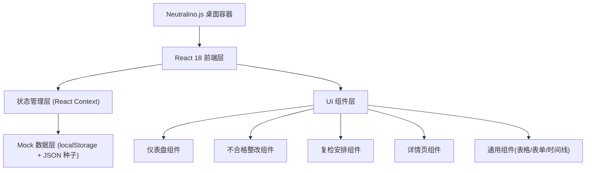
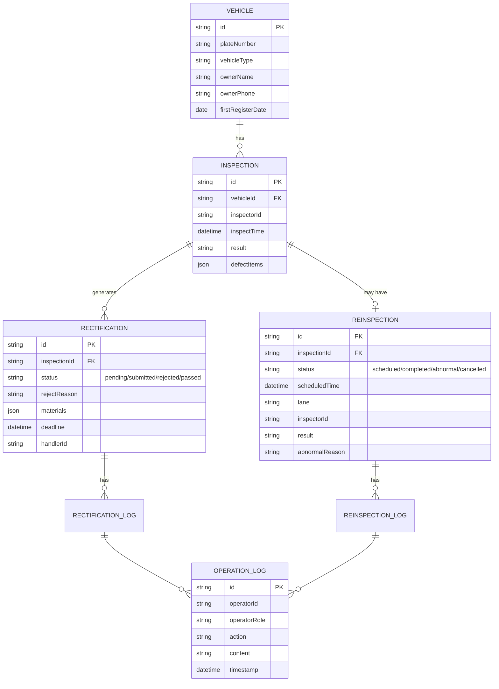

## 1. 架构设计

## 2. 技术选型

- **桌面容器**：Neutralino.js v5（轻量，替代 Electron）
- **前端框架**：React 18 + TypeScript
- **构建工具**：Vite 5
- **样式方案**：TailwindCSS 3 + CSS 变量（主题）
- **路由**：React Router v6（HashRouter，适配 Neutralino 文件协议）
- **图标**：Lucide React
- **数据层**：localStorage 持久化 + 内置 JSON mock 数据（无后端）
- **状态管理**：React Context + useReducer，按业务域拆分
- **表单**：React Hook Form + 原生 HTML 校验

## 3. 路由定义

| 路由 | 页面 | 说明 |
|------|------|------|
| `/` | 首页仪表盘 | 默认页，显示待办、风险、最近变更 |
| `/rectification` | 不合格整改 | 整改列表、批量录入、处理动作 |
| `/reinspection` | 复检安排 | 复检调度、历史回看、异常处理 |
| `/vehicle/:id` | 车辆详情 | 档案、时间线、附件 |

## 4. 数据模型

### 4.1 实体关系

### 4.2 角色与权限数据

应用内通过模拟登录切换角色（接车员/receiver、检测员/inspector、审核员/auditor），权限在 Context 层判断。

### 4.3 mock 数据分布

- 车辆：15 条，覆盖轿车、货车、客车
- 检测记录：20 条，其中不合格 12 条
- 整改任务：12 条，含待处理 3、已提交 2、被驳回 2（含补录）、已通过 5
- 复检安排：8 条，含待安排 2、已安排 2、已完成 3、异常 1
- 操作日志：按流程自动生成

首页故意留有空白/待处理区域，不全是满状态。
