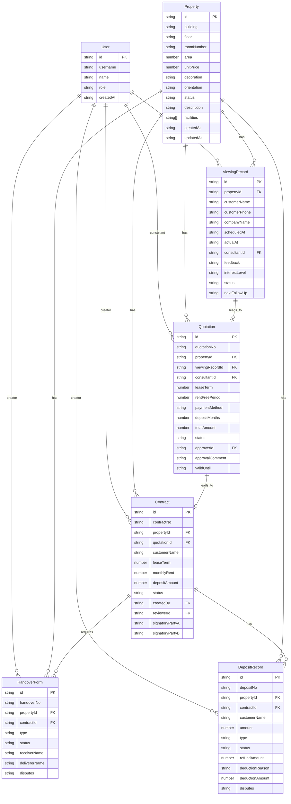

## 1. 架构设计

```mermaid
flowchart TB
    subgraph "前端 React 18"
        "LoginPage"
        "MainLayout"
        "Dashboard"
        "PropertyList/Detail"
        "ViewingList/Detail"
        "QuotationList/Detail"
        "ContractList/Detail"
        "HandoverList/Detail"
        "DepositList/Detail"
        "OperationLogs"
    end

    subgraph "后端 Express 4"
        "AuthRoutes"
        "PropertyRoutes"
        "ViewingRoutes"
        "QuotationRoutes"
        "ContractRoutes"
        "HandoverRoutes"
        "DepositRoutes"
        "LogRoutes"
    end

    subgraph "数据层"
        "内存数据库\nMap + Array"
        "种子数据\nseedData.ts"
    end

    subgraph "工具层"
        "状态机\nstatusMachine.ts"
        "操作日志\noperationLogger.ts"
        "JWT认证\nauth.ts"
    end

    "前端 React 18" -->|"Axios HTTP"| "后端 Express 4"
    "后端 Express 4" -->|"读写"| "数据层"
    "后端 Express 4" -->|"调用"| "工具层"
```

## 2. 技术说明

- 前端：React@18 + antd@5 + zustand@4 + axios + react-router-dom@6 + vite@5
- 后端：Express@4 + TypeScript + JWT + bcryptjs + uuid
- 数据库：内存数据库（Map + Array），种子数据初始化
- 认证：JWT Token，角色权限控制（rental_consultant / operation_manager / finance）

## 3. 路由定义

| 路由 | 用途 |
|------|------|
| /login | 登录页 |
| /dashboard | 工作台 |
| /properties | 房源列表 |
| /properties/:id | 房源详情 |
| /viewings | 看房记录列表 |
| /viewings/:id | 看房记录详情 |
| /quotations | 报价单列表 |
| /quotations/:id | 报价单详情 |
| /contracts | 合同列表 |
| /contracts/:id | 合同详情 |
| /handover | 交接单列表 |
| /handover/:id | 交接单详情 |
| /deposits | 押金记录列表 |
| /deposits/:id | 押金记录详情 |
| /logs | 操作日志 |

## 4. API 定义

### 4.1 认证 API

```
POST /api/auth/login          → { user, token }
POST /api/logout              → 200
GET  /api/auth/me             → User
GET  /api/auth/demo-accounts  → DemoAccount[]
```

### 4.2 房源 API

```
GET    /api/properties                          → Property[]
GET    /api/properties/:id                      → Property & { logs }
POST   /api/properties                          → Property
PUT    /api/properties/:id                      → Property
POST   /api/properties/:id/transition           → Property
GET    /api/properties/:id/available-transitions → StatusTransition[]
GET    /api/properties/:id/related              → { viewings, quotations, contracts, handovers, deposits }
GET    /api/properties/statistics/summary        → Statistics
```

### 4.3 看房 API

```
GET    /api/viewings          → ViewingRecord[]
GET    /api/viewings/:id      → ViewingRecord & { property, logs }
POST   /api/viewings          → ViewingRecord
PUT    /api/viewings/:id      → ViewingRecord
POST   /api/viewings/:id/complete → ViewingRecord
POST   /api/viewings/:id/cancel   → ViewingRecord
```

### 4.4 报价 API

```
GET    /api/quotations           → Quotation[]
GET    /api/quotations/:id       → Quotation & { property, viewing, logs }
POST   /api/quotations           → Quotation
PUT    /api/quotations/:id       → Quotation
POST   /api/quotations/:id/submit  → Quotation
POST   /api/quotations/:id/approve → Quotation
POST   /api/quotations/:id/reject  → Quotation
```

### 4.5 合同 API

```
GET    /api/contracts                → Contract[]
GET    /api/contracts/:id            → Contract & { property, quotation, logs }
POST   /api/contracts                → Contract
PUT    /api/contracts/:id            → Contract
POST   /api/contracts/:id/submit-review → Contract
POST   /api/contracts/:id/approve    → Contract
POST   /api/contracts/:id/reject     → Contract
POST   /api/contracts/:id/sign       → Contract
```

### 4.6 交接 API

```
GET    /api/handover                → HandoverForm[]
GET    /api/handover/:id            → HandoverForm & { property, contract, logs }
POST   /api/handover                → HandoverForm
PUT    /api/handover/:id            → HandoverForm
POST   /api/handover/:id/sign-receiver → HandoverForm
POST   /api/handover/:id/complete     → HandoverForm
```

### 4.7 押金 API

```
GET    /api/deposits                        → DepositRecord[]
GET    /api/deposits/:id                    → DepositRecord & { property, contract, logs }
POST   /api/deposits                        → DepositRecord
POST   /api/deposits/:id/confirm-payment    → DepositRecord
POST   /api/deposits/:id/start-refund       → DepositRecord
POST   /api/deposits/:id/confirm-refund     → DepositRecord
POST   /api/deposits/:id/deduct             → DepositRecord
POST   /api/deposits/:id/dispute            → DepositRecord
GET    /api/deposits/statistics/summary      → Statistics
```

### 4.8 日志 API

```
GET /api/logs                          → { list, total, page, pageSize, totalPages }
GET /api/logs/entity/:type/:id         → OperationLog[]
GET /api/logs/timeline/:type/:id       → TimelineEvent[]
```

## 5. 服务端架构图

```mermaid
flowchart LR
    "Controller\nRoutes" --> "Middleware\nAuth + Roles"
    "Middleware\nAuth + Roles" --> "Business Logic\nRoute Handlers"
    "Business Logic\nRoute Handlers" --> "Database\nMemory Map"
    "Business Logic\nRoute Handlers" --> "StatusMachine\n状态校验"
    "Business Logic\nRoute Handlers" --> "OperationLogger\n操作留痕"
```

## 6. 数据模型

### 6.1 数据模型定义



### 6.2 状态枚举

**PropertyStatus**: vacant → viewing_scheduled → viewing_completed → quotation_pending → quotation_submitted → quotation_approved → contract_drafting → contract_reviewing → contract_signed → handover_pending → handover_completed → occupied → checkout_pending → checkout_completed

**QuotationStatus**: draft → submitted → approved / rejected / expired

**ContractStatus**: draft → under_review → approved / rejected → signed / terminated

**HandoverStatus**: pending / in_progress → completed / disputed

**DepositStatus**: unpaid → paid → refunding → refunded / deducted / disputed

## 7. 实现计划

### 7.1 已完成

- 后端全部 API 路由和业务逻辑
- 数据库和种子数据
- 状态机、操作日志、认证中间件
- 前端：LoginPage、Dashboard、PropertyList、PropertyDetail、MainLayout

### 7.2 待实现前端页面

1. ViewingList - 看房记录列表
2. ViewingDetail - 看房记录详情
3. QuotationList - 报价单列表
4. QuotationDetail - 报价单详情（含报价明细、审批操作）
5. ContractList - 合同列表
6. ContractDetail - 合同详情（含条款、审核签署）
7. HandoverList - 交接单列表
8. HandoverDetail - 交接单详情（含物品清单、签字区）
9. DepositList - 押金记录列表
10. DepositDetail - 押金记录详情（含结算操作）
11. OperationLogs - 操作日志页面

### 7.3 启动命令

```bash
# 后端启动
cd backend && npm install && npm run dev
# 服务运行在 http://localhost:3001

# 前端启动
cd frontend && npm install && npm run dev
# 服务运行在 http://localhost:5173
```

### 7.4 演示账号

| 角色 | 用户名 | 密码 |
|------|--------|------|
| 租赁顾问 | consultant | 123456 |
| 运营经理 | manager | 123456 |
| 财务 | finance | 123456 |
