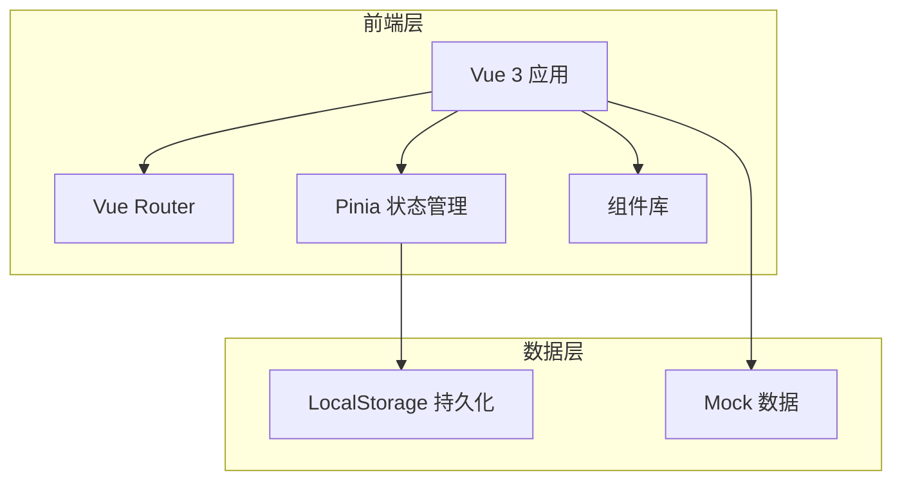

# 翻译公司译员分配与术语维护系统 - 技术架构文档

## 1. 架构设计



## 2. 技术说明
- **前端框架**：Vue 3 + Composition API
- **构建工具**：Vite
- **路由管理**：Vue Router 4
- **状态管理**：Pinia
- **UI组件**：自定义组件 + Tailwind CSS
- **数据持久化**：LocalStorage（原型演示用）
- **图标**：Heroicons / Lucide Vue

## 3. 路由定义
| 路由路径 | 页面名称 | 功能描述 |
|---------|---------|---------|
| `/` | 工作台首页 | 重定向到 /dashboard |
| `/dashboard` | 工作台首页 | 状态看板、待办列表 |
| `/assignments` | 译员分配页 | 分配列表、批量操作 |
| `/assignments/:id` | 分配详情页 | 单个分配的完整信息 |
| `/terminology` | 术语维护页 | 术语列表、回看功能 |
| `/terminology/:id` | 术语详情页 | 术语维护详情 |

## 4. 数据模型

### 4.1 译员分配(Assignment)
```typescript
interface Assignment {
  id: string
  projectName: string
  sourceLanguage: string
  targetLanguage: string
  translatorId: string
  translatorName: string
  reviewerId?: string
  reviewerName?: string
  status: 'pending' | 'assigned' | 'in_progress' | 'reviewing' | 'rejected' | 'completed'
  deadline: string
  createdAt: string
  updatedAt: string
  history: HistoryRecord[]
  terminologyIds: string[]
}

interface HistoryRecord {
  id: string
  action: string
  operator: string
  operatorRole: 'project_manager' | 'translator' | 'reviewer'
  timestamp: string
  remark: string
  fromStatus?: string
  toStatus?: string
}
```

### 4.2 术语维护(Terminology)
```typescript
interface Terminology {
  id: string
  assignmentId: string
  sourceTerm: string
  targetTerm: string
  status: 'pending' | 'approved' | 'rejected' | 'updated'
  createdAt: string
  updatedAt: string
  versions: TerminologyVersion[]
  history: HistoryRecord[]
}

interface TerminologyVersion {
  id: string
  sourceTerm: string
  targetTerm: string
  updatedBy: string
  updatedAt: string
  remark: string
}
```

### 4.3 用户(User)
```typescript
interface User {
  id: string
  name: string
  role: 'project_manager' | 'translator' | 'reviewer'
  avatar?: string
}
```

## 5. 组件结构

```
src/
├── components/
│   ├── common/
│   │   ├── StatusBadge.vue        # 状态标签组件
│   │   ├── ActionButton.vue       # 操作按钮组件
│   │   ├── Timeline.vue           # 时间线组件
│   │   └── Modal.vue              # 模态框组件
│   ├── assignment/
│   │   ├── AssignmentList.vue     # 分配列表组件
│   │   ├── AssignmentCard.vue     # 分配卡片组件
│   │   └── BatchActions.vue       # 批量操作组件
│   ├── terminology/
│   │   ├── TerminologyList.vue    # 术语列表组件
│   │   ├── TerminologyCard.vue    # 术语卡片组件
│   │   └── HistoryModal.vue       # 历史回看弹窗
│   └── layout/
│       ├── Sidebar.vue            # 侧边导航栏
│       └── Header.vue             # 顶部导航栏
├── views/
│   ├── Dashboard.vue              # 工作台首页
│   ├── Assignments.vue            # 译员分配页
│   ├── AssignmentDetail.vue       # 分配详情页
│   ├── Terminology.vue           # 术语维护页
│   └── TerminologyDetail.vue     # 术语详情页
├── stores/
│   ├── assignment.ts              # 分配状态管理
│   ├── terminology.ts            # 术语状态管理
│   └── user.ts                   # 用户状态管理
├── data/
│   └── mockData.ts               # 模拟数据
└── router/
    └── index.ts                  # 路由配置
```

## 6. 关键功能实现

### 6.1 状态流转
```typescript
const statusTransitions = {
  pending: ['assigned'],
  assigned: ['in_progress'],
  in_progress: ['reviewing'],
  reviewing: ['rejected', 'completed'],
  rejected: ['reviewing'],
  completed: []
}
```

### 6.2 批量操作
- 使用复选框选择多个项目
- 批量操作栏显示已选数量
- 批量分配：打开弹窗选择译员
- 批量驳回：填写统一驳回原因
- 批量通过：确认后更新所有选中项状态

### 6.3 操作留痕
- 每次状态变更自动记录到 history 数组
- 记录包含：操作类型、操作人、时间戳、备注
- 详情页使用时间线组件展示历史记录

### 6.4 数据持久化
- 使用 Pinia store 管理状态
- 使用 localStorage 插件持久化数据
- 页面刷新后数据不丢失

## 7. 样例数据初始化

系统启动时自动初始化以下样例数据：

1. **用户数据**：3个项目经理、5个译员、2个审校
2. **译员分配数据**：10条不同状态的分配记录
3. **术语维护数据**：20条术语记录，关联到分配
4. **历史记录**：每条分配至少5条操作记录

样例数据包含真实的驳回、补录场景，用于演示完整流程。