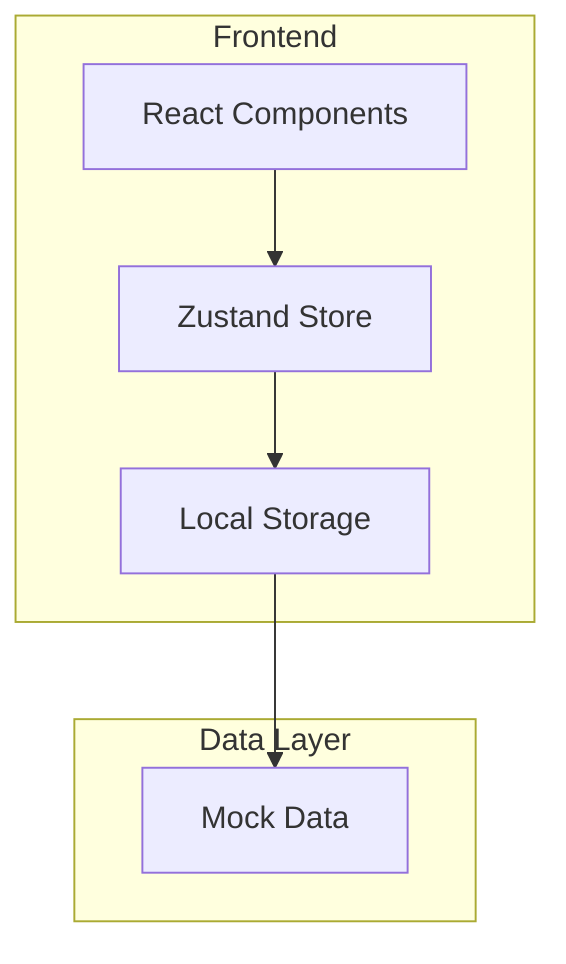
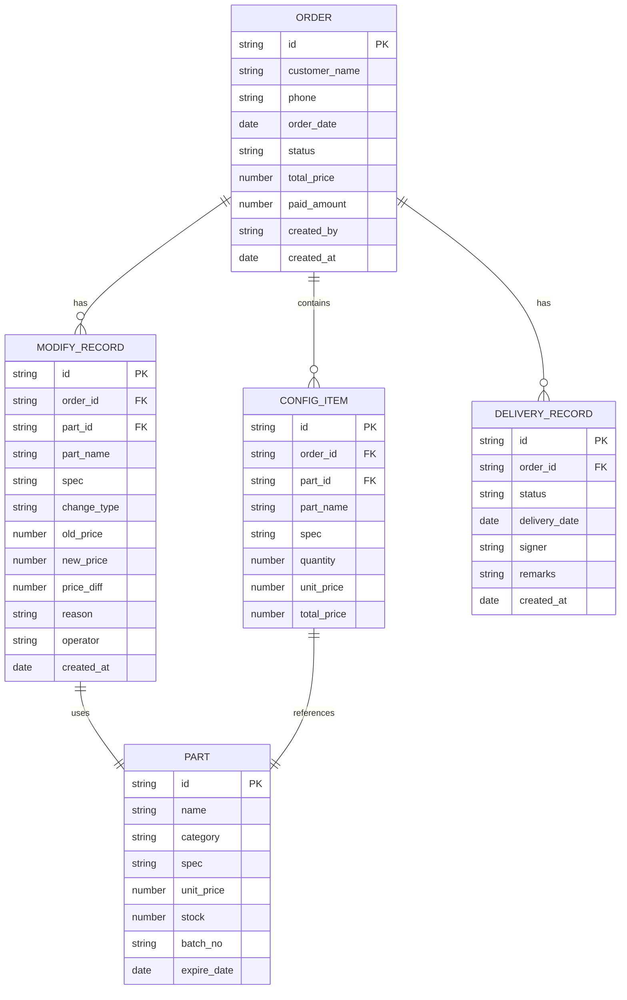

## 1. Architecture Design

## 2. Technology Description
- Frontend: React@18 + tailwindcss@3 + vite
- Initialization Tool: vite-init
- Backend: None (本地数据)
- State Management: Zustand
- UI Components: Custom components + Lucide icons
- Data Storage: LocalStorage for persistence

## 3. Route Definitions
| Route | Purpose |
|-------|---------|
| / | 订单列表页 |
| /orders/:id | 订单详情页 |
| /orders/:id/modify | 改配记录页 |
| /orders/:id/pricing | 差价复核页 |
| /orders/:id/delivery | 交付验收页 |
| /parts | 配件管理页 |

## 4. Data Model

### 4.1 Data Model Definition

### 4.2 Data Definition Language

#### Order Table (订单表)
| Field | Type | Description |
|-------|------|-------------|
| id | string | 订单唯一标识 |
| customer_name | string | 客户姓名 |
| phone | string | 联系电话 |
| order_date | date | 下单日期 |
| status | string | 订单状态 (待确认/待装机/已交付/返修中) |
| total_price | number | 总金额 |
| paid_amount | number | 已付金额 |
| created_by | string | 创建人 |
| created_at | date | 创建时间 |

#### ConfigItem Table (配置项表)
| Field | Type | Description |
|-------|------|-------------|
| id | string | 配置项唯一标识 |
| order_id | string | 关联订单ID |
| part_id | string | 配件ID |
| part_name | string | 配件名称 |
| spec | string | 规格型号 |
| quantity | number | 数量 |
| unit_price | number | 单价 |
| total_price | number | 总价 |

#### ModifyRecord Table (改配记录表)
| Field | Type | Description |
|-------|------|-------------|
| id | string | 改配记录唯一标识 |
| order_id | string | 关联订单ID |
| part_id | string | 配件ID |
| part_name | string | 配件名称 |
| spec | string | 规格型号 |
| change_type | string | 变更类型 (升级/降级/替换) |
| old_price | number | 原价格 |
| new_price | number | 新价格 |
| price_diff | number | 差价 |
| reason | string | 变更原因 |
| operator | string | 操作人 |
| created_at | date | 创建时间 |

#### Part Table (配件表)
| Field | Type | Description |
|-------|------|-------------|
| id | string | 配件唯一标识 |
| name | string | 配件名称 |
| category | string | 分类 (CPU/内存/显卡/主板/电源/硬盘) |
| spec | string | 规格型号 |
| unit_price | number | 单价 |
| stock | number | 库存数量 |
| batch_no | string | 批次号 |
| expire_date | date | 质保到期日期 |

#### DeliveryRecord Table (交付记录表)
| Field | Type | Description |
|-------|------|-------------|
| id | string | 交付记录唯一标识 |
| order_id | string | 关联订单ID |
| status | string | 状态 (待交付/已交付/返修) |
| delivery_date | date | 交付日期 |
| signer | string | 签收人 |
| remarks | string | 备注 |
| created_at | date | 创建时间 |

## 5. Core Components
- Layout: 布局组件，包含导航和侧边栏
- OrderList: 订单列表组件
- OrderDetail: 订单详情组件
- ModifyRecord: 改配记录组件
- PricingReview: 差价复核组件
- DeliveryCheck: 交付验收组件
- PartsManager: 配件管理组件

## 6. State Management
使用 Zustand 管理全局状态：
- orders: 订单数据
- parts: 配件数据
- currentUser: 当前用户信息
- selectedOrder: 当前选中的订单
