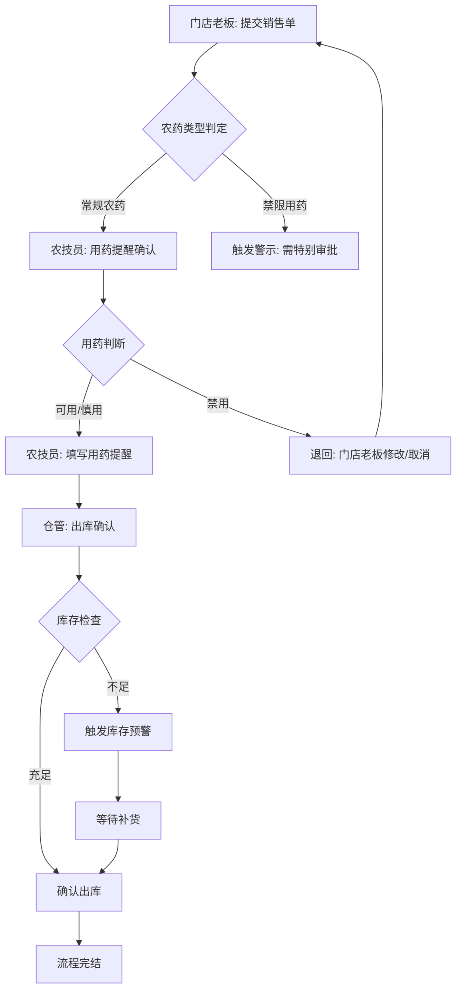
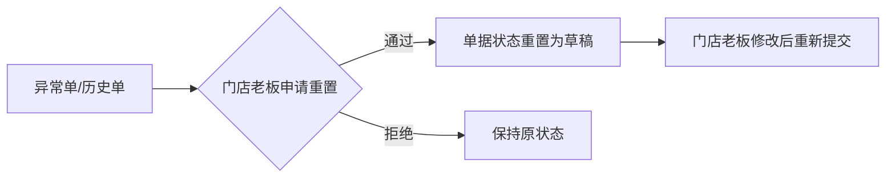

# 农资门店-农药销售与用药提醒系统 PRD

## 1. 产品概述

[用最多2行描述项目概述]
针对农资门店的农药销售流程管理、用药提醒确认和库存协同系统，解决赊账难催、禁限用药提醒弱、季节备货不准的问题。

- **解决问题**：门店老板、农技员、仓管三人协作时流程不透明、异常处理无留痕、临时追问进度靠嘴
- **目标用户**：农资门店老板（决策者）、农技员（技术判断）、仓管（库存执行）
- **核心价值**：销售与提醒流程可视化，异常自动触发退回或提醒，季节备货有数据支撑

---

## 2. 核心功能

### 2.1 用户角色

| 角色 | 职责 | 操作边界 |
|------|------|----------|
| 门店老板 | 提交销售单、确认赊账、查看进度 | 提交销售单、赊账确认、查看所有流程状态 |
| 农技员 | 确认用药提醒、判定禁限用药、处理异常用药申请 | 确认/退回用药提醒、查看待确认列表 |
| 仓管 | 确认出库、查看库存预警、季节备货建议 | 出库确认、库存查询、备货建议查看 |

**交接规则**：
- 农药销售单由**门店老板**提交，状态变为"待农技员确认用药提醒"
- 农技员确认或退回后，状态变为"待仓管出库"或"退回门店老板修改"
- 仓管确认出库后，流程完结，所有操作留痕

### 2.2 功能模块

#### 模块一：农药销售提交流程（门店老板）
- **销售单提交**：选择农药、填写数量、选择客户（赊账/现结）、填写用药目的
- **赊账登记**：选择赊账客户、填写赊账金额、预计还款日期
- **提交后状态**：自动推送至农技员待确认队列

#### 模块二：用药提醒确认流程（农技员）
- **待确认列表**：显示所有待确认的销售单
- **用药判断**：根据农药种类和用药目的，给出"可用"/"慎用"/"禁用"判断
- **提醒内容**：填写用药注意事项、浓度配比、安全间隔期等
- **退回功能**：如信息不全或存在用药风险，退回给门店老板补充

#### 模块三：出库确认流程（仓管）
- **待出库列表**：显示农技员已确认的销售单
- **库存扣减**：确认出库后自动扣减库存
- **库存不足处理**：库存不足时触发预警，流程暂停等待补货

#### 模块四：用药提醒回看
- **时间轴展示**：每个销售单的完整处理历史（提交→农技员确认→仓管出库）
- **操作留痕**：记录每个节点的操作人、操作时间、处理意见

#### 模块五：数据重置
- **月度数据归档**：每月数据归档，保留记录但标记为历史
- **异常单重置**：异常单（退回、取消）可由门店老板重置后重新提交

#### 模块六：筛选与统计
- **多维度筛选**：按时间、客户、农药类型、状态筛选
- **赊账统计**：赊账汇总、逾期提醒
- **季节备货建议**：基于历史销售数据生成备货建议

### 2.3 页面清单

| 页面名称 | 归属角色 | 核心功能 |
|----------|----------|----------|
| 销售单提交页 | 门店老板 | 新建销售单、选择农药/客户、提交 |
| 销售单列表页 | 门店老板 | 查看所有销售单状态、筛选、重置异常单 |
| 用药确认页 | 农技员 | 待确认列表、用药判断、填写提醒、退回 |
| 用药确认历史页 | 农技员 | 已确认单据回看 |
| 出库确认页 | 仓管 | 待出库列表、确认出库、库存不足处理 |
| 库存管理页 | 仓管 | 库存查询、预警、备货建议 |
| 用药提醒回看页 | 全部角色 | 时间轴展示完整流程 |
| 赊账管理页 | 门店老板 | 赊账列表、逾期预警、还款登记 |

---

## 3. 核心流程

### 3.1 主流程：农药销售与用药提醒



### 3.2 异常流程

**异常样例 1：农药销售但库存不足**
```
触发条件：仓管确认出库时，库存数量 < 销售数量
预期行为：
  - 流程暂停，状态变为"库存不足待补货"
  - 自动通知门店老板和仓管
  - 门店老板可选择：取消销售、部分出库、或等待补货
  - 补货后仓管重新确认
```

**异常样例 2：赊账逾期未还**
```
触发条件：赊账超过预计还款日期
预期行为：
  - 自动标红显示逾期赊账
  - 门店老板提交新销售单时，提示该客户有逾期赊账
  - 需先还款或门店老板确认才能继续赊账
```

**异常样例 3：禁用农药被提交销售**
```
触发条件：门店老板提交了禁用类农药销售
预期行为：
  - 农技员确认页面显示红色警示
  - 农技员只能选择"确认禁用-退回"或"特殊情况说明"
  - 退回后门店老板需修改农药类型或取消
```

**异常样例 4：销售单信息不全被退回**
```
触发条件：农技员发现用药目的不明或缺少关键信息
预期行为：
  - 退回原因自动记录
  - 门店老板收到退回通知
  - 门店老板修改后重新提交，历史记录保留
```

### 3.5 数据重置流程



---

## 4. 用户界面设计

### 4.1 设计风格
- **色调**：农业绿色系为主（#2D5016 深绿、#8BC34A 亮绿），搭配警示橙（#FF9800）和警告红（#E53935）
- **字体**：思源黑体（中文）/Roboto（英文），标题粗体，正文常规
- **布局**：卡片式布局，左侧导航栏，右侧内容区
- **图标**：线性图标风格，简约清晰
- **状态颜色**：
  - 待处理：蓝色 #2196F3
  - 处理中：橙色 #FF9800
  - 已完成：绿色 #4CAF50
  - 异常/退回：红色 #E53935
  - 逾期：深红色 #C62828

### 4.2 页面设计概览

| 页面名称 | 核心模块 | UI 元素 |
|----------|----------|----------|
| 销售单提交页 | 农药选择器、客户选择器、赊账开关、表单验证 | 绿色主题、卡片布局、步骤指示器 |
| 销售单列表页 | 状态标签、筛选栏、操作按钮 | 表格布局、行状态颜色区分、操作按钮组 |
| 用药确认页 | 待确认卡片、用药判断单选、提醒文本框 | 卡片堆叠、退回红色边框、确认绿色边框 |
| 出库确认页 | 库存信息展示、出库按钮、库存不足警示 | 库存进度条、预警弹窗 |
| 用药提醒回看页 | 时间轴组件、详情折叠面板 | 时间轴线条、节点图标、操作人头像 |
| 赊账管理页 | 赊账列表、逾期标红、还款按钮 | 表格、行颜色渐变、快捷操作 |

### 4.3 响应式设计
- 桌面优先，支持移动端查看
- 关键流程（提交、确认）支持移动端操作

### 4.4 交互细节
- 表单提交后：按钮显示 loading → 成功 toast → 跳转列表
- 退回操作：弹出确认框，填写退回原因，必填
- 库存不足：页面顶部红色横幅警示，支持一键通知

---

## 5. 边界约束

### 5.1 前后端边界
- **前端**：React + TailwindCSS，负责页面渲染、用户交互、表单验证、状态展示
- **后端**：Express + SQLite（轻量级本地数据库），负责业务逻辑、数据持久化、状态流转
- **数据存储**：本地 SQLite 文件，支持数据导出为 CSV/Excel

### 5.2 状态管理
- 销售单状态：草稿 → 待确认 → 确认中 → 待出库 → 已完成 / 已退回 / 已取消 / 库存不足
- 所有状态流转必须记录操作人、时间、意见

### 5.3 权限控制
- 门店老板：可提交、查看所有、重置异常单
- 农技员：只可确认/退回自己待确认的单据
- 仓管：只可操作自己待出库的单据

---

## 6. 非功能性需求

- 数据本地存储，不依赖外部网络
- 支持断网操作，恢复后自动同步状态
- 关键操作需二次确认（如删除、退回）
- 赊账逾期超过 30 天自动提醒
