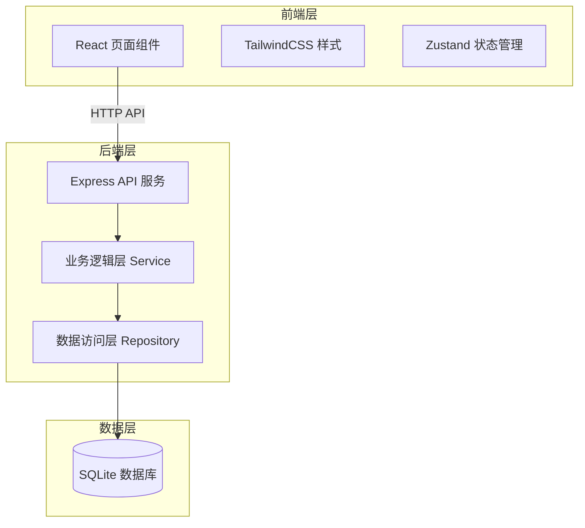
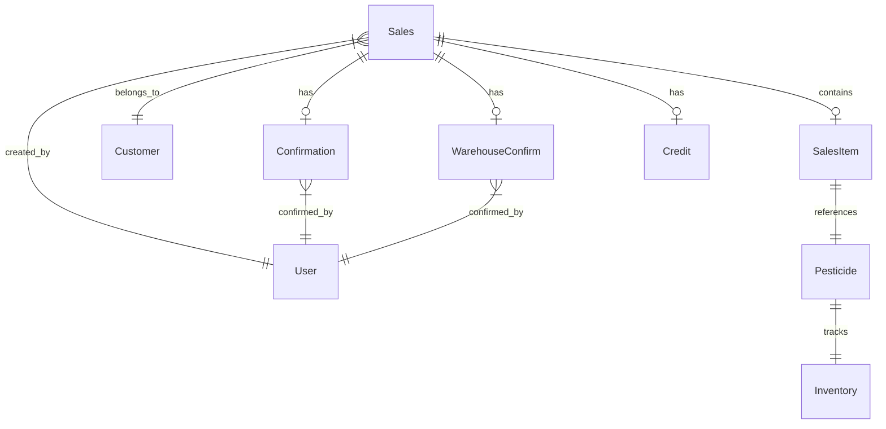
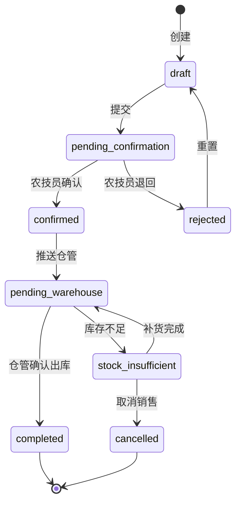

# 农资门店-农药销售与用药提醒系统 技术架构文档

## 1. 架构设计



---

## 2. 技术选型

| 层级 | 技术 | 版本 |
|------|------|------|
| 前端框架 | React | 18.x |
| 构建工具 | Vite | 5.x |
| CSS 框架 | TailwindCSS | 3.x |
| 状态管理 | Zustand | 4.x |
| 前端路由 | React Router | 6.x |
| 后端框架 | Express | 4.x |
| 数据库 | better-sqlite3 | 最新稳定版 |
| 前后端通信 | REST API | JSON |

---

## 3. 路由定义

### 3.1 前端路由

| 路由 | 页面名称 | 访问角色 |
|------|----------|----------|
| `/` | 登录页 | 全部 |
| `/dashboard` | 仪表盘首页 | 全部 |
| `/sales/new` | 销售单提交页 | 门店老板 |
| `/sales/list` | 销售单列表页 | 门店老板 |
| `/confirmation/list` | 用药确认列表页 | 农技员 |
| `/confirmation/:id` | 用药确认详情页 | 农技员 |
| `/warehouse/list` | 出库确认列表页 | 仓管 |
| `/warehouse/:id` | 出库确认详情页 | 仓管 |
| `/inventory` | 库存管理页 | 仓管 |
| `/trace/:id` | 用药提醒回看页 | 全部 |
| `/credit` | 赊账管理页 | 门店老板 |

### 3.2 后端 API

| 方法 | 路由 | 功能 | 请求体 | 响应 |
|------|------|------|--------|------|
| GET | /api/sales | 获取销售单列表 | query: status, date, customerId | Sales[] |
| POST | /api/sales | 创建销售单 | SalesInput | Sales |
| PUT | /api/sales/:id | 更新销售单 | Partial<SalesInput> | Sales |
| POST | /api/sales/:id/submit | 提交销售单 | - | Sales |
| POST | /api/sales/:id/reset | 重置异常单 | - | Sales |
| POST | /api/sales/:id/confirm | 农技员确认 | ConfirmationInput | Sales |
| POST | /api/sales/:id/reject | 农技员退回 | RejectInput | Sales |
| POST | /api/sales/:id/warehouse-confirm | 仓管出库确认 | - | Sales |
| GET | /api/inventory | 获取库存列表 | query: pesticideId | Inventory[] |
| PUT | /api/inventory/:id | 更新库存 | Partial<Inventory> | Inventory |
| GET | /api/credit | 获取赊账列表 | query: status | Credit[] |
| POST | /api/credit/:id/repay | 还款登记 | RepayInput | Credit |

---

## 4. 数据模型

### 4.1 实体关系图



### 4.2 数据定义语言（DDL）

```sql
-- 用户表
CREATE TABLE users (
    id TEXT PRIMARY KEY,
    name TEXT NOT NULL,
    role TEXT NOT NULL CHECK (role IN ('owner', 'technician', 'warehouse')),
    created_at DATETIME DEFAULT CURRENT_TIMESTAMP
);

-- 客户表（农户档案）
CREATE TABLE customers (
    id TEXT PRIMARY KEY,
    name TEXT NOT NULL,
    phone TEXT,
    address TEXT,
    credit_limit REAL DEFAULT 0,
    created_at DATETIME DEFAULT CURRENT_TIMESTAMP
);

-- 农药表
CREATE TABLE pesticides (
    id TEXT PRIMARY KEY,
    name TEXT NOT NULL,
    type TEXT NOT NULL CHECK (type IN ('常规', '限用', '禁用')),
    unit TEXT NOT NULL,
    description TEXT,
    created_at DATETIME DEFAULT CURRENT_TIMESTAMP
);

-- 库存表
CREATE TABLE inventory (
    id TEXT PRIMARY KEY,
    pesticide_id TEXT NOT NULL REFERENCES pesticides(id),
    quantity REAL NOT NULL DEFAULT 0,
    warning_threshold REAL DEFAULT 10,
    updated_at DATETIME DEFAULT CURRENT_TIMESTAMP
);

-- 销售单主表
CREATE TABLE sales (
    id TEXT PRIMARY KEY,
    customer_id TEXT NOT NULL REFERENCES customers(id),
    created_by TEXT NOT NULL REFERENCES users(id),
    status TEXT NOT NULL DEFAULT 'draft' CHECK (status IN ('draft', 'pending_confirmation', 'confirmed', 'pending_warehouse', 'completed', 'rejected', 'cancelled', 'stock_insufficient')),
    total_amount REAL NOT NULL DEFAULT 0,
    is_credit INTEGER NOT NULL DEFAULT 0,
    created_at DATETIME DEFAULT CURRENT_TIMESTAMP,
    updated_at DATETIME DEFAULT CURRENT_TIMESTAMP
);

-- 销售单明细
CREATE TABLE sales_items (
    id TEXT PRIMARY KEY,
    sales_id TEXT NOT NULL REFERENCES sales(id),
    pesticide_id TEXT NOT NULL REFERENCES pesticides(id),
    quantity REAL NOT NULL,
    unit_price REAL NOT NULL,
    subtotal REAL NOT NULL
);

-- 农技员确认记录
CREATE TABLE confirmations (
    id TEXT PRIMARY KEY,
    sales_id TEXT NOT NULL REFERENCES sales(id),
    confirmed_by TEXT NOT NULL REFERENCES users(id),
    result TEXT NOT NULL CHECK (result IN ('available', 'caution', 'prohibited')),
    reminder TEXT,
    comments TEXT,
    created_at DATETIME DEFAULT CURRENT_TIMESTAMP
);

-- 仓管确认记录
CREATE TABLE warehouse_confirms (
    id TEXT PRIMARY KEY,
    sales_id TEXT NOT NULL REFERENCES sales(id),
    confirmed_by TEXT NOT NULL REFERENCES users(id),
    status TEXT NOT NULL CHECK (status IN ('confirmed', 'partial', 'insufficient')),
    actual_quantity REAL,
    comments TEXT,
    created_at DATETIME DEFAULT CURRENT_TIMESTAMP
);

-- 赊账记录
CREATE TABLE credits (
    id TEXT PRIMARY KEY,
    sales_id TEXT NOT NULL REFERENCES sales(id),
    customer_id TEXT NOT NULL REFERENCES customers(id),
    amount REAL NOT NULL,
    repaid_amount REAL DEFAULT 0,
    due_date DATE NOT NULL,
    status TEXT NOT NULL DEFAULT 'pending' CHECK (status IN ('pending', 'partial', 'repaid', 'overdue')),
    created_at DATETIME DEFAULT CURRENT_TIMESTAMP,
    updated_at DATETIME DEFAULT CURRENT_TIMESTAMP
);

-- 操作日志（用于留痕）
CREATE TABLE operation_logs (
    id TEXT PRIMARY KEY,
    entity_type TEXT NOT NULL,
    entity_id TEXT NOT NULL,
    action TEXT NOT NULL,
    operator_id TEXT NOT NULL REFERENCES users(id),
    details TEXT,
    created_at DATETIME DEFAULT CURRENT_TIMESTAMP
);
```

---

## 5. 状态机定义

### 5.1 销售单状态流转



### 5.2 状态权限矩阵

| 当前状态 | 门店老板可执行 | 农技员可执行 | 仓管可执行 |
|----------|---------------|-------------|-----------|
| draft | 提交/删除 | - | - |
| pending_confirmation | 查看/撤回 | 确认/退回 | - |
| confirmed | 查看 | - | 出库确认 |
| pending_warehouse | 查看 | - | 出库确认/标记不足 |
| stock_insufficient | 取消/等待 | 查看 | 补货确认 |
| completed | 查看 | 查看 | 查看 |
| rejected | 重置/修改 | 查看 | - |

---

## 6. 目录结构

```
/
├── package.json
├── vite.config.js
├── tailwind.config.js
├── index.html
├── server/
│   ├── index.js          # Express 入口
│   ├── routes/
│   │   ├── sales.js
│   │   ├── inventory.js
│   │   └── credit.js
│   ├── services/
│   │   ├── salesService.js
│   │   ├── inventoryService.js
│   │   └── creditService.js
│   ├── repositories/
│   │   ├── db.js         # SQLite 连接
│   │   ├── salesRepo.js
│   │   ├── inventoryRepo.js
│   │   └── creditRepo.js
│   └── middleware/
│       └── auth.js
├── src/
│   ├── main.jsx
│   ├── App.jsx
│   ├── index.css
│   ├── stores/
│   │   └── appStore.js   # Zustand store
│   ├── pages/
│   │   ├── Dashboard.jsx
│   │   ├── SalesNew.jsx
│   │   ├── SalesList.jsx
│   │   ├── ConfirmationList.jsx
│   │   ├── ConfirmationDetail.jsx
│   │   ├── WarehouseList.jsx
│   │   ├── WarehouseDetail.jsx
│   │   ├── Inventory.jsx
│   │   ├── Trace.jsx
│   │   └── Credit.jsx
│   ├── components/
│   │   ├── Layout.jsx
│   │   ├── StatusBadge.jsx
│   │   ├── Timeline.jsx
│   │   └── ...
│   └── utils/
│       └── api.js
└── data/
    └── store.db          # SQLite 数据库文件
```

---

## 7. 异常处理规范

### 7.1 API 错误响应格式

```json
{
    "success": false,
    "error": {
        "code": "INVENTORY_INSUFFICIENT",
        "message": "库存不足，当前库存 5 件，需求 10 件",
        "details": {
            "current": 5,
            "required": 10
        }
    }
}
```

### 7.2 异常码定义

| 异常码 | 说明 | HTTP 状态码 |
|--------|------|-------------|
| VALIDATION_ERROR | 参数校验失败 | 400 |
| UNAUTHORIZED | 未授权操作 | 401 |
| FORBIDDEN | 无权限 | 403 |
| NOT_FOUND | 资源不存在 | 404 |
| INVENTORY_INSUFFICIENT | 库存不足 | 409 |
| INVALID_STATUS_TRANSITION | 状态流转无效 | 409 |
| CREDIT_OVERDUE | 赊账逾期 | 409 |
