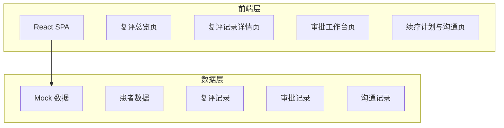
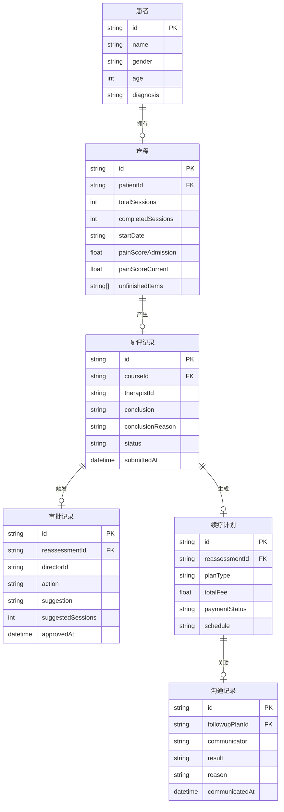

## 1. 架构设计



纯前端架构，使用 Mock 数据模拟完整业务流程，无需后端服务。

## 2. 技术说明

- 前端：React@18 + Tailwind CSS@3 + Vite
- 初始化工具：Vite (react-ts 模板)
- 后端：无（纯前端 Mock 数据）
- 数据库：无（使用内存状态管理 + 初始 Mock 数据）
- 状态管理：React Context + useReducer
- 图表：内联 SVG 绘制迷你趋势图
- 路由：React Router v6

## 3. 路由定义

| 路由 | 用途 |
|------|------|
| / | 复评总览页，状态看板与患者列表 |
| /reassessment/:id | 复评记录详情页，前阶段摘要与复评表单 |
| /approval | 审批工作台页，待审批队列与审批操作 |
| /followup/:id | 续疗计划与沟通页，费用排期与沟通状态 |

## 4. 数据模型

### 4.1 数据模型定义



### 4.2 核心类型定义

```typescript
interface Patient {
  id: string;
  name: string;
  gender: string;
  age: number;
  diagnosis: string;
}

interface Course {
  id: string;
  patientId: string;
  totalSessions: number;
  completedSessions: number;
  startDate: string;
  painScoreAdmission: number;
  painScoreCurrent: number;
  painHistory: { date: string; score: number }[];
  unfinishedItems: string[];
}

type ReassessmentConclusion = '结案' | '续疗' | '转诊' | '换方案';
type ReassessmentStatus = '草稿' | '已提交' | '已审批' | '已退回';

interface ReassessmentRecord {
  id: string;
  courseId: string;
  therapistId: string;
  conclusion: ReassessmentConclusion;
  conclusionReason: string;
  status: ReassessmentStatus;
  functionalScore: number;
  painVAS: number;
  romMeasurement: string;
  subjectiveEvaluation: string;
  submittedAt: string | null;
}

interface ApprovalRecord {
  id: string;
  reassessmentId: string;
  directorId: string;
  action: '通过' | '退回';
  suggestion: string;
  suggestedSessions: number | null;
  notes: string;
  approvedAt: string;
}

type CommunicationResult = '已同意' | '已暂停' | '已拒绝' | '待沟通';

interface FollowupPlan {
  id: string;
  reassessmentId: string;
  planType: string;
  planDetails: string;
  totalFee: number;
  paymentStatus: string;
  scheduleItems: { date: string; session: string }[];
  communicationRecords: {
    id: string;
    communicator: string;
    result: CommunicationResult;
    reason: string;
    communicatedAt: string;
  }[];
}
```
