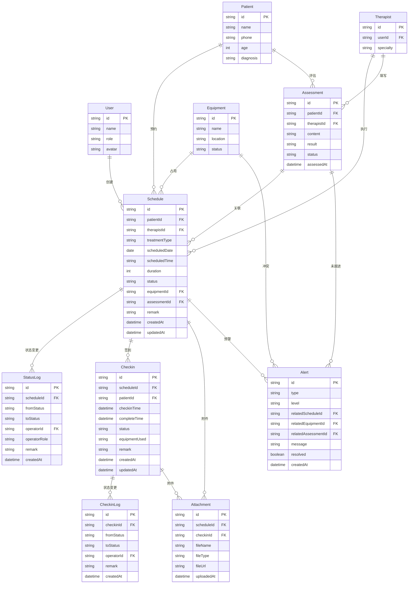

## 1. 架构设计

```mermaid
flowchart TB
    subgraph "前端层"
        "Next.js App Router"
        "React 组件"
        "Tailwind CSS"
        "Zustand 状态管理"
    end
    subgraph "API 层"
        "Next.js Route Handlers"
        "服务端 Actions"
    end
    subgraph "数据层"
        "Prisma ORM"
        "SQLite 数据库"
    end
    "前端层" --> "API 层"
    "API 层" --> "数据层"
```

## 2. 技术说明

- 前端：Next.js 14 (App Router) + React 18 + Tailwind CSS + Zustand
- 后端：Next.js Route Handlers (API Routes)
- 数据库：SQLite + Prisma ORM（轻量部署，便于验收）
- 类型安全：TypeScript 全栈
- 包管理器：npm

## 3. 路由定义

| 路由 | 用途 |
|------|------|
| `/login` | 角色选择登录页 |
| `/therapist/schedule` | 治疗师-排班工作台 |
| `/therapist/schedule/[id]` | 治疗师-排班详情页（含历史回看） |
| `/reception/checkin` | 前台-签到消课工作台 |
| `/reception/checkin/[id]` | 前台-签到消课详情页（含历史回看） |
| `/director/overview` | 主任-复盘预警总览 |
| `/director/schedule` | 主任-全局排班查看与调整 |

## 4. API 定义

### 4.1 排班相关

| 方法 | 路径 | 说明 |
|------|------|------|
| GET | `/api/schedules` | 获取排班列表（支持按角色、日期、状态筛选） |
| GET | `/api/schedules/:id` | 获取排班详情（含历史变更） |
| POST | `/api/schedules` | 创建排班 |
| PATCH | `/api/schedules/:id/status` | 更新排班状态（催/退回/补材料/确认） |
| PATCH | `/api/schedules/:id` | 修改排班信息 |

### 4.2 签到消课相关

| 方法 | 路径 | 说明 |
|------|------|------|
| GET | `/api/checkins` | 获取签到消课列表 |
| GET | `/api/checkins/:id` | 获取签到消课详情（含历史） |
| POST | `/api/checkins` | 办理签到 |
| PATCH | `/api/checkins/:id/complete` | 消课确认 |
| PATCH | `/api/checkins/:id/cancel` | 取消签到 |

### 4.3 预警相关

| 方法 | 路径 | 说明 |
|------|------|------|
| GET | `/api/alerts` | 获取预警列表 |
| PATCH | `/api/alerts/:id/resolve` | 标记预警已处理 |

### 4.4 辅助数据

| 方法 | 路径 | 说明 |
|------|------|------|
| GET | `/api/patients` | 患者列表 |
| GET | `/api/therapists` | 治疗师列表 |
| GET | `/api/equipments` | 器械列表 |
| GET | `/api/assessments` | 评估表列表 |

### 4.5 TypeScript 类型定义

```typescript
type ScheduleStatus = 'PENDING' | 'URGED' | 'CONFIRMED' | 'RETURNED' | 'SUPPLEMENTING' | 'IN_TREATMENT' | 'COMPLETED' | 'CANCELLED'

type CheckinStatus = 'WAITING' | 'CHECKED_IN' | 'IN_TREATMENT' | 'COMPLETED' | 'CANCELLED'

type AlertType = 'PLAN_DISRUPTED' | 'ASSESSMENT_NOT_FOLLOWED' | 'EQUIPMENT_CONFLICT'

type AlertLevel = 'HIGH' | 'MEDIUM' | 'LOW'

type UserRole = 'THERAPIST' | 'RECEPTION' | 'DIRECTOR'

interface Schedule {
  id: string
  patientId: string
  therapistId: string
  treatmentType: string
  scheduledDate: string
  scheduledTime: string
  duration: number
  status: ScheduleStatus
  equipmentId: string | null
  assessmentId: string | null
  remark: string | null
  createdAt: string
  updatedAt: string
}

interface Checkin {
  id: string
  scheduleId: string
  patientId: string
  checkinTime: string | null
  completeTime: string | null
  status: CheckinStatus
  equipmentUsed: string | null
  attachments: string[]
  remark: string | null
  createdAt: string
  updatedAt: string
}

interface Alert {
  id: string
  type: AlertType
  level: AlertLevel
  relatedScheduleId: string | null
  relatedEquipmentId: string | null
  relatedAssessmentId: string | null
  message: string
  resolved: boolean
  createdAt: string
}

interface StatusLog {
  id: string
  scheduleId: string
  fromStatus: ScheduleStatus | null
  toStatus: ScheduleStatus
  operatorId: string
  operatorRole: UserRole
  remark: string | null
  createdAt: string
}
```

## 5. 数据模型

### 5.1 数据模型 ER 图



### 5.2 Prisma Schema DDL

```prisma
datasource db {
  provider = "sqlite"
  url      = "file:./dev.db"
}

generator client {
  provider = "prisma-client-js"
}

model User {
  id        String   @id @default(cuid())
  name      String
  role      String   // THERAPIST | RECEPTION | DIRECTOR
  avatar    String?
  createdAt DateTime @default(now())

  schedules   Schedule[]
  statusLogs  StatusLog[]
  checkinLogs CheckinLog[]
  attachments Attachment[]
  therapist   Therapist?
}

model Patient {
  id        String   @id @default(cuid())
  name      String
  phone     String
  age       Int
  diagnosis String?
  createdAt DateTime @default(now())

  schedules    Schedule[]
  assessments  Assessment[]
  checkins     Checkin[]
}

model Therapist {
  id        String   @id @default(cuid())
  userId    String   @unique
  specialty String?
  user      User     @relation(fields: [userId], references: [id])

  schedules   Schedule[]
  assessments Assessment[]
}

model Assessment {
  id         String   @id @default(cuid())
  patientId  String
  therapistId String
  content    String
  result     String?
  status     String   @default("COMPLETED") // COMPLETED | PENDING
  assessedAt DateTime @default(now())

  patient   Patient   @relation(fields: [patientId], references: [id])
  therapist Therapist @relation(fields: [therapistId], references: [id])
  schedules Schedule[]
  alerts    Alert[]
}

model Equipment {
  id       String @id @default(cuid())
  name     String
  location String?
  status   String @default("AVAILABLE") // AVAILABLE | IN_USE | MAINTENANCE

  schedules Schedule[]
  alerts    Alert[]
}

model Schedule {
  id            String   @id @default(cuid())
  patientId     String
  therapistId   String
  treatmentType String
  scheduledDate String
  scheduledTime String
  duration      Int      @default(30)
  status        String   @default("PENDING")
  equipmentId   String?
  assessmentId  String?
  remark        String?
  createdAt     DateTime @default(now())
  updatedAt     DateTime @updatedAt

  patient     Patient     @relation(fields: [patientId], references: [id])
  therapist   Therapist   @relation(fields: [therapistId], references: [id])
  equipment   Equipment?  @relation(fields: [equipmentId], references: [id])
  assessment  Assessment? @relation(fields: [assessmentId], references: [id])
  statusLogs  StatusLog[]
  checkins    Checkin[]
  attachments Attachment[]
  alerts      Alert[]
}

model StatusLog {
  id           String        @id @default(cuid())
  scheduleId   String
  fromStatus   String?
  toStatus     String
  operatorId   String
  operatorRole String
  remark       String?
  createdAt    DateTime      @default(now())

  schedule Schedule @relation(fields: [scheduleId], references: [id])
  operator User     @relation(fields: [operatorId], references: [id])
}

model Checkin {
  id           String   @id @default(cuid())
  scheduleId   String
  patientId    String
  checkinTime  DateTime?
  completeTime DateTime?
  status       String   @default("WAITING")
  equipmentUsed String?
  remark       String?
  createdAt    DateTime @default(now())
  updatedAt    DateTime @updatedAt

  schedule   Schedule     @relation(fields: [scheduleId], references: [id])
  patient    Patient      @relation(fields: [patientId], references: [id])
  checkinLogs CheckinLog[]
  attachments Attachment[]
}

model CheckinLog {
  id         String   @id @default(cuid())
  checkinId  String
  fromStatus String?
  toStatus   String
  operatorId String
  remark     String?
  createdAt  DateTime @default(now())

  checkin  Checkin @relation(fields: [checkinId], references: [id])
  operator User    @relation(fields: [operatorId], references: [id])
}

model Attachment {
  id         String   @id @default(cuid())
  scheduleId String?
  checkinId  String?
  fileName   String
  fileType   String
  fileUrl    String
  uploadedAt DateTime @default(now())
  uploaderId String

  schedule Schedule? @relation(fields: [scheduleId], references: [id])
  checkin  Checkin?  @relation(fields: [checkinId], references: [id])
  uploader User      @relation(fields: [uploaderId], references: [id])
}

model Alert {
  id                 String   @id @default(cuid())
  type               String   // PLAN_DISRUPTED | ASSESSMENT_NOT_FOLLOWED | EQUIPMENT_CONFLICT
  level              String   // HIGH | MEDIUM | LOW
  relatedScheduleId  String?
  relatedEquipmentId String?
  relatedAssessmentId String?
  message            String
  resolved           Boolean  @default(false)
  createdAt          DateTime @default(now())

  schedule   Schedule?  @relation(fields: [relatedScheduleId], references: [id])
  equipment  Equipment? @relation(fields: [relatedEquipmentId], references: [id])
  assessment Assessment? @relation(fields: [relatedAssessmentId], references: [id])
}
```
