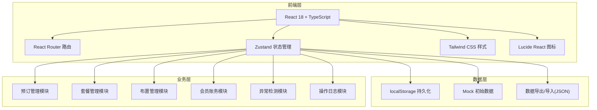
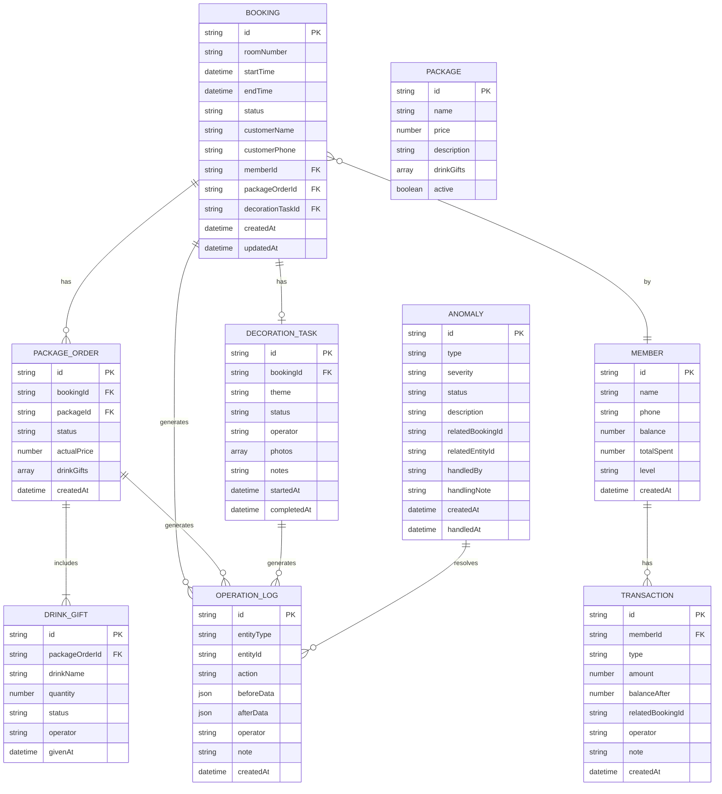

## 1. 架构设计



## 2. 技术描述

- **前端框架**：React 18 + TypeScript
- **构建工具**：Vite 5
- **路由**：react-router-dom 6
- **状态管理**：zustand 4
- **样式**：tailwindcss 3
- **图标**：lucide-react
- **数据持久化**：localStorage
- **后端**：无后端，纯前端本地存储
- **部署**：静态文件部署

## 3. 路由定义

| 路由 | 页面 | 用途 |
|-------|------|------|
| / | Dashboard | 首页控制台，异常预警与今日概览 |
| /bookings | BookingList | 包厢预订列表与时间轴看板 |
| /bookings/:id | BookingDetail | 预订详情页 |
| /packages | PackageList | 生日套餐列表 |
| /packages/process | PackageProcess | 套餐订单处理 |
| /decorations | DecorationBoard | 包厢布置任务看板 |
| /decorations/:id | DecorationDetail | 布置详情与回看 |
| /members | MemberList | 会员列表 |
| /members/:id | MemberDetail | 会员账务明细 |
| /anomalies | AnomalyCenter | 异常中心 |
| /audit | AuditLog | 操作追溯与审计日志 |
| /settings | Settings | 设置与数据管理 |

## 4. 数据模型

### 4.1 数据模型ER图



### 4.2 状态定义

**预订状态 (BookingStatus)**
- `pending` - 待确认
- `confirmed` - 已确认
- `checked_in` - 已到店
- `completed` - 已完成
- `cancelled` - 已取消

**套餐订单状态 (PackageOrderStatus)**
- `created` - 已创建
- `processing` - 处理中
- `completed` - 已完成
- `cancelled` - 已取消

**布置任务状态 (DecorationStatus)**
- `pending` - 待布置
- `in_progress` - 布置中
- `completed` - 已完成
- `restored` - 已还原

**异常类型 (AnomalyType)**
- `room_conflict` - 包厢撞档
- `drink_gift_issue` - 酒水赠送异常
- `member_balance_issue` - 会员账务不平
- `other` - 其他异常

**异常严重程度 (AnomalySeverity)**
- `high` - 高危
- `medium` - 中危
- `low` - 低危

**异常状态 (AnomalyStatus)**
- `open` - 待处理
- `handling` - 处理中
- `resolved` - 已解决
- `ignored` - 已忽略

## 5. 状态管理设计

### 5.1 Store 划分

```typescript
// useBookingStore - 预订管理
// usePackageStore - 套餐管理
// useDecorationStore - 布置管理
// useMemberStore - 会员与账务
// useAnomalyStore - 异常中心
// useAuditStore - 操作日志
// useAuthStore - 当前操作员/角色
```

### 5.2 操作日志机制

每次数据变更时自动记录：
1. 变更前数据快照
2. 变更后数据快照
3. 操作人、操作时间
4. 操作类型（创建/更新/删除）
5. 可选备注

## 6. 简化/轻量实现说明

1. **账号体系**：本地角色切换，无真实用户认证系统
2. **第三方通知**：无短信/微信推送，仅本地异常提示
3. **附件上传**：使用图片URL模拟，无真实文件上传存储
4. **多端同步**：单设备本地存储，无云端同步
5. **打印功能**：无打印模块
