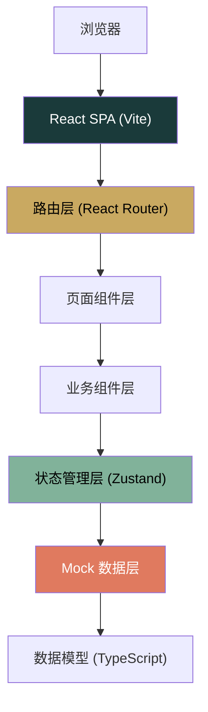
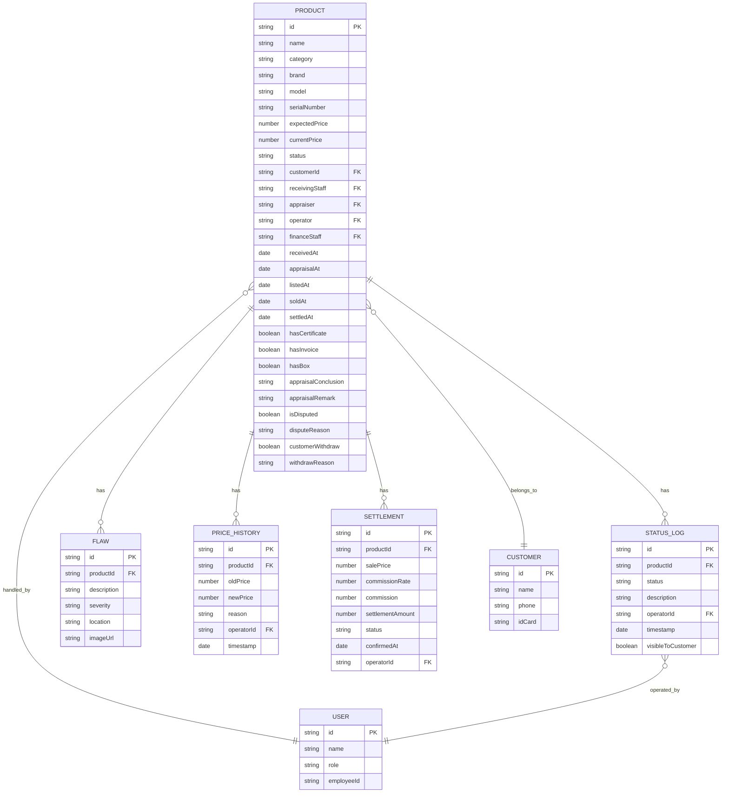

## 1. 架构设计

本项目为纯前端单页应用，采用 Mock 数据模拟完整业务链路。



## 2. 技术栈描述

| 层级 | 技术选择 | 版本 | 说明 |
|------|----------|------|------|
| 构建工具 | Vite | ^5.0.0 | 快速的前端构建工具，热更新 |
| 前端框架 | React | ^18.2.0 | 组件化开发 |
| 语言 | TypeScript | ^5.3.0 | 类型安全 |
| 路由 | React Router | ^6.20.0 | 单页应用路由 |
| 状态管理 | Zustand | ^4.4.0 | 轻量级状态管理 |
| 样式 | TailwindCSS | ^3.4.0 | 原子化CSS |
| UI 组件 | Lucide React | ^0.290.0 | 图标库 |
| 图表 | Recharts | ^2.10.0 | React图表库 |

## 3. 目录结构

```
src/
├── assets/              # 静态资源
│   └── fonts/           # 字体文件
├── components/          # 公共业务组件
│   ├── layout/          # 布局组件
│   │   ├── Sidebar.tsx
│   │   ├── Header.tsx
│   │   └── MainLayout.tsx
│   ├── StatusTimeline.tsx    # 状态时间线
│   ├── StatCard.tsx          # 统计卡片
│   ├── ProductCard.tsx       # 商品卡片
│   ├── CustomerSummary.tsx   # 客户可见摘要
│   └── ActionHistory.tsx     # 操作历史
├── data/                # Mock数据层
│   ├── products.ts      # 商品数据
│   └── users.ts         # 用户数据
├── pages/               # 页面组件
│   ├── Receiving.tsx    # 收货台
│   ├── Appraisal.tsx    # 鉴定区
│   ├── Operations.tsx   # 运营区
│   ├── Finance.tsx      # 财务区
│   └── ProductDetail.tsx # 商品详情
├── store/               # 状态管理
│   └── useProductStore.ts
├── types/               # 类型定义
│   └── index.ts
├── utils/               # 工具函数
│   └── format.ts
├── App.tsx
├── main.tsx
└── index.css
```

## 4. 路由定义

| 路由路径 | 页面名称 | 说明 |
|---------|----------|------|
| `/` | 收货台 | 待鉴定列表、资料缺失列表 |
| `/receiving` | 收货台 | 同上（别名） |
| `/appraisal` | 鉴定区 | 待鉴定队列、鉴定录入 |
| `/operations` | 运营区 | 上架管理、改价审批 |
| `/finance` | 财务区 | 结算确认、结算记录 |
| `/product/:id` | 商品详情 | 状态时间线、操作历史 |

## 5. 数据模型

### 5.1 实体关系图



### 5.2 商品状态枚举

```typescript
type ProductStatus = 
  | 'PENDING_RECEIVE'      // 待收货
  | 'RECEIVED'             // 已收货待鉴定
  | 'MISSING_DOCS'         // 资料缺失
  | 'PENDING_APPRAISAL'    // 待鉴定
  | 'APPRAISING'           // 鉴定中
  | 'APPRAISAL_DISPUTE'    // 鉴定争议
  | 'APPRAISAL_FAILED'     // 鉴定未通过
  | 'APPRAISAL_PASSED'     // 鉴定通过
  | 'CUSTOMER_WITHDRAW'    // 客户要求撤回
  | 'PENDING_LISTING'      // 待上架
  | 'LISTED'               // 已上架
  | 'PRICE_CHANGING'       // 改价审批中
  | 'SOLD'                 // 已成交
  | 'PENDING_SETTLEMENT'   // 待结算
  | 'SETTLED'              // 已结算
  | 'RETURNED'             // 已退回
```

### 5.3 TypeScript 类型定义

```typescript
// 商品基础信息
interface Product {
  id: string;
  name: string;
  category: string;
  brand: string;
  model: string;
  serialNumber: string;
  expectedPrice: number;
  currentPrice: number;
  status: ProductStatus;
  customer: Customer;
  receivedAt: string;
  appraisalAt?: string;
  listedAt?: string;
  soldAt?: string;
  settledAt?: string;
  documents: {
    hasCertificate: boolean;
    hasInvoice: boolean;
    hasBox: boolean;
    missingNotes?: string;
  };
  appraisal?: {
    conclusion: 'genuine' | 'counterfeit' | 'disputed';
    remark: string;
    appraiser: string;
    flaws: Flaw[];
  };
  isDisputed: boolean;
  disputeReason?: string;
  customerWithdraw: boolean;
  withdrawReason?: string;
  priceHistory: PriceHistoryItem[];
  settlement?: Settlement;
  statusLogs: StatusLog[];
  images: string[];
}

interface StatusLog {
  id: string;
  status: ProductStatus;
  description: string;
  operator: string;
  timestamp: string;
  visibleToCustomer: boolean;
}

interface Flaw {
  id: string;
  description: string;
  severity: 'minor' | 'moderate' | 'severe';
  location: string;
  imageUrl?: string;
}

interface PriceHistoryItem {
  id: string;
  oldPrice: number;
  newPrice: number;
  reason: string;
  operator: string;
  timestamp: string;
}

interface Settlement {
  id: string;
  salePrice: number;
  commissionRate: number;
  commission: number;
  settlementAmount: number;
  status: 'pending' | 'confirmed' | 'paid';
  confirmedAt?: string;
  operator?: string;
}

interface Customer {
  id: string;
  name: string;
  phone: string;
  idCard?: string;
}

interface User {
  id: string;
  name: string;
  role: 'receiver' | 'appraiser' | 'operator' | 'finance' | 'cs';
  employeeId: string;
}
```

## 6. 状态管理设计

使用 Zustand 管理全局商品状态：

```typescript
interface ProductState {
  products: Product[];
  loading: boolean;
  getProductById: (id: string) => Product | undefined;
  getProductsByStatus: (status: ProductStatus[]) => Product[];
  getProductsByRole: (role: User['role']) => Product[];
  updateProductStatus: (productId: string, status: ProductStatus, log: Omit<StatusLog, 'id' | 'timestamp'>) => void;
  updateAppraisal: (productId: string, appraisal: Product['appraisal']) => void;
  updatePrice: (productId: string, newPrice: number, reason: string, operator: string) => void;
  confirmSettlement: (productId: string, operator: string) => void;
  markDocsComplete: (productId: string) => void;
  handleWithdraw: (productId: string, reason: string) => void;
}
```

## 7. Mock 数据设计

### 7.1 商品数据场景

共设计 12 条 Mock 商品数据，覆盖以下场景：

| 序号 | 商品名称 | 状态 | 特殊场景 |
|------|---------|------|----------|
| 1 | 爱马仕 Birkin 30 | PENDING_APPRAISAL | 正常待鉴定 |
| 2 | 劳力士 潜航者系列 | MISSING_DOCS | 缺少原厂证书 |
| 3 | 香奈儿 Classic Flap | APPRAISAL_DISPUTE | 鉴定师存疑，需复核 |
| 4 | 路易威登 Neverfull | APPRAISAL_PASSED | 鉴定通过待上架 |
| 5 | 卡地亚 蓝气球手表 | PENDING_LISTING | 已定价待上架 |
| 6 | 迪奥 Lady Dior | LISTED | 已上架销售中 |
| 7 | 古驰 Marmont 手袋 | PRICE_CHANGING | 客户要求降价，改价审批中 |
| 8 | 宝格丽 蛇头包 | CUSTOMER_WITHDRAW | 客户要求撤回寄卖 |
| 9 | 普拉达 Cahier 手袋 | SOLD | 已成交待结算 |
| 10 | 纪梵希 Antigona | PENDING_SETTLEMENT | 成交后结算待确认 |
| 11 | 巴黎世家 City 机车包 | SETTLED | 已完成结算 |
| 12 | 芬迪 Peekaboo | APPRAISAL_FAILED | 鉴定为仿品，已退回 |

### 7.2 状态时间线设计

每个商品包含完整的状态流转记录，其中 `visibleToCustomer` 标记控制哪些状态对客户可见：

- ✅ 对客户可见：已收货、鉴定通过、已上架、已成交、已结算
- ❌ 内部状态：鉴定中、改价审批中、待结算、资料缺失、鉴定争议

## 8. 开发规范

### 8.1 组件命名规范
- 页面组件：大驼峰，如 `Receiving.tsx`
- 业务组件：大驼峰，如 `StatusTimeline.tsx`
- 工具函数：小驼峰，如 `formatCurrency.ts`

### 8.2 样式规范
- 主色调使用 CSS 变量定义在 `index.css`
- 优先使用 Tailwind 原子类
- 复杂动效用 CSS 自定义属性
- 避免使用 `!important`

### 8.3 Git 提交规范
- feat: 新功能
- fix: 修复bug
- refactor: 重构
- style: 样式调整
- docs: 文档更新
