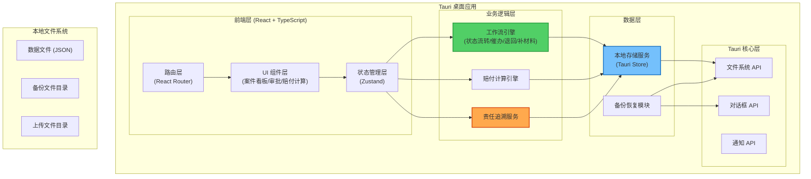
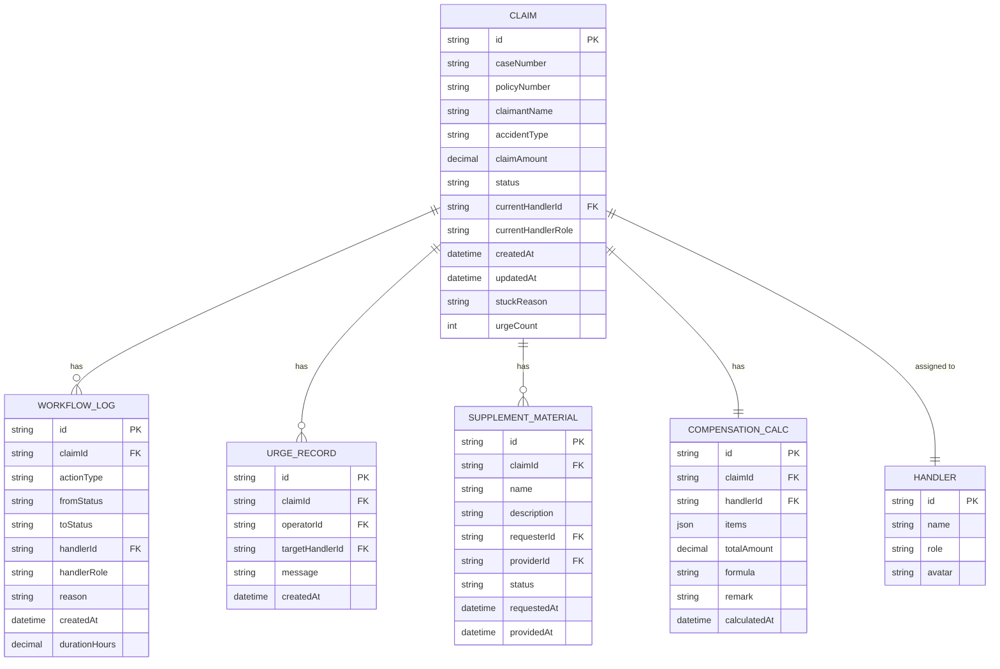

## 1. 架构设计



## 2. 技术描述

### 2.1 技术栈选型

- **前端框架**：React 18 + TypeScript 5
- **桌面容器**：Tauri 2.0（Rust 后端，轻量高性能）
- **构建工具**：Vite 5
- **样式方案**：TailwindCSS 3
- **状态管理**：Zustand 4（轻量、支持持久化）
- **路由管理**：React Router 6
- **UI 组件**：Headless UI（无样式组件，便于自定义）
- **图标库**：Lucide React
- **本地存储**：Tauri Store + IndexedDB（双轨存储）
- **数据格式**：JSON（便于备份和人工查阅）

### 2.2 核心技术决策

1. **Tauri 2.0**：相比 Electron 更轻量，使用系统 WebView，包体小、内存占用低
2. **Zustand**：相比 Redux 更简洁，支持中间件和持久化，适合中小型桌面应用
3. **本地优先**：所有数据存储在本地，不依赖服务器，确保数据安全和离线可用
4. **JSON 数据格式**：便于备份、迁移和人工审计，不使用复杂的数据库
5. **TailwindCSS**：快速构建专业 UI，支持响应式和自定义主题

## 3. 路由定义

| 路由 | 页面 | 用途 |
|------|------|------|
| `/` | 案件看板 | 首页，展示所有案件状态分类和责任三问 |
| `/claim/:id` | 案件详情 | 查看案件基本信息和流转时间线 |
| `/claim/:id/approval` | 核赔审批 | 核赔主管进行审批操作 |
| `/claim/:id/calculation` | 赔付计算 | 理赔专员进行赔付计算，含流转回看 |
| `/data` | 数据管理 | 本地存储状态、备份恢复操作 |
| `/settings` | 设置 | 通知入口、文件上传占位、系统设置 |

## 4. 数据模型

### 4.1 ER 图



### 4.2 类型定义

```typescript
// 案件状态枚举
export type ClaimStatus = 
  | 'pending'      // 待处理
  | 'urged'        // 催办中
  | 'returned'     // 退回待改
  | 'supplement'   // 补材料中
  | 'approved'     // 审批通过
  | 'calculating'  // 赔付计算中
  | 'completed';   // 已完成

// 操作类型枚举
export type ActionType = 
  | 'create'       // 创建
  | 'approve'      // 通过
  | 'reject'       // 退回
  | 'supplement'   // 要求补材料
  | 'material_ok'  // 材料补齐
  | 'start_calc'   // 开始计算
  | 'finish_calc'  // 计算完成
  | 'urge';        // 催办

// 用户角色
export type Role = 'specialist' | 'surveyor' | 'supervisor';

// 处理人
export interface Handler {
  id: string;
  name: string;
  role: Role;
  avatar: string;
}

// 流转记录
export interface WorkflowLog {
  id: string;
  claimId: string;
  actionType: ActionType;
  fromStatus: ClaimStatus | null;
  toStatus: ClaimStatus;
  handlerId: string;
  handlerRole: Role;
  reason: string;
  createdAt: string;
  durationHours: number;
}

// 催办记录
export interface UrgeRecord {
  id: string;
  claimId: string;
  operatorId: string;
  targetHandlerId: string;
  message: string;
  createdAt: string;
}

// 补材料要求
export interface SupplementMaterial {
  id: string;
  claimId: string;
  name: string;
  description: string;
  requesterId: string;
  providerId: string;
  status: 'pending' | 'provided';
  requestedAt: string;
  providedAt?: string;
}

// 赔付计算项目
export interface CalcItem {
  name: string;
  amount: number;
  formula: string;
  remark: string;
}

// 赔付计算
export interface CompensationCalc {
  id: string;
  claimId: string;
  handlerId: string;
  items: CalcItem[];
  totalAmount: number;
  formula: string;
  remark: string;
  calculatedAt: string;
}

// 案件主数据
export interface Claim {
  id: string;
  caseNumber: string;
  policyNumber: string;
  claimantName: string;
  accidentType: string;
  accidentDescription: string;
  claimAmount: number;
  status: ClaimStatus;
  currentHandlerId: string;
  currentHandlerRole: Role;
  createdAt: string;
  updatedAt: string;
  stuckReason: string;
  urgeCount: number;
  workflowLogs: WorkflowLog[];
  urgeRecords: UrgeRecord[];
  supplementMaterials: SupplementMaterial[];
  compensationCalc?: CompensationCalc;
}

// 责任三问数据
export interface ResponsibilityInfo {
  currentHandler: Handler | null;
  stuckPoint: string;
  reason: string;
}

// 备份记录
export interface BackupRecord {
  id: string;
  name: string;
  createdAt: string;
  size: number;
  itemCount: number;
}
```

## 5. 核心模块设计

### 5.1 工作流引擎

```typescript
// 状态流转规则矩阵
const TRANSITION_RULES: Record<ClaimStatus, ClaimStatus[]> = {
  pending: ['approved', 'returned', 'supplement', 'urged'],
  urged: ['approved', 'returned', 'supplement'],
  returned: ['pending', 'urged'],
  supplement: ['pending', 'urged'],
  approved: ['calculating', 'urged'],
  calculating: ['completed', 'urged'],
  completed: []
};

// 操作权限矩阵
const PERMISSION_MATRIX: Record<ActionType, Role[]> = {
  create: ['specialist', 'supervisor'],
  approve: ['supervisor'],
  reject: ['supervisor'],
  supplement: ['supervisor', 'specialist'],
  material_ok: ['specialist', 'surveyor'],
  start_calc: ['specialist'],
  finish_calc: ['specialist'],
  urge: ['supervisor', 'specialist']
};
```

### 5.2 责任追溯算法

```typescript
// 计算案件卡点位置
function calculateStuckPoint(claim: Claim): {
  handler: Handler;
  duration: number;
  reason: string;
}

// 计算各环节时效
function calculateDuration(logs: WorkflowLog[]): Record<string, number>

// 生成责任链报告
function generateResponsibilityChain(claim: Claim): ResponsibilityInfo[]
```

## 6. 本地存储与备份方案

### 6.1 存储结构

```
~/Library/Application Support/insurance-claim-center/
├── data/
│   ├── claims.json          # 案件数据
│   ├── handlers.json        # 处理人数据
│   └── settings.json        # 系统设置
├── backups/                 # 备份文件目录
│   ├── backup-20240115-143022.json
│   └── ...
└── uploads/                 # 上传文件占位目录
```

### 6.2 备份恢复流程

1. **备份**：序列化所有数据为 JSON → 生成时间戳文件名 → 写入 backups 目录 → 记录备份元数据
2. **恢复**：选择备份文件 → 校验数据格式 → 提示确认覆盖 → 恢复数据 → 刷新应用状态
3. **自动备份**：可配置每日自动备份，保留最近 7 个备份文件

### 6.3 数据校验

- 所有操作前校验数据完整性
- 备份文件包含版本号和校验码
- 恢复时执行数据迁移（如有版本差异）
