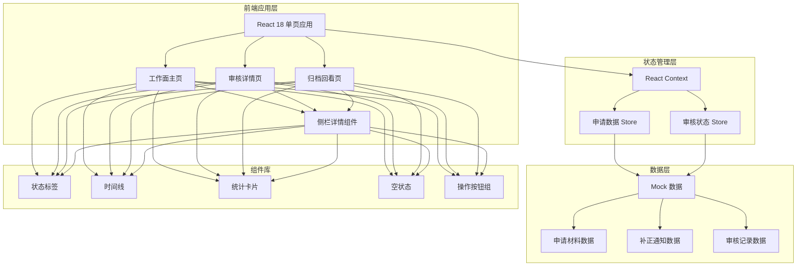
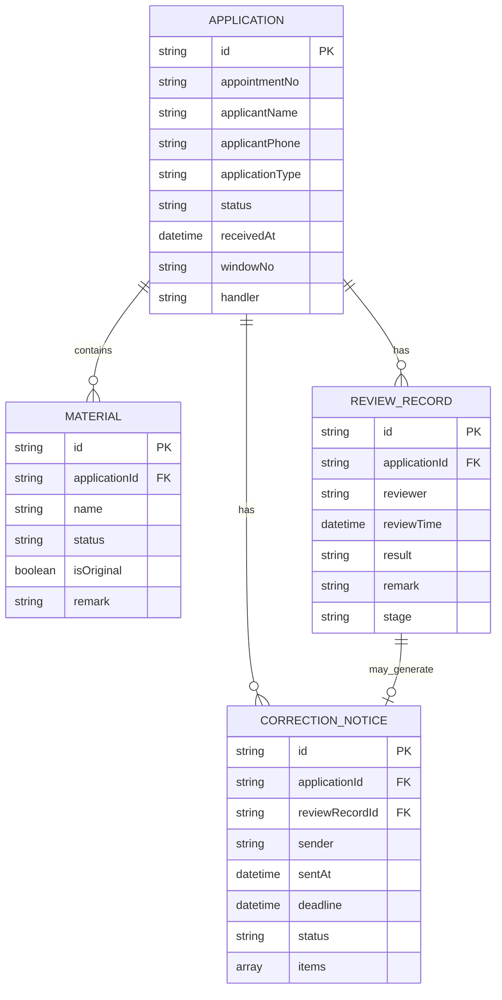

## 1. 架构设计



## 2. 技术描述

- **前端框架**：React@18 + TypeScript
- **构建工具**：Vite@5
- **样式方案**：Tailwind CSS@3
- **图标库**：Lucide React
- **路由**：React Router DOM@6
- **状态管理**：React Context（轻量级，无需 Redux）
- **后端**：无后端，全部使用 Mock 数据
- **数据持久化**：localStorage 模拟（可选）

## 3. 目录结构

```
src/
├── components/          # 通用组件
│   ├── StatCard.tsx     # 统计卡片
│   ├── StatusBadge.tsx  # 状态标签
│   ├── Timeline.tsx     # 时间线
│   ├── EmptyState.tsx   # 空状态
│   ├── Sidebar.tsx      # 侧栏详情
│   └── ApplicationCard.tsx # 申请卡片
├── pages/               # 页面
│   ├── Workbench.tsx    # 工作面主页
│   ├── ReviewDetail.tsx # 审核详情页
│   └── ArchiveView.tsx  # 归档回看页
├── data/                # Mock 数据
│   ├── applications.ts  # 申请数据
│   └── mockData.ts      # 聚合数据导出
├── types/               # 类型定义
│   └── index.ts
├── context/             # 状态管理
│   └── ApplicationContext.tsx
├── App.tsx
├── main.tsx
└── index.css
```

## 4. 路由定义

| 路由 | 页面 | 用途 |
|------|------|------|
| / | 工作面主页 | 待办列表、统计概览、快速筛选 |
| /review/:id | 审核详情页 | 材料审核、补正通知发送、操作处理 |
| /archive | 归档回看页 | 已完成申请列表、历史回溯 |
| /archive/:id | 归档详情 | 完整流程回看、补正记录查看 |

## 5. 数据模型

### 5.1 数据实体关系



### 5.2 申请状态枚举

| 状态值 | 显示文本 | 颜色 |
|--------|----------|------|
| pending | 待审核 | 蓝色 |
| correction | 补正中 | 琥珀色 |
| approved | 已通过 | 绿色 |
| rejected | 已驳回 | 红色 |
| archived | 已归档 | 灰色 |

### 5.3 审核记录阶段

| 阶段 | 说明 | 责任方 |
|------|------|--------|
| receive | 材料接收 | 窗口受理员 |
| review | 公证员审核 | 公证员 |
| correction_sent | 补正通知发送 | 公证员 |
| correction_received | 补正材料接收 | 窗口受理员 |
| final_approve | 最终审核通过 | 公证员 |
| archive | 归档 | 系统自动 |

## 6. Mock 数据设计

### 6.1 样例数据分布

| 样例类型 | 数量 | 说明 |
|----------|------|------|
| 顺利流 | 2 条 | 材料齐全直接通过归档 |
| 问题流 | 3 条 | 需要补正材料，含一次或多次补正 |
| 待审核 | 3 条 | 处于待审核状态 |
| 补正中 | 2 条 | 已发送补正通知待回复 |

### 6.2 真实样例场景

1. **顺利流样例 - 委托公证**：张三，委托公证，材料齐全，一次审核通过
2. **顺利流样例 - 遗嘱公证**：李四，遗嘱公证，材料齐全，一次审核通过
3. **问题流样例 - 继承公证**：王五，继承公证，缺少亲属关系证明，补正后通过
4. **问题流样例 - 合同公证**：赵六，合同公证，材料有误需要更正，二次补正
5. **问题流样例 - 学历公证**：孙七，学历公证，异常情况需说明
