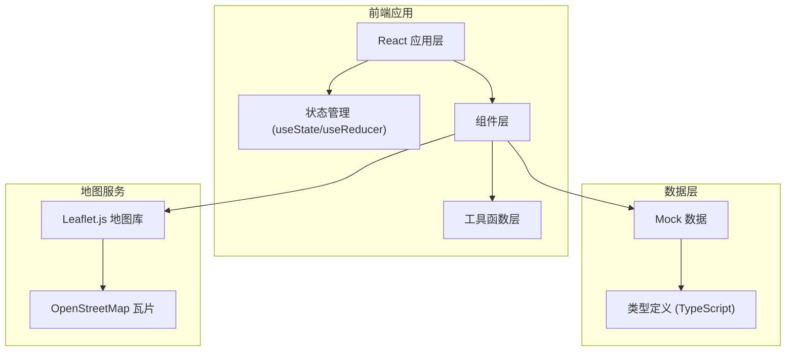

# 共享单车运维系统 技术架构文档

## 1. 架构设计



## 2. 技术描述
- **前端框架**：React 18 + TypeScript
- **构建工具**：Vite 5
- **样式方案**：Tailwind CSS 3
- **地图组件**：Leaflet.js + react-leaflet
- **图标方案**：Lucide React
- **数据方案**：本地 Mock 数据，无后端依赖

## 3. 目录结构
```
src/
├── components/          # 组件目录
│   ├── layout/         # 布局组件
│   ├── complaint/      # 投诉相关组件
│   ├── map/            # 地图相关组件
│   ├── timeline/       # 时间线组件
│   └── common/         # 通用组件
├── data/               # Mock 数据
│   ├── complaints.ts   # 投诉数据
│   └── hotspots.ts     # 热点数据
├── types/              # TypeScript 类型定义
│   └── index.ts
├── utils/              # 工具函数
│   ├── distance.ts     # 距离计算
│   └── format.ts       # 格式化工具
├── hooks/              # 自定义 Hooks
├── App.tsx
├── main.tsx
└── index.css
```

## 4. 路由定义
本项目为单页应用，主要通过组件状态控制视图切换，不使用前端路由。

| 视图 | 触发方式 | 说明 |
|------|---------|------|
| 主工作台 | 默认 | 地图 + 列表双栏布局 |
| 详情抽屉 | 点击列表项/地图点 | 右侧滑出详情面板 |
| 热点面板 | 切换 Tab | 重复投诉点位列表 |

## 5. 数据模型

### 5.1 投诉工单 (Complaint)
```typescript
interface Complaint {
  id: string;
  title: string;
  description: string;
  source: '12345热线' | '城市管理局' | '市民APP' | '巡查发现';
  status: 'pending' | 'assigned' | 'processing' | 'completed' | 'closed';
  priority: 'low' | 'medium' | 'high' | 'urgent';
  location: {
    lat: number;
    lng: number;
    address: string;
    accuracy?: number; // 定位精度（米）
    offset?: boolean;  // 是否存在定位偏移
  };
  bikeId: string;
  createTime: string;
  assignTime?: string;
  arriveTime?: string;
  processTime?: string;
  closeTime?: string;
  assignee?: string;
  photos: {
    before?: string[];
    after?: string[];
  };
  processNote?: string;
  closeReason?: string;
  repeatCount?: number; // 同区域重复投诉次数
  hotspotId?: string;
}
```

### 5.2 热点区域 (Hotspot)
```typescript
interface Hotspot {
  id: string;
  name: string;
  center: { lat: number; lng: number };
  radius: number; // 半径（米）
  complaintCount: number;
  complaintIds: string[];
  trend: 'rising' | 'stable' | 'declining';
}
```

### 5.3 时间线节点 (TimelineNode)
```typescript
interface TimelineNode {
  type: 'report' | 'assign' | 'arrive' | 'process' | 'close';
  title: string;
  description?: string;
  time: string;
  operator?: string;
  completed: boolean;
}
```

## 6. 核心功能实现思路

### 6.1 地图列表联动
- 使用 react-leaflet 渲染地图
- 选中状态通过 props 双向同步
- 点击列表项 → 地图中心点移动 + marker 高亮
- 点击地图 marker → 对应列表项滚动到可视区域 + 高亮

### 6.2 重复点位识别
- 基于经纬度计算两点间距离（Haversine 公式）
- 距离阈值内的投诉归为同一热点
- 热点区域使用热力效果或聚类图标展示

### 6.3 时间线渲染
- 根据工单状态动态生成时间线节点
- 已完成节点显示为实心，进行中显示为脉冲动画
- 时间格式统一处理

### 6.4 照片占位
- 使用 SVG 占位图，区分处理前/处理后
- 上传按钮使用虚线边框样式
- 支持网格布局展示多张照片
