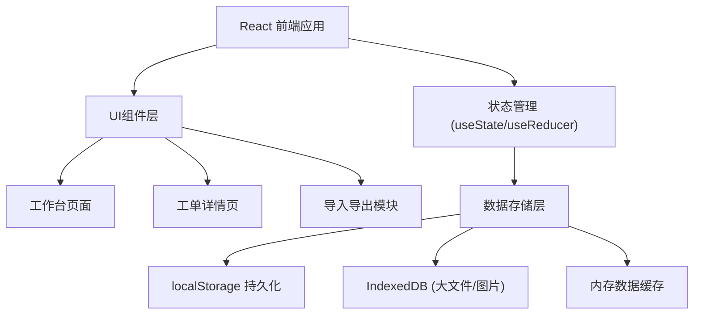
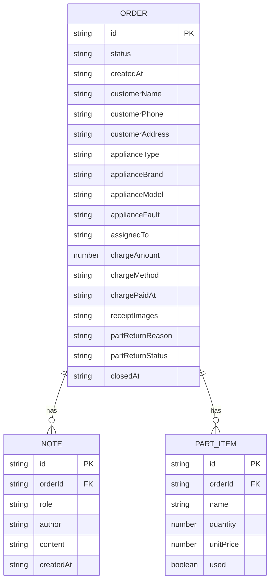
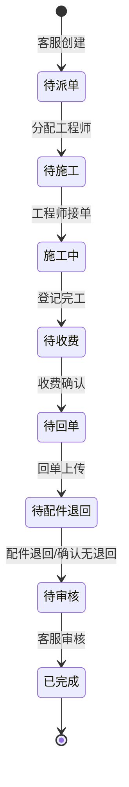

## 1. 架构设计

纯前端单页应用，数据全部存储在浏览器本地（localStorage），支持离线使用，无需后端服务。



## 2. 技术选型

- **前端框架**: React@18 + Vite
- **样式方案**: Tailwind CSS@3
- **路由**: React Router DOM@6
- **图标**: Lucide React
- **数据存储**: localStorage（主数据） + IndexedDB（图片等大文件）
- **导入导出**: SheetJS (xlsx) + 原生 File API
- **语言**: 中文界面

## 3. 目录结构

```
src/
├── components/       # 通用组件
│   ├── Layout.jsx    # 布局组件
│   ├── StatusBadge.jsx  # 状态标签
│   └── Timeline.jsx  # 时间线组件
├── pages/            # 页面
│   ├── Dashboard.jsx # 工作台/待办列表
│   └── OrderDetail.jsx # 工单详情
├── data/             # 数据层
│   ├── store.js      # localStorage 封装
│   ├── mockData.js   # 样例数据
│   └── seed.js       # 初始化数据
├── utils/            # 工具函数
│   ├── format.js     # 格式化函数
│   ├── export.js     # 导出工具
│   └── import.js     # 导入工具
├── hooks/            # 自定义 Hooks
│   └── useOrders.js  # 工单数据 hook
├── App.jsx
├── main.jsx
└── index.css
```

## 4. 路由定义

| 路由 | 页面 | 说明 |
|------|------|------|
| `/` | 工作台 | 待办列表、统计、角色切换 |
| `/order/:id` | 工单详情 | 完整工单信息、操作 |
| `/import` | 导入页面 | 数据导入（可弹层替代） |

## 5. 数据模型

### 5.1 工单 (Order)

```typescript
interface Order {
  id: string;              // 工单编号，如 AS20240601001
  createdAt: string;       // 创建时间
  status: OrderStatus;     // 工单状态
  customer: {              // 客户信息
    name: string;
    phone: string;
    address: string;
  };
  appliance: {             // 家电信息
    type: string;          // 家电类型：空调/冰箱/洗衣机等
    brand: string;         // 品牌
    model: string;         // 型号
    fault: string;         // 故障描述
  };
  assignedTo: string;      // 分配工程师
  parts: PartItem[];       // 配件清单
  charge: {                // 收费信息
    amount: number;        // 金额
    method: string;        // 收费方式：现金/微信/支付宝/转账
    paidAt: string | null; // 收费时间
    confirmedBy: string | null; // 确认人
    confirmedAt: string | null; // 确认时间
  };
  receipt: {               // 电子回单
    images: string[];      // 回单图片 (base64或blob url)
    uploadedAt: string | null;
    confirmedBy: string | null;
    confirmedAt: string | null;
  };
  partReturn: {            // 配件退回
    hasReturn: boolean;
    reason: string;        // 退回原因
    status: 'pending' | 'returned' | 'confirmed';
    returnedAt: string | null;
    confirmedBy: string | null;
  };
  notes: Note[];           // 历史备注
  closedAt: string | null; // 结案时间
}

type OrderStatus = 
  | 'pending_assign'   // 待派单
  | 'pending_work'     // 待施工
  | 'working'          // 施工中
  | 'pending_charge'   // 待收费
  | 'pending_receipt'  // 待回单
  | 'pending_return'   // 待配件退回
  | 'pending_review'   // 待审核
  | 'completed';       // 已完成

interface PartItem {
  id: string;
  name: string;
  quantity: number;
  unitPrice: number;
  used: boolean;       // 是否已使用
}

interface Note {
  id: string;
  role: '客服' | '工程师' | '配件管理员';
  author: string;
  content: string;
  createdAt: string;
}
```

### 5.2 ER图



## 6. 状态流转



## 7. 离线方案

1. **首次加载**：初始化样例数据到 localStorage
2. **所有读写**：通过封装的 store 模块操作 localStorage
3. **图片存储**：用 base64 编码存入 localStorage（小图），大图用 IndexedDB
4. **数据备份**：支持导出 JSON/Excel 文件手动备份
5. **恢复数据**：支持导入备份文件恢复

## 8. 性能考虑

- 工单数据量预期在千级以内，localStorage 完全够用
- 列表分页加载，默认每页 20 条
- 图片压缩后存储，避免 localStorage 超限
- 使用 React.memo 优化列表渲染
