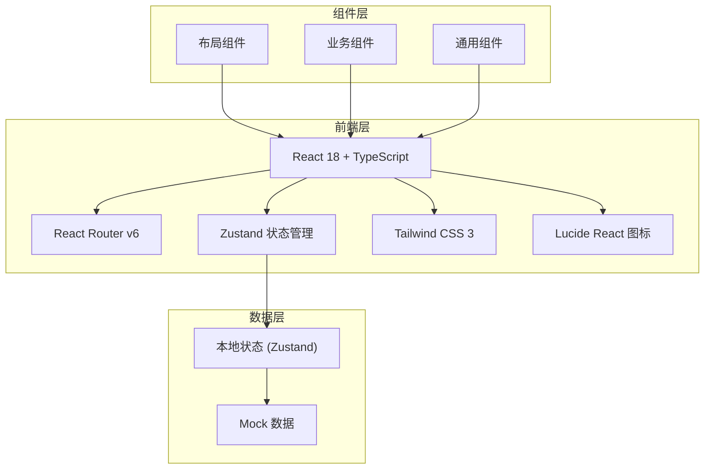
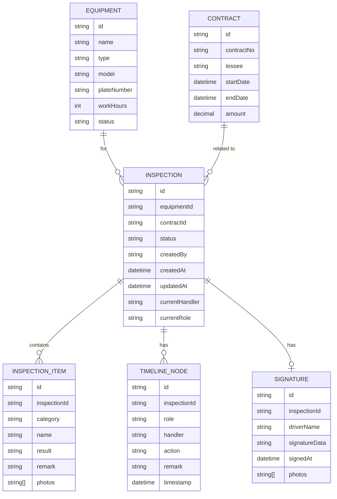

## 1. 架构设计



## 2. 技术描述

- **前端框架**：React 18 + TypeScript
- **构建工具**：Vite 5
- **路由管理**：react-router-dom v6
- **状态管理**：zustand
- **样式方案**：Tailwind CSS 3
- **图标库**：lucide-react
- **数据方案**：Mock 数据（无后端）

## 3. 路由定义

| 路由 | 页面 | 说明 |
|-------|------|------|
| / | 工作台 | 首页，待办/异常/已完成概览 |
| /inspections | 出场验机列表 | 验机单列表、筛选搜索 |
| /inspections/:id | 验机详情 | 验机单详情、处理操作 |
| /inspections/:id/sign | 司机签收 | 司机签字确认页面 |
| /inspections/:id/review | 签收回看 | 历史签收记录查看 |

## 4. 数据模型

### 4.1 数据模型定义



### 4.2 状态枚举

**验机单状态：**
- `pending_manager`：待租赁经理确认
- `pending_dispatch`：待调度分配
- `pending_inspection`：待出场验机
- `inspecting`：验机中
- `pending_repair`：待维修
- `pending_sign`：待司机签收
- `completed`：已完成
- `disputed`：有争议

**角色类型：**
- `manager`：租赁经理
- `dispatcher`：调度员
- `technician`：维修师傅
- `driver`：司机

## 5. 项目结构

```
src/
├── components/          # 通用组件
│   ├── layout/         # 布局组件
│   │   ├── Sidebar.tsx
│   │   ├── Header.tsx
│   │   └── Layout.tsx
│   ├── ui/             # UI 基础组件
│   │   ├── Button.tsx
│   │   ├── Card.tsx
│   │   ├── Badge.tsx
│   │   ├── Tag.tsx
│   │   ├── Input.tsx
│   │   ├── Select.tsx
│   │   ├── Modal.tsx
│   │   └── Timeline.tsx
│   └── business/       # 业务组件
│       ├── InspectionCard.tsx
│       ├── InspectionFilter.tsx
│       ├── InspectionItems.tsx
│       └── SignaturePad.tsx
├── pages/              # 页面组件
│   ├── Dashboard.tsx
│   ├── InspectionList.tsx
│   ├── InspectionDetail.tsx
│   ├── DriverSign.tsx
│   └── SignReview.tsx
├── store/              # 状态管理
│   ├── useInspectionStore.ts
│   └── useUserStore.ts
├── data/               # Mock 数据
│   ├── inspections.ts
│   ├── equipments.ts
│   ├── contracts.ts
│   └── users.ts
├── types/              # TypeScript 类型
│   └── index.ts
├── utils/              # 工具函数
│   ├── date.ts
│   └── status.ts
├── App.tsx
├── main.tsx
└── index.css
```
