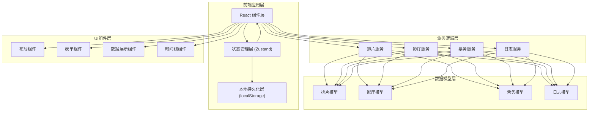
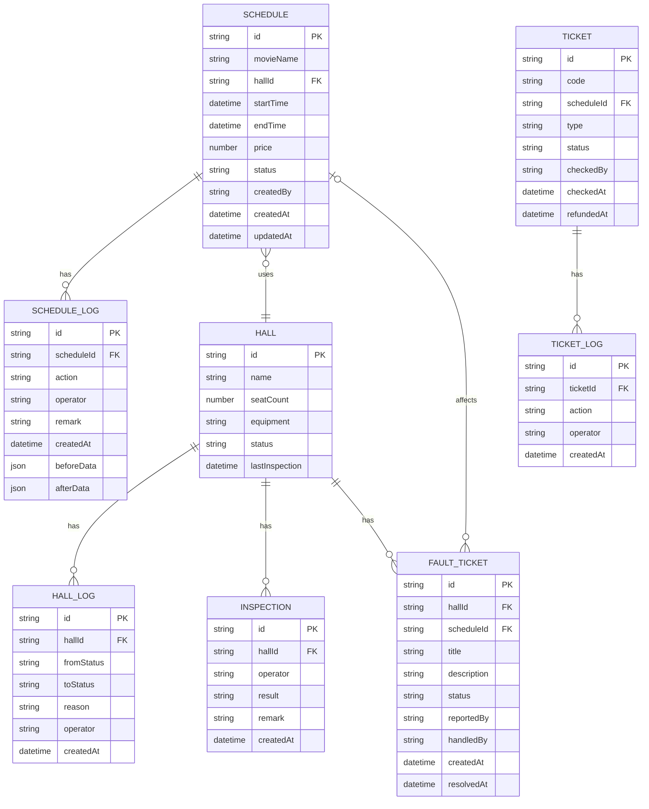

## 1. 架构设计



## 2. 技术描述

- **前端框架**: React@18 + TypeScript
- **构建工具**: Vite@5
- **样式方案**: TailwindCSS@3
- **状态管理**: Zustand@4 + localStorage 持久化
- **路由管理**: React Router Dom@6
- **图标库**: Lucide React
- **日期处理**: date-fns
- **无后端依赖**: 纯前端实现，数据全部本地存储

## 3. 路由定义

| 路由 | 页面 | 用途 |
|------|------|------|
| / | Dashboard | 系统首页，角色选择与概览数据 |
| /schedule | 排片工作台 | 排片列表与新建入口 |
| /schedule/new | 新建排片 | 创建新的排片计划 |
| /schedule/:id | 排片详情 | 查看排片详情、处理操作、历史记录 |
| /hall | 影厅看板 | 影厅状态总览 |
| /hall/:id | 影厅详情 | 影厅信息、巡检记录、故障工单、流转历史 |
| /ticket | 票务中心 | 团体票核销、退票处理 |
| /history | 历史中心 | 全系统操作日志与流转轨迹 |

## 4. 数据模型

### 4.1 数据模型定义



### 4.2 状态枚举定义

**排片状态**:
- `draft`: 草稿
- `pending`: 待审核
- `active`: 生效中
- `adjusting`: 调整中
- `cancelled`: 已取消
- `completed`: 已完成
- `closed`: 已关闭

**影厅状态**:
- `idle`: 空闲
- `screening`: 放映中
- `fault`: 故障
- `maintenance`: 维护中

**故障工单状态**:
- `pending`: 待处理
- `processing`: 处理中
- `resolved`: 已解决
- `closed`: 已关闭

**票务状态**:
- `unused`: 未使用
- `checked`: 已核销
- `refunding`: 退票中
- `refunded`: 已退票

## 5. 核心模块设计

### 5.1 状态管理模块 (Zustand)

```typescript
// store 分层设计
- useScheduleStore: 排片相关状态与操作
- useHallStore: 影厅相关状态与操作
- useTicketStore: 票务相关状态与操作
- useLogStore: 日志与历史记录
- useRoleStore: 当前角色与权限
```

### 5.2 本地持久化方案

使用 Zustand 的 `persist` 中间件，将所有 store 数据持久化到 localStorage：
- 键名前缀: `cinema-ops-*`
- 序列化: JSON.stringify/parse
- 版本控制: 支持数据迁移
- 性能优化: 防抖写入，避免频繁操作

### 5.3 核心服务层

**ScheduleService**:
- createSchedule: 创建排片（含冲突校验）
- updateSchedule: 更新排片信息
- changeHall: 临时换厅操作
- cancelSchedule: 取消排片
- closeSchedule: 关闭归档

**HallService**:
- submitInspection: 提交巡检记录
- createFaultTicket: 创建设备故障工单
- changeHallStatus: 变更影厅状态
- resolveFault: 解决故障工单
- closeFaultTicket: 关闭故障工单

**TicketService**:
- verifyTicket: 验票校验
- checkTicket: 核销票券
- batchCheckTickets: 批量核销
- applyRefund: 申请退票
- approveRefund: 审核退票

**LogService**:
- recordAction: 记录操作日志
- getLogsByEntity: 查询实体相关日志
- generateTimeline: 生成时间线数据

## 6. 项目目录结构

```
src/
├── components/          # 通用组件
│   ├── layout/         # 布局组件
│   ├── form/           # 表单组件
│   ├── timeline/       # 时间线组件
│   ├── status/         # 状态标签组件
│   └── common/         # 通用UI组件
├── pages/              # 页面组件
│   ├── Dashboard/
│   ├── Schedule/
│   ├── Hall/
│   ├── Ticket/
│   └── History/
├── store/              # Zustand 状态管理
│   ├── scheduleStore.ts
│   ├── hallStore.ts
│   ├── ticketStore.ts
│   ├── logStore.ts
│   └── roleStore.ts
├── services/           # 业务逻辑服务
│   ├── scheduleService.ts
│   ├── hallService.ts
│   ├── ticketService.ts
│   └── logService.ts
├── types/              # TypeScript 类型定义
│   ├── schedule.ts
│   ├── hall.ts
│   ├── ticket.ts
│   └── common.ts
├── utils/              # 工具函数
│   ├── storage.ts
│   ├── date.ts
│   └── id.ts
├── data/               # 模拟数据
│   └── mockData.ts
├── App.tsx
├── main.tsx
└── index.css
```
