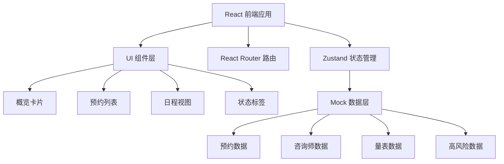

## 1. 架构设计



## 2. 技术描述

- **前端框架**：React@18 + TypeScript
- **构建工具**：Vite@5
- **样式方案**：TailwindCSS@3
- **状态管理**：Zustand@4
- **路由管理**：React Router@6
- **图标库**：Lucide React
- **数据来源**：本地 Mock 数据（无后端）

## 3. 路由定义

| 路由 | 用途 |
|------|------|
| /dashboard | 工作台首页 - 概览和待办事项 |
| /appointments | 预约管理 - 预约列表和改期处理 |
| /triage | 分诊管理 - 待分诊和分配咨询师 |
| /schedule | 排班管理 - 咨询师日程视图 |
| /scales | 量表管理 - 量表状态追踪 |
| /risk | 高风险预警 - 风险个案列表 |

## 4. 数据模型

### 4.1 核心数据类型

```typescript
// 来访者（匿名化）
interface Client {
  id: string;
  anonymousName: string; // 如 "来访者001" 或 "王*"
  visitType: 'initial' | 'followup';
  riskLevel: 'low' | 'medium' | 'high';
}

// 预约
interface Appointment {
  id: string;
  clientId: string;
  clientName: string;
  counselorId: string | null;
  date: string;
  time: string;
  type: 'initial' | 'followup';
  status: 'scheduled' | 'rescheduled' | 'completed' | 'cancelled' | 'pending';
  rescheduleRequest?: {
    reason: string;
    requestedDate: string;
  };
  scaleStatus: 'not_sent' | 'sent' | 'submitted' | 'retest_needed' | 'retest_submitted';
  createdAt: string;
}

// 咨询师
interface Counselor {
  id: string;
  name: string;
  specialty: string[];
  schedule: CounselorSchedule[];
}

// 咨询师排班
interface CounselorSchedule {
  date: string;
  availableSlots: string[];
  bookedSlots: string[];
}

// 待分诊
interface TriageItem {
  id: string;
  appointmentId: string;
  clientName: string;
  intakeNotes: string;
  suggestedCounselors: string[];
  assignedCounselorId: string | null;
  status: 'pending' | 'assigned';
}

// 高风险个案
interface RiskCase {
  id: string;
  appointmentId: string;
  clientName: string;
  counselorName: string;
  riskLevel: 'high' | 'critical';
  riskIndicators: string[];
  supervisorNotes?: string;
  status: 'pending_review' | 'reviewed' | 'action_taken';
  reportedAt: string;
}

// 量表记录
interface ScaleRecord {
  id: string;
  appointmentId: string;
  clientName: string;
  scaleType: string;
  status: 'not_sent' | 'sent' | 'submitted' | 'retest_needed' | 'retest_submitted';
  sentAt?: string;
  submittedAt?: string;
  clientNotified: boolean;
  needsRetest: boolean;
}
```

## 5. 状态管理设计

使用 Zustand 管理全局状态，按功能模块划分：

- `useAppointmentStore` - 预约相关状态和操作
- `useCounselorStore` - 咨询师和排班状态
- `useTriageStore` - 分诊管理状态
- `useRiskStore` - 高风险预警状态
- `useScaleStore` - 量表管理状态

## 6. Mock 数据规范

- 所有来访者名称使用匿名化处理：来访者001、来访者002...
- 生成 15-20 条预约数据，覆盖各种状态
- 包含 3-5 名咨询师，各有专长领域
- 3-5 条待分诊断
- 2-3 条高风险个案
- 量表状态包含：未发送、已发送、已提交、需复测
