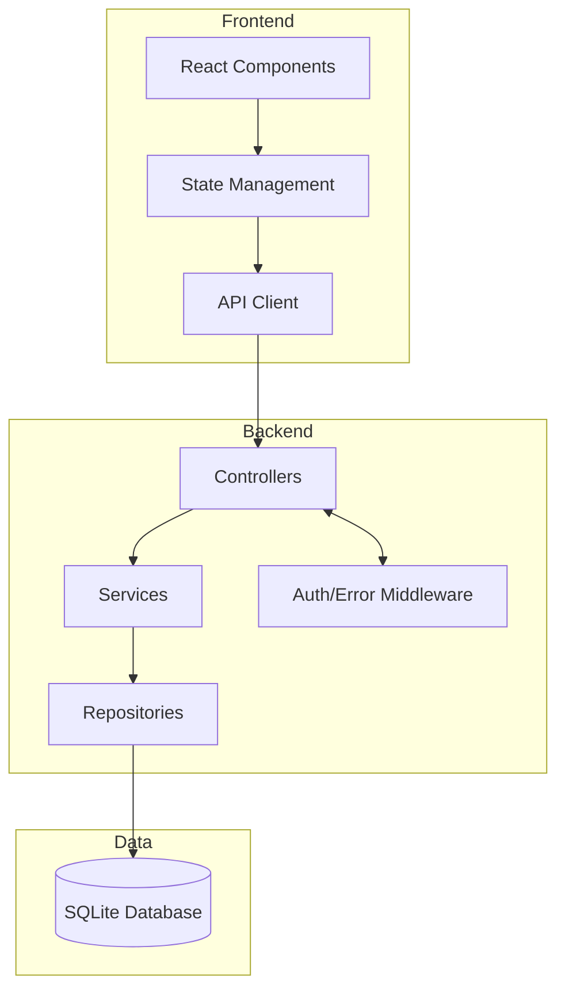
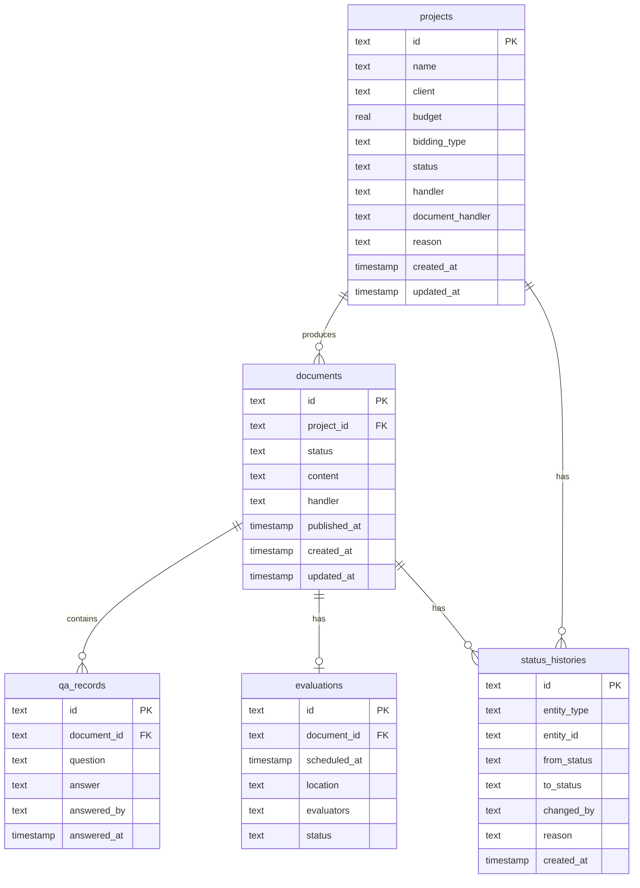

# 招标代理公司-项目立项与文件编制系统 技术架构

## 1. 架构设计



## 2. 技术选型

| 层级 | 技术栈 | 版本 |
|------|--------|------|
| 前端框架 | React | 18.x |
| 构建工具 | Vite | 5.x |
| 样式方案 | TailwindCSS | 3.x |
| 后端框架 | Express | 4.x |
| 数据库 | SQLite | 3.x |
| ORM | better-sqlite3 | - |
| 数据验证 | Zod | - |

## 3. 目录结构

```
/workspace
├── client/                 # 前端应用
│   ├── src/
│   │   ├── components/     # UI组件
│   │   ├── pages/         # 页面
│   │   ├── services/      # API调用
│   │   ├── types/         # TypeScript类型
│   │   ├── hooks/         # 自定义Hook
│   │   ├── stores/        # 状态管理
│   │   ├── utils/         # 工具函数
│   │   └── App.tsx
│   ├── index.html
│   └── package.json
│
├── server/                # 后端应用
│   ├── src/
│   │   ├── controllers/   # 控制器
│   │   ├── services/      # 业务逻辑
│   │   ├── repositories/   # 数据访问
│   │   ├── models/        # 数据模型
│   │   ├── middleware/    # 中间件
│   │   ├── routes/        # 路由定义
│   │   ├── utils/         # 工具函数
│   │   └── index.ts
│   ├── database/          # 数据库文件
│   └── package.json
│
└── package.json           # 根目录
```

## 4. 路由定义

### 4.1 前端路由

| 路径 | 页面 | 权限 |
|------|------|------|
| / | 统一工作台 | 全部角色 |
| /projects | 项目立项列表 | 全部角色 |
| /projects/new | 新建立项 | 项目专员 |
| /projects/:id | 项目立项详情 | 全部角色 |
| /projects/:id/edit | 编辑项目 | 项目专员 |
| /documents | 文件编制列表 | 全部角色 |
| /documents/:id | 文件编制详情 | 全部角色 |

### 4.2 后端API

#### 项目管理

| 方法 | 路径 | 描述 | 请求体 |
|------|------|------|--------|
| GET | /api/projects | 获取项目列表 | ?page&pageSize&status&handler |
| POST | /api/projects | 创建项目 | ProjectCreateDTO |
| GET | /api/projects/:id | 获取项目详情 | - |
| PATCH | /api/projects/:id | 更新项目 | ProjectUpdateDTO |
| PATCH | /api/projects/:id/status | 更新状态 | {status, reason} |
| DELETE | /api/projects/:id | 删除项目 | - |

#### 文件管理

| 方法 | 路径 | 描述 | 请求体 |
|------|------|------|--------|
| GET | /api/documents | 获取文档列表 | ?projectId&status |
| POST | /api/documents | 创建文档 | DocumentCreateDTO |
| GET | /api/documents/:id | 获取文档详情 | - |
| PATCH | /api/documents/:id | 更新文档 | DocumentUpdateDTO |
| POST | /api/documents/:id/qa-records | 添加答疑记录 | QARecordDTO |
| POST | /api/documents/:id/evaluation | 添加评标安排 | EvaluationDTO |

#### 状态历史

| 方法 | 路径 | 描述 |
|------|------|------|
| GET | /api/status-history | 获取状态变更历史 | ?entityType&entityId |

## 5. API 类型定义

### 5.1 项目相关

```typescript
// 项目状态枚举
type ProjectStatus =
  | 'draft'           // 草稿
  | 'initial_review'  // 待初审
  | 're_review'       // 待复审
  | 'approved'        // 立项通过
  | 'rejected';      // 已驳回

// 创建项目 DTO
interface ProjectCreateDTO {
  name: string;
  client: string;
  budget: number;
  biddingType: '公开招标' | '邀请招标' | '竞争性谈判' | '单一来源';
  handler: string;
  documentHandler: string;
  reason: string;  // 必填：为什么立项
}

// 项目响应
interface ProjectResponse {
  id: string;
  name: string;
  client: string;
  budget: number;
  biddingType: string;
  status: ProjectStatus;
  handler: string;
  documentHandler: string;
  reason: string;
  createdAt: string;
  updatedAt: string;
}

// 状态更新 DTO
interface StatusUpdateDTO {
  status: ProjectStatus;
  reason: string;  // 必填：变更原因
}
```

### 5.2 文档相关

```typescript
// 文档状态枚举
type DocumentStatus =
  | 'pending'     // 待编制
  | 'drafting'    // 编制中
  | 'review'      // 待审核
  | 'published'   // 已发布
  | 'rejected';   // 已驳回

// 答疑记录
interface QARecord {
  id: string;
  question: string;
  answer: string;
  answeredBy: string;
  answeredAt: string;
}

// 评标安排
interface Evaluation {
  id: string;
  scheduledAt: string;
  location: string;
  evaluators: string[];
  status: 'pending' | 'completed' | 'cancelled';
}

// 文档响应
interface DocumentResponse {
  id: string;
  projectId: string;
  projectName: string;
  status: DocumentStatus;
  content: string;
  handler: string;
  qaRecords: QARecord[];
  evaluation: Evaluation | null;
  createdAt: string;
  updatedAt: string;
  publishedAt: string | null;
}
```

### 5.3 统一响应格式

```typescript
// 成功响应
interface SuccessResponse<T> {
  success: true;
  data: T;
  pagination?: {
    page: number;
    pageSize: number;
    total: number;
    totalPages: number;
  };
}

// 错误响应
interface ErrorResponse {
  success: false;
  error: {
    code: string;      // 如 PROJECT_001
    message: string;  // 人类可读消息
    details?: any;    // 详细错误信息
  };
}
```

## 6. 数据库设计

### 6.1 ER 图



### 6.2 DDL 语句

```sql
-- 项目表
CREATE TABLE IF NOT EXISTS projects (
    id TEXT PRIMARY KEY,
    name TEXT NOT NULL,
    client TEXT NOT NULL,
    budget REAL NOT NULL,
    bidding_type TEXT NOT NULL,
    status TEXT NOT NULL DEFAULT 'draft',
    handler TEXT NOT NULL,
    document_handler TEXT NOT NULL,
    reason TEXT NOT NULL,
    created_at DATETIME DEFAULT CURRENT_TIMESTAMP,
    updated_at DATETIME DEFAULT CURRENT_TIMESTAMP
);

-- 文档表
CREATE TABLE IF NOT EXISTS documents (
    id TEXT PRIMARY KEY,
    project_id TEXT NOT NULL,
    status TEXT NOT NULL DEFAULT 'pending',
    content TEXT,
    handler TEXT NOT NULL,
    published_at DATETIME,
    created_at DATETIME DEFAULT CURRENT_TIMESTAMP,
    updated_at DATETIME DEFAULT CURRENT_TIMESTAMP,
    FOREIGN KEY (project_id) REFERENCES projects(id)
);

-- 答疑记录表
CREATE TABLE IF NOT EXISTS qa_records (
    id TEXT PRIMARY KEY,
    document_id TEXT NOT NULL,
    question TEXT NOT NULL,
    answer TEXT NOT NULL,
    answered_by TEXT NOT NULL,
    answered_at DATETIME DEFAULT CURRENT_TIMESTAMP,
    FOREIGN KEY (document_id) REFERENCES documents(id)
);

-- 评标安排表
CREATE TABLE IF NOT EXISTS evaluations (
    id TEXT PRIMARY KEY,
    document_id TEXT NOT NULL UNIQUE,
    scheduled_at DATETIME NOT NULL,
    location TEXT NOT NULL,
    evaluators TEXT NOT NULL,
    status TEXT NOT NULL DEFAULT 'pending',
    FOREIGN KEY (document_id) REFERENCES documents(id)
);

-- 状态历史表
CREATE TABLE IF NOT EXISTS status_histories (
    id TEXT PRIMARY KEY,
    entity_type TEXT NOT NULL,
    entity_id TEXT NOT NULL,
    from_status TEXT,
    to_status TEXT NOT NULL,
    changed_by TEXT NOT NULL,
    reason TEXT NOT NULL,
    created_at DATETIME DEFAULT CURRENT_TIMESTAMP
);

-- 索引
CREATE INDEX IF NOT EXISTS idx_projects_status ON projects(status);
CREATE INDEX IF NOT EXISTS idx_projects_handler ON projects(handler);
CREATE INDEX IF NOT EXISTS idx_documents_project_id ON documents(project_id);
CREATE INDEX IF NOT EXISTS idx_documents_status ON documents(status);
CREATE INDEX IF NOT EXISTS idx_status_histories_entity ON status_histories(entity_type, entity_id);
```

## 7. 服务层设计

### 7.1 ProjectService 核心方法

```typescript
class ProjectService {
  // 创建项目（自动设置状态历史）
  create(dto: ProjectCreateDTO): Promise<Project>

  // 获取项目列表（分页+筛选）
  findAll(params: {
    page: number;
    pageSize: number;
    status?: ProjectStatus;
    handler?: string;
  }): Promise<PaginatedResult<Project>>

  // 获取项目详情（含状态历史）
  findById(id: string): Promise<ProjectWithHistory>

  // 更新项目基本信息
  update(id: string, dto: ProjectUpdateDTO): Promise<Project>

  // 状态流转（包含校验）
  updateStatus(
    id: string,
    newStatus: ProjectStatus,
    reason: string,
    userId: string
  ): Promise<Project>

  // 校验状态流转是否合法
  validateStatusTransition(
    currentStatus: ProjectStatus,
    newStatus: ProjectStatus
  ): boolean
}
```

### 7.2 DocumentService 核心方法

```typescript
class DocumentService {
  // 创建文档（从项目继承信息）
  create(projectId: string, handler: string): Promise<Document>

  // 获取文档列表
  findAll(params: {
    projectId?: string;
    status?: DocumentStatus;
  }): Promise<Document[]>

  // 获取文档详情（含答疑记录和评标安排）
  findById(id: string): Promise<DocumentDetail>

  // 更新文档内容
  update(id: string, dto: DocumentUpdateDTO): Promise<Document>

  // 添加答疑记录
  addQARecord(
    documentId: string,
    dto: QARecordDTO
  ): Promise<QARecord>

  // 安排评标
  scheduleEvaluation(
    documentId: string,
    dto: EvaluationDTO
  ): Promise<Evaluation>

  // 发布文档
  publish(id: string): Promise<Document>
}
```

## 8. 错误处理

### 8.1 错误码映射

```typescript
const ErrorCodes = {
  PROJECT_NOT_FOUND: { code: 'PROJECT_001', message: '项目不存在' },
  INVALID_STATUS_TRANSITION: { code: 'PROJECT_002', message: '状态流转不合规' },
  MISSING_REQUIRED_FIELD: { code: 'PROJECT_003', message: '缺少必填字段' },
  PERMISSION_DENIED: { code: 'PROJECT_004', message: '无权限操作' },
  DOCUMENT_NOT_FOUND: { code: 'DOCUMENT_001', message: '文档不存在' },
  DOCUMENT_PUBLISHED: { code: 'DOCUMENT_002', message: '文档已发布，无法编辑' },
  UNAUTHORIZED: { code: 'AUTH_001', message: '未登录' },
  FORBIDDEN: { code: 'AUTH_002', message: '权限不足' },
};
```

### 8.2 状态流转规则

```typescript
const ProjectStatusTransitions: Record<ProjectStatus, ProjectStatus[]> = {
  draft: ['initial_review'],
  initial_review: ['re_review', 'draft'],      // 驳回回草稿
  re_review: ['approved', 'initial_review'],    // 驳回回初审
  approved: [],                                 // 终态
  rejected: ['draft'],                         // 可重新提交
};

const DocumentStatusTransitions: Record<DocumentStatus, DocumentStatus[]> = {
  pending: ['drafting'],
  drafting: ['review', 'pending'],
  review: ['published', 'drafting'],           // 驳回回编制中
  published: [],                               // 终态
  rejected: ['drafting'],                      // 可重新提交
};
```

## 9. Mock 数据

系统初始化时将创建以下测试数据：

### 9.1 项目数据

| ID | 项目名称 | 状态 | 立项负责人 | 文件编制负责人 |
|----|---------|------|-----------|--------------|
| P001 | XX单位办公楼装修招标 | approved | 张三 | 李四 |
| P002 | YY学校智慧教室设备采购 | initial_review | 张三 | 王五 |
| P003 | ZZ医院信息系统升级 | drafting | 李四 | 王五 |

### 9.2 用户角色

| 用户ID | 姓名 | 角色 |
|--------|------|------|
| U001 | 张三 | 项目专员 |
| U002 | 李四 | 项目专员 |
| U003 | 王五 | 评审秘书 |
| U004 | 赵六 | 财务人员 |
