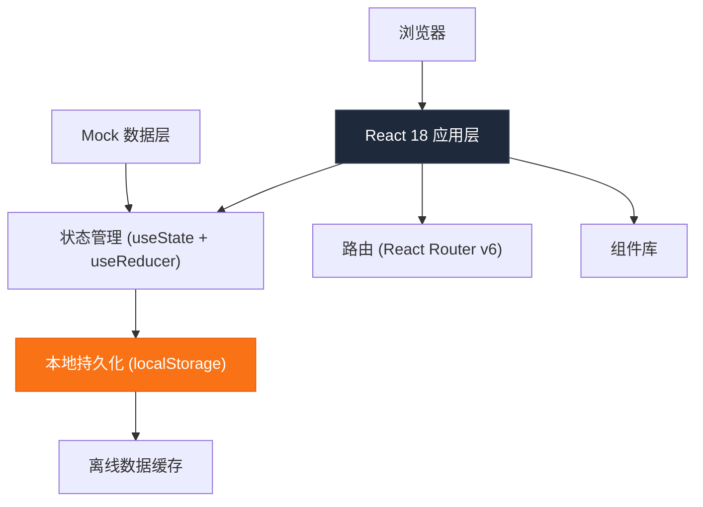
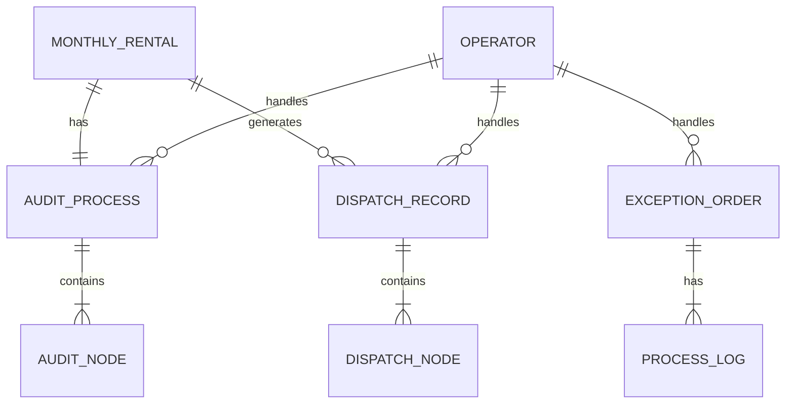

## 1. 架构设计



## 2. 技术选型

- **前端框架**: React@18 + TypeScript
- **构建工具**: Vite@5
- **样式方案**: TailwindCSS@3 + CSS 变量
- **路由**: React Router v6
- **图标**: Lucide React（轻量、现代风格）
- **状态管理**: 原生 useState + useReducer + Context，避免过度设计
- **离线存储**: localStorage + IndexedDB（日志数据）
- **日期处理**: date-fns（轻量级，相比 moment 更优）
- **无后端**: 全部使用 Mock 数据，通过 localStorage 持久化操作记录

## 3. 目录结构

```
src/
├── components/          # 通用组件
│   ├── Layout/         # 布局组件
│   ├── StatusBadge/    # 状态标签
│   ├── ProcessSteps/   # 流程步骤条
│   ├── DataTable/      # 数据表格
│   └── Timeline/       # 时间线
├── pages/              # 页面组件
│   ├── Dashboard/      # 仪表盘首页
│   ├── Audit/          # 月租车审核
│   ├── Dispatch/       # 权限下发回看
│   └── Exception/      # 异常处理
├── data/               # Mock 数据
│   ├── mockData.ts     # 模拟数据
│   └── types.ts        # TypeScript 类型定义
├── hooks/              # 自定义 Hooks
│   ├── useOffline.ts   # 离线模式 Hook
│   ├── useRecent.ts    # 最近访问 Hook
│   └── useLocalStorage.ts
├── utils/              # 工具函数
│   ├── storage.ts      # 存储工具
│   └── date.ts         # 日期处理
├── App.tsx
├── main.tsx
└── index.css
```

## 4. 路由定义

| 路由路径 | 页面名称 | 功能描述 |
|----------|----------|----------|
| `/` | 仪表盘首页 | 待处理队列、风险预警、最近变更、处理人状态 |
| `/audit` | 月租车审核 | 审核列表、流程跟踪、审核操作 |
| `/audit/:id` | 审核详情 | 单条审核记录详情、流程节点、处理操作 |
| `/dispatch` | 权限下发回看 | 下发列表、链路追踪、重试操作 |
| `/dispatch/:id` | 下发详情 | 单条下发链路详情、日志、重试 |
| `/exception` | 异常处理 | 工单列表、分类筛选、工单处理 |
| `/exception/:id` | 工单详情 | 工单详情、处理记录、转派操作 |

## 5. 数据模型

### 5.1 实体关系图



### 5.2 核心数据类型

```typescript
// 月租车申请
interface MonthlyRental {
  id: string;
  plateNumber: string;
  plateType: 'blue' | 'green' | 'yellow' | 'none';
  ownerName: string;
  ownerPhone: string;
  vehicleType: 'sedan' | 'suv' | 'truck';
  parkingLot: string;
  startDate: string;
  endDate: string;
  amount: number;
  status: 'pending' | 'auditing' | 'approved' | 'rejected' | 'dispatching' | 'completed' | 'failed';
  createdAt: string;
  auditId: string;
}

// 审核流程
interface AuditProcess {
  id: string;
  rentalId: string;
  currentNode: number;
  nodes: AuditNode[];
  createdAt: string;
  updatedAt: string;
  handlerId: string | null;
}

interface AuditNode {
  id: string;
  name: string;
  status: 'pending' | 'processing' | 'completed' | 'failed' | 'stuck';
  handler: string | null;
  startTime: string | null;
  endTime: string | null;
  remark: string | null;
  stuckReason?: string;
}

// 权限下发记录
interface DispatchRecord {
  id: string;
  rentalId: string;
  status: 'pending' | 'queued' | 'dispatching' | 'success' | 'failed';
  nodes: DispatchNode[];
  retryCount: number;
  createdAt: string;
  updatedAt: string;
  handlerId: string | null;
}

interface DispatchNode {
  id: string;
  name: string;
  target: string;
  status: 'pending' | 'processing' | 'success' | 'failed';
  startTime: string | null;
  endTime: string | null;
  errorCode?: string;
  errorMessage?: string;
  rawLog?: string;
}

// 处理人员
interface Operator {
  id: string;
  name: string;
  role: 'operation' | 'service' | 'maintenance';
  status: 'online' | 'offline' | 'busy';
  currentTaskCount: number;
  avatar: string;
}

// 异常工单
interface ExceptionOrder {
  id: string;
  type: 'permission_expired' | 'unlicensed_dispute' | 'gate_fault';
  priority: 'high' | 'medium' | 'low';
  status: 'pending' | 'processing' | 'transferred' | 'closed';
  plateNumber?: string;
  parkingLot: string;
  description: string;
  handlerId: string | null;
  logs: ProcessLog[];
  createdAt: string;
  updatedAt: string;
}

interface ProcessLog {
  id: string;
  operatorId: string;
  action: string;
  remark: string;
  timestamp: string;
}

// 最近访问记录
interface RecentVisit {
  id: string;
  type: 'audit' | 'dispatch' | 'exception';
  title: string;
  path: string;
  timestamp: string;
}
```

## 6. 离线可用实现方案

1. **Service Worker 缓存**：缓存静态资源和核心数据接口
2. **localStorage 持久化**：存储列表数据和用户操作，联网后同步
3. **IndexedDB 日志存储**：存储大量下发日志和处理记录
4. **在线状态检测**：通过 navigator.onLine 和心跳检测网络状态
5. **数据同步机制**：联网后自动同步离线期间的操作记录

## 7. 关键技术决策

- **不引入状态管理库**：使用 React 原生 API 足够，减少包体积和复杂度
- **TailwindCSS 原子化**：快速构建高密度信息展示界面
- **Lucide 图标**：与工业风格匹配，轻量且一致
- **date-fns**：相比 moment 更小，按需引入，支持 Tree Shaking
- **纯前端 Mock**：便于离线使用和演示，数据本地持久化
