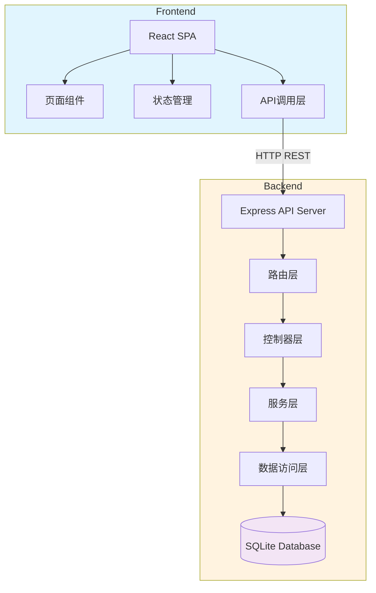
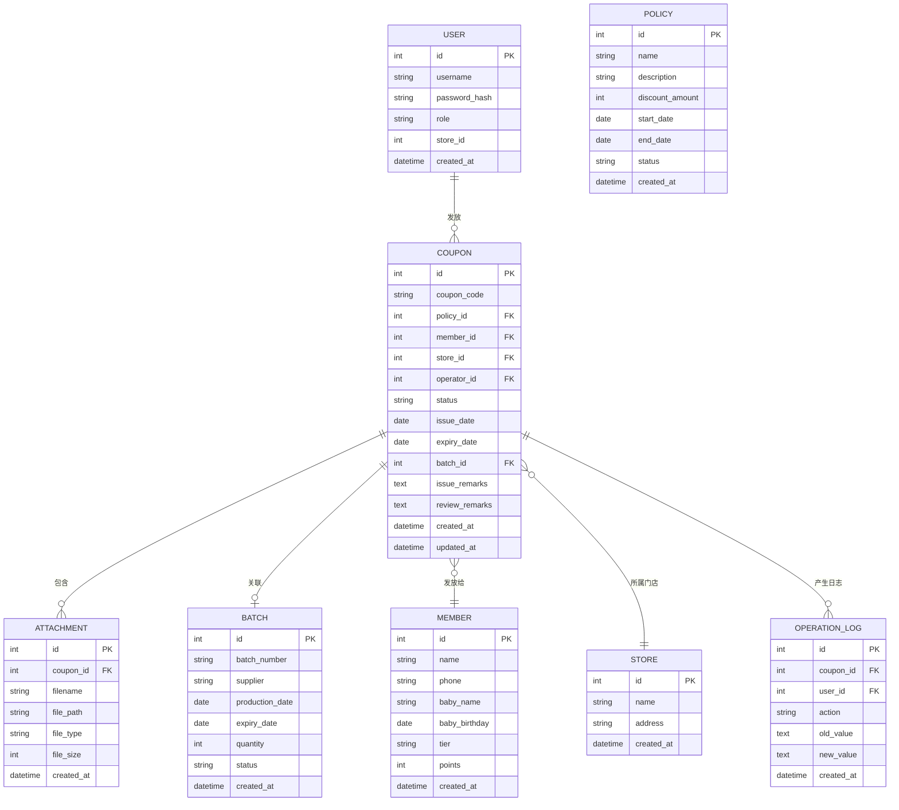
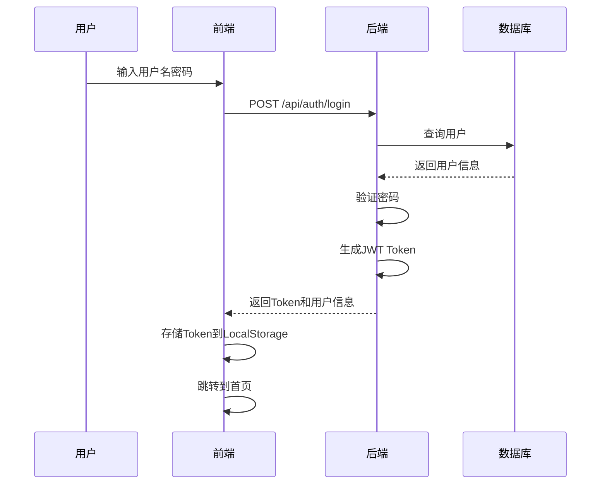

# 母婴零售店-促销券发放与核销复核系统 技术架构

## 1. 系统架构



**架构说明：**
- 前端：React 18 + Vite + TailwindCSS（桌面优先，响应式适配）
- 后端：Express 4（轻量API服务）
- 数据库：SQLite（文件数据库，适合MVP阶段，无需额外安装）
- API风格：RESTful JSON API

## 2. 技术栈

| 层级 | 技术选型 | 版本 | 说明 |
|------|---------|------|------|
| 前端框架 | React | 18.x | 函数组件 + Hooks |
| 构建工具 | Vite | 5.x | 快速开发热更新 |
| CSS框架 | TailwindCSS | 3.x | 原子化CSS |
| 状态管理 | React Context | 内置 | 简化版全局状态 |
| 路由 | React Router | 6.x | 单页应用路由 |
| 后端框架 | Express | 4.x | 轻量Node.js框架 |
| 数据库 | better-sqlite3 | 最新 | 同步SQLite驱动 |
| 工具库 | Node.js内置 | LTS | crypto, path, fs |

**开发环境：**
- Node.js 18+
- npm 包管理器

## 3. 路由定义

### 3.1 前端路由

| 路由 | 页面 | 权限 | 说明 |
|------|------|------|------|
| `/` | 首页仪表盘 | 全部 | 待办、风险、变更 |
| `/login` | 登录页 | 公开 | 简化登录 |
| `/coupons` | 促销券列表 | 全部 | 查询所有券 |
| `/coupons/issue` | 发放新券 | 店员/店长 | 新建发放 |
| `/coupons/:id` | 券详情 | 全部 | 查看详情 |
| `/coupons/:id/review` | 复核界面 | 店长 | 核销复核 |
| `/members` | 会员档案 | 全部 | 会员列表 |
| `/members/:id` | 会员详情 | 全部 | 会员信息 |
| `/batches` | 批号管理 | 全部 | 批号列表 |
| `/batches/:id` | 批号详情 | 全部 | 批号追溯 |
| `/attachments` | 附件管理 | 店员/店长 | 附件上传 |

### 3.2 后端API

**认证相关：**
| 方法 | 路由 | 说明 |
|------|------|------|
| POST | `/api/auth/login` | 用户登录 |
| POST | `/api/auth/logout` | 用户登出 |
| GET | `/api/auth/me` | 获取当前用户 |

**促销券相关：**
| 方法 | 路由 | 说明 |
|------|------|------|
| GET | `/api/coupons` | 查询券列表 |
| POST | `/api/coupons` | 新建发放 |
| GET | `/api/coupons/:id` | 查询券详情 |
| PUT | `/api/coupons/:id` | 更新券信息 |
| POST | `/api/coupons/:id/submit` | 提交复核 |
| POST | `/api/coupons/:id/review` | 复核操作 |
| GET | `/api/coupons/:id/history` | 查看历史记录 |

**会员相关：**
| 方法 | 路由 | 说明 |
|------|------|------|
| GET | `/api/members` | 查询会员列表 |
| GET | `/api/members/:id` | 查询会员详情 |
| GET | `/api/members/:id/coupons` | 会员的券历史 |

**批号相关：**
| 方法 | 路由 | 说明 |
|------|------|------|
| GET | `/api/batches` | 查询批号列表 |
| GET | `/api/batches/:id` | 查询批号详情 |
| GET | `/api/batches/:id/coupons` | 批号关联的券 |

**附件相关：**
| 方法 | 路由 | 说明 |
|------|------|------|
| POST | `/api/attachments/upload` | 上传附件 |
| GET | `/api/attachments/:id` | 下载附件 |
| GET | `/api/attachments/:id/preview` | 预览附件 |

**首页数据：**
| 方法 | 路由 | 说明 |
|------|------|------|
| GET | `/api/dashboard/todos` | 待办任务 |
| GET | `/api/dashboard/risks` | 风险项 |
| GET | `/api/dashboard/recent` | 最近变更 |

## 4. 数据模型

### 4.1 ER图



### 4.2 数据库表定义

```sql
-- 用户表
CREATE TABLE users (
    id INTEGER PRIMARY KEY AUTOINCREMENT,
    username TEXT UNIQUE NOT NULL,
    password_hash TEXT NOT NULL,
    role TEXT NOT NULL CHECK (role IN ('clerk', 'manager', 'buyer')),
    store_id INTEGER,
    name TEXT NOT NULL,
    created_at DATETIME DEFAULT CURRENT_TIMESTAMP,
    FOREIGN KEY (store_id) REFERENCES stores(id)
);

-- 门店表
CREATE TABLE stores (
    id INTEGER PRIMARY KEY AUTOINCREMENT,
    name TEXT NOT NULL,
    address TEXT,
    created_at DATETIME DEFAULT CURRENT_TIMESTAMP
);

-- 促销政策表
CREATE TABLE policies (
    id INTEGER PRIMARY KEY AUTOINCREMENT,
    name TEXT NOT NULL,
    description TEXT,
    discount_amount DECIMAL(10, 2),
    start_date DATE,
    end_date DATE,
    status TEXT DEFAULT 'active',
    created_at DATETIME DEFAULT CURRENT_TIMESTAMP
);

-- 会员表
CREATE TABLE members (
    id INTEGER PRIMARY KEY AUTOINCREMENT,
    name TEXT NOT NULL,
    phone TEXT UNIQUE NOT NULL,
    baby_name TEXT,
    baby_birthday DATE,
    tier TEXT DEFAULT 'normal',
    points INTEGER DEFAULT 0,
    created_at DATETIME DEFAULT CURRENT_TIMESTAMP
);

-- 奶粉批号表
CREATE TABLE batches (
    id INTEGER PRIMARY KEY AUTOINCREMENT,
    batch_number TEXT UNIQUE NOT NULL,
    supplier TEXT,
    production_date DATE,
    expiry_date DATE,
    quantity INTEGER DEFAULT 0,
    status TEXT DEFAULT 'normal',
    created_at DATETIME DEFAULT CURRENT_TIMESTAMP
);

-- 促销券表
CREATE TABLE coupons (
    id INTEGER PRIMARY KEY AUTOINCREMENT,
    coupon_code TEXT UNIQUE NOT NULL,
    policy_id INTEGER,
    member_id INTEGER NOT NULL,
    store_id INTEGER,
    operator_id INTEGER NOT NULL,
    status TEXT DEFAULT 'draft' CHECK (status IN ('draft', 'pending_review', 'issued', 'verified', 'archived', 'rejected')),
    issue_date DATE,
    expiry_date DATE,
    batch_id INTEGER,
    issue_remarks TEXT,
    review_remarks TEXT,
    created_at DATETIME DEFAULT CURRENT_TIMESTAMP,
    updated_at DATETIME DEFAULT CURRENT_TIMESTAMP,
    FOREIGN KEY (policy_id) REFERENCES policies(id),
    FOREIGN KEY (member_id) REFERENCES members(id),
    FOREIGN KEY (store_id) REFERENCES stores(id),
    FOREIGN KEY (operator_id) REFERENCES users(id),
    FOREIGN KEY (batch_id) REFERENCES batches(id)
);

-- 附件表
CREATE TABLE attachments (
    id INTEGER PRIMARY KEY AUTOINCREMENT,
    coupon_id INTEGER NOT NULL,
    filename TEXT NOT NULL,
    file_path TEXT NOT NULL,
    file_type TEXT,
    file_size INTEGER,
    created_at DATETIME DEFAULT CURRENT_TIMESTAMP,
    FOREIGN KEY (coupon_id) REFERENCES coupons(id) ON DELETE CASCADE
);

-- 操作日志表
CREATE TABLE operation_logs (
    id INTEGER PRIMARY KEY AUTOINCREMENT,
    coupon_id INTEGER NOT NULL,
    user_id INTEGER NOT NULL,
    action TEXT NOT NULL,
    old_value TEXT,
    new_value TEXT,
    created_at DATETIME DEFAULT CURRENT_TIMESTAMP,
    FOREIGN KEY (coupon_id) REFERENCES coupons(id) ON DELETE CASCADE,
    FOREIGN KEY (user_id) REFERENCES users(id)
);

-- 索引
CREATE INDEX idx_coupons_status ON coupons(status);
CREATE INDEX idx_coupons_member ON coupons(member_id);
CREATE INDEX idx_coupons_operator ON coupons(operator_id);
CREATE INDEX idx_coupons_expiry ON coupons(expiry_date);
CREATE INDEX idx_operation_logs_coupon ON operation_logs(coupon_id);
CREATE INDEX idx_members_phone ON members(phone);
CREATE INDEX idx_batches_batch_number ON batches(batch_number);
```

## 5. API数据格式

### 5.1 认证接口

**登录请求：**
```typescript
POST /api/auth/login
{
  "username": "string",
  "password": "string"
}
```

**登录响应：**
```typescript
{
  "success": true,
  "data": {
    "token": "jwt_token_string",
    "user": {
      "id": 1,
      "username": "clerk001",
      "name": "张三",
      "role": "clerk",
      "store_id": 1,
      "store_name": "旗舰店"
    }
  }
}
```

### 5.2 促销券接口

**创建券请求：**
```typescript
POST /api/coupons
{
  "policy_id": 1,
  "member_id": 123,
  "batch_id": 456,
  "expiry_date": "2024-12-31",
  "issue_remarks": "顾客购买爱他美奶粉3罐，符合满减条件"
}
```

**券列表查询参数：**
```
?status=pending_review
&member_id=123
&start_date=2024-01-01
&end_date=2024-12-31
&page=1
&limit=20
```

**券详情响应：**
```typescript
{
  "success": true,
  "data": {
    "id": 1,
    "coupon_code": "COUP202406150001",
    "policy": {
      "id": 1,
      "name": "爱他美满减券",
      "discount_amount": 50
    },
    "member": {
      "id": 123,
      "name": "李女士",
      "phone": "138****8888"
    },
    "store": {
      "id": 1,
      "name": "旗舰店"
    },
    "operator": {
      "id": 5,
      "name": "张三"
    },
    "status": "pending_review",
    "issue_date": "2024-06-15",
    "expiry_date": "2024-12-31",
    "batch": {
      "id": 456,
      "batch_number": "Aptamil20240501"
    },
    "issue_remarks": "顾客购买爱他美奶粉3罐，符合满减条件",
    "attachments": [
      {
        "id": 1,
        "filename": "purchase_receipt.jpg",
        "file_type": "image/jpeg"
      }
    ],
    "history": [
      {
        "action": "created",
        "user": "张三",
        "timestamp": "2024-06-15 10:30:00",
        "remarks": "顾客购买爱他美奶粉3罐，符合满减条件"
      },
      {
        "action": "submitted_for_review",
        "user": "张三",
        "timestamp": "2024-06-15 10:31:00",
        "remarks": null
      }
    ],
    "created_at": "2024-06-15 10:30:00",
    "updated_at": "2024-06-15 10:31:00"
  }
}
```

**复核请求：**
```typescript
POST /api/coupons/:id/review
{
  "action": "approve", // "approve" | "reject"
  "remarks": "审核通过，材料齐全"
}
```

### 5.3 首页数据接口

**待办任务响应：**
```typescript
GET /api/dashboard/todos
{
  "success": true,
  "data": [
    {
      "type": "review_pending",
      "count": 5,
      "items": [
        {
          "coupon_id": 1,
          "coupon_code": "COUP202406150001",
          "member_name": "李女士",
          "issue_date": "2024-06-15",
          "waiting_time": "2小时"
        }
      ]
    },
    {
      "type": "draft_pending",
      "count": 2,
      "items": [...]
    }
  ]
}
```

**风险项响应：**
```typescript
GET /api/dashboard/risks
{
  "success": true,
  "data": [
    {
      "type": "expired_unverified",
      "level": "high",
      "count": 3,
      "description": "已过期但未核销的券"
    },
    {
      "type": "batch_expiring",
      "level": "medium",
      "count": 5,
      "description": "批号3天内到期"
    },
    {
      "type": "review_overdue",
      "level": "high",
      "count": 2,
      "description": "复核超期（>48小时）"
    }
  ]
}
```

**最近变更响应：**
```typescript
GET /api/dashboard/recent
{
  "success": true,
  "data": [
    {
      "coupon_id": 1,
      "coupon_code": "COUP202406150001",
      "action": "submitted_for_review",
      "operator": "张三",
      "timestamp": "2024-06-15 10:31:00"
    },
    {
      "coupon_id": 2,
      "coupon_code": "COUP202406140002",
      "action": "approved",
      "operator": "李店长",
      "timestamp": "2024-06-14 16:20:00"
    }
  ]
}
```

## 6. 状态流转实现

### 6.1 状态机定义

```typescript
const statusTransitions = {
  'draft': ['pending_review'],
  'pending_review': ['issued', 'rejected'],
  'rejected': ['draft', 'pending_review'],
  'issued': ['verified'],
  'verified': ['archived'],
  'archived': [] // 终态
};

const rolePermissions = {
  'draft': {
    'clerk': ['update', 'delete', 'submit'],
    'manager': ['update', 'delete', 'submit']
  },
  'pending_review': {
    'manager': ['approve', 'reject']
  },
  'rejected': {
    'clerk': ['update', 'submit'], // 原操作员
    'manager': ['update', 'submit']
  },
  'issued': {
    'manager': ['verify']
  }
};
```

### 6.2 业务规则引擎

**发放规则：**
1. 会员必须存在且状态正常
2. 促销政策必须在有效期内
3. 批号关联时，批号必须在有效期内
4. 操作员必须属于发放门店

**复核规则：**
1. 只有店长角色可以复核
2. 拒绝时必须填写拒绝原因
3. 复核通过后状态自动变更为"已发放"
4. 复核通过后自动发送通知（模拟）

**核销规则：**
1. 只有"已发放"状态的券可以核销
2. 店长角色可以执行核销操作
3. 核销时自动验证有效期

**归档规则：**
1. 核销后30天自动归档
2. 过期后7天未核销标记为风险项
3. 归档操作不可逆

## 7. 项目结构

```
project-root/
├── frontend/                 # React前端
│   ├── public/
│   │   └── vite.svg
│   ├── src/
│   │   ├── components/      # 通用组件
│   │   │   ├── common/      # Button, Input, Card等
│   │   │   ├── layout/      # Header, Sidebar, Layout
│   │   │   └── business/    # CouponCard, MemberSelector等
│   │   ├── pages/           # 页面组件
│   │   │   ├── Dashboard/   # 首页仪表盘
│   │   │   ├── Login/       # 登录页
│   │   │   ├── Coupons/     # 促销券相关
│   │   │   ├── Members/     # 会员相关
│   │   │   └── Batches/     # 批号相关
│   │   ├── contexts/        # React Context
│   │   │   ├── AuthContext.tsx
│   │   │   └── AppContext.tsx
│   │   ├── hooks/           # 自定义Hooks
│   │   ├── services/        # API调用
│   │   ├── utils/           # 工具函数
│   │   ├── types/           # TypeScript类型
│   │   ├── App.tsx
│   │   ├── main.tsx
│   │   └── index.css
│   ├── index.html
│   ├── package.json
│   ├── tsconfig.json
│   ├── vite.config.ts
│   └── tailwind.config.js
│
├── backend/                  # Express后端
│   ├── src/
│   │   ├── routes/          # 路由定义
│   │   │   ├── auth.ts
│   │   │   ├── coupons.ts
│   │   │   ├── members.ts
│   │   │   ├── batches.ts
│   │   │   ├── attachments.ts
│   │   │   └── dashboard.ts
│   │   ├── controllers/     # 控制器
│   │   ├── services/       # 业务逻辑
│   │   ├── models/         # 数据模型
│   │   ├── middlewares/    # 中间件
│   │   │   ├── auth.ts     # 认证中间件
│   │   │   └── errorHandler.ts
│   │   ├── utils/          # 工具函数
│   │   ├── database.ts     # 数据库初始化
│   │   └── app.ts          # Express应用
│   ├── uploads/            # 上传文件目录
│   ├── package.json
│   └── tsconfig.json
│
├── .gitignore
├── README.md
└── package.json            # 根目录workspace配置
```

## 8. 权限控制

### 8.1 认证流程



### 8.2 API权限矩阵

| API | 店员 | 店长 | 采购 |
|-----|------|------|------|
| GET /api/coupons | 本店数据 | 全店数据 | 所有数据 |
| POST /api/coupons | ✓ | ✓ | ✗ |
| PUT /api/coupons/:id | 本店数据 | 全店数据 | ✗ |
| POST /api/coupons/:id/review | ✗ | ✓ | ✗ |
| GET /api/members | ✓ | ✓ | ✓ |
| GET /api/members/:id | ✓ | ✓ | ✓ |
| GET /api/batches | ✓ | ✓ | ✓ |
| GET /api/batches/:id | ✓ | ✓ | ✓ |
| POST /api/attachments/upload | ✓ | ✓ | ✗ |

## 9. 错误处理

### 9.1 错误码定义

```typescript
const errorCodes = {
  // 客户端错误 (4xx)
  'AUTH_001': '用户名或密码错误',
  'AUTH_002': 'Token已过期',
  'AUTH_003': '无权限访问',
  'VALIDATION_001': '参数校验失败',
  'VALIDATION_002': '必填项缺失',

  // 业务错误 (5xx)
  'BUSINESS_001': '状态流转不允许',
  'BUSINESS_002': '数据不存在',
  'BUSINESS_003': '数据已存在',
  'BUSINESS_004': '操作被拒绝'
};
```

### 9.2 统一响应格式

```typescript
// 成功响应
{
  "success": true,
  "data": { ... },
  "message": "操作成功"
}

// 错误响应
{
  "success": false,
  "error": {
    "code": "BUSINESS_001",
    "message": "状态流转不允许",
    "details": { ... }
  }
}
```

## 10. 初始数据

系统初始化时自动创建以下测试数据：

**门店：**
- 旗舰店（ID: 1）
- 二店（ID: 2）

**用户：**
- 店员：张三（clerk001）、李四（clerk002）
- 店长：王店长（manager001）
- 采购：赵采购（buyer001）

**促销政策：**
- 爱他美满减券（满300减50）
- 惠氏新客券（首单8折）
- 通用优惠券（满200减20）

**会员：**
- 李女士（手机：13800001111）
- 王先生（手机：13800002222）
- 张宝宝妈妈（手机：13800003333）

**奶粉批号：**
- 爱他美20240501
- 惠氏20240415
- 美赞臣20240601
