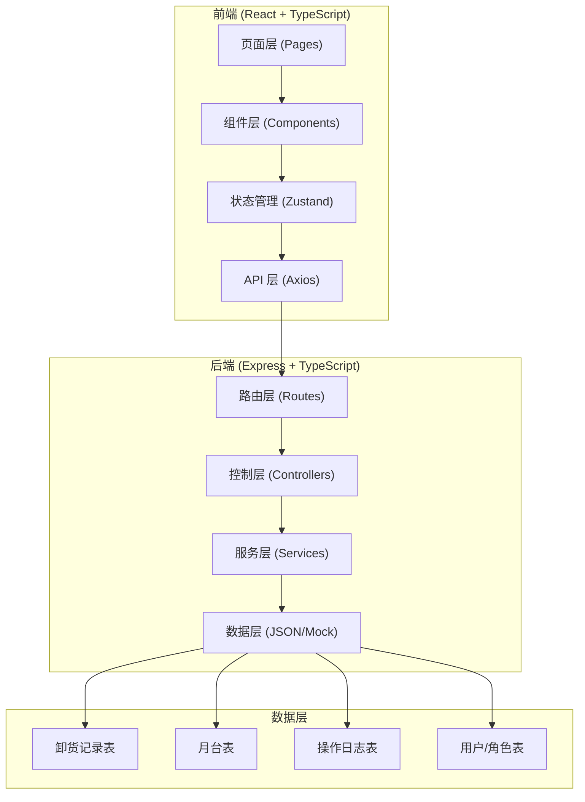
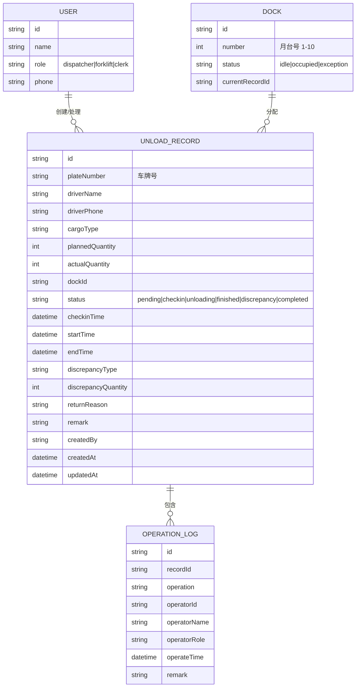

## 1. 架构设计



## 2. 技术选型

- **前端**：React@18 + TypeScript + Vite + TailwindCSS@3 + Zustand + React Router DOM + Lucide Icons
- **后端**：Express@4 + TypeScript
- **数据存储**：内存 + JSON 文件（Mock 数据，可后续替换为数据库）
- **初始化工具**：vite-init，模板选择 react-express-ts

## 3. 路由定义

| 路由 (前端) | 页面 | 说明 |
|-------|------|------|
| / | 首页仪表盘 | 待办事项 + 状态时间线 |
| /dock-board | 月台看板 | 月台状态可视化 + 到车计划 |
| /check-in | 卸货签到 | 签到列表 + 签到表单 |
| /discrepancy | 差异登记 | 待登记列表 + 差异表单 |
| /records | 历史记录 | 查询 + 详情 + 操作日志 |

| 路由 (后端 API) | 方法 | 说明 |
|-------|------|------|
| /api/dashboard | GET | 获取仪表盘数据（待办数量 + 最近状态） |
| /api/docks | GET | 获取月台列表及状态 |
| /api/docks/:id/assign | PUT | 分配月台给车辆 |
| /api/records | GET | 获取卸货记录列表（支持筛选） |
| /api/records | POST | 创建卸货记录（签到） |
| /api/records/:id | GET | 获取单条记录详情 |
| /api/records/:id/status | PUT | 更新记录状态 |
| /api/records/:id/discrepancy | PUT | 登记差异信息 |
| /api/records/:id/logs | GET | 获取记录的操作日志 |
| /api/records/batch | PUT | 批量操作 |

## 4. 数据模型

### 4.1 实体关系图



### 4.2 核心类型定义 (TypeScript)

```typescript
// 角色类型
type UserRole = 'dispatcher' | 'forklift' | 'clerk';

// 记录状态
type RecordStatus = 
  | 'pending'      // 待签到
  | 'checkin'      // 已签到
  | 'unloading'    // 卸货中
  | 'finished'     // 卸货完成
  | 'discrepancy'  // 差异登记中
  | 'completed';   // 已完成

// 差异类型
type DiscrepancyType = 'quantity' | 'damage' | 'other';

// 月台状态
type DockStatus = 'idle' | 'occupied' | 'exception';

interface User {
  id: string;
  name: string;
  role: UserRole;
  phone: string;
}

interface Dock {
  id: string;
  number: number;
  status: DockStatus;
  currentRecordId?: string;
}

interface UnloadRecord {
  id: string;
  plateNumber: string;
  driverName: string;
  driverPhone: string;
  cargoType: string;
  plannedQuantity: number;
  actualQuantity?: number;
  dockId?: string;
  dockNumber?: number;
  status: RecordStatus;
  checkinTime?: string;
  startTime?: string;
  endTime?: string;
  discrepancyType?: DiscrepancyType;
  discrepancyQuantity?: number;
  returnReason?: string;
  remark?: string;
  createdBy: string;
  createdAt: string;
  updatedAt: string;
}

interface OperationLog {
  id: string;
  recordId: string;
  operation: string;
  operatorId: string;
  operatorName: string;
  operatorRole: UserRole;
  operateTime: string;
  remark?: string;
}

interface DashboardData {
  todoCounts: {
    pendingCheckin: number;
    pendingUnload: number;
    pendingDiscrepancy: number;
  };
  recentStatus: OperationLog[];
  dockStatus: Dock[];
}
```

## 5. 前后端边界

### 5.1 前端负责
- 页面渲染与交互
- 表单验证
- 路由跳转
- 本地状态管理（当前用户、筛选条件等临时状态）
- 调用后端 API

### 5.2 后端负责
- 数据持久化（JSON 文件）
- 业务逻辑校验（状态流转合法性、权限校验）
- 操作日志自动记录
- 批量处理逻辑
- API 接口封装

### 5.3 状态管理原则
- **不分散在临时状态**：卸货签到、差异登记、退回原因、补充备注全部在同一条 `UnloadRecord` 记录中
- **操作日志独立存储**：每条状态变化生成独立 `OperationLog`，与记录关联但不嵌入记录本身
- **前端只做展示**：状态流转逻辑由后端控制，前端只触发 API 调用
