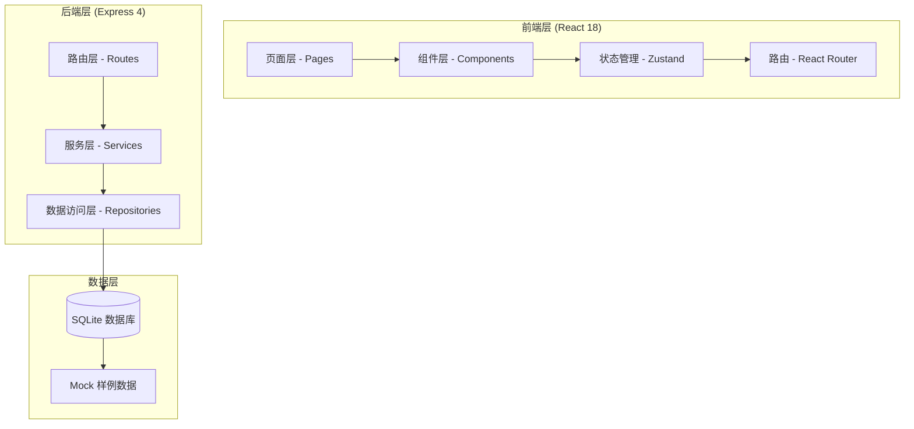
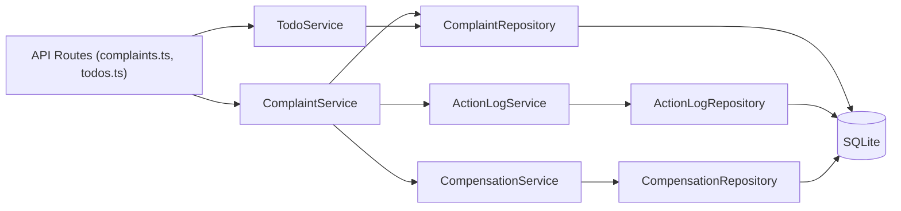
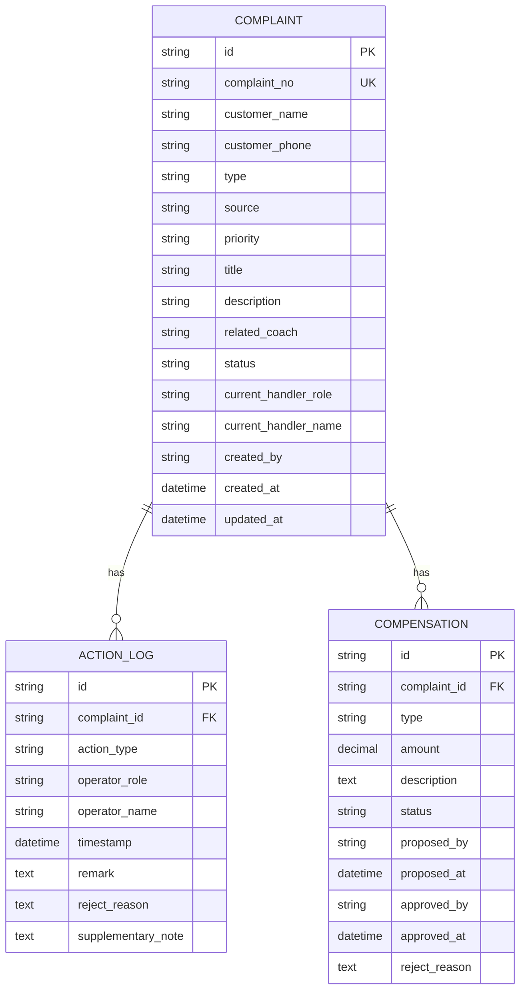

## 1. 架构设计



## 2. 技术说明

- **前端**: React 18 + TypeScript + Vite + Tailwind CSS 3 + Zustand + React Router DOM
- **后端**: Express 4 + TypeScript
- **数据库**: SQLite（本地文件数据库，无需额外安装，便于演示）
- **初始化工具**: vite-init
- **状态管理**: Zustand
- **UI 组件**: 自定义组件 + lucide-react 图标库

## 3. 路由定义

| 路由 | 用途 |
|-------|---------|
| / | 待办工作台（首页） |
| /complaints | 投诉记录列表 |
| /complaints/:id | 投诉详情页 |
| /complaints/new | 新建投诉记录 |

## 4. API 定义

### 4.1 TypeScript 类型定义

```typescript
// 角色类型
type UserRole = 'reception' | 'coach' | 'manager';

// 投诉状态
type ComplaintStatus = 
  | 'draft'           // 草稿
  | 'pending_review'  // 待初审
  | 'review_rejected' // 初审驳回
  | 'pending_compensation' // 待补偿审批
  | 'compensation_rejected' // 补偿驳回
  | 'completed'       // 已完成
  | 'closed';         // 已关闭

// 投诉类型
type ComplaintType = 
  | 'venue'      // 场地问题
  | 'equipment'  // 设备问题
  | 'service'    // 服务态度
  | 'booking'    // 预约问题
  | 'billing'    // 收费问题
  | 'other';     // 其他

// 优先级
type Priority = 'low' | 'medium' | 'high' | 'urgent';

// 操作类型
type ActionType = 
  | 'create'      // 创建
  | 'submit'      // 提交
  | 'review_approve' // 初审通过
  | 'review_reject'  // 初审驳回
  | 'resubmit'    // 补录重提
  | 'compensation_propose' // 提出补偿
  | 'compensation_approve' // 补偿通过
  | 'compensation_reject'  // 补偿驳回
  | 'complete'    // 完成处理
  | 'note';       // 添加备注

// 操作日志
interface ActionLog {
  id: string;
  complaintId: string;
  actionType: ActionType;
  operatorRole: UserRole;
  operatorName: string;
  timestamp: string;
  remark?: string;        // 操作备注
  rejectReason?: string;  // 驳回原因（驳回时必填）
  supplementaryNote?: string; // 补充备注（补录时必填）
}

// 补偿信息
interface Compensation {
  id: string;
  complaintId: string;
  type: 'refund' | 'discount' | 'free_service' | 'gift' | 'other';
  amount?: number;
  description: string;
  status: 'pending' | 'approved' | 'rejected' | 'executed';
  proposedBy: string;
  proposedAt: string;
  approvedBy?: string;
  approvedAt?: string;
  rejectReason?: string;
}

// 投诉记录
interface Complaint {
  id: string;
  complaintNo: string;     // 投诉单号 TS-YYYYMMDD-XXXX
  customerName: string;
  customerPhone: string;
  type: ComplaintType;
  source: 'phone' | 'onsite' | 'wechat' | 'other';
  priority: Priority;
  title: string;
  description: string;
  relatedCoach?: string;   // 涉及教练
  status: ComplaintStatus;
  currentHandlerRole: UserRole; // 当前处理角色
  currentHandlerName: string;   // 当前处理人
  createdAt: string;
  updatedAt: string;
  createdBy: string;
  
  // 关联数据
  actionLogs: ActionLog[];
  compensations: Compensation[];
}
```

### 4.2 API 端点

| 方法 | 路径 | 描述 |
|------|------|------|
| GET | /api/complaints | 获取投诉列表（支持筛选、分页） |
| GET | /api/complaints/:id | 获取投诉详情（含操作日志和补偿） |
| POST | /api/complaints | 创建投诉记录 |
| PUT | /api/complaints/:id | 更新投诉基本信息 |
| POST | /api/complaints/:id/actions | 执行操作（提交、驳回、审批等） |
| POST | /api/complaints/:id/compensations | 提出补偿方案 |
| GET | /api/todos/:role | 获取指定角色的待办列表 |

## 5. 服务端架构图



## 6. 数据模型

### 6.1 ER 图



### 6.2 DDL 语句

```sql
-- 投诉记录表
CREATE TABLE IF NOT EXISTS complaints (
  id TEXT PRIMARY KEY,
  complaint_no TEXT UNIQUE NOT NULL,
  customer_name TEXT NOT NULL,
  customer_phone TEXT NOT NULL,
  type TEXT NOT NULL,
  source TEXT NOT NULL,
  priority TEXT NOT NULL DEFAULT 'medium',
  title TEXT NOT NULL,
  description TEXT NOT NULL,
  related_coach TEXT,
  status TEXT NOT NULL DEFAULT 'draft',
  current_handler_role TEXT NOT NULL,
  current_handler_name TEXT NOT NULL,
  created_by TEXT NOT NULL,
  created_at DATETIME NOT NULL DEFAULT CURRENT_TIMESTAMP,
  updated_at DATETIME NOT NULL DEFAULT CURRENT_TIMESTAMP
);

-- 操作日志表
CREATE TABLE IF NOT EXISTS action_logs (
  id TEXT PRIMARY KEY,
  complaint_id TEXT NOT NULL,
  action_type TEXT NOT NULL,
  operator_role TEXT NOT NULL,
  operator_name TEXT NOT NULL,
  timestamp DATETIME NOT NULL DEFAULT CURRENT_TIMESTAMP,
  remark TEXT,
  reject_reason TEXT,
  supplementary_note TEXT,
  FOREIGN KEY (complaint_id) REFERENCES complaints(id) ON DELETE CASCADE
);

-- 补偿信息表
CREATE TABLE IF NOT EXISTS compensations (
  id TEXT PRIMARY KEY,
  complaint_id TEXT NOT NULL,
  type TEXT NOT NULL,
  amount REAL,
  description TEXT NOT NULL,
  status TEXT NOT NULL DEFAULT 'pending',
  proposed_by TEXT NOT NULL,
  proposed_at DATETIME NOT NULL DEFAULT CURRENT_TIMESTAMP,
  approved_by TEXT,
  approved_at DATETIME,
  reject_reason TEXT,
  FOREIGN KEY (complaint_id) REFERENCES complaints(id) ON DELETE CASCADE
);

-- 索引
CREATE INDEX IF NOT EXISTS idx_complaints_status ON complaints(status);
CREATE INDEX IF NOT EXISTS idx_complaints_handler ON complaints(current_handler_role, current_handler_name);
CREATE INDEX IF NOT EXISTS idx_action_logs_complaint ON action_logs(complaint_id);
CREATE INDEX IF NOT EXISTS idx_compensations_complaint ON compensations(complaint_id);
```
