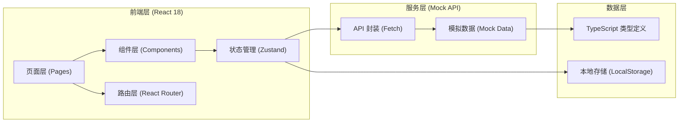

## 1. 架构设计



## 2. 技术描述

- **前端框架**：React@18 + TypeScript + Vite
- **状态管理**：Zustand（轻量级，适合中小型应用）
- **路由管理**：react-router-dom@6
- **UI 框架**：TailwindCSS@3 + lucide-react 图标库
- **后端方案**：前端 Mock 数据 + LocalStorage 持久化（无需真实后端，便于演示）
- **构建工具**：Vite@5
- **代码规范**：ESLint + Prettier

## 3. 路由定义

| 路由路径 | 页面名称 | 说明 |
|---------|---------|------|
| / | 工作台首页 | 今日待处理、超时、刚退回记录概览 |
| /reviews | 场次复盘列表 | 复盘单筛选列表，支持多条件查询 |
| /reviews/:id | 场次复盘详情 | 单场复盘详情及关联异常订单 |
| /reviews/:id/orders/:orderId | 异常订单详情 | 异常订单处理页面 |
| /logs | 操作日志 | 全链路操作记录查询 |

## 4. 数据模型定义

### 4.1 核心类型定义

```typescript
// 用户角色
type UserRole = 'assistant' | 'controller' | 'aftersales';

// 复盘单状态
type ReviewStatus = 'draft' | 'pending' | 'rejected' | 'confirmed' | 'processing' | 'closed';

// 异常订单状态
type OrderStatus = 'pending' | 'rejected' | 'supplement' | 'confirmed' | 'processing' | 'resolved';

// 操作类型
type OperationType = 'create' | 'submit' | 'reject' | 'confirm' | 'supplement' | 'transfer' | 'process' | 'close';

// 直播场次复盘单
interface LiveReview {
  id: string;
  sessionNo: string;           // 场次号
  liveTitle: string;           // 直播标题
  anchorName: string;          // 主播名称
  assistantName: string;       // 主播助理
  startTime: string;           // 开播时间
  endTime: string;             // 结束时间
  duration: number;            // 时长（分钟）
  gmv: number;                 // GMV
  orderCount: number;          // 订单数
  viewerCount: number;         // 观看人数
  status: ReviewStatus;
  siteRecords: string;         // 现场记录
  oldLedger: string;           // 旧台账备注
  chatScreenshots: string[];   // 沟通截图（URL）
  abnormalOrders: AbnormalOrder[];
  operationLogs: OperationLog[];
  createdAt: string;
  updatedAt: string;
  currentHandler: UserRole;    // 当前处理人角色
  rejectReason?: string;       // 驳回原因
  supplementRequired?: boolean; // 是否需要补录
  supplementNotes?: string;    // 补录说明
}

// 异常订单
interface AbnormalOrder {
  id: string;
  reviewId: string;
  orderNo: string;             // 订单号
  productName: string;         // 商品名称
  productImage: string;        // 商品图片
  buyerName: string;           // 买家昵称
  buyerPhone: string;          // 买家电话
  amount: number;              // 订单金额
  abnormalType: string;        // 异常类型
  abnormalDesc: string;        // 异常描述
  status: OrderStatus;
  rejectReason?: string;       // 驳回原因
  supplementRequired?: boolean; // 是否需要补录
  supplementNotes?: string;    // 补录说明
  processResult?: string;      // 处理结果
  operationLogs: OperationLog[];
  createdAt: string;
  updatedAt: string;
}

// 操作日志
interface OperationLog {
  id: string;
  targetId: string;            // 关联目标ID（复盘单或订单）
  targetType: 'review' | 'order';
  operator: string;            // 操作人
  operatorRole: UserRole;
  operationType: OperationType;
  operationDesc: string;       // 操作描述
  remark?: string;             // 备注
  createdAt: string;
}
```

## 5. 项目目录结构

```
src/
├── components/              # 公共组件
│   ├── layout/             # 布局组件
│   │   ├── Sidebar.tsx
│   │   ├── Header.tsx
│   │   └── MainLayout.tsx
│   ├── common/             # 通用组件
│   │   ├── StatusBadge.tsx
│   │   ├── RejectBadge.tsx
│   │   ├── SupplementBadge.tsx
│   │   ├── StatCard.tsx
│   │   ├── DataTable.tsx
│   │   └── Timeline.tsx
│   └── forms/              # 表单组件
│       └── OperationForm.tsx
├── pages/                  # 页面组件
│   ├── Dashboard.tsx       # 工作台首页
│   ├── ReviewList.tsx      # 场次复盘列表
│   ├── ReviewDetail.tsx    # 场次复盘详情
│   ├── OrderDetail.tsx     # 异常订单详情
│   └── OperationLogs.tsx   # 操作日志
├── store/                  # 状态管理
│   ├── useReviewStore.ts
│   └── useUserStore.ts
├── types/                  # 类型定义
│   └── index.ts
├── utils/                  # 工具函数
│   ├── mock.ts             # Mock 数据生成
│   ├── date.ts             # 日期处理
│   └── status.ts           # 状态映射
├── App.tsx
├── main.tsx
└── index.css
```

## 6. 状态管理设计

### 6.1 复盘单 Store (Zustand)

```typescript
interface ReviewState {
  reviews: LiveReview[];
  currentReview: LiveReview | null;
  filters: ReviewFilters;
  loading: boolean;
  setFilters: (filters: Partial<ReviewFilters>) => void;
  fetchReviews: () => Promise<void>;
  fetchReviewById: (id: string) => Promise<void>;
  createReview: (data: Partial<LiveReview>) => Promise<void>;
  submitReview: (id: string) => Promise<void>;
  rejectReview: (id: string, reason: string) => Promise<void>;
  confirmReview: (id: string) => Promise<void>;
  supplementReview: (id: string, data: Partial<LiveReview>) => Promise<void>;
  transferToAftersales: (id: string) => Promise<void>;
  processOrder: (reviewId: string, orderId: string, result: string) => Promise<void>;
  closeReview: (id: string) => Promise<void>;
}
```

### 6.2 筛选条件

```typescript
interface ReviewFilters {
  status?: ReviewStatus;
  keyword?: string;
  anchorName?: string;
  startDate?: string;
  endDate?: string;
  hasReject?: boolean;
  hasSupplement?: boolean;
  currentHandler?: UserRole;
}
```
