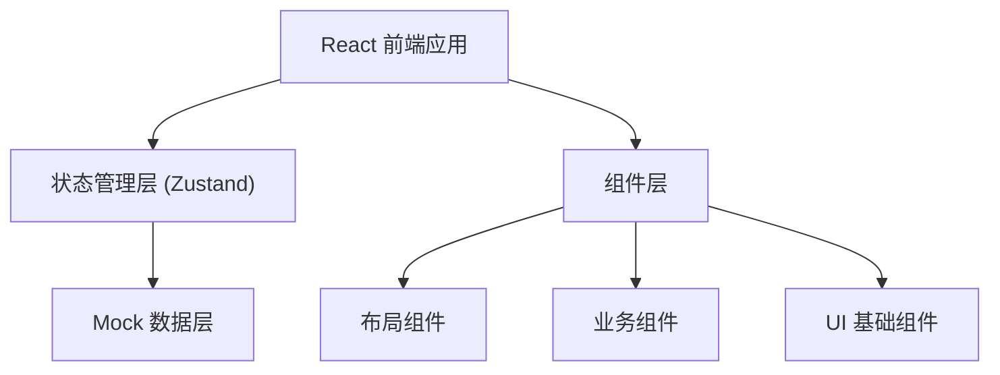
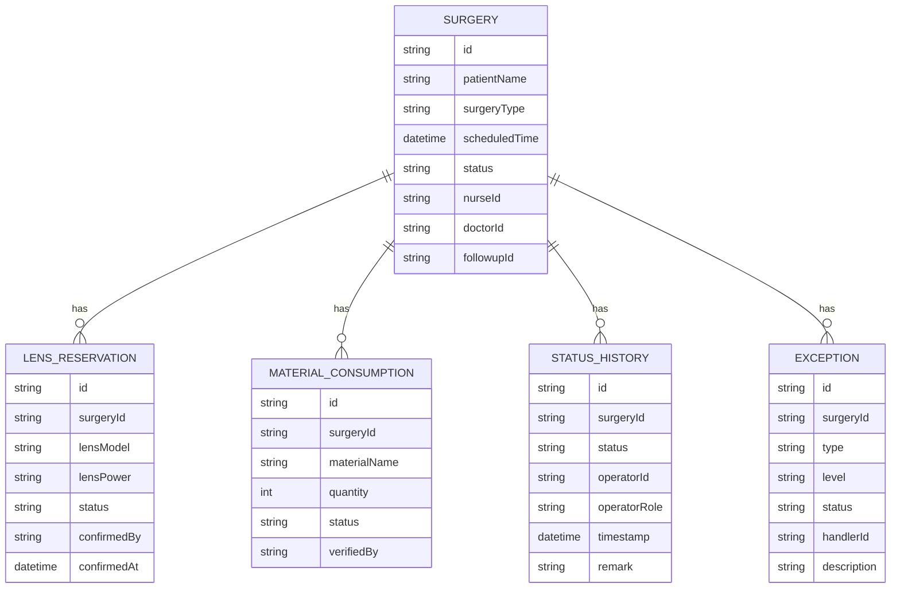

## 1. 架构设计



## 2. 技术选型

- **前端框架**：React@18 + TypeScript
- **构建工具**：Vite
- **样式方案**：TailwindCSS@3
- **状态管理**：Zustand（轻量级，适合后台系统）
- **路由方案**：React Router DOM
- **图标库**：Lucide React
- **数据模拟**：Mock Service Worker (MSW) 或内置 Mock 数据
- **日期处理**：date-fns

## 3. 目录结构

```
src/
├── pages/              # 页面组件
│   ├── dashboard/      # 工作台
│   ├── surgeries/      # 手术列表与详情
│   └── exceptions/     # 异常中心
├── components/         # 组件
│   ├── layout/         # 布局组件
│   ├── surgery/        # 手术相关组件
│   ├── exception/      # 异常相关组件
│   └── ui/             # 基础 UI 组件
├── store/              # 状态管理
├── types/              # TypeScript 类型定义
├── data/               # Mock 数据
└── utils/              # 工具函数
```

## 4. 路由定义

| 路由 | 页面 | 说明 |
|------|------|------|
| / | 工作台 | 待办、异常、统计概览 |
| /surgeries | 手术列表 | 手术排班与状态列表 |
| /surgeries/:id | 手术详情 | 侧栏详情、晶体预留、耗材核销 |
| /exceptions | 异常中心 | 异常列表与处理 |

## 5. 状态管理设计

### 5.1 手术状态流转

```typescript
type SurgeryStatus = 
  | 'scheduled'      // 已排班
  | 'applying'       // 护士申领中
  | 'lens_pending'   // 待医生确认晶体
  | 'lens_confirmed' // 晶体已确认
  | 'in_progress'    // 手术中
  | 'verifying'      // 待核销复核
  | 'completed'      // 已完成
  | 'exception'      // 异常
```

### 5.2 数据模型



## 6. 核心模块交互设计

### 6.1 侧栏详情联动
- 点击手术列表项 → 右侧抽屉展开详情
- 详情包含：患者信息、手术信息、状态时间线、处理人

### 6.2 晶体预留处理
- 显示晶体型号、度数、预留状态
- 医生角色可操作：确认预留 / 退回申请（附原因）
- 状态变更实时更新时间线

### 6.3 耗材核销回看
- 耗材清单列表（名称、数量、状态）
- 核销历史记录（谁、何时、做了什么）
- 随访专员可操作：通过核销 / 退回修正

### 6.4 异常触发机制
- 预置异常样例数据
- 提供"触发异常"按钮直接演示流程
- 异常触发后自动：状态变红、推送提醒、进入异常中心
